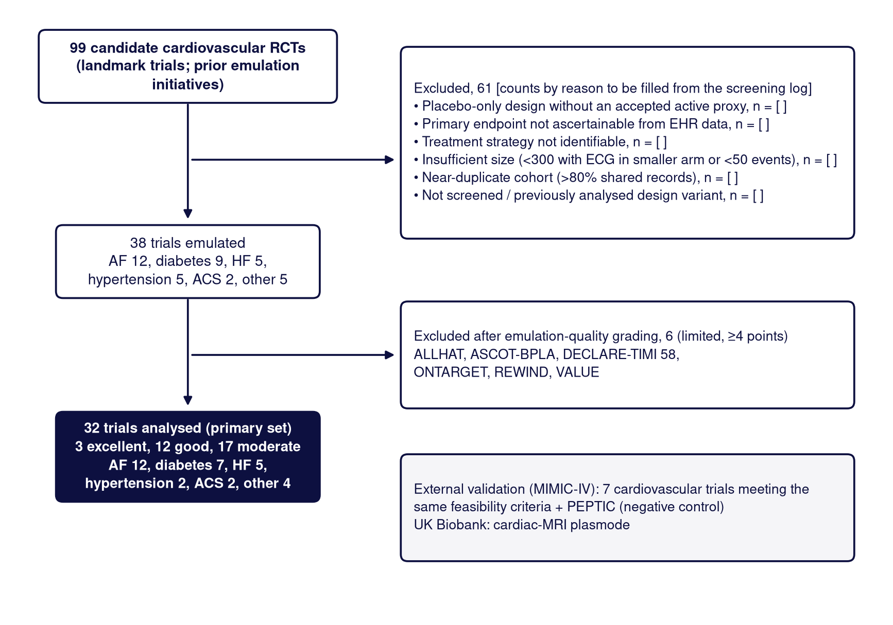
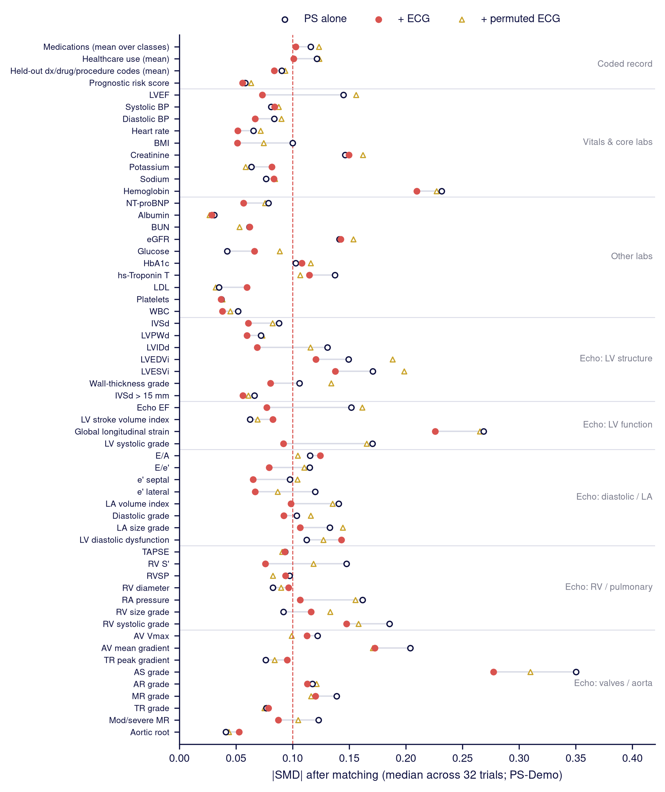
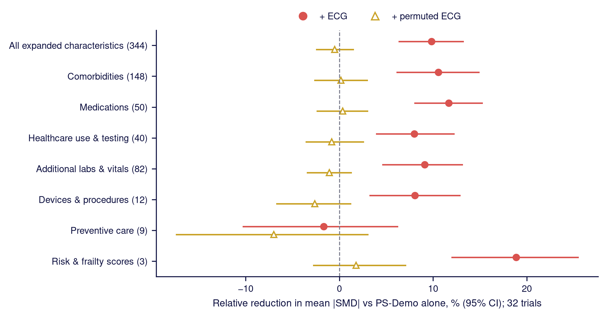
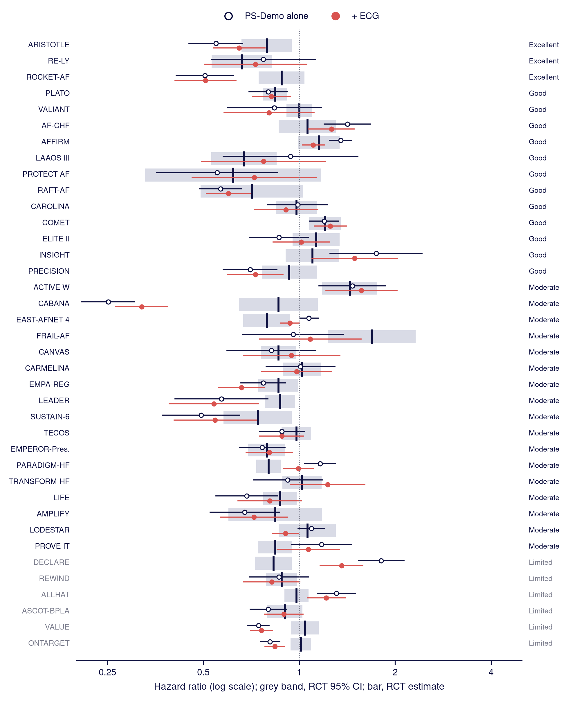
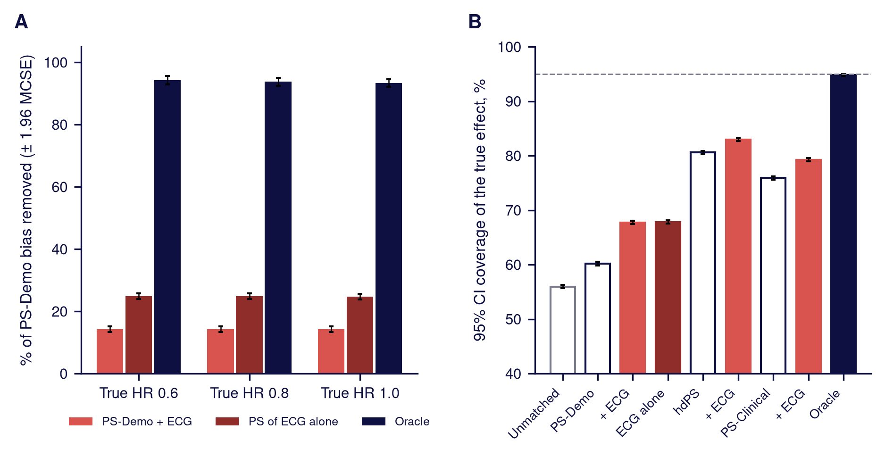
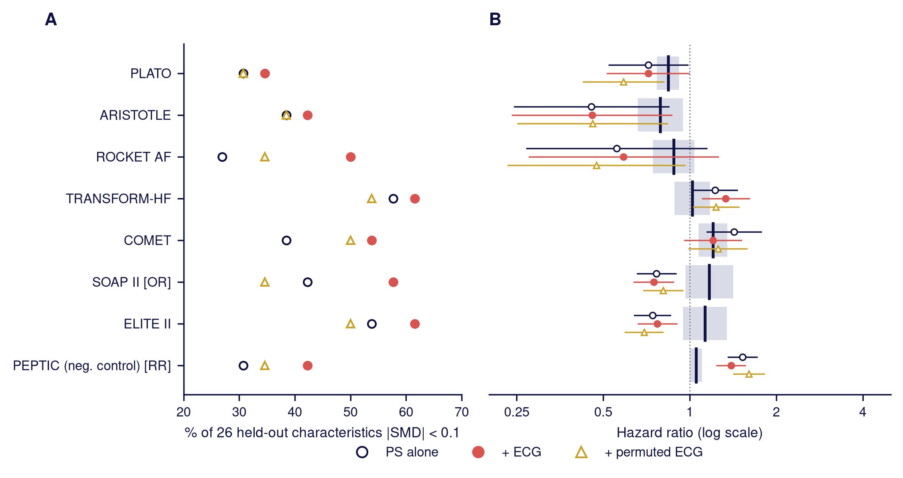
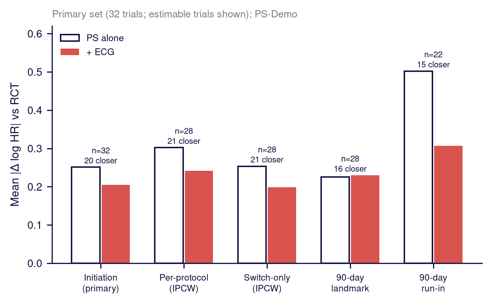
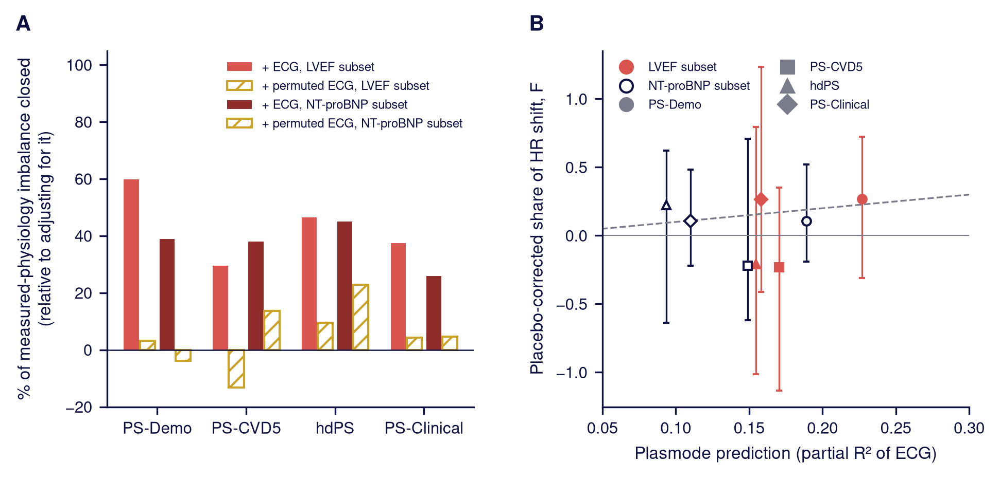

# Supplementary Materials: TRACE-ECG

*Supplement to: AI-enhanced electrocardiography as a phenotypic probe of confounding in target trial emulation. Working draft, 2026-10-06. Numbered citations (e.g. ^5^) refer to the main-text reference list; e-numbered citations to the eReferences below. Tables are generated from aggregate outputs by scripts/v20/make_supplement_tables.py; figures by scripts/v20/make_paper_figures.py.*

## Contents

**Supplementary Methods**

- eMethods 1. Data sources
- eMethods 2. Emulation design (PICOT)
- eMethods 3. Trial selection and emulation quality
- eMethods 4. ECG representation
- eMethods 5. Propensity score specifications and matching
- eMethods 6. Balance and agreement metrics
- eMethods 7. Plasmode simulation
- eMethods 8. Design-step diagnostics
- eMethods 9. Sensitivity analyses
- eMethods 10. Statistical software
- eMethods 11. External validation in MIMIC-IV
- eMethods 12. Echocardiography subset

**Supplementary Tables**

- eTable 1. Target Trial Specification, Emulation Quality and Cohort Size for the 38 Emulated Trials
- eTable 2. Held-Out Characteristics and Expanded-Panel Sources
- eTable 3. Covariate Balance by Propensity Score Specification, Domain and Trial Set
- eTable 4. Agreement With RCT Results by Propensity Score Specification and Trial Set
- eTable 5. Agreement With RCT Results by Emulation Quality
- eTable 6. External Validation in MIMIC-IV
- eTable 7. Sensitivity of Balance and Agreement to Matching, Weighting, Propensity Score Model and Number of ECG Components
- eTable 8. On-Treatment, Landmark and Run-In Estimands
- eTable 9. Prespecified Confirmation Analyses

**Supplementary Figures**

- eFigure 1. Trial Selection
- eFigure 2. Balance on the 58 Held-Out Characteristics With the Permuted-ECG Placebo
- eFigure 3. Balance on the Expanded Panel
- eFigure 4. Emulated and RCT Hazard Ratios for the 38 Emulated Trials
- eFigure 5. Robustness of the Plasmode Simulation
- eFigure 6. External Validation in MIMIC-IV by Trial
- eFigure 7. Alternative Estimands
- eFigure 8. Comparison With Measured Physiology in Patients With Echocardiography

**eReferences**

---

## Supplementary Methods

### eMethods 1. Data sources

YNHHS comprises multiple hospitals and an extensive outpatient network across Connecticut and Rhode Island. Our team mapped the structured Epic data to the OMOP common data model, covering diagnoses (ICD-10-CM), medication orders, procedures, laboratory measurements, vital signs and encounters; source Epic tables supplemented the mapped data for race, ethnicity and hospital encounters. Echocardiographic measurements were taken from structured echocardiography reports; free text was not used. Echocardiographic held-out values were set to missing for index dates before July 31, 2016, the start of the structured echocardiography source. Deaths were identified from the EHR and from linked Connecticut vital statistics records, which also provided the listed causes of death. ECGs were retrieved from the institutional archive as raw 10-second, 500 Hz 12-lead signals. Follow-up extended through December 2024 for all-cause death and June 2024 for cause-specific death.

### eMethods 2. Emulation design (PICOT)

The population comprised patients meeting the trial's key eligibility criteria as operationalized from structured data. All were aged 18 years or older (or the trial minimum) and had a first recorded encounter at least 365 days before the index date, and exclusion criteria that could be ascertained were applied. New users of the intervention were compared with new users of the comparator. Time zero was the first order of the study drug or procedure, with no order for the comparator in the preceding 365 days. Where the trial tested adding or switching therapy against continuing existing treatment, for example rhythm control added to rate control or switching from warfarin, a sequential design was used. For placebo-controlled trials, an active comparator without an expected effect on the outcome served as a placebo proxy, for example dipeptidyl peptidase-4 inhibitors in trials of glucose-lowering drugs. The outcome was the trial's primary endpoint, mapped to EHR events; hospitalization components required a qualifying ICD-10 code during an inpatient stay, and cardiovascular death was defined from listed causes of death. Follow-up began the day after time zero and continued to the primary endpoint, death, end of data or a trial-matched horizon, whichever came first. eTable 1 lists, for each trial, the PICOT elements and the TARGET protocol components (eligibility, treatment strategies, assignment, time zero, follow-up, outcome, causal contrast and analysis), each with its emulated counterpart and any adaptation.

### eMethods 3. Trial selection and emulation quality

Trials were assembled in three stages: 18 trials in which the analytic approach was developed; 15 trials, drawn largely from RCT-DUPLICATE, analysed under a prespecified plan; and 5 AF trials analysed under a separate prespecified plan. For the second and third stages, trial specifications, benchmarks and the analysis plan were committed before any results were computed, and results for these prespecified sets are reported in eTable 9. A count-only screen of pooled event numbers preceded registration of the second stage, and the AF hypothesis tested in the third stage arose from a post hoc pattern in second-stage results. Four further trials were built during early development but are not among the 38: PARAGON-HF, DAPA-HF/EMPEROR-Reduced and PARTNER had fewer than 400 matched pairs with PS-Clinical, the data-sufficiency threshold of the development protocol, and the primary outcome of DIONYSOS (recurrence of AF) could not be ascertained. Because their results had been examined, none was eligible for the prespecified confirmation stages. Of 99 candidate RCTs, 38 were emulated (eFigure 1). Candidates were counted as individual RCTs: design variants of the same trial were counted once, and grouped entries in screening lists were counted separately. Reasons for exclusion were a placebo-only design without an accepted proxy, an endpoint not ascertainable from EHR data, an exposure that could not be identified, insufficient size, or a near-duplicate cohort. Size was assessed from pooled counts only, as at least 300 patients with an ECG in the smaller arm and at least 50 pooled primary events. Cohorts sharing 80% or more of patient–index date records with an existing cohort were considered near-duplicates. This rule was added after the initial count-only screen; overlap of 50% to 80% was permitted (for example, 69% between ACTIVE W and RE-LY), and the 18 development cohorts were not compared with one another.

Emulation quality was rated from design information only, without reference to emulation results. Five design deviations were scored, following the RCT-DUPLICATE classification of emulation differences:^5^ in-hospital initiation not mirrored in the emulation (F1), a selective run-in period (F2), discontinuation or replacement of an ongoing same-purpose therapy at randomization that the emulation did not reproduce (F3), a horizon of 48 months or longer with a delayed treatment effect (F4), and other misalignment of time zero (F5). Comparator and outcome fidelity were each graded good, moderate or poor. A poor comparator denoted a placebo proxy or a substitution that changed the trial hypothesis, and a poor outcome a primary endpoint that could not be validly ascertained. Each flag scored 1 point, and comparator and outcome fidelity scored 0, 1 or 2 points for good, moderate or poor, giving a total of 0 to 9. Trials were classified as excellent (0 points), good (1–2 points, with no poor item and at most one flag), moderate (3 points, or 1–2 points with a poor item or two flags) or limited (≥4 points). The points were additive because design differences contribute approximately additively to disagreement between RCTs and their emulations,^18^ and poor proxies were weighted double because they agreed worst in RCT-DUPLICATE.^4^ The ratings were first made as a three-class classification and then independently re-rated by a second reviewer from design information, blind to all emulation results. The second reviewer was inadvertently exposed to the first three-class labels, so the agreement may be overstated; both ratings were made with large-language-model assistance [PI: confirm the wording of this disclosure]. Agreement on the three-class result was 82% (Cohen κ, 0.71) and disagreements were adjudicated against the written rules. The graded scale was defined after the primary analyses had been run but from design items only, and analyses by emulation quality are therefore post hoc. Of the 38 emulated trials, 3 were rated excellent, 12 good, 17 moderate and 6 limited; the 6 limited emulations (ALLHAT, ASCOT-BPLA, DECLARE-TIMI 58, ONTARGET, REWIND and VALUE) were excluded from the primary analysis set. The relevance of ECG-reflected physiology to each trial was graded high, medium or low according to whether treatment choice and prognosis plausibly depend on it.

### eMethods 4. ECG representation

The ECG model is a convolutional encoder followed by a transformer over leads and time, applied to 10-second, 500 Hz 12-lead signals in microvolts and trained in-house with the BCL objective of the published image-based model.^13^ [PI: add the training data (number of ECGs and patients, years, and whether trial cohorts were excluded) and training details.] In echocardiography-linked ECGs from 8,127 held-out patients outside the COMET cohort, linear probes on the embedding detected LVEF ≤40% with an area under the curve of 0.90 and AF with an area under the curve of 0.95, and explained 32% of the variance in LVEF. The frozen encoder produced 256-dimensional embeddings, from which the first 32 principal components were computed within each trial. Two placebos were used: a permuted-ECG placebo, in which embeddings were reassigned at random between patients within each cohort, and a noise placebo of independent Gaussian variables (96 columns in the real-data analyses; 32 columns in the simulation).

### eMethods 5. Propensity score specifications and matching

Four PS specifications are reported. PS-Demo included age, sex and calendar year of index. PS-CVD5 added hypertension, type 2 diabetes, coronary artery disease, AF and heart failure. The hdPS followed the approach of Schneeweiss et al.^16^ Its base covariates were demographics and 9 to 13 investigator-selected diagnoses recorded in the prior 365 days, including cardiovascular conditions and conditions such as diabetes, chronic kidney disease and chronic lung disease. Pre-index diagnosis, medication and procedure codes with a prevalence of at least 2% were converted into indicators of any, sporadic (at least the median count among patients with the code) and frequent (at least the 75th percentile) recurrence, and laboratory tests into indicators of having been measured. Indicators were ranked by the absolute log ratio of their prevalence in the two treatment groups (with an offset of 0.001), and the top 200 indicators were added to the base covariates. Unlike the original algorithm, codes were ranked on their association with treatment only, not with the outcome, so that selection never used outcome data; candidates were drawn from a random half of the code features, the other half being reserved for balance assessment, and the trial's exposure drugs were excluded. PS-Clinical comprised a median of 32 covariates per trial (range, 28–37). The 24 covariates common to all trials were age, sex, index year; AF, hypertension, diabetes, ischemic heart disease or myocardial infarction, chronic kidney disease, chronic obstructive pulmonary disease or asthma, peripheral artery disease, stroke and valve disease; LVEF, systolic and diastolic blood pressure, heart rate, body mass index, creatinine, potassium, sodium and hemoglobin; and outpatient, emergency department and inpatient encounter counts. Trial-specific covariates comprised 3 to 10 medication orders relevant to the clinical area and additional diagnoses such as heart failure, transient ischemic attack, liver disease and prior bleeding. Diagnoses were ascertained in the prior 365 days and medication orders in the prior 90 days. For laboratory values and vital signs, the latest value in the prior 90 days (365 days for body mass index and LVEF) was used and set to missing if implausible. Items describing the index event in acute coronary syndrome trials (ST-elevation myocardial infarction and percutaneous coronary intervention within 30 days) used a window that included the index day. Missing values in PS-Clinical were completed with a single imputation by chained equations (posterior sampling, with all covariates and treatment as predictors and no outcome information).

All PS were estimated by L2-penalized logistic regression on standardized covariates with an inverse regularization strength of 1 (scikit-learn), which stabilizes estimates when covariates are numerous, correlated or sparse. The same specification was used for every covariate set, so that only the covariates differed between comparisons. Matching was greedy 1:1 nearest-neighbour matching without replacement on the PS logit. Patients in the smaller treatment group were processed in descending order of their predicted probability of membership in that group and matched to the nearest available patient within a caliper of 0.2 pooled within-group standard deviations of the logit in the analysed cohort. In sensitivity analyses in the 32 and 38 trials (eTable 7), we used a caliper of 0.1, 1:3 matching, inverse probability and overlap weighting, a gradient-boosted PS with 5-fold cross-fitting, and 4 to 256 ECG principal components.

### eMethods 6. Balance and agreement metrics

For each characteristic, the SMD was the difference in means between treatment groups in the matched sample divided by the pooled standard deviation of the unmatched analysed cohort, so that the denominator did not change between PS specifications. Held-out characteristics were not imputed. Diagnoses, procedures and medications were coded as present or absent in the look-back window, and laboratory and vital sign values were compared among patients with an observed value. The primary panel of 58 characteristics excluded every variable in the demographic and diagnosis-based PS; at PS-Clinical, the characteristics included in that PS were also removed. Its coded-record summaries include a prognostic score for the trial's primary outcome, which has demographic and diagnostic components and is retained at every PS specification, and summaries of held-out code features that can include diagnoses also present in the diagnosis-based PS.

The expanded panel was built from a review of 12 sources describing covariates in PS and trial emulation studies, including studies from our group, RCT-DUPLICATE protocols, the Sentinel PS tool, the hdPS and the OHDSI FeatureExtraction defaults; the sources and their citations are listed in eTable 2. The review yielded 150 candidate covariates, which were implemented as 431 variables from the OMOP and Epic data, with all look-back windows ending the day before index. Within each trial, we excluded variables defining the exposure, variables with prevalence below 1% or above 99% or observed in fewer than 1% of patients, variables not strictly measured before index, and 67 ECG-proximal variables that an ECG encodes directly. The last group comprised rhythm and conduction disorders, devices and pacing, ablation and cardioversion, ventricular arrhythmias, cardiomyopathy and heart failure, myocardial infarction, natriuretic peptide, rate- and rhythm-control drugs, prior ECG counts and composite scores with such components. For each PS, we also excluded variables that overlapped with that PS, including composite scores with PS components, and, for the hdPS, variables whose codes could enter its selection. This left about 245 to 336 characteristics per trial depending on the PS (median, about 330 with PS-Demo). Expanded-panel results are reported for PS-Demo only. In the expanded panel, each laboratory value also had an indicator of missingness included as its own characteristic. Variables were grouped into seven domains for display: comorbidities, medications, healthcare use and testing, additional laboratory values and vital signs, devices and procedures, risk and frailty scores, and preventive care.

For each trial and specification, we computed the proportion of characteristics with |SMD| <0.1 and the mean |SMD|. The relative reduction in mean |SMD| with the ECG was 1 minus the ratio of the across-trial mean of the mean |SMD| with the ECG to that without the ECG, with a percentile 95% CI from 4,000 bootstrap resamples of trials; it does not depend on a threshold. It was added post hoc to the prespecified proportion of characteristics with |SMD| <0.1. Changes in balance by characteristic and domain were examined descriptively.

For agreement with RCTs, let θ~E~ and θ~R~ be the emulated and RCT log HRs with standard errors s~E~ and s~R~. Estimate agreement was |θ~E~ − θ~R~| ≤1.96 s~R~, standardized difference agreement was |θ~E~ − θ~R~| / (s~E~^2^ + s~R~^2^)^1/2^ <1.96, and the Pearson correlation was computed between θ~E~ and θ~R~ across trials.^4,5^ The absolute difference |θ~E~ − θ~R~| was compared between specifications within each trial. In the benchmark-permutation test, RCT results were reassigned at random across trials 20,000 times, and the reduction in the mean absolute difference with the ECG was recomputed each time. A reduction larger than under reassignment indicates movement toward each trial's own result rather than a general shrinkage of extreme estimates.

### eMethods 7. Plasmode simulation

Simulations were run in 31 trials and 107 trial–confounder combinations. These were trials in which at least 300 patients per treatment group had the confounder recorded, after exclusion of one combination whose simulated event rate was less than half the observed rate. The confounders were echocardiographic LVEF, NT-proBNP (log-transformed), body mass index and estimated glomerular filtration rate, standardized within the analysis set. Treatment was simulated from a logistic model including the observed PS-Demo logit and the confounder, with an odds ratio of 1.25, 1.5 or 2 per standard deviation, and calibrated to the observed proportion treated. Event times were simulated from a Weibull proportional hazards model including the observed clinical covariates, with coefficients estimated in the real data, the confounder, with an HR of 1.25, 1.5 or 2 per standard deviation, and treatment, with a true HR of 0.80. A null scenario had no confounding. Censoring was administrative at the trial horizon or end of data. Real covariates, ECGs and index dates were retained, and simulated event rates were close to observed rates (median, 21.0% vs 20.4%). In each of 50 replicates per scenario, 80% of patients were sampled without replacement, treatment and outcome were redrawn, and every PS was refitted and rematched. The compared arms were PS-Demo alone and with the ECG components, the permuted-ECG placebo, 32 noise columns, or the confounder itself (oracle). The true marginal log HR in each matched population was computed from simulated potential outcomes under both treatments, which accounts for non-collapsibility. Bias was the mean difference between the estimated and true log HR, and the proportion of bias removed was 1 minus the ratio of bias with and without the added components, pooled over the nine confounding scenarios. We also report CI coverage of the true value. The ECG's ability to encode each confounder was estimated in the real data as the cross-fitted R^2^ of the confounder on the ECG components, and as the partial R^2^ given demographics. In the initial design, every confounder was oriented so that higher values increased both treatment and hazard. After this design had been examined, LVEF and estimated glomerular filtration rate were reoriented so that lower values increased treatment and hazard, as in clinical practice, because in the initial orientation their effects partly cancelled against those of the real covariates; a variant in which the outcome depended on the confounder and treatment only was also added. The main-text results combine the reoriented LVEF and estimated glomerular filtration rate scenarios with the unchanged NT-proBNP and body mass index scenarios; results of the initial design are reported in the supplement.

The compared PS were PS-Demo alone and with the ECG components; a PS on the ECG components alone and on the permuted ECG components alone; the hdPS, with codes re-ranked on the simulated treatment in each replicate, with and without the ECG; PS-Clinical with the confounder's own analogue removed (LVEF for LVEF, body mass index for body mass index, creatinine for estimated glomerular filtration rate), with and without the ECG; and the oracle. To isolate the bias induced by the confounder from demographic confounding and design artefacts, we subtracted, for each arm and subsample, the error in the scenario without confounding (null-corrected bias). The proportion of bias removed by the ECG-only PS was estimated in an additional post hoc design in which treatment depended on the confounder only. The added value of the ECG over each PS was 1 minus the ratio of the null-corrected bias with and without the ECG. We report Monte Carlo SEs from 1,000 resamples of replicates within cells, together with empirical SE, root mean squared error and coverage, following the ADEMP framework.^e1^ To assess dependence on the true effect, the principal arms were re-run with true HRs of 1.0 and 0.6 using common random numbers.

### eMethods 8. Design-step diagnostics

Residual imbalance in ECG phenotypes was examined in the 38 trials across five successive design steps: initiators without trial eligibility criteria; the emulated trial population; matching on demographics and prior diagnoses; hdPS matching; and PS-Clinical matching. The mean |SMD| of ECG phenotypes fell from 0.206 to 0.144, 0.088, 0.079 and 0.075 across these steps, but residual imbalance after matching was not associated with the absolute difference from RCT results (Spearman ρ = −0.03; P = .85).

### eMethods 9. Sensitivity analyses

The on-treatment, landmark and run-in estimands were computed in the same matched samples as the primary estimate. Per-protocol effects censored patients at deviation from the assigned strategy, with grace periods of 180, 365 and 730 days and stabilized inverse-probability-of-censoring weights truncated at the 99th percentile; a switch-only estimand censored only at initiation of the comparator strategy. Because orders carry no days' supply, the switch-only estimand was considered the most reliable on-treatment estimand. We also estimated effects in a 90-day landmark analysis, which was added after the analysis plan, and in a 90-day run-in analysis requiring at least one repeat order of the assigned drug within 90 days, analogous to an active run-in. These estimands were not applicable to the four trials with a one-time procedure arm, and the run-in analysis was not estimable in trials with 50 or fewer patients retained. Exclusion of the six limited-quality emulations from the primary analysis set, and analyses by emulation quality, were post hoc; all analyses are therefore also reported for the 38 emulated trials (eTables 3, 4, 7 and 8).

### eMethods 10. Statistical software

Core analyses used Python 3.11.16, with pandas 2.3.3, NumPy 2.4.6, DuckDB 1.5.5, scikit-learn 1.9.1, lifelines 0.30.3, SciPy 1.17.1 and matplotlib 3.11.2. ECG embeddings were computed with PyTorch 2.5.0; their principal components were computed in the core analysis environment. Tests were one-sided where the direction was prespecified and two-sided otherwise.

### eMethods 11. External validation in MIMIC-IV

MIMIC-IV contains deidentified EHR data for patients admitted to the emergency department or hospital at Beth Israel Deaconess Medical Center, and MIMIC-IV-ECG contains the matched diagnostic 12-lead ECG signals, which extend to approximately 2019.^14,e2^ Candidate trials were screened against the feasibility criteria of the primary analysis, using the same thresholds: at least 300 patients with an ECG in the smaller treatment group and at least 50 primary-outcome events. Outcomes were restricted to those ascertainable in hospital data or from linked dates of death, which are complete for 1 year after discharge. Five trials (PLATO, ARISTOTLE, ROCKET AF, TRANSFORM-HF and COMET) had been built previously, and SOAP II (dopamine vs norepinephrine), ELITE II (angiotensin receptor blocker vs angiotensin-converting enzyme inhibitor in heart failure) and PEPTIC (proton pump inhibitor vs histamine-2 receptor antagonist in ventilated patients; negative control) were added from prespecified screen definitions. Before the new analyses, the previous estimates for the five existing trials were reproduced exactly. The ECG nearest before time zero was encoded with the same model and reduced to 32 principal components within each trial. The held-out panel comprised 26 characteristics: core laboratory values and vital signs (8), additional laboratory values (13; NT-proBNP, troponin T, lactate, albumin and others), mechanical ventilation at time zero (1) and healthcare use (4). The four PS specifications were PS-Demo; a sparse PS (PS-Sparse) of demographics and prior diagnoses; the hdPS; and a PS-Clinical-lite of core laboratory values, vital signs and healthcare use (LVEF was not available), whose components were removed from its held-out panel. The plan was committed before the new analyses, although estimates for the five previously built trials already existed. RE-LY and three trials requiring a proxy comparator also met the count thresholds but were not analysed. Laboratory values were compared among patients with an observed value, with indicators of missingness. Structured echocardiographic measurements were not used because their provenance could not be verified. Two RCT benchmarks were not HRs (SOAP II, odds ratio; PEPTIC, relative risk). Because 16% to 53% of ECGs were recorded on the index day, a sensitivity analysis excluded these patients. Per-trial results are shown in eTable 6 and eFigure 6.

### eMethods 12. Echocardiography subset

Within each trial, we analysed patients with a pre-index echocardiographic LVEF and, separately, patients with a pre-index NT-proBNP value, in trials with at least 300 patients in the smaller treatment group and at least 50 events within the subset (20 and 16 of the 32 trials). In each subset, we matched on PS-Demo alone, with the ECG components, with the permuted-ECG placebo, and with the measured value itself. The share of the imbalance closed by the ECG was the reduction in |SMD| for the measured value with the ECG divided by the reduction with the measured value itself; this measure was not in the analysis plan and is descriptive. The share of the HR shift reproduced by the ECG was the slope through the origin of the log HR change with the ECG on the log HR change with the measured value, pooled across trials, with a trial-level bootstrap 95% CI, and was corrected by subtracting the corresponding slope for the permuted-ECG placebo. The analysis plan was committed before results were computed. Results are shown in eFigure 8.

---

## Supplementary Tables

### eTable 1. Target Trial Specification, Emulation Quality and Cohort Size for the 38 Emulated Trials

<!-- ETABLE:1:BEGIN -->
| Area | Trial | Eligibility (population) | Treatment strategies (intervention vs comparator) | Outcome | Horizon, mo | Design flags | Comparator / outcome fidelity | Quality (points) | Patients with ECG | Matched pairs (PS-Demo) | Design notes and adaptations |
|---|---|---|---|---|---|---|---|---|---|---|---|
| ACS / MI | PLATO | ACS within 30 d | ticagrelor vs clopidogrel | vascular death, MI or stroke | 12 | F3 | good / moderate | Good (2) | 6,759 | 2,535 | P2Y12 inhibitors in ACS start within the index admission and EHR inpatient orders are visible (F1 exemption in the rule). Vascular death needs listed causes. Adjudicated: F3 = 1 (v1.7). |
| ACS / MI | VALIANT | MI within 30 d | ARB vs ACEi | all-cause death | 25 | F3 | moderate / good | Good (2) | 2,096 | 595 | RCT randomised 0.5-10 d after MI in hospital; ACEi/ARB are started in the admission with visible inpatient orders (treated like the P2Y12 exemption; borderline). Class adaptation (valsartan vs captopril). All-cause death. Adjudicated: F3 = 1 (v1.7). |
| AF | ARISTOTLE | AF | apixaban vs warfarin | stroke or systemic embolism | 22 | none | good / good | Excellent (0) | 18,771 | 2,782 | Apixaban vs warfarin initiators in outpatient AF; stroke/SE from inpatient codes. VKA-experienced patients transitioned by protocol (post-randomisation washout), which RCT-DUPLICATE did not score as baseline-therapy discontinuation. |
| AF | RE-LY | AF | dabigatran vs warfarin | stroke or systemic embolism | 24 | none | good / good | Excellent (0) | 4,172 | 702 | Dabigatran vs warfarin; the benchmark is the 150 mg arm and 110 mg is not marketed in the US (75 mg only below RE-LY's CrCl limit), so the agent and effective dose match; stroke/SE from inpatient codes. |
| AF | ROCKET-AF | AF | rivaroxaban vs warfarin | stroke or systemic embolism | 23 | none | good / good | Excellent (0) | 7,055 | 2,606 | Same agents; ITT benchmark; stroke/SE from inpatient codes; VKA transition handled as for ARISTOTLE. |
| AF | AF-CHF | AF with HF on rate control | rhythm-control drug added vs continued rate control | CV death | 37 | none | moderate / moderate | Good (2) | 5,558 | 1,271 | Same strategy approximation as AFFIRM in HFrEF. Primary endpoint CV death needs listed causes of death. |
| AF | AFFIRM | AF on rate control, age ≥65 | rhythm-control drug added vs continued rate control | all-cause death | 42 | none | moderate / good | Good (1) | 17,634 | 4,100 | Sequential add-on design mirrors adding rhythm control to rate control; strategy approximated by antiarrhythmic initiation (cardioversion not captured). All-cause death. |
| AF | LAAOS III | AF undergoing cardiac surgery | surgical LAA occlusion vs surgery without LAA occlusion | ischaemic stroke or systemic embolism | 46 | none | moderate / moderate | Good (2) | 2,621 | 511 | Occlusion vs none at the same cardiac surgery; time zero is the surgery in both arms (F1 not flagged). Ischaemic stroke/SE from codes, but perioperative (index-stay) events, part of the RCT primary, are not counted. Adjudicated: comparator = moderate (v1.7). |
| AF | PROTECT AF | AF on warfarin with ≥1 stroke risk factor | percutaneous LAA closure vs warfarin | stroke, CV death or systemic embolism | 18 | none | good / moderate | Good (1) | 1,442 | 314 | LAAO vs continued warfarin in OAC-treated AF (sequential; no future information). Composite includes CV/unexplained death needing listed causes. |
| AF | RAFT-AF | AF with HF on rate control | catheter ablation vs continued rate control | all-cause death or HF event | 36 | none | moderate / moderate | Good (2) | 3,003 | 614 | Ablation vs continued rate control; comparator antiarrhythmic use not excluded (contamination of the rate-control strategy). HF events from any-position HF hospitalisation codes. |
| AF | ACTIVE W | AF with ≥1 stroke risk factor, age ≥55 | clopidogrel vs warfarin | stroke, non-CNS systemic embolism, MI or vascular death | 15 | F3 | moderate / moderate | Moderate (3) | 3,139 | 895 | 77% were on OAC at entry and the clopidogrel+aspirin arm stopped it at randomisation (no protocol transition window); the initiator design neither requires nor reproduces that OAC discontinuation (F3). Aspirin not identifiable. Composite includes vascular death. |
| AF | CABANA | AF | catheter ablation vs antiarrhythmic drug | death, disabling stroke, serious bleeding or cardiac arrest | 49 | F4 | moderate / moderate | Moderate (3) | 13,133 | 1,573 | Horizon 49 mo (F4). RCT drug arm = rate or rhythm drugs; emulation = antiarrhythmic initiators. 'Disabling' stroke not identifiable; serious bleeding reduced to GI bleed/ICH hospitalisation. |
| AF | EAST-AFNET 4 | Early AF (diagnosis ≤1 y) on rate control | rhythm-control drug added vs continued rate control | CV death, stroke, HF or ACS hospitalisation | 61 | F4 | moderate / moderate | Moderate (3) | 16,109 | 3,462 | Horizon 61 mo (F4). Early rhythm-control strategy approximated by adding an antiarrhythmic (ablation-first not captured). Composite needs CV death from listed causes and HF/ACS hospitalisation codes. |
| AF | FRAIL-AF | AF on warfarin, age ≥75 | switch to DOAC vs warfarin | major or clinically relevant non-major bleeding | 12 | none | good / poor | Moderate (2) | 3,714 | 797 | Sequential warfarin-to-DOAC switch mirrors the randomised switch (F3 not flagged); any DOAC as in the trial. Primary = major or clinically relevant non-major bleeding; CRNM bleeding (the dominant component) is not ascertainable, only major-bleeding hospitalisation. |
| Diabetes | CAROLINA | T2D | linagliptin vs glimepiride | 3-point MACE | 76 | F4 | good / moderate | Good (2) | 1,794 | 769 | Same agents (linagliptin vs glimepiride). Horizon 76 mo (F4). Prior SU/glinide was stopped at randomisation for a minority (SU-exposed stratum); not judged substantial (RCT-DUPLICATE: no). 3-point MACE. |
| Diabetes | CANVAS Program | T2D, age ≥30 | canagliflozin vs DPP-4i (placebo proxy) | CV death, nonfatal MI or nonfatal stroke | 43 | none | poor / moderate | Moderate (3) | 6,037 | 485 | Placebo-controlled; DPP-4i proxy. Horizon 43 mo. 3-point MACE. |
| Diabetes | CARMELINA | T2D with kidney disease | linagliptin vs sulfonylurea (placebo proxy) | CV death, nonfatal MI or nonfatal stroke | 26 | none | poor / moderate | Moderate (3) | 1,546 | 594 | Placebo-controlled; sulfonylurea proxy. 3-point MACE. |
| Diabetes | EMPA-REG OUTCOME | T2D with established CVD | SGLT2i vs DPP-4i (placebo proxy) | 3-point MACE | 37 | none | poor / moderate | Moderate (3) | 5,649 | 1,673 | Placebo-controlled; DPP-4i proxy. 3-point MACE with CV death from listed causes. |
| Diabetes | LEADER | T2D with CVD, age ≥50 | liraglutide vs DPP-4i (placebo proxy) | CV death, nonfatal MI or nonfatal stroke | 46 | none | poor / moderate | Moderate (3) | 3,782 | 453 | Placebo-controlled; DPP-4i proxy. Horizon 46 mo (<48). 3-point MACE. |
| Diabetes | SUSTAIN-6 | T2D with CVD, age ≥50 | semaglutide vs DPP-4i (placebo proxy) | CV death, nonfatal MI or nonfatal stroke | 25 | none | poor / moderate | Moderate (3) | 3,727 | 1,068 | Placebo-controlled; DPP-4i proxy. 3-point MACE. |
| Diabetes | TECOS | T2D with CVD, age ≥50 | sitagliptin vs sulfonylurea (placebo proxy) | CV death, nonfatal MI, nonfatal stroke or UA hospitalisation | 36 | none | poor / moderate | Moderate (3) | 2,925 | 1,387 | Placebo-controlled; sulfonylurea proxy (rated poor in RCT-DUPLICATE). 4-point MACE incl. UA hospitalisation. |
| Diabetes | DECLARE-TIMI 58 † | T2D, age ≥40 | dapagliflozin vs DPP-4i (placebo proxy) | CV death or HF hospitalisation | 50 | F4 | poor / moderate | Limited (4) | 6,967 | 1,321 | Placebo-controlled; DPP-4i proxy. Horizon 50 mo (F4). CV death or HF hospitalisation. |
| Diabetes | REWIND † | T2D, age ≥50 | dulaglutide vs DPP-4i (placebo proxy) | nonfatal MI, nonfatal stroke or CV death (incl. unknown causes) | 65 | F4 | poor / moderate | Limited (4) | 6,049 | 1,335 | Placebo-controlled; DPP-4i proxy. Horizon 65 mo (F4). 3-point MACE. |
| HF | COMET | HF | carvedilol vs metoprolol | all-cause mortality | 58 | F4 | good / good | Good (1) | 6,381 | 2,633 | Horizon 58 mo (F4). Carvedilol vs immediate-release metoprolol tartrate, as in the RCT (docs/COMET_ADAPTED_PROTOCOL.md); dose not identifiable (record-only titration). All-cause death. Adjudicated: comparator = good (v1.9). |
| HF | ELITE II | HF, age ≥60 | ARB vs ACEi | all-cause mortality | 18 | none | moderate / good | Good (1) | 3,222 | 1,076 | Class adaptation (any ARB vs any ACEi; trial losartan vs captopril) in ACEi-naive HF; 18 mo; all-cause death. |
| HF | EMPEROR-Preserved | HF with T2D | SGLT2i vs DPP-4i (placebo proxy) | CV death or HF hospitalisation | 26 | none | poor / moderate | Moderate (3) | 2,417 | 531 | Placebo-controlled RCT emulated with a DPP-4i active-comparator proxy (estimand changes); T2D restriction. CV death or HF hospitalisation. |
| HF | PARADIGM-HF | HF on ACEi/ARB (switch at time zero) | sacubitril-valsartan vs ACEi | CV death or first HF hospitalisation | 27 | F2 | moderate / moderate | Moderate (3) | 5,129 | 1,223 | Sequential enalapril then sacubitril/valsartan active run-in removed intolerant patients (F2). The ACEi/ARB switch is mirrored by the sequential switch design. Comparator = any ACEi (trial: enalapril). CV death or HF hospitalisation. |
| HF | TRANSFORM-HF | HF hospitalisation (discharge within 30 d) | torsemide vs furosemide | all-cause mortality | 12 | F1, F3 | good / good | Moderate (2) | 15,657 | 697 | Randomised before discharge from an HF admission; initiators within 30 d of an HF code can take time zero from an inpatient IV furosemide order vs an oral discharge torsemide strategy (F1). 67% were on a loop diuretic before admission and changed agent at randomisation; the new-user design excludes them (F3). All-cause death. Adjudicated: comparator = good (v1.9). |
| Hypertension | INSIGHT | High-risk hypertension, age ≥55 | nifedipine vs thiazide | CV death, MI, HF or stroke | 42 | none | moderate / moderate | Good (2) | 8,847 | 397 | 4-week placebo run-in (washout) before randomisation, not flagged. Nifedipine (GITS not identifiable) vs thiazide class for co-amilozide. Composite needs CV death and HF hospitalisation codes. Adjudicated: F3 = 0 (v1.9). |
| Hypertension | LIFE | Hypertension with ECG-LVH, age 55–80 | ARB vs β-blocker | CV death, MI or stroke | 58 | F4 | moderate / moderate | Moderate (3) | 3,131 | 1,239 | Horizon 58 mo (F4). ARB class vs cardioselective beta-blocker class (trial losartan vs atenolol). Prior therapy was withdrawn during a placebo run-in before randomisation (not F2/F3). CV death, MI or stroke. Adjudicated: F3 = 0 (v1.9). |
| Hypertension | ALLHAT † | Hypertension, age ≥55 | amlodipine vs thiazide | fatal CHD or nonfatal MI | 59 | F3, F4 | moderate / moderate | Limited (4) | 26,592 | 8,494 | About 90% were treated at entry and prior antihypertensives were replaced by study drug at randomisation without washout; initiator design does not mirror this (F3). Horizon 59 mo (F4). Thiazide class for chlorthalidone. Fatal CHD needs listed causes. |
| Hypertension | ASCOT-BPLA † | Hypertension, age 40–79 | amlodipine vs β-blocker | nonfatal MI and fatal CHD | 66 | F3, F4 | moderate / moderate | Limited (4) | 26,021 | 12,783 | Previously treated patients (most) had therapy replaced at randomisation (PROBE, no washout) (F3). Horizon 66 mo (F4). Atenolol-based strategy approximated by cardioselective beta-blocker initiation. Fatal CHD from listed causes; silent MI not captured. |
| Hypertension | VALUE † | Hypertension, age ≥50 | ARB vs amlodipine | cardiac morbidity and mortality composite | 50 | F3, F4 | moderate / moderate | Limited (4) | 26,657 | 10,208 | 89.9% previously treated were switched directly to study drug without run-in (F3). Horizon 50 mo (F4). ARB class for valsartan. Cardiac composite approximated by CV death, HF hospitalisation and MI (emergency procedures not captured). |
| Other | PRECISION | Arthritis with CV risk | celecoxib vs naproxen | CV death (incl. haemorrhagic), nonfatal MI or nonfatal stroke (APTC) | 34 | F3 | good / moderate | Good (2) | 5,310 | 2,154 | Same agents (celecoxib vs naproxen; OTC naproxen unseen, dose titration record-only). APTC composite needs CV death incl. haemorrhagic. Adjudicated: F3 = 1 (v1.7). |
| Other | AMPLIFY | Acute VTE | apixaban vs warfarin | recurrent symptomatic VTE or VTE-related death | 6 | none | good / poor | Moderate (2) | 5,080 | 683 | Apixaban vs warfarin (with parenteral lead-in) after acute VTE; both started around the index encounter with visible orders. Recurrent VTE from a new inpatient stay with a VTE code: ascertainable but low specificity and outpatient-managed recurrences missed (moderate, as RCT-DUPLICATE rated its AMPLIFY outcome). Adjudicated: outcome = poor (v1.7). |
| Other | LODESTAR | Coronary artery disease | rosuvastatin vs atorvastatin | 3-y death, MI, stroke or any coronary revascularisation | 36 | none | good / poor | Moderate (2) | 22,277 | 3,880 | Rosuvastatin vs atorvastatin (factorial with intensity strategy; agents match). Any coronary revascularisation, the most frequent component of the RCT composite, is not captured (dominant component missing). |
| Other | PROVE IT-TIMI 22 | ACS within 30 d | atorvastatin vs pravastatin | death, MI, UA rehospitalisation, revascularisation >= 30 d or stroke | 24 | none | moderate / poor | Moderate (3) | 4,379 | 531 | The tested hypothesis is intensive (atorvastatin 80) vs moderate (pravastatin 40) therapy; dose is not identifiable, so atorvastatin initiators at any dose change the hypothesis. Revascularisation >= 30 d, the most frequent component, is not captured. Statins start in the ACS admission (F1 not flagged). Adjudicated: comparator = moderate (v1.7). |
| Other | ONTARGET † | Established vascular disease or high-risk diabetes, age ≥55 | ARB vs ACEi | CV death, MI, stroke or HF hospitalisation | 56 | F2, F4 | moderate / moderate | Limited (4) | 14,853 | 6,374 | 3-week single-blind active run-in (ramipril, then telmisartan+ramipril) removed intolerant patients (F2 as the rule defines it). Horizon 56 mo (F4). ARB class for telmisartan, ACEi class for ramipril. CV death, MI, stroke or HF hospitalisation. Adjudicated: F3 = 0 (v1.9). |

† Limited-quality emulation, excluded from the primary analysis set. Primary set totals: 212,496 patients with an ECG (median 4,729 per trial) and 44,230 matched pairs with PS-Demo. Design flags: F1, in-hospital initiation not mirrored; F2, selective run-in; F3, discontinuation or replacement of baseline therapy at randomization not reproduced; F4, horizon ≥48 months with a delayed treatment effect; F5, other time-zero misalignment (eMethods 3). Time zero was the first order of the intervention or comparator in new users, or the first add-on or switch order in sequential designs (eMethods 2). Sources: Table 1; docs/v19/quality_tiers.json; cohort counts from the primary analysis outputs.
<!-- ETABLE:1:END -->

### eTable 2. Held-Out Characteristics and Expanded-Panel Sources

<!-- ETABLE:2:BEGIN -->
**A. Primary held-out panel (58 characteristics)**

| Domain | n | Characteristics | Definition and window |
|---|---|---|---|
| Coded record | 4 | Medications (mean over classes), Healthcare use (mean), Held-out dx/drug/procedure codes (mean), Prognostic risk score | Mean |SMD| over medication-order classes (90 d), utilization counts (365 d) and held-out code features (365 d); prognostic risk score for the trial's primary outcome |
| Vitals & core labs | 9 | LVEF, Systolic BP, Diastolic BP, Heart rate, BMI, Creatinine, Potassium, Sodium, Hemoglobin | Latest value before index (90 d; 365 d for BMI and LVEF), compared among patients with an observed value |
| Other labs | 10 | NT-proBNP, Albumin, BUN, eGFR, Glucose, HbA1c, hs-Troponin T, LDL, Platelets, WBC | Latest value in the 365 days before index, compared among patients with an observed value |
| Echo: LV structure | 7 | IVSd, LVPWd, LVIDd, LVEDVi, LVESVi, Wall-thickness grade, IVSd > 15 mm | Latest structured echocardiogram in the 365 days before index (index dates from July 31, 2016) |
| Echo: LV function | 4 | Echo EF, LV stroke volume index, Global longitudinal strain, LV systolic grade | As above |
| Echo: diastolic / LA | 8 | E/A, E/e', e' septal, e' lateral, LA volume index, Diastolic grade, LA size grade, LV diastolic dysfunction | As above |
| Echo: RV / pulmonary | 7 | TAPSE, RV S', RVSP, RV diameter, RA pressure, RV size grade, RV systolic grade | As above |
| Echo: valves / aorta | 9 | AV Vmax, AV mean gradient, TR peak gradient, AS grade, AR grade, MR grade, TR grade, Mod/severe MR, Aortic root | As above |

**B. Expanded panel**

| Expanded-panel domain | Variables (union across trials) |
|---|---|
| Comorbidities | 148 |
| Medications | 50 |
| Healthcare use & testing | 40 |
| Additional labs & vitals | 82 |
| Devices & procedures | 12 |
| Preventive care | 9 |
| Risk & frailty scores | 5 |
| Total | 346 |

**C. Literature sources**

| Source used to derive the expanded panel | Citation |
|---|---|
| Khera et al., ACEi/ARB and COVID-19 (claims PS) | JAHA 2021; PMID 33624516 |
| LEGEND-T2DM and LEGEND-HTN (large-scale PS; OHDSI) | BMJ Open 2022, PMID 35680274; JACC 2024, PMID 39197980; Nat Commun 2026, PMID 41935054; Lancet 2019, PMID 31668726 |
| Thangaraj et al., TOPCAT phenomapping in YNHHS | Circ Cardiovasc Qual Outcomes 2025; PMID 40261065 |
| Biswas et al., DISCO (AI-ECG phenotypic matching) | Eur Heart J 2025 (Suppl) |
| Dhingra, Croon et al., AI-ECG prognostic adjustment | Eur Heart J 2025, PMID 39804243; JACC 2025, PMID 40139886; Circulation 2025, PMID 40888124 |
| RCT-DUPLICATE registered protocols (PARADIGM-HF and others) | NCT04736433 and related registrations |
| EMPRISE (Patorno, Htoo et al.) | Circulation 2019, PMID 30955357; Cardiovasc Diabetol 2024, PMID 38331813 |
| ARISTOPHANES (Lip et al.) | Stroke 2018; PMID 30571400 |
| Sentinel propensity score tools | Sentinel Initiative methods reports |
| High-dimensional PS (Schneeweiss; Rassen) | Epidemiology 2009, PMID 19487948; Pharmacoepidemiol Drug Saf 2023 |
| Fan et al., HF target trial emulation in CPRD | Nat Commun 2026 |
| OHDSI FeatureExtraction default covariates | OHDSI software documentation |

Part A lists the 58 primary held-out characteristics; at PS-Clinical, the 11 characteristics included in that PS are excluded (47 remain). Part B lists expanded-panel domains; per trial, about 245 to 336 characteristics remain after exclusions (eMethods 6). Part C lists the 12 sources of the literature review. Abbreviations: BMI, body mass index; LA, left atrium; LV, left ventricle; LVEF, LV ejection fraction; RV, right ventricle. Sources: docs/v16/COVARIATES2.md, docs/v16/LIT_COVARIATES.md, scripts/build_physiology_panel_v2.py.
<!-- ETABLE:2:END -->

### eTable 3. Covariate Balance by Propensity Score Specification, Domain and Trial Set

<!-- ETABLE:3:BEGIN -->
**A. Primary panel by PS specification**

| Trial set | PS | Mean |SMD|, PS alone | Mean |SMD|, PS + ECG | Relative reduction, % (95% CI) | % |SMD| <0.1, PS alone → + ECG | Trials improved | P | Cluster P | Leave-one-out max P | q | Permuted ECG, relative reduction, % (95% CI) |
|---|---|---|---|---|---|---|---|---|---|---|---|
| 32 primary trials | PS-Demo | 0.142 | 0.126 | 11.4 (6.3 to 16.0) | 49.8 → 55.0 | 22/32 | .002 | .033 | .004 | .007 | −0.7 (−5.2 to 4.1) |
| 32 primary trials | PS-CVD5 | 0.128 | 0.117 | 9.0 (4.8 to 13.3) | 53.6 → 57.6 | 21/32 | .003 | .016 | .006 | .008 | 1.1 (−2.4 to 4.8) |
| 32 primary trials | hdPS | 0.113 | 0.105 | 7.6 (1.9 to 12.8) | 58.9 → 63.8 | 23/32 | <.001 | .001 | <.001 | .003 | 2.8 (−1.4 to 7.0) |
| 32 primary trials | PS-Clinical | 0.109 | 0.111 | −1.2 (−6.5 to 3.9) | 61.9 → 62.2 | 15/32 | .41 | .33 | .62 | .50 | −3.4 (−8.6 to 1.2) |
| 38 emulated trials | PS-Demo | 0.138 | 0.120 | 12.6 (7.8 to 16.6) | 51.4 → 57.2 | 28/38 | <.001 | .017 | <.001 | .003 | 0.1 (−3.9 to 4.6) |
| 38 emulated trials | PS-CVD5 | 0.122 | 0.111 | 9.2 (5.4 to 13.3) | 55.6 → 59.5 | 25/38 | .001 | .008 | .002 | .004 | 0.6 (−2.7 to 4.0) |
| 38 emulated trials | hdPS | 0.107 | 0.099 | 7.6 (2.3 to 12.4) | 61.6 → 65.7 | 24/38 | <.001 | .002 | .002 | .004 | 2.6 (−1.3 to 6.6) |
| 38 emulated trials | PS-Clinical | 0.102 | 0.102 | −0.5 (−5.3 to 4.3) | 64.4 → 65.7 | 19/38 | .20 | .23 | .33 | .29 | −3.1 (−7.9 to 1.2) |

**B. Relative reduction by domain**

| Domain (PS-Demo) | 32 trials, + ECG | 32 trials, + permuted ECG | 38 trials, + ECG | 38 trials, + permuted ECG |
|---|---|---|---|---|
| All 58 | 11.4 (6.3 to 16.0) | −0.7 (−5.2 to 4.1) | 12.6 (7.8 to 16.6) | 0.1 (−3.9 to 4.6) |
| Coded record | 12.8 (7.3 to 17.7) | −2.6 (−8.2 to 2.3) | 12.6 (7.8 to 17.1) | −2.5 (−7.6 to 1.8) |
| Vitals & core labs | 13.9 (6.8 to 20.2) | −1.2 (−5.9 to 3.2) | 14.4 (8.3 to 19.8) | −0.6 (−4.4 to 3.2) |
| Other labs | −0.9 (−10.5 to 7.0) | −3.6 (−15.9 to 7.2) | −0.4 (−8.9 to 7.0) | −2.8 (−13.3 to 7.0) |
| Echo: LV structure | 24.6 (15.0 to 32.1) | −0.7 (−10.2 to 7.5) | 25.3 (17.2 to 32.2) | 0.5 (−7.8 to 8.1) |
| Echo: LV function | 14.6 (−0.5 to 27.3) | −6.8 (−19.0 to 4.1) | 17.1 (4.1 to 28.3) | −3.9 (−14.1 to 5.7) |
| Echo: diastolic / LA | 17.7 (8.0 to 26.4) | −1.9 (−12.1 to 8.5) | 18.8 (10.0 to 26.2) | 0.3 (−9.1 to 9.7) |
| Echo: RV / pulmonary | 13.0 (3.0 to 22.1) | 2.6 (−5.8 to 10.6) | 15.6 (6.6 to 23.7) | 3.0 (−4.3 to 9.9) |
| Echo: valves / aorta | 1.3 (−12.5 to 12.7) | 4.1 (−3.4 to 11.9) | 2.0 (−10.0 to 12.3) | 3.3 (−3.7 to 10.3) |

**C. Expanded panel**

| Expanded panel (PS-Demo) | Mean |SMD|, PS alone | Mean |SMD|, PS + ECG | Relative reduction, % (95% CI) |
|---|---|---|---|
| 32 primary trials | 0.103 | 0.093 | 9.8 (6.4 to 13.2) |
| 38 emulated trials | 0.099 | 0.090 | 9.6 (6.3 to 12.6) |

Relative reduction is 1 minus the ratio of the across-trial mean of the per-trial mean |SMD| with and without the added components; 95% CIs from 4,000 bootstrap resamples of trials with a fixed seed, using the characteristics observed in both compared arms. P values are exact one-sided sign-flip tests across trials for the proportion of characteristics with |SMD| <0.1; cluster P groups trials that share a comparator; q is the false discovery rate–adjusted P within the analysis family. Sources: docs/v20/SENS_PRIMARY32.md; expanded panel recomputed from the aggregate balance outputs.
<!-- ETABLE:3:END -->

### eTable 4. Agreement With RCT Results by Propensity Score Specification and Trial Set

<!-- ETABLE:4:BEGIN -->
| Trial set | PS | Mean |Δ log HR| | Trials closer | P | Cluster P | Leave-one-out max P | q | Benchmark-permutation P | Pearson r | Estimate agreement, n | Standardized difference agreement, n |
|---|---|---|---|---|---|---|---|---|---|---|---|
| 32 primary trials | PS-Demo | 0.251 → 0.205 | 20/32 | .008 | .026 | .016 | .050 | .26 | 0.51 → 0.59 | 15 → 18 | 20 → 27 |
| 32 primary trials | PS-CVD5 | 0.226 → 0.196 | 20/32 | .049 | .20 | .087 | .14 | .70 | 0.56 → 0.57 | 15 → 22 | 24 → 25 |
| 32 primary trials | hdPS | 0.181 → 0.167 | 18/32 | .20 | .27 | .29 | .39 | .11 | 0.44 → 0.50 | 21 → 21 | 24 → 27 |
| 32 primary trials | PS-Clinical | 0.158 → 0.155 | 18/32 | .42 | .25 | .57 | .55 | .62 | 0.56 → 0.59 | 22 → 22 | 27 → 28 |
| 38 emulated trials | PS-Demo | 0.258 → 0.207 | 25/38 | .002 | .021 | .004 | .017 | .22 | 0.44 → 0.53 | 17 → 20 | 22 → 29 |
| 38 emulated trials | PS-CVD5 | 0.224 → 0.195 | 23/38 | .033 | .25 | .060 | .14 | .68 | 0.54 → 0.54 | 15 → 23 | 26 → 27 |
| 38 emulated trials | hdPS | 0.181 → 0.166 | 22/38 | .15 | .12 | .22 | .33 | .11 | 0.41 → 0.48 | 22 → 21 | 25 → 31 |
| 38 emulated trials | PS-Clinical | 0.159 → 0.155 | 21/38 | .40 | .21 | .54 | .55 | .60 | 0.54 → 0.57 | 23 → 24 | 29 → 32 |

Values are PS alone → PS + ECG. Mean |Δ log HR|, mean absolute difference between emulated and RCT log HRs. Estimate agreement, emulated HR within the RCT 95% CI; standardized difference agreement, |z| <1.96 with both standard errors (trials, n). Benchmark-permutation P: RCT results reassigned across trials 20,000 times. Source: docs/v20/SENS_PRIMARY32.md.
<!-- ETABLE:4:END -->

### eTable 5. Agreement With RCT Results by Emulation Quality

<!-- ETABLE:5:BEGIN -->
| Emulation quality | PS | Mean |Δ log HR| | Trials closer | P | Pearson r | Estimate agreement, % | Standardized difference agreement, % |
|---|---|---|---|---|---|---|---|
| Excellent or good (n = 15) | PS-Demo | 0.231 → 0.169 | 11/15 | .009 | 0.67 → 0.71 | 40 → 67 | 67 → 93 |
| Excellent or good (n = 15) | PS-CVD5 | 0.216 → 0.171 | 9/15 | .078 | 0.65 → 0.70 | 47 → 80 | 73 → 87 |
| Excellent or good (n = 15) | hdPS | 0.175 → 0.154 | 8/15 | .20 | 0.61 → 0.57 | 73 → 73 | 80 → 93 |
| Excellent or good (n = 15) | PS-Clinical | 0.114 → 0.127 | 7/15 | .69 | 0.83 → 0.75 | 80 → 73 | 100 → 100 |
| Moderate (n = 17) | PS-Demo | 0.268 → 0.237 | 9/17 | .13 | 0.40 → 0.52 | 53 → 47 | 59 → 76 |
| Moderate (n = 17) | PS-CVD5 | 0.235 → 0.217 | 11/17 | .21 | 0.50 → 0.48 | 47 → 59 | 76 → 71 |
| Moderate (n = 17) | hdPS | 0.187 → 0.179 | 10/17 | .36 | 0.27 → 0.47 | 59 → 59 | 71 → 76 |
| Moderate (n = 17) | PS-Clinical | 0.198 → 0.180 | 11/17 | .20 | 0.39 → 0.50 | 59 → 65 | 71 → 76 |

Values are PS alone → PS + ECG; estimate and standardized difference agreement are percentages of trials. P, exact one-sided sign-flip test for the mean absolute difference. Comparisons by emulation quality are post hoc (eMethods 3).
<!-- ETABLE:5:END -->

### eTable 6. External Validation in MIMIC-IV

<!-- ETABLE:6:BEGIN -->
**A. Per-trial cohorts, balance and HRs (PS-Demo)**

| Trial | Matched pairs (PS-Demo) | Events | % |SMD| <0.1: PS alone / + ECG / + permuted ECG | HR, PS alone | HR, + ECG | HR, + permuted ECG | RCT estimate (95% CI) |
|---|---|---|---|---|---|---|---|
| PLATO | 441 | 149 | 30.8 / 34.6 / 30.8 | 0.72 (0.52–0.98) | 0.72 (0.52–0.99) | 0.59 (0.43–0.81) | 0.84 (0.77–0.92) |
| ARISTOTLE | 1,487 | 47 | 38.5 / 42.3 / 38.5 | 0.46 (0.25–0.84) | 0.46 (0.24–0.87) | 0.46 (0.25–0.84) | 0.79 (0.66–0.95) |
| ROCKET AF | 903 | 30 | 26.9 / 50.0 / 34.6 | 0.56 (0.27–1.14) | 0.59 (0.28–1.25) | 0.47 (0.23–0.96) | 0.88 (0.75–1.04) |
| TRANSFORM-HF | 940 | 460 | 57.7 / 61.5 / 53.8 | 1.22 (1.02–1.46) | 1.33 (1.11–1.61) | 1.23 (1.03–1.48) | 1.02 (0.89–1.17) |
| COMET | 743 | 309 | 38.5 / 53.8 / 50.0 | 1.42 (1.15–1.77) | 1.21 (0.96–1.51) | 1.25 (0.99–1.58) | 1.21 (1.07–1.35) |
| SOAP II | 926 | 635 | 42.3 / 57.7 / 34.6 | 0.77 (0.66–0.89) | 0.75 (0.64–0.88) | 0.81 (0.69–0.94) | 1.17 (0.97–1.42) [OR] |
| ELITE II | 1,841 | 680 | 53.8 / 61.5 / 50.0 | 0.74 (0.64–0.86) | 0.77 (0.66–0.90) | 0.69 (0.60–0.80) | 1.13 (0.95–1.35) |
| PEPTIC (negative control) | 2,139 | 1,134 | 30.8 / 42.3 / 34.6 | 1.53 (1.36–1.71) | 1.39 (1.24–1.56) | 1.61 (1.42–1.81) | 1.05 (1.00–1.10) [RR] |

**B. Summary by PS specification**

| PS | Population | Relative reduction in mean |SMD|, % (95% CI) | Trials with lower mean |SMD| | Permuted ECG, % | Mean |Δ log HR|, PS alone → + ECG | Trials closer | P | Mean |Δ log HR|, + permuted ECG | Pearson r | Standardized difference agreement |
|---|---|---|---|---|---|---|---|---|---|---|
| PS-Demo | All patients | 10.3 (6.4 to 14.5) | 7/7 | −2.5 | 0.337 → 0.315 | 4/7 | .27 | 0.373 | 0.71 → 0.67 | 5/7 → 4/7 |
| PS-Demo | Excluding index-day ECGs | 14.5 (9.7 to 19.7) | 7/7 | −1.9 | 0.257 → 0.239 | 4/7 | .32 | 0.214 | 0.27 → 0.21 | 6/7 → 6/7 |
| PS-Sparse | All patients | 10.2 (7.6 to 14.4) | 7/7 | −3.6 | 0.303 → 0.209 | 4/7 | .27 | 0.255 | 0.75 → 0.64 | 6/7 → 5/7 |
| PS-Sparse | Excluding index-day ECGs | 9.6 (3.2 to 15.0) | 6/7 | −4.3 | 0.229 → 0.208 | 2/7 | .42 | 0.258 | 0.65 → 0.41 | 6/7 → 6/7 |
| hdPS | All patients | 7.5 (−0.5 to 15.9) | 4/7 | −0.3 | 0.220 → 0.179 | 4/7 | .22 | 0.165 | 0.68 → 0.54 | 5/7 → 5/7 |
| hdPS | Excluding index-day ECGs | 3.4 (−5.9 to 12.2) | 5/7 | −1.4 | 0.272 → 0.207 | 5/7 | .16 | 0.243 | 0.15 → 0.27 | 6/7 → 7/7 |
| PS-Clinical-lite | All patients | 1.2 (−9.6 to 10.8) | 3/7 | 0.5 | 0.297 → 0.175 | 5/7 | .078 | 0.231 | 0.74 → 0.82 | 4/7 → 6/7 |
| PS-Clinical-lite | Excluding index-day ECGs | −1.5 (−12.7 to 6.0) | 4/7 | 1.3 | 0.159 → 0.313 | 4/7 | .85 | 0.198 | 0.63 → −0.06 | 6/7 → 7/7 |

Part A: PEPTIC is a negative-control trial with no expected effect. [OR] and [RR] mark RCT benchmarks reported as odds ratio (SOAP II) or relative risk (PEPTIC). Part B: summaries across the 7 cardiovascular trials. Source: docs/v20/MIMIC_REPLICATION.md.
<!-- ETABLE:6:END -->

### eTable 7. Sensitivity of Balance and Agreement to Matching, Weighting, Propensity Score Model and Number of ECG Components

<!-- ETABLE:7:BEGIN -->
**A. Matching, weighting and PS model**

| Trial set | Approach (PS-Demo) | Relative reduction, % (95% CI) | % |SMD| <0.1 | P | Permuted ECG, % | Mean |Δ log HR| | P | Benchmark-permutation P |
|---|---|---|---|---|---|---|---|---|
| 32 primary trials | 1:1 matching, caliper 0.2 (primary) | 11.4 (6.3 to 16.0) | 49.8 → 55.0 | .002 | −0.7 | 0.251 → 0.205 | .008 | .26 |
| 32 primary trials | 1:1 matching, caliper 0.1 | 12.2 (6.9 to 17.1) | 50.4 → 55.6 | .003 | −0.8 | 0.250 → 0.208 | .016 | .31 |
| 32 primary trials | 1:3 matching | 13.6 (9.8 to 17.5) | 51.0 → 57.8 | <.001 | −0.4 | 0.242 → 0.205 | .016 | .53 |
| 32 primary trials | Inverse probability weighting | 11.2 (7.2 to 15.2) | 51.3 → 55.9 | <.001 | −0.7 | 0.250 → 0.218 | .043 | .85 |
| 32 primary trials | Overlap weighting | 14.4 (10.6 to 18.2) | 51.6 → 59.0 | <.001 | −0.7 | 0.246 → 0.204 | .002 | .39 |
| 32 primary trials | Gradient-boosted PS (5-fold cross-fitted) | 6.6 (1.5 to 11.2) | 50.1 → 51.4 | .21 | −1.3 | 0.261 → 0.238 | .092 | .62 |
| 38 emulated trials | 1:1 matching, caliper 0.2 (primary) | 12.6 (7.8 to 16.6) | 51.4 → 57.2 | <.001 | 0.1 | 0.258 → 0.207 | .002 | .22 |
| 38 emulated trials | 1:1 matching, caliper 0.1 | 13.6 (8.5 to 17.9) | 51.7 → 57.8 | <.001 | 0.0 | 0.256 → 0.209 | .006 | .28 |
| 38 emulated trials | 1:3 matching | 14.0 (10.5 to 17.5) | 52.6 → 59.3 | <.001 | −0.5 | 0.250 → 0.209 | .005 | .47 |
| 38 emulated trials | Inverse probability weighting | 11.5 (7.9 to 15.1) | 52.9 → 57.5 | <.001 | −0.5 | 0.245 → 0.211 | .015 | .72 |
| 38 emulated trials | Overlap weighting | 15.0 (11.3 to 18.7) | 53.2 → 60.2 | <.001 | −0.6 | 0.252 → 0.207 | <.001 | .33 |
| 38 emulated trials | Gradient-boosted PS (5-fold cross-fitted) | 7.3 (2.5 to 11.7) | 52.1 → 53.8 | .11 | −1.5 | 0.268 → 0.248 | .091 | .71 |

**B. Number of ECG principal components**

| Trial set | ECG principal components | Relative reduction, % (95% CI) | % |SMD| <0.1 | P | Mean |Δ log HR| | P | Benchmark-permutation P |
|---|---|---|---|---|---|---|---|
| 32 primary trials | 4 | 6.8 (2.7 to 10.7) | 49.8 → 52.6 | .030 | 0.251 → 0.238 | .23 | .10 |
| 32 primary trials | 8 | 8.8 (4.3 to 13.0) | 49.8 → 53.6 | .011 | 0.251 → 0.243 | .34 | .33 |
| 32 primary trials | 16 | 10.5 (5.6 to 15.0) | 49.8 → 53.2 | .027 | 0.251 → 0.218 | .030 | .50 |
| 32 primary trials | 32 | 11.4 (6.3 to 16.0) | 49.8 → 55.0 | .002 | 0.251 → 0.205 | .008 | .26 |
| 32 primary trials | 64 | 12.0 (4.9 to 18.0) | 49.8 → 56.7 | <.001 | 0.251 → 0.190 | .002 | .007 |
| 32 primary trials | 128 | 15.3 (10.2 to 19.9) | 49.8 → 57.2 | <.001 | 0.251 → 0.201 | .008 | .49 |
| 32 primary trials | 256 | 13.8 (7.3 to 19.5) | 49.8 → 57.7 | <.001 | 0.251 → 0.200 | .022 | .40 |
| 38 emulated trials | 4 | 6.6 (3.0 to 10.1) | 51.4 → 53.9 | .027 | 0.258 → 0.245 | .19 | .12 |
| 38 emulated trials | 8 | 9.1 (5.2 to 12.8) | 51.4 → 55.3 | .003 | 0.258 → 0.245 | .23 | .36 |
| 38 emulated trials | 16 | 10.7 (6.3 to 14.7) | 51.4 → 54.8 | .012 | 0.258 → 0.227 | .028 | .55 |
| 38 emulated trials | 32 | 12.6 (7.8 to 16.6) | 51.4 → 57.2 | <.001 | 0.258 → 0.207 | .002 | .22 |
| 38 emulated trials | 64 | 13.5 (6.8 to 19.1) | 51.4 → 58.2 | <.001 | 0.258 → 0.196 | <.001 | .007 |
| 38 emulated trials | 128 | 16.5 (11.6 to 20.7) | 51.4 → 59.1 | <.001 | 0.258 → 0.205 | .004 | .49 |
| 38 emulated trials | 256 | 15.1 (9.3 to 20.2) | 51.4 → 59.3 | <.001 | 0.258 → 0.201 | .005 | .36 |

Values are PS-Demo → PS-Demo + ECG. The primary analysis uses 32 principal components. Source: docs/v20/SENS_PRIMARY32.md.
<!-- ETABLE:7:END -->

### eTable 8. On-Treatment, Landmark and Run-In Estimands

<!-- ETABLE:8:BEGIN -->
| Trial set | Estimand | Trials, n | Mean |Δ log HR| | Trials closer | P |
|---|---|---|---|---|---|
| 32 primary trials | Initiation (primary) | 32 | 0.251 → 0.205 | 20/32 | .008 |
| 32 primary trials | Per-protocol, 365-day grace (IPCW) | 28 | 0.302 → 0.241 | 21/28 | .008 |
| 32 primary trials | Switch-only (IPCW) | 28 | 0.253 → 0.199 | 21/28 | .002 |
| 32 primary trials | 90-day landmark | 28 | 0.225 → 0.229 | 16/28 | .56 |
| 32 primary trials | 90-day run-in | 22 | 0.502 → 0.307 | 15/22 | .065 |
| 38 emulated trials | Initiation (primary) | 38 | 0.258 → 0.207 | 25/38 | .002 |
| 38 emulated trials | Per-protocol, 365-day grace (IPCW) | 34 | 0.315 → 0.251 | 25/34 | .002 |
| 38 emulated trials | Switch-only (IPCW) | 34 | 0.270 → 0.210 | 26/34 | <.001 |
| 38 emulated trials | 90-day landmark | 34 | 0.232 → 0.222 | 22/34 | .34 |
| 38 emulated trials | 90-day run-in | 28 | 0.484 → 0.315 | 19/28 | .045 |

Values are PS-Demo → PS-Demo + ECG. Trials with a one-time procedure arm are not applicable to on-treatment estimands, and the run-in analysis was not estimable in trials with 50 or fewer patients retained (eMethods 9). IPCW, inverse-probability-of-censoring weights. P, exact one-sided sign-flip test. Source: docs/v19/SENS_ADHERENCE.md (recomputed for each trial set).
<!-- ETABLE:8:END -->

### eTable 9. Prespecified Confirmation Analyses

<!-- ETABLE:9:BEGIN -->
| Prespecified set | PS | Outcome | PS alone → + ECG | Trials improved | P | Benchmark-permutation P |
|---|---|---|---|---|---|---|
| 15 trials (second stage) | PS-Demo | % |SMD| <0.1 | 52.4 → 58.3 | 11/15 | .033 | — |
| 15 trials (second stage) | PS-Demo | Mean |Δ log HR| | 0.250 → 0.208 | 8/15 | .074 | .97 |
| 15 trials (second stage) | Demographics + 6 diagnoses* | % |SMD| <0.1 | 57.2 → 59.0 | 9/15 | .17 | — |
| 15 trials (second stage) | Demographics + 6 diagnoses* | Mean |Δ log HR| | 0.192 → 0.193 | 7/15 | .52 | .36 |
| 5 AF trials (third stage) | PS-Demo | % |SMD| <0.1 | 39.7 → 43.1 | 3/5 | .34 | — |
| 5 AF trials (third stage) | PS-Demo | Mean |Δ log HR| | 0.254 → 0.199 | 3/5 | .19 | .28 |
| 5 AF trials (third stage) | PS-CVD5 | % |SMD| <0.1 | 43.4 → 46.9 | 4/5 | .19 | — |
| 5 AF trials (third stage) | PS-CVD5 | Mean |Δ log HR| | 0.135 → 0.212 | 1/5 | .97 | 1.00 |

Analyses specified and committed before results were computed (eMethods 3). Values are PS alone → PS + ECG; P, exact one-sided sign-flip test across trials; benchmark-permutation P as in eTable 4. *The second-stage plan specified a PS of demographics, the five diagnoses of PS-CVD5 and obesity. The ECG did not reproduce the agreement finding in the 5 AF trials. Sources: docs/v17/V17_CONFIRMATION_RESULTS.md; docs/v18/AF_CONFIRMATION_RESULTS.md.
<!-- ETABLE:9:END -->

---

## Supplementary Figures

### eFigure 1. Trial Selection

Flow from 99 candidate RCTs to 38 emulated and 32 analysed trials, with reasons for exclusion and the 6 limited-quality emulations excluded after quality grading. [PI: add counts by exclusion reason from the screening log.]

### eFigure 2. Balance on the 58 Held-Out Characteristics With the Permuted-ECG Placebo

Median absolute standardized mean difference (|SMD|) across 32 trials after matching on PS-Demo (open circles), PS-Demo + ECG (red) and PS-Demo + permuted ECG (gold triangles), grouped by domain. The dashed line marks |SMD| = 0.1.

### eFigure 3. Balance on the Expanded Panel

Relative reduction in mean |SMD| with the ECG (red) and the permuted-ECG placebo (gold), overall and by domain, for PS-Demo in 32 trials. Error bars are 95% CIs from bootstrap resampling of trials.

### eFigure 4. Emulated and RCT Hazard Ratios for the 38 Emulated Trials

Emulated HRs (95% CI) with PS-Demo (open circles) and PS-Demo + ECG (red) against the RCT estimate (bar) and 95% CI (grey band), ordered by emulation quality. Limited-quality emulations (grey labels) are excluded from the primary analyses.

### eFigure 5. Robustness of the Plasmode Simulation

A, Percentage of bias removed (all confounders) by adding the ECG to PS-Demo, by a PS of the ECG alone and by adjustment for the confounder itself, at true HRs of 0.6, 0.8 and 1.0; error bars are ±1.96 Monte Carlo SEs. B, Coverage of nominal 95% CIs for each PS specification without and with the ECG; the dashed line marks 95%.

### eFigure 6. External Validation in MIMIC-IV by Trial

A, Percentage of 26 held-out characteristics with |SMD| <0.1 after matching on PS-Demo, PS-Demo + ECG and PS-Demo + permuted ECG. B, Emulated HRs (95% CI) against the RCT estimate (bar) and 95% CI (grey band). PEPTIC is a negative-control trial; [OR] and [RR] mark benchmarks reported as an odds ratio or relative risk.

### eFigure 7. Alternative Estimands

Mean absolute difference between emulated and RCT log HRs with PS-Demo (open) and PS-Demo + ECG (red) for the initiation (primary), per-protocol, switch-only, 90-day landmark and 90-day run-in estimands, in the primary-set trials in which each was estimable (n shown).

### eFigure 8. Comparison With Measured Physiology in Patients With Echocardiography

A, Share of the imbalance in LVEF or NT-proBNP closed by adding the ECG (solid bars) or the permuted ECG (hatched), relative to adjustment for the measured value itself, by PS specification. B, Placebo-corrected share of the HR shift reproduced by the ECG (95% CI) against the simulation prediction; the dashed line is the line of identity.

*Abbreviations for eFigures:* ECG, electrocardiogram; hdPS, high-dimensional propensity score; HR, hazard ratio; LVEF, left ventricular ejection fraction; NT-proBNP, N-terminal pro–B-type natriuretic peptide; PS, propensity score; RCT, randomized controlled trial; SMD, standardized mean difference.

---

## eReferences

e1. Morris TP, White IR, Crowther MJ. Using simulation studies to evaluate statistical methods. *Stat Med.* 2019;38:2074–2102. doi:10.1002/sim.8086
e2. Gow B, Pollard T, Nathanson LA, et al. MIMIC-IV-ECG: diagnostic electrocardiogram matched subset (version 1.0). PhysioNet. 2023. doi:10.13026/4nqg-sb35
