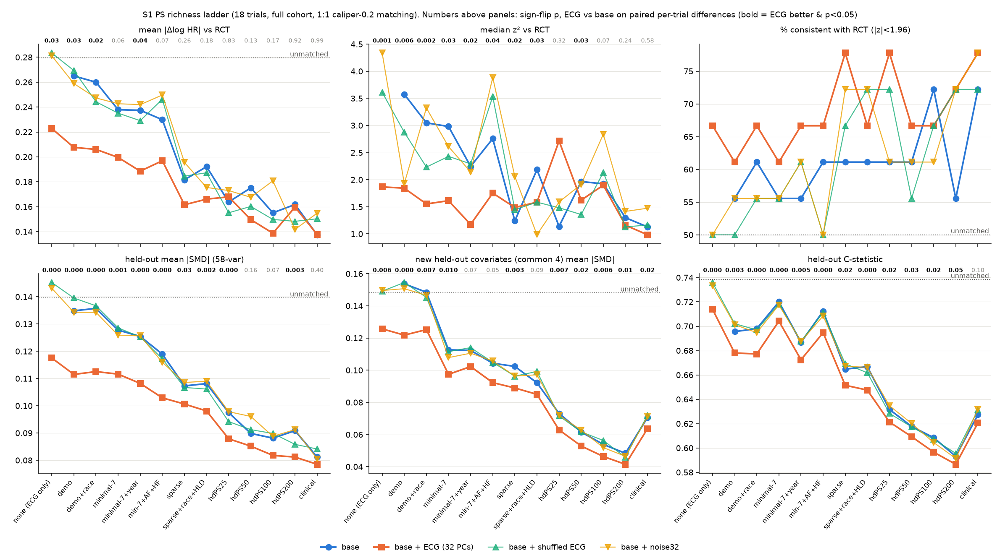
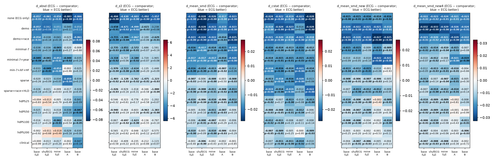

# v1.6 S1 — baseline PS richness ladder (2026-09-26)

**Exploratory, post-hoc specification (docs/V16_SWEEP_PLAN.md).** 18 trials; 1:1 greedy caliper-0.2 matching on an L2 (C=1) logistic PS; imputation 1, pool-split seed 0; primary outcome at trial horizon. ECG = 32 BCL PCs; placebos = same PCs with rows permuted (`shufECG`) and 32 Gaussian columns (`noise32`). Paired exact sign-flip across trials; d = mean over trials of (ECG arm − comparator), negative = ECG better. BH-FDR over the 13 rungs per metric (ECG vs base, full cohort). Script `scripts/v16/s1_ladder.py`; aggregates in `/mnt/raid0/rbc58/ecg-tte/audits/claude-v16-s1-ladder/`.

## Key findings (plain language)

Central question: how does the ECG gain change as the baseline PS gets richer? Short answer: **the ECG gain is
largest when the baseline PS is thin and shrinks steadily as it gets richer.** For balance on held-out variables, the gain
stays significant and beats both placebos up to hdPS200, but is null for clinical. For agreement with the RCT, the gain
is sizeable only at the thin rungs (none through minimal-7+AF+HF), and there it does not survive FDR for |Δlog HR|.
d = ECG − base, averaged over 18 trials; negative = ECG better.

1. **Held-out balance (58-variable panel): the most robust result.** ECG lowers mean |SMD| at every rung. The size of
   the drop falls as the PS gets richer: −0.022/−0.023 (none, demo, demo+race), −0.016/−0.017 (minimal-7 rungs),
   −0.007 to −0.010 (sparse, sparse+race+HLD, hdPS25, hdPS200), and −0.003 for clinical (p = 0.40, not significant).
   It is significant (p < 0.05, BH q < 0.05) at 10 of 13 rungs; hdPS50 (p = 0.16), hdPS100 (p = 0.07) and clinical are
   not. At every significant rung ECG also beats shufECG and noise32 in direction, and in most of them at p < 0.05.
   ECG-specific, FDR-surviving and p < 0.05 in **both** halves: none, demo, demo+race, minimal-7, minimal-7+year,
   sparse+race+HLD, hdPS25. Sparse (half A p = 0.50) and hdPS200 (half B p = 0.29) are significant in the full cohort but
   do not replicate. Restricting clinical to its 47 truly held-out variables leaves it null (d = −0.003, p = 0.55).
2. **Held-out C-statistic:** ECG lowers it at 12/13 rungs at p < 0.05 (clinical p = 0.074–0.10). The drop runs from
   −0.024 (none) through about −0.013 to −0.019 (sparse, sparse+race+HLD) down to −0.007 (hdPS200). It survives FDR at
   11 rungs (hdPS200 q = 0.053). Replicated at p < 0.05 in both halves: none, demo+race, minimal-7, minimal-7+year,
   minimal-7+AF+HF.
3. **New v1.6 held-out covariates:** these are tobacco, obesity, frailty and prior HF hospitalisation (the "common-4"),
   which are never in any PS. ECG lowers their |SMD| at 10/13 rungs, all surviving FDR, including hdPS25–200 and
   clinical (d = −0.007 to −0.010). But p < 0.05 in both halves holds only at none, demo and demo+race. At the richer
   rungs half A is null, so the rich-PS part is **not replicated**.
4. **Agreement with the RCT: |Δlog HR|.** The ECG gain is about −0.05 to −0.06 at none, demo, demo+race and
   minimal-7+year (p = 0.02–0.04), about −0.02 to −0.03 at sparse/sparse+race+HLD/hdPS50 (not significant), and about 0
   at hdPS25, hdPS200 and clinical. **No rung survives FDR** (smallest q = 0.124). The placebo comparisons at the thin
   rungs are mostly not significant (for example demo: vs shufECG p = 0.08, vs noise p = 0.12). Only "none" (ECG PCs
   alone vs unmatched) is significant in both halves.
5. **Agreement with the RCT: z².** Significant and placebo-beating in direction at 9 rungs (none through
   sparse+race+HLD, and hdPS50). It survives FDR at none, demo, demo+race and minimal-7+year. Sparse just misses FDR
   (q = 0.054), although it beats both placebos (p = 0.026 and 0.015) and is p < 0.05 in both halves (0.013 and 0.030).
   hdPS50 is also p < 0.05 in both halves, but its placebo p-values are 0.19 and 0.06. **Only "none" meets every
   criterion.** Consistency with the RCT is 61–78% with ECG vs 50–72% without. Dispersion φ is lower with ECG at every
   rung (for example sparse 3.4 vs 4.7, hdPS200 2.7 vs 3.3).
6. **ECG does not replace the baseline codes.** ECG PCs alone (|Δlog HR| 0.223, held-out |SMD| 0.118) beat unmatched
   (0.279 / 0.140) and every placebo-only arm, and are better than demo or minimal-7 without ECG. But minimal-7+ECG
   (0.200 / 0.112) is still worse than sparse without ECG (0.182 / 0.107). Richer baselines lower the error far more
   than ECG does: base |Δlog HR| goes from 0.265 (demo) to 0.137 (clinical).
7. **Race / hyperlipidemia add almost nothing.** demo → demo+race and sparse → sparse+race+HLD barely change any metric.
   Adding index year to minimal-7 lowers the C-statistic (0.720 → 0.687) but leaves |Δlog HR| unchanged.

Bottom line: the ECG-specific balance benefit is significant, beats both placebos and replicates **through
hdPS25**. It fades with hdPS ≥ 50 (significant but not replicated) and disappears with clinical. The RCT-agreement
benefit is concentrated in thin PSs and is not robust: it fails FDR for |Δlog HR|, and for z² it passes every
criterion only with no baseline covariates. All of this is exploratory: rungs are nested and correlated, and the two
halves come from the same 18 trials.

Automatic flags per metric (a rung is *ECG-specific* only if ECG vs base p<0.05 and ECG also beats shufECG and noise32 in direction; *replicated* = p<0.05 in half A and half B, same direction):

- **|Δlog HR| vs RCT**: ECG better at p<0.05 in 4/13 rungs (none (ECG only), demo, demo+race, minimal-7+year); placebo-beating: none (ECG only), demo, demo+race, minimal-7+year; BH q<0.05: none; replicated (p<0.05 in both halves): none (ECG only); **all four (sig + placebo + FDR + replicated): none**.
- **z²**: ECG better at p<0.05 in 9/13 rungs (none (ECG only), demo, demo+race, minimal-7, minimal-7+year, min-7+AF+HF, sparse, sparse+race+HLD, hdPS50); placebo-beating: none (ECG only), demo, demo+race, minimal-7, minimal-7+year, min-7+AF+HF, sparse, sparse+race+HLD, hdPS50; BH q<0.05: none (ECG only), demo, demo+race, minimal-7+year; replicated (p<0.05 in both halves): none (ECG only), sparse, hdPS50; **all four (sig + placebo + FDR + replicated): none (ECG only)**.
- **held-out mean |SMD| (58-var)**: ECG better at p<0.05 in 10/13 rungs (none (ECG only), demo, demo+race, minimal-7, minimal-7+year, min-7+AF+HF, sparse, sparse+race+HLD, hdPS25, hdPS200); placebo-beating: none (ECG only), demo, demo+race, minimal-7, minimal-7+year, min-7+AF+HF, sparse, sparse+race+HLD, hdPS25, hdPS200; BH q<0.05: none (ECG only), demo, demo+race, minimal-7, minimal-7+year, min-7+AF+HF, sparse, sparse+race+HLD, hdPS25, hdPS200; replicated (p<0.05 in both halves): none (ECG only), demo, demo+race, minimal-7, minimal-7+year, sparse+race+HLD, hdPS25; **all four (sig + placebo + FDR + replicated): none (ECG only), demo, demo+race, minimal-7, minimal-7+year, sparse+race+HLD, hdPS25**.
- **held-out C-statistic**: ECG better at p<0.05 in 12/13 rungs (none (ECG only), demo, demo+race, minimal-7, minimal-7+year, min-7+AF+HF, sparse, sparse+race+HLD, hdPS25, hdPS50, hdPS100, hdPS200); placebo-beating: none (ECG only), demo, demo+race, minimal-7, minimal-7+year, min-7+AF+HF, sparse, sparse+race+HLD, hdPS25, hdPS50, hdPS100, hdPS200; BH q<0.05: none (ECG only), demo, demo+race, minimal-7, minimal-7+year, min-7+AF+HF, sparse, sparse+race+HLD, hdPS25, hdPS50, hdPS100; replicated (p<0.05 in both halves): none (ECG only), demo+race, minimal-7, minimal-7+year, min-7+AF+HF; **all four (sig + placebo + FDR + replicated): none (ECG only), demo+race, minimal-7, minimal-7+year, min-7+AF+HF**.
- **58-var |SMD| restricted to variables held out from that base**: ECG better at p<0.05 in 10/13 rungs (none (ECG only), demo, demo+race, minimal-7, minimal-7+year, min-7+AF+HF, sparse, sparse+race+HLD, hdPS25, hdPS200); placebo-beating: none (ECG only), demo, demo+race, minimal-7, minimal-7+year, min-7+AF+HF, sparse, sparse+race+HLD, hdPS25, hdPS200; BH q<0.05: none (ECG only), demo, demo+race, minimal-7, minimal-7+year, min-7+AF+HF, sparse, sparse+race+HLD, hdPS25, hdPS200; replicated (p<0.05 in both halves): none (ECG only), demo, demo+race, minimal-7, minimal-7+year, sparse+race+HLD, hdPS25; **all four (sig + placebo + FDR + replicated): none (ECG only), demo, demo+race, minimal-7, minimal-7+year, sparse+race+HLD, hdPS25**.
- **new held-out covariates |SMD|**: ECG better at p<0.05 in 9/13 rungs (none (ECG only), demo, demo+race, minimal-7, min-7+AF+HF, sparse, hdPS25, hdPS50, hdPS100); placebo-beating: none (ECG only), demo, demo+race, minimal-7, min-7+AF+HF, sparse, hdPS25, hdPS50, hdPS100; BH q<0.05: none (ECG only), demo, demo+race, minimal-7, sparse, hdPS25, hdPS50, hdPS100; replicated (p<0.05 in both halves): none (ECG only), demo, demo+race, minimal-7, minimal-7+year; **all four (sig + placebo + FDR + replicated): none (ECG only), demo, demo+race, minimal-7**.
- **common-4 new covariates |SMD|**: ECG better at p<0.05 in 10/13 rungs (none (ECG only), demo, demo+race, minimal-7, sparse, hdPS25, hdPS50, hdPS100, hdPS200, clinical); placebo-beating: none (ECG only), demo, demo+race, minimal-7, sparse, hdPS25, hdPS50, hdPS100, hdPS200, clinical; BH q<0.05: none (ECG only), demo, demo+race, minimal-7, sparse, hdPS25, hdPS50, hdPS100, hdPS200, clinical; replicated (p<0.05 in both halves): none (ECG only), demo, demo+race, minimal-7+year; **all four (sig + placebo + FDR + replicated): none (ECG only), demo, demo+race**.

Figure: x = PS richness rung; lines = mean over 18 trials per arm (median for z², which is heavy-tailed); dotted = unmatched. Rung 'none' = no baseline covariates: its '+ECG' point is ECG PCs alone (and placebos alone). Numbers above each panel = sign-flip p for ECG vs base at that rung (bold = ECG better and p<0.05). C-statistic panel uses the held-out-from-base component set (differs from the engine C only for clinical).

## Rungs (base designs)

| cell | design |
|---|---|
| none (ECG only) | base = unmatched; +ECG = 32 ECG PCs alone |
| demo | age, sex, index year (`T.demo`) |
| demo+race | demo + race_black, race_asian, race_other_unknown (White reference), hispanic, ethnicity_unknown |
| minimal-7 | age, sex, race block (as above), t2d, cad_ihd, hypertension_v11, hyperlipidemia (no index year) |
| minimal-7+year | minimal-7 + index year |
| min-7+AF+HF | minimal-7 + atrial_fibrillation, heart_failure flags from `T.cov` where present (heart_failure is absent in HF-population trials) |
| sparse | `T.X_dx` (demo + v1.1 diagnosis flags) |
| sparse+race+HLD | sparse + race block + hyperlipidemia |
| hdPS k | sparse + top-k hdPS levels (pool A, ranked on the analysed rows' treatment), k = 25/50/100/200 |
| clinical | `T.X_core` (demo, dx flags, medication orders, utilisation, imputed vitals/labs) |

## Held-out balance definitions

- `mean_smd` / `cstat`: engine 58-variable panel (all components) in the matched sample.
- Overlap of the 58-panel with base designs: only **clinical** contains panel variables (`mean_meds`, `mean_util` and the 9 `smd_obs_*` vitals/labs are in `T.X_core`, as completed values). `mean_smd_ho` = mean over panel variables NOT in the base (47 for clinical, 58/57 otherwise); `cstat_ho` = C-statistic on components excluding those (identical to `cstat` for other rungs). The prognostic score and pool-B codes are treated as held-out for every rung. Race/HLD/T2D/CAD/HTN are not in the 58-panel. hdPS uses pool-A codes only; pool B is held out by construction.
- `mean_smd_new`: |SMD| on the v1.6 candidate covariates (tobacco_ever, obesity, frailty_count, inpatient_days_365, prior_hf_hosp_365, race_black, race_asian, race_other_unknown, hispanic, hyperlipidemia, t2d), matched sample, pooled pre-match SD of the analysed rows (as the engine). Excluded when in the base or proxied by it: race vars + hyperlipidemia + t2d in demo+race/min-7 rungs (race only for demo+race), t2d in any rung containing the sparse `diabetes` flag, `inpatient_days_365` in clinical (proxied by `hospital_admissions`). `prior_hf_hosp_365` kept even where a heart_failure flag is in the PS (different construct: hospitalisation).

## Results by metric (ECG vs base, and placebos; full cohort + halves)

### |Δlog HR| vs RCT

| cell | k better (full) | ECG−base full | q (BH) | ECG−shufECG | ECG−noise | half A | half B |
|---|---|---|---|---|---|---|---|
| none (ECG only) | 14/18 | -0.057 (p=0.032) | 0.124 | -0.061 (p=0.014) | -0.058 (p=0.013) | -0.083 (p=0.001) | -0.066 (p=0.016) |
| demo | 14/18 | -0.057 (p=0.033) | 0.124 | -0.062 (p=0.083) | -0.051 (p=0.120) | -0.040 (p=0.106) | -0.054 (p=0.125) |
| demo+race | 13/18 | -0.054 (p=0.022) | 0.124 | -0.038 (p=0.179) | -0.041 (p=0.159) | -0.025 (p=0.240) | -0.061 (p=0.013) |
| minimal-7 | 11/18 | -0.038 (p=0.058) | 0.150 | -0.036 (p=0.101) | -0.043 (p=0.007) | -0.020 (p=0.269) | -0.008 (p=0.805) |
| minimal-7+year | 13/18 | -0.049 (p=0.038) | 0.124 | -0.041 (p=0.012) | -0.053 (p=0.006) | -0.044 (p=0.016) | -0.035 (p=0.240) |
| min-7+AF+HF | 13/18 | -0.033 (p=0.071) | 0.154 | -0.049 (p=0.013) | -0.053 (p=0.001) | -0.002 (p=0.959) | -0.025 (p=0.329) |
| sparse | 14/18 | -0.020 (p=0.264) | 0.344 | -0.023 (p=0.088) | -0.034 (p=0.053) | -0.059 (p=0.042) | -0.034 (p=0.231) |
| sparse+race+HLD | 11/18 | -0.026 (p=0.180) | 0.260 | -0.021 (p=0.181) | -0.009 (p=0.629) | -0.017 (p=0.299) | -0.028 (p=0.446) |
| hdPS25 | 12/18 | +0.004 (p=0.830) | 0.981 | +0.013 (p=0.541) | -0.005 (p=0.794) | -0.016 (p=0.489) | -0.041 (p=0.091) |
| hdPS50 | 13/18 | -0.025 (p=0.126) | 0.234 | -0.011 (p=0.324) | -0.018 (p=0.162) | -0.038 (p=0.095) | -0.047 (p=0.002) |
| hdPS100 | 10/18 | -0.016 (p=0.168) | 0.260 | -0.011 (p=0.278) | -0.042 (p=0.006) | -0.010 (p=0.536) | -0.034 (p=0.049) |
| hdPS200 | 10/18 | -0.002 (p=0.918) | 0.989 | +0.011 (p=0.678) | +0.018 (p=0.493) | -0.029 (p=0.159) | -0.030 (p=0.079) |
| clinical | 9/18 | +0.000 (p=0.989) | 0.989 | -0.013 (p=0.268) | -0.017 (p=0.204) | -0.002 (p=0.928) | -0.047 (p=0.183) |

### z² = Δ²/(se²+se_RCT²)

| cell | k better (full) | ECG−base full | q (BH) | ECG−shufECG | ECG−noise | half A | half B |
|---|---|---|---|---|---|---|---|
| none (ECG only) | 14/18 | -6.404 (p=0.001) | 0.016 | -4.630 (p=0.001) | -4.603 (p=0.002) | -5.492 (p=0.000) | -5.057 (p=0.001) |
| demo | 14/18 | -3.658 (p=0.006) | 0.025 | -4.671 (p=0.021) | -4.499 (p=0.015) | -2.615 (p=0.032) | -3.238 (p=0.083) |
| demo+race | 13/18 | -3.715 (p=0.002) | 0.016 | -3.399 (p=0.045) | -3.867 (p=0.006) | -2.100 (p=0.055) | -2.629 (p=0.010) |
| minimal-7 | 11/18 | -2.735 (p=0.033) | 0.054 | -3.051 (p=0.005) | -2.572 (p=0.006) | -1.686 (p=0.073) | -1.591 (p=0.188) |
| minimal-7+year | 14/18 | -3.318 (p=0.015) | 0.049 | -1.727 (p=0.061) | -3.184 (p=0.015) | -1.720 (p=0.074) | -1.905 (p=0.077) |
| min-7+AF+HF | 13/18 | -1.970 (p=0.039) | 0.057 | -2.513 (p=0.001) | -2.614 (p=0.004) | -1.135 (p=0.201) | -1.448 (p=0.085) |
| sparse | 14/18 | -1.403 (p=0.024) | 0.054 | -1.128 (p=0.026) | -1.562 (p=0.015) | -1.475 (p=0.013) | -1.223 (p=0.030) |
| sparse+race+HLD | 11/18 | -1.026 (p=0.033) | 0.054 | -0.929 (p=0.155) | -1.018 (p=0.305) | -0.346 (p=0.581) | -1.000 (p=0.036) |
| hdPS25 | 12/18 | -0.546 (p=0.316) | 0.343 | -0.323 (p=0.615) | -0.778 (p=0.167) | -0.253 (p=0.575) | -1.202 (p=0.068) |
| hdPS50 | 13/18 | -0.940 (p=0.027) | 0.054 | -0.464 (p=0.191) | -0.603 (p=0.060) | -0.963 (p=0.012) | -1.383 (p=0.001) |
| hdPS100 | 10/18 | -0.867 (p=0.067) | 0.087 | -0.697 (p=0.024) | -1.623 (p=0.001) | -0.136 (p=0.551) | -0.797 (p=0.099) |
| hdPS200 | 10/18 | -0.565 (p=0.242) | 0.286 | -0.273 (p=0.621) | -0.048 (p=0.913) | -0.527 (p=0.120) | -0.575 (p=0.067) |
| clinical | 9/18 | -0.162 (p=0.584) | 0.584 | -0.409 (p=0.222) | -0.235 (p=0.314) | -0.212 (p=0.660) | -1.115 (p=0.071) |

### held-out mean |SMD|, 58-var panel

| cell | k better (full) | ECG−base full | q (BH) | ECG−shufECG | ECG−noise | half A | half B |
|---|---|---|---|---|---|---|---|
| none (ECG only) | 16/18 | -0.022 (p=0.000) | 0.000 | -0.028 (p=0.000) | -0.026 (p=0.000) | -0.017 (p=0.003) | -0.023 (p=0.001) |
| demo | 17/18 | -0.023 (p=0.000) | 0.000 | -0.028 (p=0.000) | -0.023 (p=0.000) | -0.019 (p=0.003) | -0.023 (p=0.001) |
| demo+race | 18/18 | -0.023 (p=0.000) | 0.000 | -0.024 (p=0.000) | -0.022 (p=0.000) | -0.014 (p=0.032) | -0.025 (p=0.001) |
| minimal-7 | 16/18 | -0.016 (p=0.001) | 0.001 | -0.017 (p=0.001) | -0.014 (p=0.003) | -0.015 (p=0.002) | -0.019 (p=0.003) |
| minimal-7+year | 17/18 | -0.017 (p=0.000) | 0.000 | -0.017 (p=0.000) | -0.017 (p=0.000) | -0.014 (p=0.014) | -0.020 (p=0.000) |
| min-7+AF+HF | 17/18 | -0.016 (p=0.000) | 0.000 | -0.014 (p=0.000) | -0.013 (p=0.001) | -0.007 (p=0.021) | -0.014 (p=0.060) |
| sparse | 14/18 | -0.007 (p=0.026) | 0.034 | -0.006 (p=0.059) | -0.008 (p=0.004) | -0.003 (p=0.504) | -0.008 (p=0.033) |
| sparse+race+HLD | 14/18 | -0.010 (p=0.002) | 0.004 | -0.008 (p=0.037) | -0.011 (p=0.011) | -0.008 (p=0.024) | -0.013 (p=0.000) |
| hdPS25 | 17/18 | -0.010 (p=0.000) | 0.000 | -0.006 (p=0.044) | -0.010 (p=0.001) | -0.006 (p=0.013) | -0.012 (p=0.001) |
| hdPS50 | 12/18 | -0.005 (p=0.161) | 0.174 | -0.006 (p=0.095) | -0.011 (p=0.012) | -0.007 (p=0.030) | -0.006 (p=0.188) |
| hdPS100 | 13/18 | -0.006 (p=0.069) | 0.082 | -0.008 (p=0.014) | -0.007 (p=0.024) | -0.003 (p=0.287) | -0.006 (p=0.314) |
| hdPS200 | 15/18 | -0.010 (p=0.003) | 0.004 | -0.005 (p=0.087) | -0.010 (p=0.000) | -0.006 (p=0.032) | -0.004 (p=0.285) |
| clinical | 13/18 | -0.003 (p=0.401) | 0.401 | -0.006 (p=0.003) | -0.002 (p=0.432) | -0.002 (p=0.541) | -0.001 (p=0.846) |

### held-out C-statistic (engine)

| cell | k better (full) | ECG−base full | q (BH) | ECG−shufECG | ECG−noise | half A | half B |
|---|---|---|---|---|---|---|---|
| none (ECG only) | 17/18 | -0.024 (p=0.000) | 0.000 | -0.022 (p=0.000) | -0.019 (p=0.000) | -0.023 (p=0.000) | -0.028 (p=0.000) |
| demo | 15/18 | -0.018 (p=0.003) | 0.007 | -0.024 (p=0.000) | -0.023 (p=0.000) | -0.014 (p=0.091) | -0.028 (p=0.000) |
| demo+race | 16/18 | -0.021 (p=0.000) | 0.000 | -0.020 (p=0.001) | -0.018 (p=0.002) | -0.021 (p=0.000) | -0.018 (p=0.011) |
| minimal-7 | 17/18 | -0.016 (p=0.000) | 0.000 | -0.014 (p=0.000) | -0.013 (p=0.000) | -0.016 (p=0.017) | -0.012 (p=0.000) |
| minimal-7+year | 16/18 | -0.014 (p=0.005) | 0.010 | -0.015 (p=0.008) | -0.015 (p=0.009) | -0.015 (p=0.030) | -0.015 (p=0.006) |
| min-7+AF+HF | 17/18 | -0.018 (p=0.000) | 0.000 | -0.016 (p=0.000) | -0.014 (p=0.000) | -0.021 (p=0.002) | -0.014 (p=0.047) |
| sparse | 15/18 | -0.013 (p=0.023) | 0.030 | -0.018 (p=0.004) | -0.016 (p=0.002) | -0.020 (p=0.001) | -0.013 (p=0.055) |
| sparse+race+HLD | 18/18 | -0.019 (p=0.000) | 0.000 | -0.014 (p=0.003) | -0.019 (p=0.000) | -0.012 (p=0.063) | -0.022 (p=0.000) |
| hdPS25 | 13/18 | -0.010 (p=0.020) | 0.030 | -0.007 (p=0.166) | -0.013 (p=0.002) | -0.010 (p=0.083) | -0.013 (p=0.004) |
| hdPS50 | 13/18 | -0.008 (p=0.029) | 0.034 | -0.008 (p=0.048) | -0.011 (p=0.008) | -0.012 (p=0.041) | -0.006 (p=0.223) |
| hdPS100 | 13/18 | -0.012 (p=0.015) | 0.025 | -0.011 (p=0.037) | -0.008 (p=0.155) | -0.007 (p=0.108) | -0.008 (p=0.137) |
| hdPS200 | 12/18 | -0.007 (p=0.048) | 0.053 | -0.009 (p=0.015) | -0.005 (p=0.254) | -0.000 (p=0.954) | -0.009 (p=0.028) |
| clinical | 14/18 | -0.007 (p=0.074) | 0.074 | -0.011 (p=0.004) | -0.011 (p=0.004) | -0.014 (p=0.020) | -0.010 (p=0.062) |

### 58-var |SMD|, held-out-from-base subset

| cell | k better (full) | ECG−base full | q (BH) | ECG−shufECG | ECG−noise | half A | half B |
|---|---|---|---|---|---|---|---|
| none (ECG only) | 16/18 | -0.022 (p=0.000) | 0.000 | -0.028 (p=0.000) | -0.026 (p=0.000) | -0.017 (p=0.003) | -0.023 (p=0.001) |
| demo | 17/18 | -0.023 (p=0.000) | 0.000 | -0.028 (p=0.000) | -0.023 (p=0.000) | -0.019 (p=0.003) | -0.023 (p=0.001) |
| demo+race | 18/18 | -0.023 (p=0.000) | 0.000 | -0.024 (p=0.000) | -0.022 (p=0.000) | -0.014 (p=0.032) | -0.025 (p=0.001) |
| minimal-7 | 16/18 | -0.016 (p=0.001) | 0.001 | -0.017 (p=0.001) | -0.014 (p=0.003) | -0.015 (p=0.002) | -0.019 (p=0.003) |
| minimal-7+year | 17/18 | -0.017 (p=0.000) | 0.000 | -0.017 (p=0.000) | -0.017 (p=0.000) | -0.014 (p=0.014) | -0.020 (p=0.000) |
| min-7+AF+HF | 17/18 | -0.016 (p=0.000) | 0.000 | -0.014 (p=0.000) | -0.013 (p=0.001) | -0.007 (p=0.021) | -0.014 (p=0.060) |
| sparse | 14/18 | -0.007 (p=0.026) | 0.034 | -0.006 (p=0.059) | -0.008 (p=0.004) | -0.003 (p=0.504) | -0.008 (p=0.033) |
| sparse+race+HLD | 14/18 | -0.010 (p=0.002) | 0.004 | -0.008 (p=0.037) | -0.011 (p=0.011) | -0.008 (p=0.024) | -0.013 (p=0.000) |
| hdPS25 | 17/18 | -0.010 (p=0.000) | 0.000 | -0.006 (p=0.044) | -0.010 (p=0.001) | -0.006 (p=0.013) | -0.012 (p=0.001) |
| hdPS50 | 12/18 | -0.005 (p=0.161) | 0.174 | -0.006 (p=0.095) | -0.011 (p=0.012) | -0.007 (p=0.030) | -0.006 (p=0.188) |
| hdPS100 | 13/18 | -0.006 (p=0.069) | 0.082 | -0.008 (p=0.014) | -0.007 (p=0.024) | -0.003 (p=0.287) | -0.006 (p=0.314) |
| hdPS200 | 15/18 | -0.010 (p=0.003) | 0.004 | -0.005 (p=0.087) | -0.010 (p=0.000) | -0.006 (p=0.032) | -0.004 (p=0.285) |
| clinical | 12/18 | -0.003 (p=0.548) | 0.548 | -0.006 (p=0.009) | -0.003 (p=0.325) | -0.003 (p=0.551) | -0.002 (p=0.678) |

### held-out C-statistic, held-out-from-base components

| cell | k better (full) | ECG−base full | q (BH) | ECG−shufECG | ECG−noise | half A | half B |
|---|---|---|---|---|---|---|---|
| none (ECG only) | 17/18 | -0.024 (p=0.000) | 0.000 | -0.022 (p=0.000) | -0.019 (p=0.000) | -0.023 (p=0.000) | -0.028 (p=0.000) |
| demo | 15/18 | -0.018 (p=0.003) | 0.007 | -0.024 (p=0.000) | -0.023 (p=0.000) | -0.014 (p=0.091) | -0.028 (p=0.000) |
| demo+race | 16/18 | -0.021 (p=0.000) | 0.000 | -0.020 (p=0.001) | -0.018 (p=0.002) | -0.021 (p=0.000) | -0.018 (p=0.011) |
| minimal-7 | 17/18 | -0.016 (p=0.000) | 0.000 | -0.014 (p=0.000) | -0.013 (p=0.000) | -0.016 (p=0.017) | -0.012 (p=0.000) |
| minimal-7+year | 16/18 | -0.014 (p=0.005) | 0.010 | -0.015 (p=0.008) | -0.015 (p=0.009) | -0.015 (p=0.030) | -0.015 (p=0.006) |
| min-7+AF+HF | 17/18 | -0.018 (p=0.000) | 0.000 | -0.016 (p=0.000) | -0.014 (p=0.000) | -0.021 (p=0.002) | -0.014 (p=0.047) |
| sparse | 15/18 | -0.013 (p=0.023) | 0.030 | -0.018 (p=0.004) | -0.016 (p=0.002) | -0.020 (p=0.001) | -0.013 (p=0.055) |
| sparse+race+HLD | 18/18 | -0.019 (p=0.000) | 0.000 | -0.014 (p=0.003) | -0.019 (p=0.000) | -0.012 (p=0.063) | -0.022 (p=0.000) |
| hdPS25 | 13/18 | -0.010 (p=0.020) | 0.030 | -0.007 (p=0.166) | -0.013 (p=0.002) | -0.010 (p=0.083) | -0.013 (p=0.004) |
| hdPS50 | 13/18 | -0.008 (p=0.029) | 0.034 | -0.008 (p=0.048) | -0.011 (p=0.008) | -0.012 (p=0.041) | -0.006 (p=0.223) |
| hdPS100 | 13/18 | -0.012 (p=0.015) | 0.025 | -0.011 (p=0.037) | -0.008 (p=0.155) | -0.007 (p=0.108) | -0.008 (p=0.137) |
| hdPS200 | 12/18 | -0.007 (p=0.048) | 0.053 | -0.009 (p=0.015) | -0.005 (p=0.254) | -0.000 (p=0.954) | -0.009 (p=0.028) |
| clinical | 14/18 | -0.007 (p=0.104) | 0.104 | -0.011 (p=0.006) | -0.011 (p=0.006) | -0.014 (p=0.011) | -0.010 (p=0.026) |

### new candidate covariates mean |SMD| (rung-specific set)

| cell | k better (full) | ECG−base full | q (BH) | ECG−shufECG | ECG−noise | half A | half B |
|---|---|---|---|---|---|---|---|
| none (ECG only) | 15/18 | -0.015 (p=0.002) | 0.006 | -0.015 (p=0.011) | -0.016 (p=0.004) | -0.014 (p=0.006) | -0.016 (p=0.017) |
| demo | 16/18 | -0.020 (p=0.000) | 0.001 | -0.022 (p=0.000) | -0.021 (p=0.000) | -0.021 (p=0.002) | -0.018 (p=0.011) |
| demo+race | 13/18 | -0.023 (p=0.005) | 0.010 | -0.020 (p=0.007) | -0.022 (p=0.005) | -0.027 (p=0.004) | -0.025 (p=0.005) |
| minimal-7 | 15/18 | -0.015 (p=0.021) | 0.035 | -0.015 (p=0.008) | -0.009 (p=0.080) | -0.015 (p=0.035) | -0.009 (p=0.033) |
| minimal-7+year | 11/18 | -0.010 (p=0.092) | 0.109 | -0.010 (p=0.050) | -0.010 (p=0.099) | -0.022 (p=0.003) | -0.021 (p=0.001) |
| min-7+AF+HF | 13/18 | -0.013 (p=0.042) | 0.061 | -0.012 (p=0.048) | -0.015 (p=0.010) | -0.010 (p=0.058) | -0.001 (p=0.930) |
| sparse | 15/18 | -0.008 (p=0.000) | 0.001 | -0.006 (p=0.007) | -0.007 (p=0.003) | -0.006 (p=0.031) | -0.005 (p=0.143) |
| sparse+race+HLD | 10/18 | -0.007 (p=0.124) | 0.134 | -0.013 (p=0.003) | -0.012 (p=0.008) | -0.012 (p=0.029) | -0.009 (p=0.055) |
| hdPS25 | 16/18 | -0.010 (p=0.000) | 0.000 | -0.008 (p=0.000) | -0.007 (p=0.004) | +0.002 (p=0.398) | -0.009 (p=0.013) |
| hdPS50 | 14/18 | -0.006 (p=0.012) | 0.023 | -0.007 (p=0.028) | -0.009 (p=0.000) | -0.004 (p=0.089) | -0.003 (p=0.359) |
| hdPS100 | 16/18 | -0.008 (p=0.000) | 0.001 | -0.008 (p=0.000) | -0.004 (p=0.081) | -0.002 (p=0.284) | -0.010 (p=0.001) |
| hdPS200 | 13/18 | -0.003 (p=0.247) | 0.247 | -0.003 (p=0.197) | -0.002 (p=0.319) | -0.001 (p=0.528) | -0.006 (p=0.108) |
| clinical | 14/18 | -0.004 (p=0.054) | 0.071 | -0.007 (p=0.011) | -0.006 (p=0.026) | -0.005 (p=0.125) | -0.004 (p=0.126) |

### common-4 new covariates mean |SMD| (tobacco_ever, obesity, frailty_count, prior_hf_hosp_365)

| cell | k better (full) | ECG−base full | q (BH) | ECG−shufECG | ECG−noise | half A | half B |
|---|---|---|---|---|---|---|---|
| none (ECG only) | 14/18 | -0.022 (p=0.006) | 0.016 | -0.023 (p=0.017) | -0.024 (p=0.007) | -0.021 (p=0.007) | -0.023 (p=0.005) |
| demo | 17/18 | -0.032 (p=0.000) | 0.001 | -0.033 (p=0.000) | -0.029 (p=0.000) | -0.026 (p=0.004) | -0.024 (p=0.009) |
| demo+race | 13/18 | -0.023 (p=0.007) | 0.016 | -0.020 (p=0.021) | -0.021 (p=0.017) | -0.029 (p=0.001) | -0.022 (p=0.009) |
| minimal-7 | 14/18 | -0.015 (p=0.010) | 0.018 | -0.014 (p=0.009) | -0.010 (p=0.037) | -0.015 (p=0.019) | -0.007 (p=0.075) |
| minimal-7+year | 12/18 | -0.010 (p=0.072) | 0.078 | -0.012 (p=0.015) | -0.008 (p=0.168) | -0.021 (p=0.003) | -0.019 (p=0.001) |
| min-7+AF+HF | 13/18 | -0.012 (p=0.053) | 0.063 | -0.013 (p=0.032) | -0.013 (p=0.011) | -0.010 (p=0.014) | -0.004 (p=0.656) |
| sparse | 15/18 | -0.013 (p=0.003) | 0.016 | -0.007 (p=0.139) | -0.007 (p=0.045) | -0.015 (p=0.011) | -0.005 (p=0.300) |
| sparse+race+HLD | 11/18 | -0.007 (p=0.087) | 0.087 | -0.014 (p=0.002) | -0.012 (p=0.011) | -0.014 (p=0.009) | -0.007 (p=0.137) |
| hdPS25 | 15/18 | -0.010 (p=0.007) | 0.016 | -0.009 (p=0.011) | -0.009 (p=0.009) | +0.002 (p=0.815) | -0.008 (p=0.062) |
| hdPS50 | 14/18 | -0.009 (p=0.020) | 0.026 | -0.009 (p=0.041) | -0.010 (p=0.006) | +0.001 (p=0.812) | -0.000 (p=0.993) |
| hdPS100 | 16/18 | -0.008 (p=0.006) | 0.016 | -0.010 (p=0.002) | -0.006 (p=0.078) | -0.002 (p=0.425) | -0.011 (p=0.010) |
| hdPS200 | 16/18 | -0.007 (p=0.013) | 0.022 | -0.004 (p=0.064) | -0.005 (p=0.065) | -0.003 (p=0.403) | -0.006 (p=0.026) |
| clinical | 14/18 | -0.007 (p=0.016) | 0.023 | -0.008 (p=0.034) | -0.008 (p=0.029) | -0.004 (p=0.302) | -0.002 (p=0.717) |

## Arm levels (full cohort; mean over trials)

absd = mean |Δlog HR|; z2 med = median z²; smd58 = 58-panel mean |SMD|; smdHO = held-out-from-base subset; smdNEW = new covariates; C_HO = held-out C-statistic.

| cell | absd base | absd ECG | absd shufECG | absd noise | z2 med base | cons% base | smd58 base | smdHO base | smdNEW base | smdNEW4 base | C_HO base | z2 med ECG | cons% ECG | smd58 ECG | smdHO ECG | smdNEW ECG | smdNEW4 ECG | C_HO ECG | pairs(med) base |
|---|---|---|---|---|---|---|---|---|---|---|---|---|---|---|---|---|---|---|---|
| none (ECG only) | 0.279 | 0.223 | 0.283 | 0.281 | 3.797 | 50.000 | 0.140 | 0.140 | 0.115 | 0.148 | 0.738 | 1.867 | 66.667 | 0.118 | 0.118 | 0.100 | 0.126 | 0.714 | – |
| demo | 0.265 | 0.208 | 0.269 | 0.259 | 3.575 | 55.556 | 0.135 | 0.135 | 0.119 | 0.154 | 0.696 | 1.843 | 61.111 | 0.111 | 0.111 | 0.099 | 0.122 | 0.678 | 2104.000 |
| demo+race | 0.260 | 0.206 | 0.244 | 0.247 | 3.048 | 61.111 | 0.136 | 0.136 | 0.146 | 0.148 | 0.698 | 1.552 | 66.667 | 0.113 | 0.113 | 0.123 | 0.125 | 0.677 | 2107.000 |
| minimal-7 | 0.238 | 0.200 | 0.235 | 0.243 | 2.981 | 55.556 | 0.128 | 0.128 | 0.127 | 0.113 | 0.720 | 1.612 | 61.111 | 0.112 | 0.112 | 0.112 | 0.097 | 0.704 | 2518.000 |
| minimal-7+year | 0.237 | 0.189 | 0.229 | 0.242 | 2.245 | 55.556 | 0.125 | 0.125 | 0.128 | 0.112 | 0.687 | 1.174 | 66.667 | 0.108 | 0.108 | 0.118 | 0.102 | 0.672 | 2030.500 |
| min-7+AF+HF | 0.230 | 0.197 | 0.246 | 0.250 | 2.757 | 61.111 | 0.119 | 0.119 | 0.118 | 0.104 | 0.712 | 1.752 | 66.667 | 0.103 | 0.103 | 0.105 | 0.092 | 0.695 | 2345.500 |
| sparse | 0.182 | 0.162 | 0.185 | 0.196 | 1.240 | 61.111 | 0.107 | 0.107 | 0.082 | 0.102 | 0.665 | 1.487 | 77.778 | 0.101 | 0.101 | 0.074 | 0.089 | 0.651 | 1908.000 |
| sparse+race+HLD | 0.192 | 0.166 | 0.187 | 0.175 | 2.184 | 61.111 | 0.108 | 0.108 | 0.100 | 0.092 | 0.667 | 1.584 | 66.667 | 0.098 | 0.098 | 0.093 | 0.085 | 0.648 | 1899.000 |
| hdPS25 | 0.164 | 0.168 | 0.155 | 0.173 | 1.138 | 61.111 | 0.097 | 0.097 | 0.066 | 0.073 | 0.632 | 2.713 | 77.778 | 0.088 | 0.088 | 0.056 | 0.063 | 0.621 | 1790.500 |
| hdPS50 | 0.175 | 0.150 | 0.160 | 0.168 | 1.965 | 61.111 | 0.090 | 0.090 | 0.056 | 0.062 | 0.618 | 1.622 | 66.667 | 0.085 | 0.085 | 0.050 | 0.053 | 0.609 | 1764.500 |
| hdPS100 | 0.155 | 0.139 | 0.150 | 0.181 | 1.923 | 72.222 | 0.088 | 0.088 | 0.054 | 0.054 | 0.608 | 1.898 | 66.667 | 0.082 | 0.082 | 0.046 | 0.046 | 0.597 | 1742.500 |
| hdPS200 | 0.162 | 0.160 | 0.148 | 0.142 | 1.299 | 55.556 | 0.091 | 0.091 | 0.047 | 0.048 | 0.593 | 1.160 | 72.222 | 0.081 | 0.081 | 0.044 | 0.041 | 0.587 | 1717.500 |
| clinical | 0.137 | 0.138 | 0.150 | 0.155 | 1.128 | 72.222 | 0.081 | 0.090 | 0.059 | 0.071 | 0.627 | 0.983 | 77.778 | 0.079 | 0.088 | 0.055 | 0.064 | 0.621 | 1790.500 |

Unmatched reference (mean over trials, by half):

| half | absd | z2_mean | cons | mean_smd | cstat | mean_smd_new | mean_smd_new4 |
|---|---|---|---|---|---|---|---|
| A | 0.281 | 10.770 | 61.111 | 0.151 | 0.728 | 0.115 | 0.146 |
| B | 0.293 | 10.022 | 55.556 | 0.155 | 0.726 | 0.120 | 0.150 |
| full | 0.279 | 13.981 | 50.000 | 0.140 | 0.738 | 0.115 | 0.148 |

## Consistency % and dispersion φ per arm (full)

| cell | cons% ECG | phi ECG | cons% base | phi base | cons% shufECG | phi shufECG | cons% noise | phi noise |
|---|---|---|---|---|---|---|---|---|
| none (ECG only) | 66.67 | 6.89 | 50.00 | 13.84 | 50.00 | 12.03 | 50.00 | 11.60 |
| demo | 61.11 | 6.08 | 55.56 | 9.76 | 50.00 | 11.12 | 55.56 | 10.90 |
| demo+race | 66.67 | 5.63 | 61.11 | 9.63 | 55.56 | 9.13 | 55.56 | 9.76 |
| minimal-7 | 61.11 | 5.13 | 55.56 | 8.17 | 55.56 | 8.43 | 55.56 | 7.82 |
| minimal-7+year | 66.67 | 5.14 | 55.56 | 8.58 | 61.11 | 7.04 | 61.11 | 8.33 |
| min-7+AF+HF | 66.67 | 5.14 | 61.11 | 7.13 | 50.00 | 7.69 | 50.00 | 7.88 |
| sparse | 77.78 | 3.41 | 61.11 | 4.70 | 66.67 | 4.59 | 72.22 | 4.91 |
| sparse+race+HLD | 66.67 | 3.52 | 61.11 | 4.49 | 72.22 | 4.22 | 72.22 | 4.53 |
| hdPS25 | 77.78 | 3.13 | 61.11 | 3.69 | 72.22 | 3.57 | 61.11 | 4.00 |
| hdPS50 | 66.67 | 2.80 | 61.11 | 3.88 | 55.56 | 3.34 | 61.11 | 3.45 |
| hdPS100 | 66.67 | 2.30 | 72.22 | 3.18 | 66.67 | 2.79 | 61.11 | 3.99 |
| hdPS200 | 72.22 | 2.71 | 55.56 | 3.28 | 72.22 | 2.97 | 72.22 | 2.72 |
| clinical | 77.78 | 2.61 | 72.22 | 2.72 | 72.22 | 3.03 | 77.78 | 2.76 |

## New candidate covariates: mean |SMD| per variable (full cohort, mean over trials; NaN = in/proxied by base)

| cell | arm_role | tobacco_ever | obesity | frailty_count | inpatient_days_365 | prior_hf_hosp_365 | race_black | race_asian | race_other_unknown | hispanic | hyperlipidemia | t2d |
|---|---|---|---|---|---|---|---|---|---|---|---|---|
| r0_none | ECG | 0.103 | 0.088 | 0.183 | 0.189 | 0.138 | 0.116 | 0.032 | 0.040 | 0.041 | 0.087 | 0.095 |
| r0_none | base | 0.118 | 0.105 | 0.211 | 0.210 | 0.171 | 0.124 | 0.030 | 0.043 | 0.052 | 0.106 | 0.113 |
| r0_none | noise | 0.114 | 0.105 | 0.217 | 0.213 | 0.176 | 0.118 | 0.035 | 0.046 | 0.054 | 0.101 | 0.113 |
| r0_none | shufECG | 0.119 | 0.104 | 0.215 | 0.209 | 0.173 | 0.132 | 0.028 | 0.039 | 0.052 | 0.104 | 0.110 |
| r1_demo | ECG | 0.106 | 0.078 | 0.182 | 0.202 | 0.124 | 0.113 | 0.033 | 0.034 | 0.050 | 0.082 | 0.096 |
| r1_demo | base | 0.136 | 0.110 | 0.210 | 0.227 | 0.169 | 0.135 | 0.034 | 0.039 | 0.052 | 0.089 | 0.127 |
| r1_demo | noise | 0.132 | 0.115 | 0.202 | 0.230 | 0.163 | 0.141 | 0.032 | 0.050 | 0.062 | 0.089 | 0.123 |
| r1_demo | shufECG | 0.129 | 0.113 | 0.215 | 0.242 | 0.173 | 0.141 | 0.031 | 0.047 | 0.054 | 0.088 | 0.118 |
| r2_demo+race | ECG | 0.102 | 0.093 | 0.183 | 0.203 | 0.128 | – | – | – | – | 0.077 | 0.086 |
| r2_demo+race | base | 0.132 | 0.108 | 0.206 | 0.231 | 0.153 | – | – | – | – | 0.090 | 0.114 |
| r2_demo+race | noise | 0.125 | 0.113 | 0.199 | 0.230 | 0.158 | – | – | – | – | 0.090 | 0.112 |
| r2_demo+race | shufECG | 0.121 | 0.103 | 0.203 | 0.230 | 0.164 | – | – | – | – | 0.086 | 0.109 |
| r3_min7 | ECG | 0.065 | 0.077 | 0.143 | 0.165 | 0.113 | – | – | – | – | – | – |
| r3_min7 | base | 0.073 | 0.090 | 0.163 | 0.178 | 0.134 | – | – | – | – | – | – |
| r3_min7 | noise | 0.079 | 0.076 | 0.153 | 0.168 | 0.132 | – | – | – | – | – | – |
| r3_min7 | shufECG | 0.074 | 0.080 | 0.159 | 0.184 | 0.147 | – | – | – | – | – | – |
| r3b_min7+year | ECG | 0.066 | 0.071 | 0.163 | 0.179 | 0.115 | – | – | – | – | – | – |
| r3b_min7+year | base | 0.080 | 0.079 | 0.173 | 0.189 | 0.121 | – | – | – | – | – | – |
| r3b_min7+year | noise | 0.080 | 0.074 | 0.174 | 0.194 | 0.117 | – | – | – | – | – | – |
| r3b_min7+year | shufECG | 0.080 | 0.075 | 0.180 | 0.181 | 0.127 | – | – | – | – | – | – |
| r4_min7+AF+HF | ECG | 0.071 | 0.061 | 0.142 | 0.152 | 0.098 | – | – | – | – | – | – |
| r4_min7+AF+HF | base | 0.080 | 0.074 | 0.166 | 0.168 | 0.098 | – | – | – | – | – | – |
| r4_min7+AF+HF | noise | 0.078 | 0.074 | 0.164 | 0.171 | 0.111 | – | – | – | – | – | – |
| r4_min7+AF+HF | shufECG | 0.076 | 0.075 | 0.161 | 0.161 | 0.110 | – | – | – | – | – | – |
| r5_sparse | ECG | 0.066 | 0.064 | 0.148 | 0.131 | 0.075 | 0.093 | 0.031 | 0.037 | 0.051 | 0.046 | – |
| r5_sparse | base | 0.079 | 0.073 | 0.161 | 0.137 | 0.098 | 0.109 | 0.036 | 0.032 | 0.057 | 0.048 | – |
| r5_sparse | noise | 0.074 | 0.070 | 0.155 | 0.130 | 0.083 | 0.115 | 0.035 | 0.042 | 0.058 | 0.050 | – |
| r5_sparse | shufECG | 0.081 | 0.066 | 0.154 | 0.125 | 0.080 | 0.105 | 0.039 | 0.040 | 0.054 | 0.061 | – |
| r6_sparse+race+HLD | ECG | 0.068 | 0.054 | 0.142 | 0.123 | 0.071 | – | – | – | – | – | – |
| r6_sparse+race+HLD | base | 0.071 | 0.065 | 0.150 | 0.127 | 0.079 | – | – | – | – | – | – |
| r6_sparse+race+HLD | noise | 0.080 | 0.063 | 0.153 | 0.132 | 0.090 | – | – | – | – | – | – |
| r6_sparse+race+HLD | shufECG | 0.079 | 0.064 | 0.165 | 0.131 | 0.088 | – | – | – | – | – | – |
| r7_hdPS25 | ECG | 0.050 | 0.047 | 0.089 | 0.063 | 0.073 | 0.086 | 0.033 | 0.036 | 0.049 | 0.042 | – |
| r7_hdPS25 | base | 0.057 | 0.067 | 0.097 | 0.068 | 0.080 | 0.117 | 0.036 | 0.037 | 0.061 | 0.053 | – |
| r7_hdPS25 | noise | 0.060 | 0.068 | 0.090 | 0.057 | 0.076 | 0.114 | 0.031 | 0.038 | 0.053 | 0.051 | – |
| r7_hdPS25 | shufECG | 0.064 | 0.055 | 0.093 | 0.061 | 0.083 | 0.111 | 0.038 | 0.033 | 0.054 | 0.053 | – |
| r7_hdPS50 | ECG | 0.050 | 0.041 | 0.072 | 0.034 | 0.052 | 0.091 | 0.030 | 0.037 | 0.051 | 0.047 | – |
| r7_hdPS50 | base | 0.054 | 0.063 | 0.078 | 0.039 | 0.055 | 0.109 | 0.030 | 0.038 | 0.055 | 0.043 | – |
| r7_hdPS50 | noise | 0.059 | 0.055 | 0.073 | 0.044 | 0.072 | 0.113 | 0.038 | 0.037 | 0.049 | 0.055 | – |
| r7_hdPS50 | shufECG | 0.056 | 0.056 | 0.076 | 0.040 | 0.065 | 0.104 | 0.029 | 0.039 | 0.056 | 0.054 | – |
| r7_hdPS100 | ECG | 0.040 | 0.038 | 0.055 | 0.025 | 0.060 | 0.092 | 0.031 | 0.034 | 0.048 | 0.043 | – |
| r7_hdPS100 | base | 0.046 | 0.052 | 0.056 | 0.029 | 0.071 | 0.110 | 0.029 | 0.044 | 0.060 | 0.046 | – |
| r7_hdPS100 | noise | 0.046 | 0.047 | 0.054 | 0.022 | 0.070 | 0.108 | 0.028 | 0.044 | 0.044 | 0.045 | – |
| r7_hdPS100 | shufECG | 0.051 | 0.052 | 0.059 | 0.025 | 0.075 | 0.105 | 0.035 | 0.039 | 0.058 | 0.051 | – |
| r7_hdPS200 | ECG | 0.039 | 0.042 | 0.036 | 0.018 | 0.059 | 0.095 | 0.031 | 0.041 | 0.045 | 0.046 | – |
| r7_hdPS200 | base | 0.039 | 0.054 | 0.041 | 0.014 | 0.069 | 0.092 | 0.033 | 0.042 | 0.054 | 0.043 | – |
| r7_hdPS200 | noise | 0.046 | 0.040 | 0.039 | 0.017 | 0.070 | 0.101 | 0.036 | 0.030 | 0.048 | 0.044 | – |
| r7_hdPS200 | shufECG | 0.044 | 0.043 | 0.041 | 0.021 | 0.064 | 0.101 | 0.032 | 0.034 | 0.049 | 0.047 | – |
| r8_clinical | ECG | 0.052 | 0.038 | 0.093 | – | 0.080 | 0.084 | 0.033 | 0.037 | 0.048 | 0.041 | – |
| r8_clinical | base | 0.060 | 0.047 | 0.097 | – | 0.088 | 0.095 | 0.027 | 0.032 | 0.048 | 0.050 | – |
| r8_clinical | noise | 0.059 | 0.045 | 0.101 | – | 0.090 | 0.097 | 0.034 | 0.037 | 0.050 | 0.051 | – |
| r8_clinical | shufECG | 0.063 | 0.045 | 0.099 | – | 0.092 | 0.094 | 0.033 | 0.039 | 0.057 | 0.052 | – |

## Audit

Pre-run audit on 2 trials (comet, elite-ii; all three halves; `audit2/`):

- **Reproduction of engine validation:** full-cohort base arms at the default estimator reproduce
  `claude-v16-engine/validation_estimates.csv` exactly (|Δ log HR| = 0, |Δ SE| = 0, identical pair counts, |Δ mean_smd| = 0,
  |Δ C| = 0) for sparse, sparse+ECG, hdPS200, hdPS200+ECG, clinical and unmatched in both trials
  (comet sparse 2,423 pairs, sparse+ECG 2,114; elite-ii sparse 1,147, sparse+ECG 1,161).
- **Match replication for the extra balance metrics:** the script re-fits the PS and re-matches (v13_common.ps_logit/match)
  and raises an error if the pair count differs from run_cell's; no mismatch in the audit or the full run.
- **Placebos:** across the 2 audit trials shufECG/noise32 did not systematically beat base: for held-out mean |SMD| and
  C-statistic they were close to base at every rung (the ECG arm was lower); for |Δlog HR| placebo arms were sometimes lower
  than base, sometimes higher (2 trials = noise).
- **Pair counts:** halves have ≈ half the full-cohort pairs at every rung (e.g. sparse base comet+elite-ii median 1,785 full,
  882 / 886 halves); adding 32 ECG PCs drops pairs by ~5–10% (sharper PS), placebos drop fewer.
- **Held-out bookkeeping:** n_vars = 58 everywhere; n_vars_ho = 47 only for clinical (meds, util, 9 obs vitals/labs removed);
  new-covariate set sizes (max; one fewer in a trial where a variable has zero variance): 11 (none, demo), 7 (demo+race), 5 (min-7 rungs), 10 (sparse, hdPS), 5 (sparse+race+HLD), 9 (clinical).
- **Full run:** 18 trials x 3 halves x 53 arm rows = 2,862 rows; no errors, no match-replication mismatches.

## Limitations

Exploratory: rungs and metrics chosen after v1.3–v1.5. One imputation, one pool split; halves are patient splits of the same trials (not independent trials). Sign-flip tests use 18 trials (smallest attainable p ≈ 7.6e-6). hdPS rungs are nested (k=25 ⊂ 50 ⊂ ...) and share matched-sample structure, so the rung tests are correlated; BH assumes PRDS. External confirmation (MIMIC/UKB) deferred.
