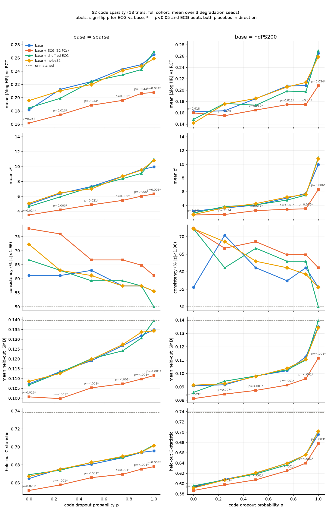
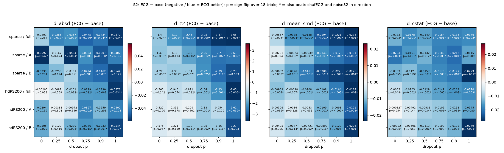

# v1.6 sweep S2 — real-data code sparsity (exploratory, 2026-09-26)

`scripts/v16/s2_dropout.py` (engine `scripts/v16/v16_engine.py`). Aggregates only; long CSV and summaries in
`/mnt/raid0/rbc58/ecg-tte/audits/claude-v16-s2-dropout/` (`results.csv`, `summary_*.csv`). **Exploratory, post hoc;
every result is hypothesis-generating.** All 12 cells (6 dropout levels × 2 bases) × 3 halves are reported below,
including null ones.

## Key findings (plain language)

"All criteria" means: ECG vs base sign-flip p<0.05 (full cohort, 18 trials) **and** BH-FDR q<0.05 (12 cells per
metric) **and** ECG beats *both* placebos (shuffled ECG, 32-d Gaussian noise) with p<0.05 **and** p<0.05 in the same
direction in *both* patient halves A and B.

1. **Deleting codes hurts every arm.** Mean |Δlog HR| vs RCT for the sparse PS rises from 0.182 (p=0) to 0.265
   (p=1, only demographics left); hdPS200 from 0.162 to 0.265. Held-out mean |SMD| rises from 0.107 to 0.135 (sparse)
   and 0.091 to 0.135 (hdPS). Unmatched: 0.279 / 0.140.
2. **The ECG gain grows as coded data become sparser, on every metric.** ECG − base mean |SMD|: sparse −0.007 (p=0)
   → −0.014 (0.25–0.5) → −0.019 (0.75) → −0.023 (1.0); hdPS −0.010 (0) → −0.011 (0.5–0.75) → −0.016 (0.9) → −0.023 (1.0).
   z²: sparse −1.4 → −3.7; hdPS −0.6 → −3.7. |Δlog HR|: sparse −0.020 → −0.057; hdPS −0.002 → −0.057.
   At p=1 the ECG recovers about 69% of the |Δlog HR| lost relative to the intact sparse PS and 86% of the mean |SMD|
   lost. The placebo arms track base at every p (they never systematically beat base), so the gain is ECG information,
   not extra dimensions.
3. **Held-out balance (mean |SMD|, C-statistic): the gain is significant, FDR-surviving, placebo-beating and
   replicated in both halves from p=0.25 with sparse codes** (mean |SMD| at every p from 0.25 to 1.0; C-statistic at
   0.25–0.9; half A misses at p=1, p=0.089). **With hdPS200 this starts later:** C-statistic from p=0.5, mean |SMD| from
   p=0.75 (both through 0.9; mean |SMD| also at 1.0). At p=0 the balance gains are significant in the full cohort but
   **do not replicate in both halves** (sparse mean |SMD| half A p=0.50; hdPS mean |SMD| half B p=0.29; hdPS
   C-statistic half A p=0.95; sparse C-statistic beats both placebos but half B p=0.055).
4. **RCT agreement, z² (precision-standardised): all criteria met at sparse p = 0, 0.75 and 0.9, and hdPS p = 0.75.**
   Other cells are significant in the full cohort (every cell except hdPS p=0 and 0.25) but miss in one half
   (sparse 0.25: A p=0.11; sparse 0.5: B p=0.07; hdPS 0.5: A p=0.40; hdPS 0.9: A p=0.17; p=1: B p=0.08).
5. **RCT agreement, |Δlog HR|: no cell meets all criteria.** The full-cohort sign-flip p is <0.05 at sparse p ≥ 0.25 and
   hdPS p ∈ {0.5, 0.75, 1.0}, but no cell survives FDR (smallest q = 0.058), no cell beats both placebos with p<0.05,
   and only hdPS p=0.75 replicates in both halves (A p=0.002, B p=0.015; but vs shufECG p=0.12). The
   degradation-seed spread is large for |Δlog HR| (e.g. sparse p=0.25 per-seed p 0.007–0.55), small for balance.
6. **Consistency (|z|<1.96)** is higher with ECG at every sparse cell (77.8% vs 61.1% at p=0; 61.1% vs 55.6% at p=1)
   and in 5/6 hdPS cells (hdPS p=0.25 is the exception: 66.7% vs 70.4%). Dispersion φ is lower with ECG in every cell
   (e.g. sparse p=0.9: 5.7 vs 9.6). These are descriptive (no test).
7. **Answer to the central question.** As codes are removed, the ECG gain on held-out balance becomes significant,
   placebo-beating and replicated in both halves at **p ≈ 0.25 for a sparse PS and p ≈ 0.5–0.75 for hdPS200**. For
   agreement with the RCT, the gain meets every criterion on z² at **p ≈ 0.75** for both bases (and, for sparse, also at
   p=0 and 0.9 but not at 0.25–0.5 or 1.0), while the raw |Δlog HR| gain never clears FDR plus placebo significance
   plus two-half replication. The pattern is monotone but the RCT-agreement evidence is threshold-sensitive: treat
   it as a dose-response *trend*, not as a sharp threshold.

## Design

- **Degradation:** `Trial.degraded(p, seed)` (v13_common): each recorded diagnosis flag and medication-order flag in
  `T.cov` is deleted (set 0) per patient with probability p, and every hdPS code in pool A (all its levels together) is
  deleted per patient with probability p; rng = `default_rng(90000 + round(1000 p) + seed)`. Demographics, labs,
  vitals, echo and ECG are unchanged. The hdPS top-200 is **re-ranked on the degraded levels** (within each half).
  p=0 and p=1 are deterministic (the three seeds give identical results, verified); at p=1 the sparse and hdPS200 designs
  are identical (demographics only), so the two p=1 cells are the same numbers.
- **Cells:** p ∈ {0, 0.25, 0.5, 0.75, 0.9, 1} × base ∈ {sparse, hdPS200} × seed ∈ {0, 1, 2}. Arms: base, base+ECG
  (32 BCL PCs), base+shufECG (the same 32 PCs row-permuted with `T.shuffle_perm`), base+noise32 (`T.noise32`);
  unmatched once per trial and half. Estimator: engine default (1:1 greedy caliper-0.2 SD matching on the L2 C=1 PS
  logit; pair-clustered Cox). Halves: full, A, B (`default_rng(16060 + trial index)`, split stratified by treatment).
- **Seed averaging:** per trial × half × cell × arm, the per-seed metrics (|Δlog HR|, z², consistency indicator,
  mean |SMD|, C-statistic) are averaged over the 3 degradation seeds; paired ECG − comparator differences of these
  seed-averaged metrics are tested across the 18 trials with the exact sign-flip test (`E.sign_flip`, as used by
  `E.summarize_pairs`). φ is computed per seed and averaged. The seed spread is reported from `E.summarize_pairs` run
  per seed.
- **FDR:** BH within the sweep family, per metric over the 12 cells, ECG vs base, full cohort. (The two p=1 cells are
  identical and both counted; that makes the q-values slightly conservative.)

### Held-out balance is always measured on the TRUE (undegraded) variables

`degraded()` changes `T.cov`, including the medication-order flags that feed the held-out `mean_meds` variable.
`run_cell` uses `T.H` unless `heldout=` is given, and `heldout_matrix(T)` returns `T.H` when it is already set.
`degraded()` makes a *shallow* copy, so the degraded copy carries the original `T.H` object. The script does not rely on
that alone. Every job asserts `D.H is T.H` and passes `heldout=T.H` explicitly, with `T` the undegraded trial. Pool-B
panel codes (`B::*`), the prognostic score, the observed labs/vitals and the physiology panel are never touched by
`degraded()`. The medications are not in the sparse or hdPS PS designs (`X_dx` = demographics + diagnoses), so they
enter the analysis only as held-out variables and stay undegraded there. What would have gone wrong otherwise (COMET,
p=0.5, seed 0): the medication-flag prevalence is 0.139 in the true `T.H` and 0.070 in the degraded `cov`.
A held-out matrix rebuilt from the degraded copy would give sparse-arm `mean_meds` |SMD| 0.100 instead of the true
0.142, which understates the imbalance.

## Caveats

- Halves A and B split *patients within the same 18 trials*, so "replicated in both halves" means "significant in both
  halves of the same trials", not independent replication. The trials are not independent either: their rosters overlap
  heavily (see `docs/v16/AUDIT_V16.md`, item 7), so the across-trial sign-flip p-values are optimistic. The cluster and
  leave-one-out checks from that audit have not yet been run for S2.
- Random code deletion is missing completely at random. Real sparsity (missing encounters, out-of-system care) is
  informative, so these curves show a mechanism, not a prediction for a real low-density population. S4
  (code-density tertiles) covers that case.
- The p=0 and p=1 cells are deterministic, so the "seed average" there is one draw. The two p=1 cells are the same
  numbers.

## Audit

1. **Base arms reproduce the engine validation.** On the pre-run with 2 trials (COMET, RELY), at p=0, seed 0, full
   cohort, sparse / sparse+ECG / hdPS200 / hdPS200+ECG / unmatched log HR, SE, pair counts, mean |SMD| and C-statistic
   all equal `claude-v16-engine/validation_estimates.csv` (every difference 0). In the full run, the p=0 full-cohort
   paired ECG − base results equal the `ENGINE_VALIDATION.md` smoke test to 3 decimals: sparse |Δ| −0.020 (p 0.264),
   z² −1.403 (p 0.024), mean |SMD| −0.007 (p 0.026), C −0.013 (p 0.023), consistency 77.8 vs 61.1, φ 3.411 vs 4.696;
   hdPS200 −0.002 (0.918), −0.565 (0.242), −0.010 (0.003), −0.007 (0.048).
2. **The held-out matrix is undegraded** (see Design). `D.H is T.H` is asserted in all 324 jobs. The unmatched reference
   is computed once on the original trial.
3. **Degradation acts as intended.** COMET, p=0.5: diagnosis-flag prevalence goes from 0.390 to 0.194 and hdPS-level
   prevalence from 0.109 to 0.055. Seeds give identical results at p=0 and p=1 (max |Δlog HR| across seeds = 0), and
   sparse ≡ hdPS200 at p=1 (identical pair counts).
4. **Placebos do not systematically beat base.** Full cohort, the placebo − base mean |SMD| is within ±0.005 of base in
   every cell. For |Δlog HR|, the placebos are better than base at some cells (hdPS p=0: shufECG 0.148, noise 0.142 vs
   base 0.162) and worse at others: noise, not signal. The per-cell base − placebo tests are in `summary_placebo.csv`.
5. **Pair counts and SEs.** Adding ECG lowers the matched pairs by about 2–3% (for example sparse p=0.9: 3314 vs 3391
   mean pairs). Mean SE rises by 0.0004–0.002 (at most about 2%), so the z² gains come from smaller Δ, not wider SEs.
   The per-half analysed n is about half the trial n (e.g. COMET 3190 / 3191).
6. **Matching near-ties.** At p=0.9 a handful of estimates differ from v1.4 (below) with identical pair counts. With
   only about 10% of codes left, many patients share identical PS logits. Greedy-matching tie resolution is then
   floating-point sensitive (cf. the ALLHAT note in ENGINE_VALIDATION).
7. **Runtime.** 324 jobs (trial × p × seed), 40 workers, 196 s wall time. There were no failed Cox fits in any arm
   (all 18 trials in every paired test).

### Reconciliation with v1.4 real-data dropout (`docs/V14_SUMMARY.md`, `scripts/v14_run.py --modes dropout`)

v1.4 degraded each trial once (`T.degraded(p)`, i.e. seed 0) at p ∈ {0.5, 0.75, 0.9}. It ran sparse, sparse+ECG,
hdPS200 and hdPS200+ECG with the same matching. On the real data it reported the mean over trials of
err(ECG)² − err(base)² against the RCT (C1 = sparse, C2 = hdPS200). There were no held-out balance metrics, no
placebos and no halves. The v1.6 seed-0 full-cohort estimates were compared with the v1.4 rep-0 estimates
(`claude-v14/boot_<trial>_dropout.csv`):

- **Point estimates.** 210 of 216 trial × p × arm estimates agree to <1e-4. The 6 exceptions are all at p=0.9 and
  all have identical pair counts: RELY sparse 0.017; CABANA hdPS200 0.0035; EAST-AFNET4 sparse / hdPS200 0.0012 /
  0.0007; VALUE sparse / hdPS200 0.0009 / 0.0008. These are matching near-ties (Audit item 6).
- **v1.4 contrast (err² difference) recomputed from both sources:**

| source | p | contrast | trials | mean_d_sqerr | p_signflip | closer |
|---|---|---|---|---|---|---|
| v16 | 0.5000 | C1 | 18 | -0.0308 | 0.1565 | 13 |
| v16 | 0.5000 | C2 | 18 | 0.0142 | 0.9397 | 11 |
| v16 | 0.7500 | C1 | 18 | -0.0452 | 0.0088 | 15 |
| v16 | 0.7500 | C2 | 18 | -0.0163 | 0.0509 | 10 |
| v16 | 0.9000 | C1 | 18 | -0.0574 | 0.2933 | 10 |
| v16 | 0.9000 | C2 | 18 | -0.0274 | 0.0623 | 12 |
| v14 | 0.5000 | C1 | 18 | -0.0308 | 0.1565 | 13 |
| v14 | 0.5000 | C2 | 18 | 0.0142 | 0.9397 | 11 |
| v14 | 0.7500 | C1 | 18 | -0.0452 | 0.0088 | 15 |
| v14 | 0.7500 | C2 | 18 | -0.0163 | 0.0510 | 10 |
| v14 | 0.9000 | C1 | 18 | -0.0578 | 0.2797 | 10 |
| v14 | 0.9000 | C2 | 18 | -0.0277 | 0.0620 | 12 |

  The mean differences reproduce the v1.4 table (−0.0308 / −0.0452 / −0.0578 for C1; +0.0142 / −0.0163 / −0.0277 for
  C2). The v1.4 table's sign-flip p-values (0.154 / 0.0099 / 0.281; 0.941 / 0.051 / 0.063) differ from a recomputation
  on the same v1.4 rep-0 estimates (0.157 / 0.009 / 0.280; 0.940 / 0.051 / 0.062) only in the third decimal. That is
  most likely because `v14_summarize` took trial membership from `trial_specs.TRIALS`, and the v1.4 output directory
  also holds legacy `cabana` / `emperor-preserved` runs. This was not pursued further, since the means agree.
- **Why v1.4 looked mostly null and v1.6 does not.** (i) v1.4 used one degradation draw. The v1.6 seed spread shows the
  single draw matters: per-seed sparse |Δ| p is 0.042–0.14 at p=0.5 and 0.008–0.29 at p=0.9, and hdPS z² p at p=0.5 is
  0.008–0.56. (ii) v1.4 tested squared error, which is dominated by the 1–2 trials with the largest error. |Δ| and the
  precision-standardised z² are less outlier-driven, and z² is where the v1.6 signal is strongest. (iii) v1.4 had no
  balance endpoint, and balance is where the dropout-dependent ECG gain is clearest and replicates in both halves.
  On the RCT-agreement question the two versions agree: at p=0.75 sparse, v1.4 found p=0.0099 and v1.6 finds |Δ| p=0.030
  and z² p=0.009, both meeting all criteria on z². The absolute-error gain in v1.4 was not robust at 0.5 or 0.9, and in
  v1.6 it still fails FDR and the placebo tests.

## Synthesis per cell × metric (full cohort unless noted)

sig = ECG vs base p<0.05 with ECG better; fdr = q<0.05; placebo_dir / placebo_sig = ECG better than both placebos
in direction / with p<0.05 for both; rep_AB_sig = p<0.05 with ECG better in both halves; all_criteria = sig & fdr &
placebo_sig & rep_AB_sig.

| base | p | metric | d_full | p_full | q_full | p_vs_shuf | p_vs_noise | p_A | p_B | sig | fdr | placebo_dir | placebo_sig | rep_AB_sig | rep_AB_dir | all_criteria |
|---|---|---|---|---|---|---|---|---|---|---|---|---|---|---|---|---|
| sparse | 0.000 | absd | -0.020 | 0.264 | 0.317 | 0.088 | 0.053 | 0.042 | 0.231 | no | no | yes | no | no | yes | no |
| sparse | 0.000 | z2 | -1.403 | 0.024 | 0.029 | 0.026 | 0.015 | 0.013 | 0.030 | yes | yes | yes | yes | yes | yes | yes |
| sparse | 0.000 | mean_smd | -0.007 | 0.026 | 0.026 | 0.059 | 0.004 | 0.504 | 0.033 | yes | yes | yes | no | no | yes | no |
| sparse | 0.000 | cstat | -0.013 | 0.023 | 0.025 | 0.004 | 0.002 | <.001 | 0.055 | yes | yes | yes | yes | no | yes | no |
| sparse | 0.250 | absd | -0.038 | 0.013 | 0.058 | 0.098 | 0.038 | 0.474 | 0.094 | yes | no | yes | no | no | yes | no |
| sparse | 0.250 | z2 | -2.194 | 0.003 | 0.012 | 0.020 | 0.025 | 0.113 | 0.037 | yes | yes | yes | yes | no | yes | no |
| sparse | 0.250 | mean_smd | -0.014 | <.001 | <.001 | <.001 | <.001 | 0.002 | 0.001 | yes | yes | yes | yes | yes | yes | yes |
| sparse | 0.250 | cstat | -0.018 | <.001 | <.001 | <.001 | <.001 | <.001 | 0.019 | yes | yes | yes | yes | yes | yes | yes |
| sparse | 0.500 | absd | -0.036 | 0.033 | 0.058 | 0.033 | 0.084 | 0.004 | 0.351 | yes | no | yes | no | no | yes | no |
| sparse | 0.500 | z2 | -2.463 | 0.021 | 0.028 | 0.011 | 0.026 | 0.016 | 0.071 | yes | yes | yes | yes | no | yes | no |
| sparse | 0.500 | mean_smd | -0.014 | <.001 | <.001 | <.001 | <.001 | 0.007 | <.001 | yes | yes | yes | yes | yes | yes | yes |
| sparse | 0.500 | cstat | -0.015 | <.001 | 0.002 | <.001 | <.001 | 0.012 | <.001 | yes | yes | yes | yes | yes | yes | yes |
| sparse | 0.750 | absd | -0.047 | 0.030 | 0.058 | 0.058 | 0.030 | 0.103 | 0.081 | yes | no | yes | no | no | yes | no |
| sparse | 0.750 | z2 | -3.245 | 0.009 | 0.015 | 0.029 | 0.005 | 0.012 | 0.025 | yes | yes | yes | yes | yes | yes | yes |
| sparse | 0.750 | mean_smd | -0.019 | <.001 | <.001 | <.001 | <.001 | <.001 | <.001 | yes | yes | yes | yes | yes | yes | yes |
| sparse | 0.750 | cstat | -0.018 | 0.001 | 0.002 | <.001 | <.001 | <.001 | <.001 | yes | yes | yes | yes | yes | yes | yes |
| sparse | 0.900 | absd | -0.043 | 0.044 | 0.066 | 0.137 | 0.091 | 0.018 | 0.070 | yes | no | yes | no | no | yes | no |
| sparse | 0.900 | z2 | -3.567 | 0.005 | 0.012 | 0.008 | 0.005 | 0.002 | 0.018 | yes | yes | yes | yes | yes | yes | yes |
| sparse | 0.900 | mean_smd | -0.022 | <.001 | <.001 | <.001 | <.001 | <.001 | <.001 | yes | yes | yes | yes | yes | yes | yes |
| sparse | 0.900 | cstat | -0.019 | <.001 | 0.001 | <.001 | <.001 | <.001 | <.001 | yes | yes | yes | yes | yes | yes | yes |
| sparse | 1.000 | absd | -0.057 | 0.034 | 0.058 | 0.083 | 0.120 | 0.105 | 0.127 | yes | no | yes | no | no | yes | no |
| sparse | 1.000 | z2 | -3.650 | 0.006 | 0.012 | 0.021 | 0.015 | 0.032 | 0.083 | yes | yes | yes | yes | no | yes | no |
| sparse | 1.000 | mean_smd | -0.023 | <.001 | <.001 | <.001 | <.001 | 0.003 | <.001 | yes | yes | yes | yes | yes | yes | yes |
| sparse | 1.000 | cstat | -0.018 | 0.003 | 0.004 | <.001 | <.001 | 0.089 | <.001 | yes | yes | yes | yes | no | yes | no |
| hdPS200 | 0.000 | absd | -0.002 | 0.918 | 0.918 | 0.678 | 0.493 | 0.159 | 0.079 | no | no | no | no | no | yes | no |
| hdPS200 | 0.000 | z2 | -0.565 | 0.242 | 0.242 | 0.621 | 0.913 | 0.120 | 0.067 | no | no | yes | no | no | yes | no |
| hdPS200 | 0.000 | mean_smd | -0.010 | 0.003 | 0.003 | 0.087 | <.001 | 0.032 | 0.285 | yes | yes | yes | no | no | yes | no |
| hdPS200 | 0.000 | cstat | -0.007 | 0.048 | 0.048 | 0.015 | 0.254 | 0.954 | 0.028 | yes | yes | yes | no | no | yes | no |
| hdPS200 | 0.250 | absd | -0.009 | 0.769 | 0.839 | 0.052 | 0.231 | 0.804 | 0.419 | no | no | yes | no | no | yes | no |
| hdPS200 | 0.250 | z2 | -0.945 | 0.074 | 0.081 | 0.005 | 0.050 | 0.178 | 0.180 | no | no | yes | yes | no | yes | no |
| hdPS200 | 0.250 | mean_smd | -0.007 | 0.007 | 0.007 | <.001 | 0.002 | 0.128 | 0.014 | yes | yes | yes | yes | no | yes | no |
| hdPS200 | 0.250 | cstat | -0.010 | 0.002 | 0.003 | 0.002 | <.001 | 0.144 | 0.058 | yes | yes | yes | yes | no | yes | no |
| hdPS200 | 0.500 | absd | -0.020 | 0.032 | 0.058 | 0.407 | 0.026 | 0.540 | 0.024 | yes | no | yes | no | no | yes | no |
| hdPS200 | 0.500 | z2 | -0.811 | 0.012 | 0.018 | 0.027 | 0.019 | 0.402 | 0.011 | yes | yes | yes | yes | no | yes | no |
| hdPS200 | 0.500 | mean_smd | -0.011 | <.001 | <.001 | 0.004 | 0.002 | 0.051 | 0.002 | yes | yes | yes | yes | no | yes | no |
| hdPS200 | 0.500 | cstat | -0.013 | <.001 | <.001 | <.001 | <.001 | 0.034 | 0.006 | yes | yes | yes | yes | yes | yes | yes |
| hdPS200 | 0.750 | absd | -0.033 | 0.012 | 0.058 | 0.120 | 0.015 | 0.002 | 0.015 | yes | no | yes | no | yes | yes | no |
| hdPS200 | 0.750 | z2 | -1.637 | <.001 | 0.005 | 0.037 | 0.002 | <.001 | 0.002 | yes | yes | yes | yes | yes | yes | yes |
| hdPS200 | 0.750 | mean_smd | -0.011 | <.001 | <.001 | <.001 | <.001 | <.001 | 0.016 | yes | yes | yes | yes | yes | yes | yes |
| hdPS200 | 0.750 | cstat | -0.015 | <.001 | <.001 | <.001 | <.001 | 0.006 | 0.003 | yes | yes | yes | yes | yes | yes | yes |
| hdPS200 | 0.900 | absd | -0.034 | 0.063 | 0.084 | 0.303 | 0.044 | 0.293 | 0.007 | no | no | yes | no | no | yes | no |
| hdPS200 | 0.900 | z2 | -2.247 | 0.006 | 0.012 | 0.038 | 0.006 | 0.170 | 0.016 | yes | yes | yes | yes | no | yes | no |
| hdPS200 | 0.900 | mean_smd | -0.016 | <.001 | <.001 | <.001 | <.001 | <.001 | 0.005 | yes | yes | yes | yes | yes | yes | yes |
| hdPS200 | 0.900 | cstat | -0.016 | <.001 | <.001 | <.001 | <.001 | 0.038 | 0.004 | yes | yes | yes | yes | yes | yes | yes |
| hdPS200 | 1.000 | absd | -0.057 | 0.034 | 0.058 | 0.083 | 0.120 | 0.105 | 0.127 | yes | no | yes | no | no | yes | no |
| hdPS200 | 1.000 | z2 | -3.650 | 0.006 | 0.012 | 0.021 | 0.015 | 0.032 | 0.083 | yes | yes | yes | yes | no | yes | no |
| hdPS200 | 1.000 | mean_smd | -0.023 | <.001 | <.001 | <.001 | <.001 | 0.003 | <.001 | yes | yes | yes | yes | yes | yes | yes |
| hdPS200 | 1.000 | cstat | -0.018 | 0.003 | 0.004 | <.001 | <.001 | 0.089 | <.001 | yes | yes | yes | yes | no | yes | no |

## Full tables

### ECG vs base, half = full

Entry: d (trials ECG better / n; sign-flip p; BH q over 12 cells). **S** = ECG-specific significant (p<0.05, and ECG beats shufECG and noise32 in direction).

| base | p | n_trials | absd | z2 | mean_smd | cstat |
|---|---|---|---|---|---|---|
| sparse | 0.000 | 18 | -0.020 (14/18; p=0.264; q=0.317) | -1.403 (14/18; p=0.024; q=0.029) **S** | -0.007 (14/18; p=0.026; q=0.026) **S** | -0.013 (15/18; p=0.023; q=0.025) **S** |
| sparse | 0.250 | 18 | -0.038 (14/18; p=0.013; q=0.058) **S** | -2.194 (16/18; p=0.003; q=0.012) **S** | -0.014 (16/18; p=<.001; q=<.001) **S** | -0.018 (16/18; p=<.001; q=<.001) **S** |
| sparse | 0.500 | 18 | -0.036 (15/18; p=0.033; q=0.058) **S** | -2.463 (14/18; p=0.021; q=0.028) **S** | -0.014 (17/18; p=<.001; q=<.001) **S** | -0.015 (14/18; p=<.001; q=0.002) **S** |
| sparse | 0.750 | 18 | -0.047 (13/18; p=0.030; q=0.058) **S** | -3.245 (14/18; p=0.009; q=0.015) **S** | -0.019 (17/18; p=<.001; q=<.001) **S** | -0.018 (15/18; p=0.001; q=0.002) **S** |
| sparse | 0.900 | 18 | -0.043 (13/18; p=0.044; q=0.066) **S** | -3.567 (13/18; p=0.005; q=0.012) **S** | -0.022 (17/18; p=<.001; q=<.001) **S** | -0.019 (17/18; p=<.001; q=0.001) **S** |
| sparse | 1.000 | 18 | -0.057 (14/18; p=0.034; q=0.058) **S** | -3.650 (14/18; p=0.006; q=0.012) **S** | -0.023 (17/18; p=<.001; q=<.001) **S** | -0.018 (15/18; p=0.003; q=0.004) **S** |
| hdPS200 | 0.000 | 18 | -0.002 (10/18; p=0.918; q=0.918) | -0.565 (10/18; p=0.242; q=0.242) | -0.010 (15/18; p=0.003; q=0.003) **S** | -0.007 (12/18; p=0.048; q=0.048) **S** |
| hdPS200 | 0.250 | 18 | -0.009 (13/18; p=0.769; q=0.839) | -0.945 (13/18; p=0.074; q=0.081) | -0.007 (15/18; p=0.007; q=0.007) **S** | -0.010 (15/18; p=0.002; q=0.003) **S** |
| hdPS200 | 0.500 | 18 | -0.020 (14/18; p=0.032; q=0.058) **S** | -0.811 (12/18; p=0.012; q=0.018) **S** | -0.011 (15/18; p=<.001; q=<.001) **S** | -0.013 (16/18; p=<.001; q=<.001) **S** |
| hdPS200 | 0.750 | 18 | -0.033 (15/18; p=0.012; q=0.058) **S** | -1.637 (15/18; p=<.001; q=0.005) **S** | -0.011 (18/18; p=<.001; q=<.001) **S** | -0.015 (17/18; p=<.001; q=<.001) **S** |
| hdPS200 | 0.900 | 18 | -0.034 (12/18; p=0.063; q=0.084) | -2.247 (11/18; p=0.006; q=0.012) **S** | -0.016 (17/18; p=<.001; q=<.001) **S** | -0.016 (15/18; p=<.001; q=<.001) **S** |
| hdPS200 | 1.000 | 18 | -0.057 (14/18; p=0.034; q=0.058) **S** | -3.650 (14/18; p=0.006; q=0.012) **S** | -0.023 (17/18; p=<.001; q=<.001) **S** | -0.018 (15/18; p=0.003; q=0.004) **S** |

### ECG vs base, half = A

Entry: d (trials ECG better / n; sign-flip p). **S** = ECG-specific significant (p<0.05, and ECG beats shufECG and noise32 in direction).

| base | p | n_trials | absd | z2 | mean_smd | cstat |
|---|---|---|---|---|---|---|
| sparse | 0.000 | 18 | -0.059 (14/18; p=0.042) **S** | -1.475 (14/18; p=0.013) **S** | -0.003 (13/18; p=0.504) | -0.020 (16/18; p=<.001) **S** |
| sparse | 0.250 | 18 | -0.017 (11/18; p=0.474) | -1.184 (12/18; p=0.113) | -0.008 (16/18; p=0.002) **S** | -0.016 (16/18; p=<.001) **S** |
| sparse | 0.500 | 18 | -0.058 (14/18; p=0.004) **S** | -1.923 (14/18; p=0.016) **S** | -0.009 (14/18; p=0.007) **S** | -0.013 (15/18; p=0.012) **S** |
| sparse | 0.750 | 18 | -0.036 (13/18; p=0.103) | -2.260 (14/18; p=0.012) **S** | -0.014 (16/18; p=<.001) **S** | -0.019 (18/18; p=<.001) **S** |
| sparse | 0.900 | 18 | -0.051 (14/18; p=0.018) **S** | -2.704 (14/18; p=0.002) **S** | -0.017 (17/18; p=<.001) **S** | -0.021 (15/18; p=<.001) **S** |
| sparse | 1.000 | 18 | -0.040 (14/18; p=0.105) | -2.612 (14/18; p=0.032) **S** | -0.019 (16/18; p=0.003) **S** | -0.015 (13/18; p=0.089) |
| hdPS200 | 0.000 | 18 | -0.029 (10/18; p=0.159) | -0.527 (10/18; p=0.120) | -0.006 (12/18; p=0.032) **S** | -0.000 (10/18; p=0.954) |
| hdPS200 | 0.250 | 18 | -0.004 (9/18; p=0.804) | -0.356 (10/18; p=0.178) | -0.004 (13/18; p=0.128) | -0.005 (14/18; p=0.144) |
| hdPS200 | 0.500 | 18 | -0.010 (13/18; p=0.540) | -0.209 (11/18; p=0.402) | -0.005 (14/18; p=0.051) | -0.009 (13/18; p=0.034) **S** |
| hdPS200 | 0.750 | 18 | -0.040 (15/18; p=0.002) **S** | -1.334 (15/18; p=<.001) **S** | -0.011 (16/18; p=<.001) **S** | -0.011 (13/18; p=0.006) **S** |
| hdPS200 | 0.900 | 18 | -0.026 (13/18; p=0.293) | -0.954 (13/18; p=0.170) | -0.010 (16/18; p=<.001) **S** | -0.012 (12/18; p=0.038) **S** |
| hdPS200 | 1.000 | 18 | -0.040 (14/18; p=0.105) | -2.612 (14/18; p=0.032) **S** | -0.019 (16/18; p=0.003) **S** | -0.015 (13/18; p=0.089) |

### ECG vs base, half = B

Entry: d (trials ECG better / n; sign-flip p). **S** = ECG-specific significant (p<0.05, and ECG beats shufECG and noise32 in direction).

| base | p | n_trials | absd | z2 | mean_smd | cstat |
|---|---|---|---|---|---|---|
| sparse | 0.000 | 18 | -0.034 (13/18; p=0.231) | -1.223 (13/18; p=0.030) **S** | -0.008 (12/18; p=0.033) **S** | -0.013 (13/18; p=0.055) |
| sparse | 0.250 | 18 | -0.026 (10/18; p=0.094) | -1.355 (10/18; p=0.037) **S** | -0.013 (15/18; p=0.001) **S** | -0.012 (13/18; p=0.019) **S** |
| sparse | 0.500 | 18 | -0.018 (10/18; p=0.351) | -1.345 (10/18; p=0.071) | -0.016 (15/18; p=<.001) **S** | -0.016 (16/18; p=<.001) **S** |
| sparse | 0.750 | 18 | -0.042 (12/18; p=0.081) | -2.222 (12/18; p=0.025) **S** | -0.021 (16/18; p=<.001) **S** | -0.018 (14/18; p=<.001) **S** |
| sparse | 0.900 | 18 | -0.046 (11/18; p=0.070) | -2.788 (12/18; p=0.018) **S** | -0.022 (16/18; p=<.001) **S** | -0.020 (14/18; p=<.001) **S** |
| sparse | 1.000 | 18 | -0.054 (11/18; p=0.127) | -3.271 (11/18; p=0.083) | -0.023 (16/18; p=<.001) **S** | -0.028 (16/18; p=<.001) **S** |
| hdPS200 | 0.000 | 18 | -0.030 (14/18; p=0.079) | -0.575 (14/18; p=0.067) | -0.004 (11/18; p=0.285) | -0.009 (12/18; p=0.028) **S** |
| hdPS200 | 0.250 | 18 | -0.012 (10/18; p=0.419) | -0.321 (11/18; p=0.180) | -0.008 (12/18; p=0.014) **S** | -0.007 (13/18; p=0.058) |
| hdPS200 | 0.500 | 18 | -0.029 (12/18; p=0.024) **S** | -1.376 (12/18; p=0.011) **S** | -0.007 (16/18; p=0.002) **S** | -0.011 (15/18; p=0.006) **S** |
| hdPS200 | 0.750 | 18 | -0.035 (14/18; p=0.015) **S** | -1.382 (12/18; p=0.002) **S** | -0.009 (13/18; p=0.016) **S** | -0.011 (13/18; p=0.003) **S** |
| hdPS200 | 0.900 | 18 | -0.033 (14/18; p=0.007) **S** | -1.357 (13/18; p=0.016) **S** | -0.012 (13/18; p=0.005) **S** | -0.013 (15/18; p=0.004) **S** |
| hdPS200 | 1.000 | 18 | -0.054 (11/18; p=0.127) | -3.271 (11/18; p=0.083) | -0.023 (16/18; p=<.001) **S** | -0.028 (16/18; p=<.001) **S** |

### ECG vs placebos, half = full (ECG − shufECG / ECG − noise32)

| base | p | absd | z2 | mean_smd | cstat |
|---|---|---|---|---|---|
| sparse | 0.000 | -0.023 (p=0.088) / -0.034 (p=0.053) | -1.128 (p=0.026) / -1.562 (p=0.015) | -0.006 (p=0.059) / -0.008 (p=0.004) | -0.018 (p=0.004) / -0.016 (p=0.002) |
| sparse | 0.250 | -0.025 (p=0.098) / -0.036 (p=0.038) | -1.756 (p=0.020) / -2.301 (p=0.025) | -0.013 (p=<.001) / -0.013 (p=<.001) | -0.016 (p=<.001) / -0.017 (p=<.001) |
| sparse | 0.500 | -0.036 (p=0.033) / -0.031 (p=0.084) | -2.395 (p=0.011) / -2.145 (p=0.026) | -0.015 (p=<.001) / -0.015 (p=<.001) | -0.017 (p=<.001) / -0.017 (p=<.001) |
| sparse | 0.750 | -0.039 (p=0.058) / -0.045 (p=0.030) | -2.925 (p=0.029) / -3.225 (p=0.005) | -0.017 (p=<.001) / -0.020 (p=<.001) | -0.019 (p=<.001) / -0.020 (p=<.001) |
| sparse | 0.900 | -0.036 (p=0.137) / -0.041 (p=0.091) | -3.060 (p=0.008) / -3.494 (p=0.005) | -0.021 (p=<.001) / -0.024 (p=<.001) | -0.019 (p=<.001) / -0.019 (p=<.001) |
| sparse | 1.000 | -0.062 (p=0.083) / -0.051 (p=0.120) | -4.671 (p=0.021) / -4.499 (p=0.015) | -0.028 (p=<.001) / -0.023 (p=<.001) | -0.024 (p=<.001) / -0.023 (p=<.001) |
| hdPS200 | 0.000 | +0.011 (p=0.678) / +0.018 (p=0.493) | -0.273 (p=0.621) / -0.048 (p=0.913) | -0.005 (p=0.087) / -0.010 (p=<.001) | -0.009 (p=0.015) / -0.005 (p=0.254) |
| hdPS200 | 0.250 | -0.022 (p=0.052) / -0.021 (p=0.231) | -1.161 (p=0.005) / -0.997 (p=0.050) | -0.010 (p=<.001) / -0.008 (p=0.002) | -0.009 (p=0.002) / -0.009 (p=<.001) |
| hdPS200 | 0.500 | -0.008 (p=0.407) / -0.020 (p=0.026) | -0.842 (p=0.027) / -1.020 (p=0.019) | -0.011 (p=0.004) / -0.010 (p=0.002) | -0.011 (p=<.001) / -0.014 (p=<.001) |
| hdPS200 | 0.750 | -0.024 (p=0.120) / -0.031 (p=0.015) | -1.346 (p=0.037) / -1.778 (p=0.002) | -0.011 (p=<.001) / -0.012 (p=<.001) | -0.012 (p=<.001) / -0.014 (p=<.001) |
| hdPS200 | 0.900 | -0.023 (p=0.303) / -0.039 (p=0.044) | -2.005 (p=0.038) / -2.106 (p=0.006) | -0.014 (p=<.001) / -0.014 (p=<.001) | -0.017 (p=<.001) / -0.016 (p=<.001) |
| hdPS200 | 1.000 | -0.062 (p=0.083) / -0.051 (p=0.120) | -4.671 (p=0.021) / -4.499 (p=0.015) | -0.028 (p=<.001) / -0.023 (p=<.001) | -0.024 (p=<.001) / -0.023 (p=<.001) |

### ECG vs placebos, half = A (ECG − shufECG / ECG − noise32)

| base | p | absd | z2 | mean_smd | cstat |
|---|---|---|---|---|---|
| sparse | 0.000 | -0.019 (p=0.349) / -0.019 (p=0.551) | -1.031 (p=0.087) / -0.878 (p=0.257) | -0.005 (p=0.125) / -0.007 (p=0.092) | -0.021 (p=<.001) / -0.025 (p=0.003) |
| sparse | 0.250 | -0.006 (p=0.737) / -0.024 (p=0.207) | -0.851 (p=0.109) / -1.378 (p=0.044) | -0.008 (p=<.001) / -0.009 (p=0.001) | -0.015 (p=0.003) / -0.013 (p=0.007) |
| sparse | 0.500 | -0.048 (p=0.017) / -0.048 (p=0.017) | -2.005 (p=0.009) / -2.089 (p=0.017) | -0.014 (p=<.001) / -0.011 (p=<.001) | -0.017 (p=<.001) / -0.015 (p=0.002) |
| sparse | 0.750 | -0.050 (p=0.010) / -0.055 (p=0.006) | -2.571 (p=0.002) / -2.883 (p=0.002) | -0.019 (p=<.001) / -0.017 (p=<.001) | -0.022 (p=<.001) / -0.019 (p=<.001) |
| sparse | 0.900 | -0.046 (p=0.047) / -0.050 (p=0.017) | -2.302 (p=0.014) / -2.501 (p=0.019) | -0.023 (p=<.001) / -0.017 (p=<.001) | -0.025 (p=<.001) / -0.023 (p=<.001) |
| sparse | 1.000 | -0.078 (p=<.001) / -0.072 (p=0.017) | -2.833 (p=0.003) / -3.697 (p=0.023) | -0.029 (p=<.001) / -0.024 (p=<.001) | -0.023 (p=0.001) / -0.022 (p=0.002) |
| hdPS200 | 0.000 | -0.031 (p=0.219) / -0.038 (p=0.071) | -0.595 (p=0.202) / -0.640 (p=0.051) | -0.011 (p=0.018) / -0.003 (p=0.368) | +0.004 (p=0.441) / +0.002 (p=0.681) |
| hdPS200 | 0.250 | -0.015 (p=0.238) / -0.010 (p=0.366) | -0.557 (p=0.106) / -0.504 (p=0.039) | -0.006 (p=0.021) / -0.007 (p=0.028) | -0.005 (p=0.123) / -0.005 (p=0.078) |
| hdPS200 | 0.500 | -0.011 (p=0.438) / -0.023 (p=0.157) | -0.448 (p=0.193) / -0.784 (p=0.027) | -0.006 (p=0.022) / -0.005 (p=0.126) | -0.011 (p=0.005) / -0.008 (p=0.096) |
| hdPS200 | 0.750 | -0.038 (p=0.001) / -0.036 (p=0.045) | -1.301 (p=<.001) / -1.051 (p=0.033) | -0.012 (p=<.001) / -0.012 (p=<.001) | -0.008 (p=0.128) / -0.013 (p=0.038) |
| hdPS200 | 0.900 | -0.022 (p=0.469) / -0.042 (p=0.081) | -1.196 (p=0.111) / -1.734 (p=0.016) | -0.012 (p=<.001) / -0.012 (p=<.001) | -0.012 (p=0.002) / -0.010 (p=0.065) |
| hdPS200 | 1.000 | -0.078 (p=<.001) / -0.072 (p=0.017) | -2.833 (p=0.003) / -3.697 (p=0.023) | -0.029 (p=<.001) / -0.024 (p=<.001) | -0.023 (p=0.001) / -0.022 (p=0.002) |

### ECG vs placebos, half = B (ECG − shufECG / ECG − noise32)

| base | p | absd | z2 | mean_smd | cstat |
|---|---|---|---|---|---|
| sparse | 0.000 | -0.052 (p=0.001) / -0.037 (p=<.001) | -1.385 (p=0.001) / -1.142 (p=<.001) | -0.013 (p=0.002) / -0.013 (p=0.022) | -0.011 (p=0.071) / -0.017 (p=0.012) |
| sparse | 0.250 | -0.029 (p=0.085) / -0.016 (p=0.355) | -1.269 (p=0.063) / -1.031 (p=0.108) | -0.012 (p=0.002) / -0.012 (p=<.001) | -0.010 (p=0.037) / -0.015 (p=0.002) |
| sparse | 0.500 | -0.025 (p=0.286) / -0.042 (p=0.031) | -1.611 (p=0.066) / -1.744 (p=0.009) | -0.016 (p=<.001) / -0.016 (p=<.001) | -0.018 (p=<.001) / -0.017 (p=<.001) |
| sparse | 0.750 | -0.045 (p=0.044) / -0.044 (p=0.059) | -2.307 (p=0.019) / -1.925 (p=0.063) | -0.020 (p=<.001) / -0.021 (p=<.001) | -0.017 (p=0.007) / -0.022 (p=<.001) |
| sparse | 0.900 | -0.025 (p=0.261) / -0.028 (p=0.210) | -2.057 (p=0.041) / -2.221 (p=0.028) | -0.022 (p=<.001) / -0.022 (p=<.001) | -0.023 (p=<.001) / -0.023 (p=<.001) |
| sparse | 1.000 | -0.048 (p=0.110) / -0.056 (p=0.090) | -2.330 (p=0.114) / -2.900 (p=0.070) | -0.022 (p=<.001) / -0.022 (p=0.001) | -0.027 (p=<.001) / -0.029 (p=<.001) |
| hdPS200 | 0.000 | -0.007 (p=0.875) / -0.039 (p=0.083) | -0.306 (p=0.604) / -0.377 (p=0.285) | -0.007 (p=0.276) / -0.006 (p=0.185) | -0.010 (p=0.029) / -0.015 (p=0.002) |
| hdPS200 | 0.250 | +0.008 (p=0.516) / -0.016 (p=0.239) | -0.035 (p=0.848) / -0.365 (p=0.156) | -0.009 (p=0.009) / -0.009 (p=<.001) | -0.007 (p=0.097) / -0.008 (p=0.114) |
| hdPS200 | 0.500 | -0.029 (p=0.010) / -0.024 (p=0.116) | -0.972 (p=0.002) / -0.895 (p=0.069) | -0.009 (p=<.001) / -0.008 (p=0.016) | -0.011 (p=0.005) / -0.012 (p=0.030) |
| hdPS200 | 0.750 | -0.038 (p=0.002) / -0.035 (p=0.029) | -1.353 (p=0.006) / -1.323 (p=0.005) | -0.012 (p=0.003) / -0.012 (p=0.005) | -0.011 (p=0.020) / -0.012 (p=0.003) |
| hdPS200 | 0.900 | -0.029 (p=0.044) / -0.033 (p=0.030) | -1.342 (p=0.026) / -1.627 (p=0.008) | -0.016 (p=<.001) / -0.015 (p=<.001) | -0.015 (p=<.001) / -0.012 (p=0.006) |
| hdPS200 | 1.000 | -0.048 (p=0.110) / -0.056 (p=0.090) | -2.330 (p=0.114) / -2.900 (p=0.070) | -0.022 (p=<.001) / -0.022 (p=0.001) | -0.027 (p=<.001) / -0.029 (p=<.001) |

### Seed spread (full cohort): range over the 3 degradation seeds of the per-seed ECG − base d and p (E.summarize_pairs)

| base | p | absd | z2 | mean_smd | cstat |
|---|---|---|---|---|---|
| sparse | 0.000 | d -0.020..-0.020; p 0.264..0.264 | d -1.403..-1.403; p 0.024..0.024 | d -0.007..-0.007; p 0.026..0.026 | d -0.013..-0.013; p 0.023..0.023 |
| sparse | 0.250 | d -0.060..-0.015; p 0.007..0.545 | d -2.612..-1.690; p 0.005..0.170 | d -0.014..-0.013; p <.001..<.001 | d -0.022..-0.015; p <.001..0.004 |
| sparse | 0.500 | d -0.042..-0.027; p 0.042..0.140 | d -2.665..-2.296; p 0.017..0.084 | d -0.016..-0.012; p <.001..<.001 | d -0.019..-0.012; p <.001..0.037 |
| sparse | 0.750 | d -0.055..-0.033; p 0.012..0.185 | d -3.857..-2.866; p 0.003..0.108 | d -0.021..-0.018; p <.001..<.001 | d -0.022..-0.016; p <.001..0.016 |
| sparse | 0.900 | d -0.049..-0.036; p 0.008..0.294 | d -3.873..-3.049; p 0.002..0.038 | d -0.023..-0.020; p <.001..<.001 | d -0.021..-0.017; p <.001..0.002 |
| sparse | 1.000 | d -0.057..-0.057; p 0.034..0.034 | d -3.650..-3.650; p 0.006..0.006 | d -0.023..-0.023; p <.001..<.001 | d -0.018..-0.018; p 0.003..0.003 |
| hdPS200 | 0.000 | d -0.002..-0.002; p 0.918..0.918 | d -0.565..-0.565; p 0.242..0.242 | d -0.010..-0.010; p 0.003..0.003 | d -0.007..-0.007; p 0.048..0.048 |
| hdPS200 | 0.250 | d -0.018..+0.004; p 0.285..0.934 | d -1.046..-0.830; p 0.030..0.189 | d -0.007..-0.006; p 0.011..0.049 | d -0.013..-0.006; p <.001..0.110 |
| hdPS200 | 0.500 | d -0.034..-0.003; p 0.054..0.938 | d -1.227..-0.416; p 0.008..0.563 | d -0.014..-0.008; p <.001..0.049 | d -0.015..-0.010; p <.001..0.011 |
| hdPS200 | 0.750 | d -0.049..-0.020; p 0.011..0.169 | d -1.685..-1.542; p 0.004..0.017 | d -0.012..-0.009; p <.001..0.005 | d -0.018..-0.012; p <.001..0.017 |
| hdPS200 | 0.900 | d -0.037..-0.031; p 0.062..0.211 | d -2.477..-2.008; p 0.007..0.032 | d -0.018..-0.015; p <.001..<.001 | d -0.019..-0.015; p <.001..0.018 |
| hdPS200 | 1.000 | d -0.057..-0.057; p 0.034..0.034 | d -3.650..-3.650; p 0.006..0.006 | d -0.023..-0.023; p <.001..<.001 | d -0.018..-0.018; p 0.003..0.003 |

### Arm means across trials (seed-averaged), half = full

| base | p | arm_role | absd | z2 | cons | phi | mean_smd | cstat | smd_prog | n_pairs |
|---|---|---|---|---|---|---|---|---|---|---|
| sparse | 0.000 | base | 0.182 | 4.900 | 61.111 | 4.696 | 0.107 | 0.665 | 0.078 | 3282.111 |
| sparse | 0.000 | ECG | 0.162 | 3.497 | 77.778 | 3.411 | 0.101 | 0.651 | 0.071 | 3231.222 |
| sparse | 0.000 | shufECG | 0.185 | 4.625 | 66.667 | 4.586 | 0.107 | 0.669 | 0.071 | 3277.556 |
| sparse | 0.000 | noise | 0.196 | 5.058 | 72.222 | 4.915 | 0.109 | 0.667 | 0.079 | 3278.500 |
| sparse | 0.250 | base | 0.212 | 6.367 | 61.111 | 6.200 | 0.113 | 0.676 | 0.073 | 3316.037 |
| sparse | 0.250 | ECG | 0.174 | 4.173 | 75.926 | 3.928 | 0.100 | 0.658 | 0.075 | 3260.222 |
| sparse | 0.250 | shufECG | 0.199 | 5.929 | 62.963 | 5.855 | 0.113 | 0.674 | 0.077 | 3313.944 |
| sparse | 0.250 | noise | 0.210 | 6.474 | 62.963 | 6.543 | 0.113 | 0.675 | 0.073 | 3315.463 |
| sparse | 0.500 | base | 0.224 | 7.317 | 62.963 | 7.254 | 0.119 | 0.681 | 0.078 | 3343.852 |
| sparse | 0.500 | ECG | 0.189 | 4.854 | 66.667 | 4.680 | 0.105 | 0.666 | 0.080 | 3284.204 |
| sparse | 0.500 | shufECG | 0.224 | 7.249 | 59.259 | 7.248 | 0.120 | 0.683 | 0.083 | 3346.944 |
| sparse | 0.500 | noise | 0.220 | 6.998 | 61.111 | 6.797 | 0.120 | 0.683 | 0.080 | 3344.259 |
| sparse | 0.750 | base | 0.243 | 8.696 | 57.407 | 8.717 | 0.127 | 0.688 | 0.098 | 3375.963 |
| sparse | 0.750 | ECG | 0.196 | 5.451 | 66.667 | 5.098 | 0.107 | 0.669 | 0.092 | 3304.444 |
| sparse | 0.750 | shufECG | 0.234 | 8.376 | 59.259 | 8.351 | 0.124 | 0.688 | 0.097 | 3378.296 |
| sparse | 0.750 | noise | 0.241 | 8.676 | 57.407 | 8.738 | 0.127 | 0.689 | 0.095 | 3378.481 |
| sparse | 0.900 | base | 0.250 | 9.586 | 57.407 | 9.597 | 0.132 | 0.694 | 0.108 | 3390.741 |
| sparse | 0.900 | ECG | 0.206 | 6.019 | 64.815 | 5.705 | 0.110 | 0.675 | 0.098 | 3313.667 |
| sparse | 0.900 | shufECG | 0.242 | 9.079 | 57.407 | 8.976 | 0.131 | 0.695 | 0.111 | 3398.796 |
| sparse | 0.900 | noise | 0.247 | 9.512 | 57.407 | 9.466 | 0.134 | 0.694 | 0.107 | 3397.704 |
| sparse | 1.000 | base | 0.265 | 9.958 | 55.556 | 9.737 | 0.135 | 0.696 | 0.125 | 3408.889 |
| sparse | 1.000 | ECG | 0.208 | 6.308 | 61.111 | 6.079 | 0.111 | 0.678 | 0.101 | 3323.778 |
| sparse | 1.000 | shufECG | 0.269 | 10.979 | 50.000 | 11.125 | 0.140 | 0.702 | 0.118 | 3421.722 |
| sparse | 1.000 | noise | 0.259 | 10.808 | 55.556 | 10.895 | 0.134 | 0.701 | 0.114 | 3418.722 |
| hdPS200 | 0.000 | base | 0.162 | 3.151 | 55.556 | 3.275 | 0.091 | 0.593 | 0.047 | 3115.778 |
| hdPS200 | 0.000 | ECG | 0.160 | 2.586 | 72.222 | 2.706 | 0.081 | 0.587 | 0.040 | 3052.222 |
| hdPS200 | 0.000 | shufECG | 0.148 | 2.859 | 72.222 | 2.966 | 0.086 | 0.596 | 0.042 | 3110.333 |
| hdPS200 | 0.000 | noise | 0.142 | 2.634 | 72.222 | 2.715 | 0.091 | 0.591 | 0.046 | 3110.444 |
| hdPS200 | 0.250 | base | 0.163 | 3.596 | 70.370 | 3.723 | 0.092 | 0.608 | 0.041 | 3150.093 |
| hdPS200 | 0.250 | ECG | 0.155 | 2.651 | 66.667 | 2.747 | 0.085 | 0.598 | 0.040 | 3091.093 |
| hdPS200 | 0.250 | shufECG | 0.176 | 3.813 | 61.111 | 3.931 | 0.094 | 0.607 | 0.045 | 3142.648 |
| hdPS200 | 0.250 | noise | 0.175 | 3.649 | 68.519 | 3.803 | 0.092 | 0.607 | 0.048 | 3141.963 |
| hdPS200 | 0.500 | base | 0.185 | 4.031 | 61.111 | 4.137 | 0.098 | 0.620 | 0.046 | 3193.481 |
| hdPS200 | 0.500 | ECG | 0.165 | 3.220 | 68.519 | 3.317 | 0.087 | 0.607 | 0.044 | 3121.981 |
| hdPS200 | 0.500 | shufECG | 0.173 | 4.061 | 66.667 | 4.210 | 0.098 | 0.619 | 0.050 | 3186.741 |
| hdPS200 | 0.500 | noise | 0.185 | 4.240 | 62.963 | 4.428 | 0.098 | 0.621 | 0.046 | 3185.500 |
| hdPS200 | 0.750 | base | 0.207 | 5.047 | 57.407 | 5.242 | 0.102 | 0.640 | 0.057 | 3241.926 |
| hdPS200 | 0.750 | ECG | 0.174 | 3.410 | 64.815 | 3.541 | 0.091 | 0.625 | 0.051 | 3157.870 |
| hdPS200 | 0.750 | shufECG | 0.198 | 4.756 | 62.963 | 4.993 | 0.103 | 0.637 | 0.058 | 3236.870 |
| hdPS200 | 0.750 | noise | 0.205 | 5.189 | 61.111 | 5.446 | 0.104 | 0.639 | 0.060 | 3235.093 |
| hdPS200 | 0.900 | base | 0.208 | 5.723 | 61.111 | 5.948 | 0.112 | 0.656 | 0.070 | 3287.444 |
| hdPS200 | 0.900 | ECG | 0.174 | 3.476 | 64.815 | 3.523 | 0.096 | 0.640 | 0.064 | 3202.944 |
| hdPS200 | 0.900 | shufECG | 0.197 | 5.481 | 62.963 | 5.663 | 0.110 | 0.656 | 0.067 | 3288.167 |
| hdPS200 | 0.900 | noise | 0.213 | 5.582 | 59.259 | 5.742 | 0.110 | 0.656 | 0.071 | 3287.111 |
| hdPS200 | 1.000 | base | 0.265 | 9.958 | 55.556 | 9.737 | 0.135 | 0.696 | 0.125 | 3408.889 |
| hdPS200 | 1.000 | ECG | 0.208 | 6.308 | 61.111 | 6.079 | 0.111 | 0.678 | 0.101 | 3323.778 |
| hdPS200 | 1.000 | shufECG | 0.269 | 10.979 | 50.000 | 11.125 | 0.140 | 0.702 | 0.118 | 3421.722 |
| hdPS200 | 1.000 | noise | 0.259 | 10.808 | 55.556 | 10.895 | 0.134 | 0.701 | 0.114 | 3418.722 |

### Arm means across trials (seed-averaged), half = A

| base | p | arm_role | absd | z2 | cons | phi | mean_smd | cstat | smd_prog | n_pairs |
|---|---|---|---|---|---|---|---|---|---|---|
| sparse | 0.000 | base | 0.245 | 4.703 | 66.667 | 4.501 | 0.121 | 0.651 | 0.112 | 1633.444 |
| sparse | 0.000 | ECG | 0.186 | 3.228 | 72.222 | 3.127 | 0.118 | 0.631 | 0.103 | 1604.722 |
| sparse | 0.000 | shufECG | 0.205 | 4.259 | 72.222 | 4.077 | 0.124 | 0.652 | 0.109 | 1629.389 |
| sparse | 0.000 | noise | 0.205 | 4.106 | 77.778 | 3.988 | 0.125 | 0.656 | 0.102 | 1628.222 |
| sparse | 0.250 | base | 0.229 | 5.055 | 68.519 | 4.868 | 0.130 | 0.660 | 0.117 | 1651.148 |
| sparse | 0.250 | ECG | 0.212 | 3.870 | 75.926 | 3.795 | 0.122 | 0.644 | 0.105 | 1618.000 |
| sparse | 0.250 | shufECG | 0.218 | 4.721 | 68.519 | 4.576 | 0.130 | 0.659 | 0.117 | 1647.963 |
| sparse | 0.250 | noise | 0.236 | 5.248 | 70.370 | 5.122 | 0.130 | 0.658 | 0.117 | 1646.093 |
| sparse | 0.500 | base | 0.251 | 5.952 | 61.111 | 5.987 | 0.134 | 0.664 | 0.120 | 1666.074 |
| sparse | 0.500 | ECG | 0.193 | 4.029 | 72.222 | 3.868 | 0.125 | 0.651 | 0.119 | 1628.944 |
| sparse | 0.500 | shufECG | 0.241 | 6.034 | 62.963 | 6.120 | 0.139 | 0.668 | 0.127 | 1665.074 |
| sparse | 0.500 | noise | 0.241 | 6.117 | 68.519 | 6.109 | 0.136 | 0.666 | 0.126 | 1662.019 |
| sparse | 0.750 | base | 0.254 | 6.870 | 62.963 | 6.841 | 0.142 | 0.675 | 0.132 | 1679.593 |
| sparse | 0.750 | ECG | 0.217 | 4.610 | 72.222 | 4.576 | 0.128 | 0.656 | 0.126 | 1637.537 |
| sparse | 0.750 | shufECG | 0.267 | 7.180 | 57.407 | 7.254 | 0.146 | 0.678 | 0.136 | 1678.889 |
| sparse | 0.750 | noise | 0.272 | 7.492 | 61.111 | 7.600 | 0.145 | 0.675 | 0.139 | 1677.333 |
| sparse | 0.900 | base | 0.267 | 7.769 | 57.407 | 7.816 | 0.147 | 0.680 | 0.161 | 1687.519 |
| sparse | 0.900 | ECG | 0.216 | 5.065 | 62.963 | 4.883 | 0.130 | 0.659 | 0.128 | 1642.778 |
| sparse | 0.900 | shufECG | 0.263 | 7.366 | 61.111 | 7.298 | 0.153 | 0.684 | 0.163 | 1689.611 |
| sparse | 0.900 | noise | 0.266 | 7.566 | 61.111 | 7.567 | 0.147 | 0.682 | 0.152 | 1685.037 |
| sparse | 1.000 | base | 0.255 | 7.760 | 61.111 | 7.577 | 0.148 | 0.678 | 0.182 | 1695.778 |
| sparse | 1.000 | ECG | 0.214 | 5.148 | 66.667 | 4.922 | 0.129 | 0.663 | 0.144 | 1647.389 |
| sparse | 1.000 | shufECG | 0.292 | 7.980 | 55.556 | 7.818 | 0.159 | 0.686 | 0.173 | 1698.111 |
| sparse | 1.000 | noise | 0.287 | 8.845 | 61.111 | 8.883 | 0.153 | 0.685 | 0.177 | 1695.000 |
| hdPS200 | 0.000 | base | 0.181 | 2.541 | 77.778 | 2.671 | 0.116 | 0.573 | 0.064 | 1522.667 |
| hdPS200 | 0.000 | ECG | 0.152 | 2.014 | 77.778 | 1.984 | 0.110 | 0.573 | 0.059 | 1489.167 |
| hdPS200 | 0.000 | shufECG | 0.182 | 2.609 | 77.778 | 2.732 | 0.121 | 0.569 | 0.060 | 1515.389 |
| hdPS200 | 0.000 | noise | 0.190 | 2.654 | 72.222 | 2.630 | 0.113 | 0.571 | 0.059 | 1515.222 |
| hdPS200 | 0.250 | base | 0.185 | 2.508 | 74.074 | 2.557 | 0.118 | 0.588 | 0.070 | 1541.944 |
| hdPS200 | 0.250 | ECG | 0.182 | 2.152 | 77.778 | 2.191 | 0.115 | 0.583 | 0.063 | 1504.574 |
| hdPS200 | 0.250 | shufECG | 0.197 | 2.708 | 70.370 | 2.764 | 0.121 | 0.588 | 0.068 | 1533.796 |
| hdPS200 | 0.250 | noise | 0.192 | 2.656 | 74.074 | 2.679 | 0.122 | 0.588 | 0.064 | 1530.556 |
| hdPS200 | 0.500 | base | 0.195 | 2.683 | 74.074 | 2.733 | 0.122 | 0.600 | 0.075 | 1558.111 |
| hdPS200 | 0.500 | ECG | 0.185 | 2.474 | 74.074 | 2.522 | 0.116 | 0.591 | 0.066 | 1520.148 |
| hdPS200 | 0.500 | shufECG | 0.196 | 2.922 | 68.519 | 2.956 | 0.122 | 0.602 | 0.074 | 1550.481 |
| hdPS200 | 0.500 | noise | 0.208 | 3.257 | 66.667 | 3.346 | 0.121 | 0.599 | 0.079 | 1549.463 |
| hdPS200 | 0.750 | base | 0.212 | 3.520 | 70.370 | 3.590 | 0.126 | 0.619 | 0.078 | 1581.519 |
| hdPS200 | 0.750 | ECG | 0.173 | 2.186 | 81.481 | 2.173 | 0.115 | 0.609 | 0.074 | 1534.870 |
| hdPS200 | 0.750 | shufECG | 0.211 | 3.487 | 66.667 | 3.615 | 0.127 | 0.616 | 0.083 | 1574.241 |
| hdPS200 | 0.750 | noise | 0.208 | 3.237 | 74.074 | 3.345 | 0.127 | 0.622 | 0.077 | 1572.778 |
| hdPS200 | 0.900 | base | 0.212 | 3.871 | 70.370 | 3.946 | 0.131 | 0.639 | 0.088 | 1606.685 |
| hdPS200 | 0.900 | ECG | 0.186 | 2.917 | 74.074 | 2.973 | 0.121 | 0.628 | 0.089 | 1560.167 |
| hdPS200 | 0.900 | shufECG | 0.208 | 4.113 | 70.370 | 4.265 | 0.133 | 0.640 | 0.098 | 1604.519 |
| hdPS200 | 0.900 | noise | 0.228 | 4.651 | 66.667 | 4.701 | 0.133 | 0.638 | 0.095 | 1601.426 |
| hdPS200 | 1.000 | base | 0.255 | 7.760 | 61.111 | 7.577 | 0.148 | 0.678 | 0.182 | 1695.778 |
| hdPS200 | 1.000 | ECG | 0.214 | 5.148 | 66.667 | 4.922 | 0.129 | 0.663 | 0.144 | 1647.389 |
| hdPS200 | 1.000 | shufECG | 0.292 | 7.980 | 55.556 | 7.818 | 0.159 | 0.686 | 0.173 | 1698.111 |
| hdPS200 | 1.000 | noise | 0.287 | 8.845 | 61.111 | 8.883 | 0.153 | 0.685 | 0.177 | 1695.000 |

### Arm means across trials (seed-averaged), half = B

| base | p | arm_role | absd | z2 | cons | phi | mean_smd | cstat | smd_prog | n_pairs |
|---|---|---|---|---|---|---|---|---|---|---|
| sparse | 0.000 | base | 0.203 | 3.537 | 61.111 | 3.525 | 0.122 | 0.646 | 0.085 | 1639.111 |
| sparse | 0.000 | ECG | 0.169 | 2.313 | 77.778 | 2.175 | 0.114 | 0.633 | 0.081 | 1606.667 |
| sparse | 0.000 | shufECG | 0.221 | 3.698 | 66.667 | 3.646 | 0.127 | 0.644 | 0.091 | 1633.722 |
| sparse | 0.000 | noise | 0.207 | 3.455 | 77.778 | 3.466 | 0.127 | 0.650 | 0.086 | 1635.389 |
| sparse | 0.250 | base | 0.216 | 4.239 | 62.963 | 4.202 | 0.131 | 0.656 | 0.091 | 1658.296 |
| sparse | 0.250 | ECG | 0.190 | 2.884 | 72.222 | 2.834 | 0.119 | 0.644 | 0.091 | 1623.444 |
| sparse | 0.250 | shufECG | 0.219 | 4.153 | 66.667 | 4.092 | 0.131 | 0.655 | 0.087 | 1653.963 |
| sparse | 0.250 | noise | 0.206 | 3.915 | 70.370 | 3.868 | 0.130 | 0.659 | 0.090 | 1655.389 |
| sparse | 0.500 | base | 0.221 | 4.477 | 64.815 | 4.369 | 0.137 | 0.664 | 0.099 | 1671.833 |
| sparse | 0.500 | ECG | 0.203 | 3.133 | 75.926 | 2.940 | 0.121 | 0.648 | 0.097 | 1637.185 |
| sparse | 0.500 | shufECG | 0.228 | 4.743 | 64.815 | 4.666 | 0.136 | 0.666 | 0.093 | 1671.204 |
| sparse | 0.500 | noise | 0.246 | 4.876 | 62.963 | 4.720 | 0.137 | 0.666 | 0.092 | 1670.074 |
| sparse | 0.750 | base | 0.243 | 5.767 | 61.111 | 5.728 | 0.144 | 0.674 | 0.113 | 1688.093 |
| sparse | 0.750 | ECG | 0.200 | 3.545 | 62.963 | 3.325 | 0.123 | 0.656 | 0.105 | 1647.333 |
| sparse | 0.750 | shufECG | 0.245 | 5.853 | 57.407 | 5.864 | 0.143 | 0.673 | 0.110 | 1687.630 |
| sparse | 0.750 | noise | 0.244 | 5.470 | 61.111 | 5.398 | 0.144 | 0.678 | 0.112 | 1687.407 |
| sparse | 0.900 | base | 0.273 | 6.974 | 57.407 | 6.778 | 0.148 | 0.678 | 0.126 | 1697.630 |
| sparse | 0.900 | ECG | 0.227 | 4.186 | 59.259 | 3.877 | 0.126 | 0.658 | 0.110 | 1655.815 |
| sparse | 0.900 | shufECG | 0.252 | 6.243 | 55.556 | 6.073 | 0.149 | 0.681 | 0.129 | 1700.407 |
| sparse | 0.900 | noise | 0.255 | 6.407 | 55.556 | 6.277 | 0.148 | 0.681 | 0.119 | 1698.167 |
| sparse | 1.000 | base | 0.283 | 7.913 | 55.556 | 7.874 | 0.151 | 0.688 | 0.145 | 1709.333 |
| sparse | 1.000 | ECG | 0.229 | 4.642 | 66.667 | 4.102 | 0.129 | 0.660 | 0.109 | 1660.111 |
| sparse | 1.000 | shufECG | 0.276 | 6.972 | 55.556 | 6.841 | 0.150 | 0.688 | 0.135 | 1712.500 |
| sparse | 1.000 | noise | 0.285 | 7.542 | 61.111 | 7.084 | 0.151 | 0.690 | 0.151 | 1708.889 |
| hdPS200 | 0.000 | base | 0.192 | 2.669 | 77.778 | 2.826 | 0.110 | 0.567 | 0.050 | 1534.556 |
| hdPS200 | 0.000 | ECG | 0.162 | 2.094 | 72.222 | 2.207 | 0.106 | 0.558 | 0.061 | 1495.944 |
| hdPS200 | 0.000 | shufECG | 0.169 | 2.400 | 77.778 | 2.529 | 0.113 | 0.569 | 0.055 | 1525.889 |
| hdPS200 | 0.000 | noise | 0.200 | 2.471 | 77.778 | 2.614 | 0.112 | 0.574 | 0.065 | 1526.000 |
| hdPS200 | 0.250 | base | 0.215 | 3.070 | 68.519 | 3.220 | 0.114 | 0.581 | 0.059 | 1550.833 |
| hdPS200 | 0.250 | ECG | 0.203 | 2.750 | 74.074 | 2.882 | 0.107 | 0.574 | 0.056 | 1513.870 |
| hdPS200 | 0.250 | shufECG | 0.194 | 2.785 | 72.222 | 2.918 | 0.116 | 0.582 | 0.061 | 1542.093 |
| hdPS200 | 0.250 | noise | 0.219 | 3.115 | 68.519 | 3.269 | 0.116 | 0.582 | 0.054 | 1542.444 |
| hdPS200 | 0.500 | base | 0.208 | 3.568 | 68.519 | 3.743 | 0.117 | 0.598 | 0.058 | 1570.463 |
| hdPS200 | 0.500 | ECG | 0.179 | 2.192 | 79.630 | 2.265 | 0.110 | 0.586 | 0.055 | 1526.759 |
| hdPS200 | 0.500 | shufECG | 0.208 | 3.164 | 68.519 | 3.295 | 0.119 | 0.598 | 0.052 | 1560.241 |
| hdPS200 | 0.500 | noise | 0.203 | 3.087 | 77.778 | 3.260 | 0.118 | 0.598 | 0.056 | 1561.722 |
| hdPS200 | 0.750 | base | 0.223 | 3.892 | 68.519 | 4.086 | 0.123 | 0.616 | 0.072 | 1592.870 |
| hdPS200 | 0.750 | ECG | 0.188 | 2.510 | 77.778 | 2.585 | 0.114 | 0.605 | 0.066 | 1545.870 |
| hdPS200 | 0.750 | shufECG | 0.226 | 3.863 | 72.222 | 4.056 | 0.125 | 0.616 | 0.068 | 1587.093 |
| hdPS200 | 0.750 | noise | 0.223 | 3.833 | 66.667 | 4.020 | 0.125 | 0.617 | 0.070 | 1586.074 |
| hdPS200 | 0.900 | base | 0.225 | 3.932 | 64.815 | 3.989 | 0.130 | 0.639 | 0.080 | 1618.241 |
| hdPS200 | 0.900 | ECG | 0.191 | 2.574 | 68.519 | 2.601 | 0.117 | 0.626 | 0.075 | 1570.111 |
| hdPS200 | 0.900 | shufECG | 0.221 | 3.917 | 68.519 | 3.991 | 0.134 | 0.641 | 0.079 | 1612.370 |
| hdPS200 | 0.900 | noise | 0.224 | 4.202 | 64.815 | 4.371 | 0.132 | 0.638 | 0.076 | 1613.481 |
| hdPS200 | 1.000 | base | 0.283 | 7.913 | 55.556 | 7.874 | 0.151 | 0.688 | 0.145 | 1709.333 |
| hdPS200 | 1.000 | ECG | 0.229 | 4.642 | 66.667 | 4.102 | 0.129 | 0.660 | 0.109 | 1660.111 |
| hdPS200 | 1.000 | shufECG | 0.276 | 6.972 | 55.556 | 6.841 | 0.150 | 0.688 | 0.135 | 1712.500 |
| hdPS200 | 1.000 | noise | 0.285 | 7.542 | 61.111 | 7.084 | 0.151 | 0.690 | 0.151 | 1708.889 |

### Unmatched reference (mean across trials)

| half | absd | z2 | cons | mean_smd | cstat | smd_prog |
|---|---|---|---|---|---|---|
| A | 0.281 | 10.770 | 61.111 | 0.151 | 0.728 | 0.239 |
| B | 0.293 | 10.022 | 55.556 | 0.155 | 0.726 | 0.181 |
| full | 0.279 | 13.981 | 50.000 | 0.140 | 0.738 | 0.167 |
