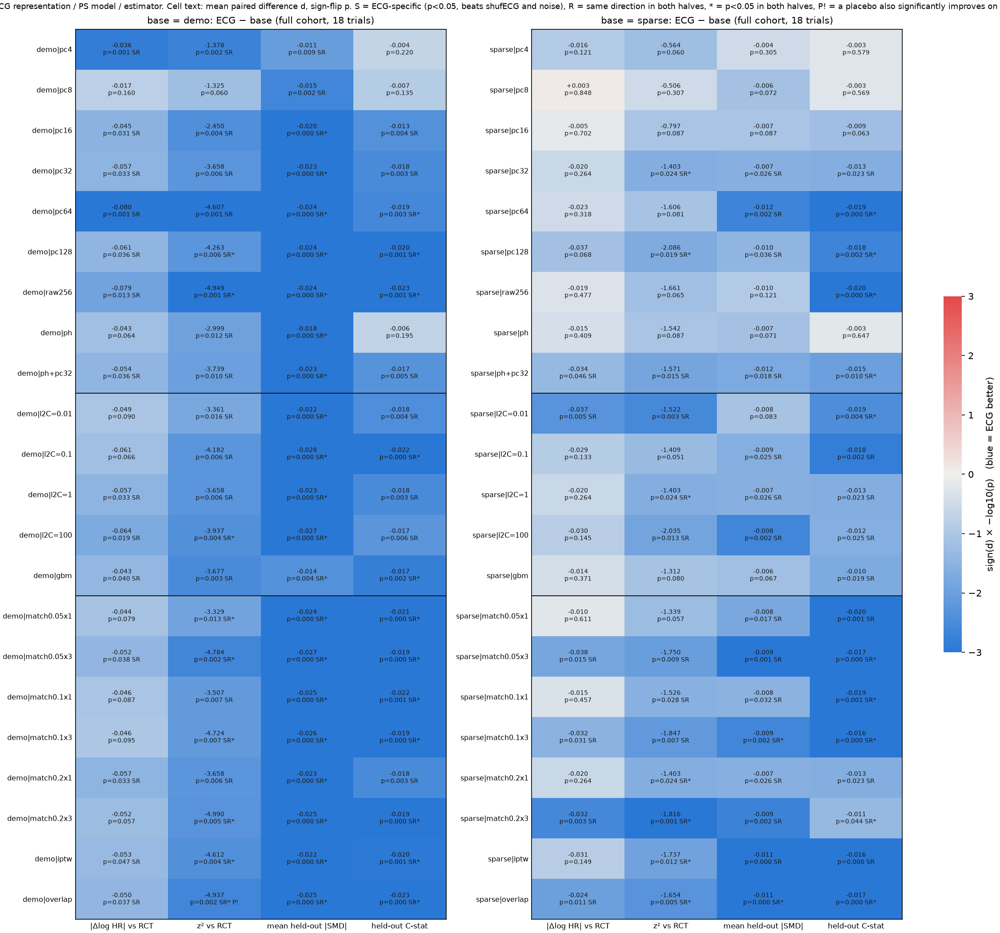
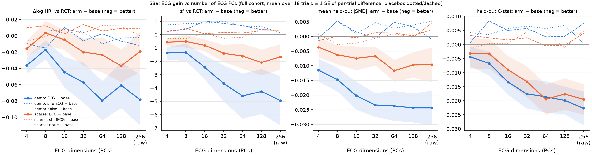

# v1.6 sweep S3: ECG representation, PS model and estimator (2026-09-26)

Exploratory (post-hoc specification accepted; docs/V16_SWEEP_PLAN.md guardrails apply). Script `scripts/v16/s3_repr.py`; long results `/mnt/raid0/rbc58/ecg-tte/audits/claude-v16-s3-repr/results.csv`; summaries `summary_pairs.csv`, `summary_cells.csv`. 18 trials, imputation 1, pool split seed 0. Aggregates only.

<!-- BEGIN MANUAL -->
## Key findings (plain language)

Cells: 22 per base (9 representation, 5 PS model, 8 estimator; 3 are the same default cell repeated per family). "S" = ECG
beats base at p<0.05 AND beats both placebos in direction; "both halves" = p<0.05 in half A and half B separately.

1. **The ECG gain on held-out balance and on z² is robust to representation, PS model and estimator, ECG-specific,
   survives FDR and replicates.** With the **demo** base, mean |SMD| is S in 22/22 cells (20 replicate at p<0.05 in both
   halves), C-statistic 19/22 (12 both halves), z² 21/22 (9 both halves); all q<0.05 within family. With the **sparse** base,
   C-statistic is S in 18/22 (10 both halves), mean |SMD| 15/22 (2 both halves: match 0.1×3, overlap), z² 13/22 (7 both
   halves: the default 32-PC cell, 128 PCs, match 0.2×3, IPTW, overlap). Gains are 2–3× larger on the demo base than on sparse.
2. **|Δlog HR| vs RCT (absd) does NOT replicate anywhere.** Demo: S in 14/22 cells, but only 2 survive within-family FDR
   (4 PCs d = −0.036, q = 0.01; 64 PCs d = −0.080, q = 0.01) and no cell reaches p<0.05 in both halves (all 22 point the same
   way in both halves). Sparse: S in 6/22; FDR survivor only `match0.2x3` (d = −0.032, p = 0.003, q = 0.044; halves p = 0.22 / 0.06);
   `l2C=0.01` d = −0.037, p = 0.005, q = 0.053 (halves p = 0.56 / 0.11). The default sparse cell is null (d = −0.020, p = 0.26).
3. **Number of PCs:** the gain grows from 4 to ~64 PCs and plateaus (64, 128, full 256-d about equal). On sparse, 4–16 PCs
   add nothing significant; 32 is the smallest that is significant (z², SMD, C-stat). Placebo lines stay flat at every
   dimension, so the higher-dimension gains are not a dimension/overfitting artifact. Phenotype scores alone (5-d) help SMD on
   demo but not the C-statistic on either base; phenotypes + 32 PCs ≈ 32 PCs (sparse absd −0.034, p = 0.046, not replicated).
4. **PS model / estimator:** estimators that keep more controls (1:3 matching, IPTW, overlap weights) give the largest and most
   consistent sparse-base gains; **overlap weights** is the only sparse cell S on all four metrics (z², SMD and C-stat
   replicated in both halves; absd −0.024, p = 0.011, q = 0.08, halves p = 0.09 / 0.09). Strong regularisation (C = 0.01) gives
   the largest sparse absd gain but it does not replicate; GBM PS weakens every ECG gain.
5. **Placebos:** placebo arms essentially never improve on base: 1 of 176 cell × metric combinations is flagged (demo|overlap
   z²: shufECG − base = −0.13, p = 0.02, against ECG − base = −4.94); ECG beats both placebos in direction in every S cell.
   No dimension or regularisation artifact was found.
6. **Answer to the central question:** no choice turns the RCT-agreement gain (|Δlog HR|) into a replicated, FDR-robust
   effect. Choices that make the ECG gain larger and more robust are ≥32–64 PCs and overlap/IPTW/1:3 matching; for balance (SMD,
   C-stat) and z² these gains are ECG-specific, FDR-significant and replicated in both halves, most strongly with a demo-only base.
   Caveat: the 44 cells share the same 18 trials and are highly correlated, so they are not independent confirmations.
<!-- END MANUAL -->

## Design

- Bases: **demo** (age, sex, index year) and **sparse** (demo + coded diagnoses). Every cell has four arms: base, base+ECG, base+shufECG (the same ECG matrix with rows permuted by `T.shuffle_perm`), base+noise (Gaussian, same dimension; 32-d = `T.noise32`, else seed 3000+1000·d). Unmatched is run once per trial/half.
- 3a representation (L2 C=1, 1:1 caliper 0.2): PCs 4/8/16/32/64 (from `T.ecg_pc64`), PCs 128 (`pcs(T.ecg_raw, 128)`, unsupervised, full cohort), full 256-d embedding (standardised), phenotype scores (5), phenotypes + 32 PCs. Supervised ECG summaries were not run (any ECG→treatment model is just the PS; any ECG→held-out-variable model would leak the evaluation targets).
- 3b PS model (32 PCs, 1:1 caliper 0.2): L2 C ∈ {0.01, 0.1, 1, 100} (applied to base and ECG arms alike), GBM (5-fold cross-fitted). 3c estimator (32 PCs, L2 C=1): matching caliper {0.05, 0.1, 0.2} × ratio {1, 3}; stabilised trimmed IPTW; overlap weights. `3b|*|l2C=1` and `3c|*|match0.2x1` are the same cell as `3a|*|pc32` (kept in each family for FDR completeness).
- Halves: full; A/B = seeded treatment-stratified 50/50 patient split (`default_rng(16060 + trial_index)`); PCs are unsupervised and computed once on the full cohort.
- Metrics (ECG − base, paired over trials; negative = ECG better): absd = |Δlog HR vs RCT|, z2 = Δ²/(se²+se_RCT²), mean_smd = mean |SMD| over the 58 held-out variables, cstat = cross-fitted held-out C-statistic (L2 C=0.01). p = exact sign-flip. q = BH-FDR within family (3a/3b/3c) per metric over cells (ECG vs base, full); qsweep = over all 44 cells.
- **ECG-specific** (S) = ECG vs base p<0.05 with d<0 AND ECG beats both shufECG and noise in direction. **Replicated** (R) = d<0 in both half A and half B (R05 = also p<0.05 in both). **Placebo flag** (P!) = shufECG or noise significantly improves on base (d<0, p<0.05): dimension/regularisation artifact.

## Status per cell and metric (full cohort)

Entry: `d (p; q)` for ECG − base, then flags. S = ECG-specific, R = same direction in halves A and B, R05 = p<0.05 in both halves, P! = placebo also significantly improves.

| cell | fam | absd | z2 | mean_smd | cstat |
|---|---|---|---|---|---|
| demo|pc4 | 3a | -0.036 (0.001; 0.01) S R | -1.378 (0.002; 0.01) S R | -0.011 (0.009; 0.02) S R | -0.004 (0.220; 0.26) R |
| demo|pc8 | 3a | -0.017 (0.160; 0.24) | -1.325 (0.060; 0.08) R | -0.015 (0.002; 0.00) S R | -0.007 (0.135; 0.19) R |
| demo|pc16 | 3a | -0.045 (0.031; 0.09) S R | -2.450 (0.004; 0.02) S R | -0.020 (0.000; 0.00) S R R05 | -0.013 (0.004; 0.01) S R |
| demo|pc32 | 3a | -0.057 (0.033; 0.09) S R | -3.658 (0.006; 0.02) S R | -0.023 (0.000; 0.00) S R R05 | -0.018 (0.003; 0.01) S R |
| demo|pc64 | 3a | -0.080 (0.001; 0.01) S R | -4.607 (0.001; 0.01) S R | -0.024 (0.000; 0.00) S R R05 | -0.019 (0.003; 0.01) S R R05 |
| demo|pc128 | 3a | -0.061 (0.036; 0.09) S R | -4.263 (0.006; 0.02) S R R05 | -0.024 (0.000; 0.00) S R R05 | -0.020 (0.001; 0.00) S R R05 |
| demo|raw256 | 3a | -0.079 (0.013; 0.08) S R | -4.949 (0.001; 0.01) S R R05 | -0.024 (0.000; 0.00) S R R05 | -0.023 (0.001; 0.00) S R R05 |
| demo|ph | 3a | -0.043 (0.064; 0.12) R | -2.999 (0.012; 0.03) S R | -0.018 (0.000; 0.00) S R R05 | -0.006 (0.195; 0.25) R |
| demo|ph+pc32 | 3a | -0.054 (0.036; 0.09) S R | -3.739 (0.010; 0.03) S R | -0.023 (0.000; 0.00) S R R05 | -0.017 (0.005; 0.01) S R |
| demo|l2C=0.01 | 3b | -0.049 (0.090; 0.15) R | -3.361 (0.016; 0.02) S R | -0.022 (0.000; 0.00) S R R05 | -0.018 (0.004; 0.01) S R |
| demo|l2C=0.1 | 3b | -0.061 (0.066; 0.13) R | -4.182 (0.006; 0.01) S R | -0.028 (0.000; 0.00) S R R05 | -0.022 (0.000; 0.00) S R R05 |
| demo|l2C=1 | 3b | -0.057 (0.033; 0.10) S R | -3.658 (0.006; 0.01) S R | -0.023 (0.000; 0.00) S R R05 | -0.018 (0.003; 0.01) S R |
| demo|l2C=100 | 3b | -0.064 (0.019; 0.09) S R | -3.937 (0.004; 0.01) S R R05 | -0.027 (0.000; 0.00) S R R05 | -0.017 (0.006; 0.01) S R |
| demo|gbm | 3b | -0.043 (0.040; 0.10) S R | -3.677 (0.003; 0.01) S R | -0.014 (0.004; 0.01) S R R05 | -0.017 (0.002; 0.01) S R R05 |
| demo|match0.05x1 | 3c | -0.044 (0.079; 0.13) R | -3.329 (0.013; 0.02) S R R05 | -0.024 (0.000; 0.00) S R R05 | -0.021 (0.000; 0.00) S R R05 |
| demo|match0.05x3 | 3c | -0.052 (0.038; 0.09) S R | -4.784 (0.002; 0.01) S R R05 | -0.027 (0.000; 0.00) S R R05 | -0.019 (0.000; 0.00) S R R05 |
| demo|match0.1x1 | 3c | -0.046 (0.087; 0.13) R | -3.507 (0.007; 0.01) S R | -0.025 (0.000; 0.00) S R R05 | -0.022 (0.001; 0.00) S R R05 |
| demo|match0.1x3 | 3c | -0.046 (0.095; 0.13) R | -4.724 (0.007; 0.01) S R R05 | -0.026 (0.000; 0.00) S R R05 | -0.019 (0.000; 0.00) S R R05 |
| demo|match0.2x1 | 3c | -0.057 (0.033; 0.09) S R | -3.658 (0.006; 0.01) S R | -0.023 (0.000; 0.00) S R R05 | -0.018 (0.003; 0.00) S R |
| demo|match0.2x3 | 3c | -0.052 (0.057; 0.10) R | -4.990 (0.005; 0.01) S R R05 | -0.025 (0.000; 0.00) S R R05 | -0.019 (0.000; 0.00) S R R05 |
| demo|iptw | 3c | -0.053 (0.047; 0.09) S R | -4.612 (0.004; 0.01) S R R05 | -0.022 (0.000; 0.00) S R R05 | -0.020 (0.001; 0.00) S R R05 |
| demo|overlap | 3c | -0.050 (0.037; 0.09) S R | -4.937 (0.002; 0.01) S R R05 P! | -0.025 (0.000; 0.00) S R R05 | -0.023 (0.000; 0.00) S R R05 |
| sparse|pc4 | 3a | -0.016 (0.121; 0.20) | -0.564 (0.060; 0.08) R | -0.004 (0.305; 0.31) | -0.003 (0.579; 0.61) R |
| sparse|pc8 | 3a | +0.003 (0.848; 0.85) R | -0.506 (0.307; 0.31) R | -0.006 (0.072; 0.09) R | -0.003 (0.569; 0.61) R |
| sparse|pc16 | 3a | -0.005 (0.702; 0.74) R | -0.797 (0.087; 0.09) R | -0.007 (0.087; 0.10) R | -0.009 (0.063; 0.09) R |
| sparse|pc32 | 3a | -0.020 (0.264; 0.37) R | -1.403 (0.024; 0.04) S R R05 | -0.007 (0.026; 0.04) S R | -0.013 (0.023; 0.04) S R |
| sparse|pc64 | 3a | -0.023 (0.318; 0.41) R | -1.606 (0.081; 0.09) R R05 | -0.012 (0.002; 0.00) S R | -0.019 (0.000; 0.00) S R R05 |
| sparse|pc128 | 3a | -0.037 (0.068; 0.12) R | -2.086 (0.019; 0.04) S R R05 | -0.010 (0.036; 0.05) S R | -0.018 (0.002; 0.01) S R R05 |
| sparse|raw256 | 3a | -0.019 (0.477; 0.54) R | -1.661 (0.065; 0.08) R | -0.010 (0.121; 0.13) R | -0.020 (0.000; 0.00) S R R05 |
| sparse|ph | 3a | -0.015 (0.409; 0.49) R | -1.542 (0.087; 0.09) R | -0.007 (0.071; 0.09) R | -0.003 (0.647; 0.65) R |
| sparse|ph+pc32 | 3a | -0.034 (0.046; 0.10) S R | -1.571 (0.015; 0.03) S R | -0.012 (0.018; 0.03) S R | -0.015 (0.010; 0.02) S R R05 |
| sparse|l2C=0.01 | 3b | -0.037 (0.005; 0.05) S R | -1.522 (0.003; 0.01) S R | -0.008 (0.083; 0.08) R | -0.019 (0.004; 0.01) S R R05 |
| sparse|l2C=0.1 | 3b | -0.029 (0.133; 0.18) | -1.409 (0.051; 0.06) R | -0.009 (0.025; 0.03) S R | -0.018 (0.002; 0.01) S R |
| sparse|l2C=1 | 3b | -0.020 (0.264; 0.29) R | -1.403 (0.024; 0.03) S R R05 | -0.007 (0.026; 0.03) S R | -0.013 (0.023; 0.02) S R |
| sparse|l2C=100 | 3b | -0.030 (0.145; 0.18) R | -2.035 (0.013; 0.02) S R | -0.008 (0.002; 0.00) S R | -0.012 (0.025; 0.02) S R |
| sparse|gbm | 3b | -0.014 (0.371; 0.37) R | -1.312 (0.080; 0.08) R | -0.006 (0.067; 0.07) R | -0.010 (0.019; 0.02) S R |
| sparse|match0.05x1 | 3c | -0.010 (0.611; 0.61) R | -1.339 (0.057; 0.06) R | -0.008 (0.017; 0.02) S R | -0.020 (0.001; 0.00) S R |
| sparse|match0.05x3 | 3c | -0.038 (0.015; 0.08) S R | -1.750 (0.009; 0.01) S R | -0.009 (0.001; 0.00) S R | -0.017 (0.000; 0.00) S R R05 |
| sparse|match0.1x1 | 3c | -0.015 (0.457; 0.49) R | -1.526 (0.028; 0.03) S R | -0.008 (0.032; 0.03) S R | -0.019 (0.001; 0.00) S R R05 |
| sparse|match0.1x3 | 3c | -0.032 (0.031; 0.09) S R | -1.847 (0.007; 0.01) S R | -0.009 (0.002; 0.00) S R R05 | -0.016 (0.000; 0.00) S R R05 |
| sparse|match0.2x1 | 3c | -0.020 (0.264; 0.30) R | -1.403 (0.024; 0.03) S R R05 | -0.007 (0.026; 0.03) S R | -0.013 (0.023; 0.02) S R |
| sparse|match0.2x3 | 3c | -0.032 (0.003; 0.04) S R | -1.816 (0.001; 0.01) S R R05 | -0.009 (0.002; 0.00) S R | -0.011 (0.044; 0.04) S R R05 |
| sparse|iptw | 3c | -0.031 (0.149; 0.18) R | -1.737 (0.012; 0.02) S R R05 | -0.011 (0.000; 0.00) S R | -0.016 (0.000; 0.00) S R |
| sparse|overlap | 3c | -0.024 (0.011; 0.08) S R | -1.654 (0.005; 0.01) S R R05 | -0.011 (0.000; 0.00) S R R05 | -0.017 (0.000; 0.00) S R R05 |

## absd: ECG vs base, vs placebos, and halves

| cell | d | k | p | q | qsweep | d_vs_shuf | p_vs_shuf | d_vs_noise | p_vs_noise | d_shuf_base | p_shuf_base | d_noise_base | p_noise_base | d_A | p_A | d_B | p_B |
|---|---|---|---|---|---|---|---|---|---|---|---|---|---|---|---|---|---|
| demo|pc4 | -0.036 | 15/18 | 0.001 | 0.013 | 0.031 | -0.042 | 0.005 | -0.027 | 0.089 | 0.006 | 0.568 | -0.009 | 0.495 | -0.012 | 0.610 | -0.009 | 0.756 |
| demo|pc8 | -0.017 | 12/18 | 0.160 | 0.240 | 0.214 | -0.023 | 0.122 | -0.002 | 0.903 | 0.006 | 0.689 | -0.015 | 0.277 | 0.017 | 0.517 | -0.020 | 0.402 |
| demo|pc16 | -0.045 | 11/18 | 0.031 | 0.093 | 0.097 | -0.053 | 0.026 | -0.055 | 0.033 | 0.008 | 0.445 | 0.010 | 0.392 | -0.007 | 0.781 | -0.034 | 0.272 |
| demo|pc32 | -0.057 | 14/18 | 0.033 | 0.093 | 0.097 | -0.062 | 0.083 | -0.051 | 0.120 | 0.004 | 0.758 | -0.006 | 0.717 | -0.040 | 0.105 | -0.054 | 0.128 |
| demo|pc64 | -0.080 | 15/18 | 0.001 | 0.010 | 0.026 | -0.070 | 0.002 | -0.082 | 0.002 | -0.010 | 0.471 | 0.003 | 0.810 | -0.024 | 0.521 | -0.067 | 0.110 |
| demo|pc128 | -0.061 | 11/18 | 0.036 | 0.093 | 0.097 | -0.058 | 0.078 | -0.054 | 0.113 | -0.003 | 0.865 | -0.006 | 0.613 | -0.040 | 0.246 | -0.064 | 0.169 |
| demo|raw256 | -0.079 | 14/18 | 0.013 | 0.076 | 0.093 | -0.077 | 0.025 | -0.067 | 0.062 | -0.002 | 0.903 | -0.012 | 0.348 | -0.049 | 0.209 | -0.083 | 0.098 |
| demo|ph | -0.043 | 13/18 | 0.064 | 0.122 | 0.124 | -0.031 | 0.272 | -0.030 | 0.262 | -0.012 | 0.300 | -0.013 | 0.271 | -0.030 | 0.237 | -0.032 | 0.414 |
| demo|ph+pc32 | -0.054 | 12/18 | 0.036 | 0.093 | 0.097 | -0.044 | 0.108 | -0.035 | 0.245 | -0.009 | 0.428 | -0.019 | 0.157 | -0.048 | 0.162 | -0.049 | 0.224 |
| demo|l2C=0.01 | -0.049 | 15/18 | 0.090 | 0.151 | 0.147 | -0.050 | 0.109 | -0.044 | 0.130 | 0.001 | 0.935 | -0.005 | 0.685 | -0.037 | 0.183 | -0.057 | 0.111 |
| demo|l2C=0.1 | -0.061 | 14/18 | 0.066 | 0.133 | 0.124 | -0.058 | 0.114 | -0.055 | 0.117 | -0.003 | 0.776 | -0.006 | 0.602 | -0.070 | 0.000 | -0.043 | 0.214 |
| demo|l2C=1 | -0.057 | 14/18 | 0.033 | 0.100 | 0.097 | -0.062 | 0.083 | -0.051 | 0.120 | 0.004 | 0.758 | -0.006 | 0.717 | -0.040 | 0.105 | -0.054 | 0.128 |
| demo|l2C=100 | -0.064 | 12/18 | 0.019 | 0.094 | 0.097 | -0.059 | 0.075 | -0.054 | 0.094 | -0.006 | 0.676 | -0.010 | 0.538 | -0.037 | 0.233 | -0.054 | 0.137 |
| demo|gbm | -0.043 | 12/18 | 0.040 | 0.100 | 0.097 | -0.021 | 0.298 | -0.029 | 0.286 | -0.021 | 0.185 | -0.013 | 0.470 | -0.059 | 0.010 | -0.009 | 0.809 |
| demo|match0.05x1 | -0.044 | 12/18 | 0.079 | 0.126 | 0.138 | -0.054 | 0.115 | -0.044 | 0.134 | 0.010 | 0.411 | -0.000 | 0.985 | -0.045 | 0.066 | -0.066 | 0.070 |
| demo|match0.05x3 | -0.052 | 13/18 | 0.038 | 0.087 | 0.097 | -0.051 | 0.061 | -0.040 | 0.142 | -0.001 | 0.915 | -0.012 | 0.346 | -0.052 | 0.015 | -0.043 | 0.173 |
| demo|match0.1x1 | -0.046 | 12/18 | 0.087 | 0.126 | 0.146 | -0.059 | 0.082 | -0.050 | 0.094 | 0.013 | 0.277 | 0.003 | 0.836 | -0.053 | 0.045 | -0.053 | 0.149 |
| demo|match0.1x3 | -0.046 | 12/18 | 0.095 | 0.127 | 0.149 | -0.050 | 0.068 | -0.043 | 0.104 | 0.004 | 0.679 | -0.003 | 0.781 | -0.054 | 0.023 | -0.034 | 0.282 |
| demo|match0.2x1 | -0.057 | 14/18 | 0.033 | 0.087 | 0.097 | -0.062 | 0.083 | -0.051 | 0.120 | 0.004 | 0.758 | -0.006 | 0.717 | -0.040 | 0.105 | -0.054 | 0.128 |
| demo|match0.2x3 | -0.052 | 12/18 | 0.057 | 0.101 | 0.119 | -0.048 | 0.101 | -0.044 | 0.124 | -0.004 | 0.749 | -0.008 | 0.337 | -0.037 | 0.161 | -0.046 | 0.100 |
| demo|iptw | -0.053 | 15/18 | 0.047 | 0.093 | 0.102 | -0.055 | 0.046 | -0.046 | 0.108 | 0.002 | 0.681 | -0.008 | 0.056 | -0.048 | 0.061 | -0.036 | 0.347 |
| demo|overlap | -0.050 | 14/18 | 0.037 | 0.087 | 0.097 | -0.048 | 0.044 | -0.050 | 0.031 | -0.002 | 0.289 | 0.001 | 0.749 | -0.062 | 0.013 | -0.042 | 0.113 |
| sparse|pc4 | -0.016 | 12/18 | 0.121 | 0.198 | 0.183 | -0.009 | 0.248 | -0.026 | 0.040 | -0.007 | 0.488 | 0.010 | 0.299 | -0.055 | 0.005 | 0.020 | 0.579 |
| sparse|pc8 | 0.003 | 10/18 | 0.848 | 0.848 | 0.848 | 0.004 | 0.857 | -0.009 | 0.596 | -0.001 | 0.948 | 0.012 | 0.324 | -0.026 | 0.211 | -0.018 | 0.554 |
| sparse|pc16 | -0.005 | 12/18 | 0.702 | 0.743 | 0.718 | -0.014 | 0.259 | -0.007 | 0.645 | 0.009 | 0.441 | 0.002 | 0.849 | -0.017 | 0.190 | -0.032 | 0.283 |
| sparse|pc32 | -0.020 | 14/18 | 0.264 | 0.366 | 0.323 | -0.023 | 0.088 | -0.034 | 0.053 | 0.003 | 0.785 | 0.014 | 0.275 | -0.059 | 0.042 | -0.034 | 0.231 |
| sparse|pc64 | -0.023 | 11/18 | 0.318 | 0.409 | 0.378 | -0.036 | 0.142 | -0.029 | 0.145 | 0.013 | 0.606 | 0.006 | 0.540 | -0.042 | 0.075 | -0.028 | 0.408 |
| sparse|pc128 | -0.037 | 12/18 | 0.068 | 0.122 | 0.124 | -0.049 | 0.025 | -0.046 | 0.072 | 0.012 | 0.376 | 0.009 | 0.534 | -0.049 | 0.030 | -0.053 | 0.168 |
| sparse|raw256 | -0.019 | 11/18 | 0.477 | 0.537 | 0.512 | -0.019 | 0.429 | -0.029 | 0.147 | -0.000 | 0.998 | 0.009 | 0.499 | -0.075 | 0.004 | -0.043 | 0.302 |
| sparse|ph | -0.015 | 8/18 | 0.409 | 0.490 | 0.461 | -0.014 | 0.482 | -0.033 | 0.085 | -0.002 | 0.879 | 0.018 | 0.284 | -0.063 | 0.004 | -0.031 | 0.275 |
| sparse|ph+pc32 | -0.034 | 14/18 | 0.046 | 0.103 | 0.102 | -0.037 | 0.071 | -0.043 | 0.018 | 0.003 | 0.876 | 0.009 | 0.496 | -0.031 | 0.078 | -0.019 | 0.602 |
| sparse|l2C=0.01 | -0.037 | 13/18 | 0.005 | 0.053 | 0.058 | -0.033 | 0.039 | -0.050 | 0.004 | -0.004 | 0.786 | 0.013 | 0.465 | -0.009 | 0.559 | -0.034 | 0.105 |
| sparse|l2C=0.1 | -0.029 | 12/18 | 0.133 | 0.182 | 0.195 | -0.019 | 0.403 | -0.024 | 0.380 | -0.010 | 0.438 | -0.005 | 0.697 | 0.006 | 0.823 | -0.047 | 0.046 |
| sparse|l2C=1 | -0.020 | 14/18 | 0.264 | 0.294 | 0.323 | -0.023 | 0.088 | -0.034 | 0.053 | 0.003 | 0.785 | 0.014 | 0.275 | -0.059 | 0.042 | -0.034 | 0.231 |
| sparse|l2C=100 | -0.030 | 15/18 | 0.145 | 0.182 | 0.205 | -0.024 | 0.290 | -0.022 | 0.430 | -0.006 | 0.703 | -0.008 | 0.603 | -0.009 | 0.703 | -0.031 | 0.348 |
| sparse|gbm | -0.014 | 13/18 | 0.371 | 0.371 | 0.430 | -0.007 | 0.695 | -0.025 | 0.150 | -0.007 | 0.598 | 0.011 | 0.482 | -0.023 | 0.216 | -0.024 | 0.375 |
| sparse|match0.05x1 | -0.010 | 11/18 | 0.611 | 0.611 | 0.640 | -0.027 | 0.127 | -0.036 | 0.049 | 0.017 | 0.210 | 0.026 | 0.054 | -0.041 | 0.251 | -0.012 | 0.694 |
| sparse|match0.05x3 | -0.038 | 13/18 | 0.015 | 0.083 | 0.097 | -0.041 | 0.017 | -0.042 | 0.017 | 0.003 | 0.757 | 0.004 | 0.709 | -0.012 | 0.527 | -0.011 | 0.598 |
| sparse|match0.1x1 | -0.015 | 11/18 | 0.457 | 0.487 | 0.502 | -0.024 | 0.110 | -0.043 | 0.013 | 0.009 | 0.531 | 0.028 | 0.061 | -0.060 | 0.056 | -0.026 | 0.354 |
| sparse|match0.1x3 | -0.032 | 13/18 | 0.031 | 0.087 | 0.097 | -0.034 | 0.016 | -0.043 | 0.006 | 0.002 | 0.871 | 0.011 | 0.308 | -0.024 | 0.099 | -0.020 | 0.190 |
| sparse|match0.2x1 | -0.020 | 14/18 | 0.264 | 0.302 | 0.323 | -0.023 | 0.088 | -0.034 | 0.053 | 0.003 | 0.785 | 0.014 | 0.275 | -0.059 | 0.042 | -0.034 | 0.231 |
| sparse|match0.2x3 | -0.032 | 15/18 | 0.003 | 0.044 | 0.041 | -0.034 | 0.004 | -0.034 | 0.053 | 0.001 | 0.874 | 0.002 | 0.865 | -0.018 | 0.221 | -0.027 | 0.063 |
| sparse|iptw | -0.031 | 12/18 | 0.149 | 0.184 | 0.205 | -0.027 | 0.173 | -0.015 | 0.239 | -0.004 | 0.697 | -0.016 | 0.122 | -0.013 | 0.368 | -0.014 | 0.389 |
| sparse|overlap | -0.024 | 13/18 | 0.011 | 0.083 | 0.093 | -0.022 | 0.017 | -0.025 | 0.004 | -0.002 | 0.506 | 0.001 | 0.662 | -0.021 | 0.091 | -0.022 | 0.090 |

## z2: ECG vs base, vs placebos, and halves

| cell | d | k | p | q | qsweep | d_vs_shuf | p_vs_shuf | d_vs_noise | p_vs_noise | d_shuf_base | p_shuf_base | d_noise_base | p_noise_base | d_A | p_A | d_B | p_B |
|---|---|---|---|---|---|---|---|---|---|---|---|---|---|---|---|---|---|
| demo|pc4 | -1.378 | 15/18 | 0.002 | 0.012 | 0.014 | -2.110 | 0.003 | -1.651 | 0.061 | 0.732 | 0.230 | 0.273 | 0.706 | -1.638 | 0.287 | -1.484 | 0.288 |
| demo|pc8 | -1.325 | 12/18 | 0.060 | 0.083 | 0.069 | -2.152 | 0.010 | -1.718 | 0.020 | 0.828 | 0.428 | 0.393 | 0.530 | -0.360 | 0.969 | -1.688 | 0.153 |
| demo|pc16 | -2.450 | 11/18 | 0.004 | 0.018 | 0.014 | -3.320 | 0.008 | -3.473 | 0.014 | 0.871 | 0.338 | 1.023 | 0.375 | -1.497 | 0.236 | -2.310 | 0.125 |
| demo|pc32 | -3.658 | 14/18 | 0.006 | 0.018 | 0.014 | -4.671 | 0.021 | -4.499 | 0.015 | 1.012 | 0.411 | 0.841 | 0.485 | -2.625 | 0.032 | -3.243 | 0.083 |
| demo|pc64 | -4.607 | 14/18 | 0.001 | 0.008 | 0.014 | -5.251 | 0.001 | -5.292 | 0.002 | 0.644 | 0.643 | 0.685 | 0.303 | -3.164 | 0.067 | -3.683 | 0.051 |
| demo|pc128 | -4.263 | 11/18 | 0.006 | 0.018 | 0.014 | -4.879 | 0.020 | -4.638 | 0.013 | 0.617 | 0.519 | 0.376 | 0.539 | -3.299 | 0.019 | -4.365 | 0.012 |
| demo|raw256 | -4.949 | 14/18 | 0.001 | 0.008 | 0.014 | -5.091 | 0.001 | -5.300 | 0.005 | 0.143 | 0.897 | 0.351 | 0.648 | -3.596 | 0.014 | -4.862 | 0.005 |
| demo|ph | -2.999 | 13/18 | 0.012 | 0.027 | 0.022 | -3.514 | 0.012 | -3.267 | 0.011 | 0.515 | 0.441 | 0.268 | 0.679 | -2.248 | 0.095 | -3.021 | 0.107 |
| demo|ph+pc32 | -3.739 | 12/18 | 0.010 | 0.026 | 0.019 | -3.351 | 0.059 | -3.753 | 0.040 | -0.388 | 0.589 | 0.014 | 0.985 | -3.128 | 0.016 | -3.301 | 0.089 |
| demo|l2C=0.01 | -3.361 | 15/18 | 0.016 | 0.023 | 0.024 | -3.503 | 0.090 | -3.444 | 0.031 | 0.142 | 0.853 | 0.082 | 0.834 | -3.007 | 0.058 | -3.687 | 0.012 |
| demo|l2C=0.1 | -4.182 | 14/18 | 0.006 | 0.012 | 0.014 | -4.488 | 0.036 | -4.481 | 0.030 | 0.305 | 0.747 | 0.298 | 0.878 | -3.011 | 0.002 | -3.156 | 0.069 |
| demo|l2C=1 | -3.658 | 14/18 | 0.006 | 0.012 | 0.014 | -4.671 | 0.021 | -4.499 | 0.015 | 1.012 | 0.411 | 0.841 | 0.485 | -2.625 | 0.032 | -3.243 | 0.083 |
| demo|l2C=100 | -3.937 | 13/18 | 0.004 | 0.012 | 0.014 | -4.204 | 0.036 | -4.521 | 0.023 | 0.267 | 0.899 | 0.583 | 0.605 | -3.016 | 0.035 | -3.446 | 0.039 |
| demo|gbm | -3.677 | 12/18 | 0.003 | 0.012 | 0.014 | -2.620 | 0.015 | -3.772 | 0.010 | -1.057 | 0.073 | 0.095 | 0.902 | -1.903 | 0.025 | -1.620 | 0.265 |
| demo|match0.05x1 | -3.329 | 12/18 | 0.013 | 0.016 | 0.022 | -4.499 | 0.033 | -4.374 | 0.009 | 1.170 | 0.311 | 1.045 | 0.349 | -2.614 | 0.022 | -3.664 | 0.037 |
| demo|match0.05x3 | -4.784 | 13/18 | 0.002 | 0.012 | 0.014 | -4.728 | 0.005 | -4.691 | 0.009 | -0.056 | 0.845 | -0.093 | 0.841 | -3.285 | 0.005 | -3.625 | 0.022 |
| demo|match0.1x1 | -3.507 | 12/18 | 0.007 | 0.012 | 0.016 | -4.540 | 0.026 | -4.316 | 0.013 | 1.033 | 0.364 | 0.810 | 0.523 | -2.752 | 0.026 | -3.363 | 0.068 |
| demo|match0.1x3 | -4.724 | 13/18 | 0.007 | 0.012 | 0.016 | -4.741 | 0.012 | -4.519 | 0.016 | 0.017 | 0.967 | -0.205 | 0.642 | -3.417 | 0.013 | -3.235 | 0.034 |
| demo|match0.2x1 | -3.658 | 14/18 | 0.006 | 0.012 | 0.014 | -4.671 | 0.021 | -4.499 | 0.015 | 1.012 | 0.411 | 0.841 | 0.485 | -2.625 | 0.032 | -3.243 | 0.083 |
| demo|match0.2x3 | -4.990 | 12/18 | 0.005 | 0.012 | 0.014 | -4.952 | 0.011 | -4.608 | 0.010 | -0.037 | 0.908 | -0.382 | 0.153 | -3.328 | 0.025 | -3.156 | 0.033 |
| demo|iptw | -4.612 | 15/18 | 0.004 | 0.012 | 0.014 | -4.699 | 0.004 | -4.165 | 0.007 | 0.087 | 0.551 | -0.447 | 0.056 | -3.350 | 0.004 | -3.390 | 0.018 |
| demo|overlap | -4.937 | 14/18 | 0.002 | 0.012 | 0.014 | -4.804 | 0.003 | -4.821 | 0.002 | -0.133 | 0.021 | -0.116 | 0.167 | -3.814 | 0.001 | -3.397 | 0.008 |
| sparse|pc4 | -0.564 | 13/18 | 0.060 | 0.083 | 0.069 | -0.258 | 0.416 | -0.766 | 0.036 | -0.306 | 0.312 | 0.202 | 0.364 | -1.277 | 0.009 | -0.144 | 0.795 |
| sparse|pc8 | -0.506 | 10/18 | 0.307 | 0.307 | 0.307 | -0.206 | 0.713 | -0.974 | 0.227 | -0.300 | 0.434 | 0.468 | 0.291 | -0.427 | 0.319 | -0.883 | 0.265 |
| sparse|pc16 | -0.797 | 12/18 | 0.087 | 0.092 | 0.089 | -0.902 | 0.118 | -0.859 | 0.156 | 0.106 | 0.740 | 0.062 | 0.871 | -0.585 | 0.268 | -1.036 | 0.238 |
| sparse|pc32 | -1.403 | 14/18 | 0.024 | 0.039 | 0.032 | -1.128 | 0.026 | -1.562 | 0.015 | -0.275 | 0.580 | 0.158 | 0.749 | -1.475 | 0.013 | -1.223 | 0.030 |
| sparse|pc64 | -1.606 | 11/18 | 0.081 | 0.092 | 0.087 | -1.407 | 0.139 | -1.724 | 0.052 | -0.199 | 0.606 | 0.119 | 0.628 | -1.619 | 0.021 | -1.419 | 0.037 |
| sparse|pc128 | -2.086 | 12/18 | 0.019 | 0.035 | 0.029 | -2.511 | 0.008 | -2.374 | 0.009 | 0.425 | 0.577 | 0.288 | 0.452 | -1.752 | 0.012 | -1.925 | 0.010 |
| sparse|raw256 | -1.661 | 11/18 | 0.065 | 0.084 | 0.073 | -1.923 | 0.086 | -1.957 | 0.041 | 0.263 | 0.819 | 0.296 | 0.550 | -2.427 | 0.004 | -1.592 | 0.064 |
| sparse|ph | -1.542 | 8/18 | 0.087 | 0.092 | 0.089 | -1.287 | 0.158 | -1.646 | 0.061 | -0.255 | 0.454 | 0.104 | 0.834 | -1.784 | 0.003 | -1.189 | 0.079 |
| sparse|ph+pc32 | -1.571 | 14/18 | 0.015 | 0.029 | 0.023 | -1.488 | 0.015 | -1.747 | 0.021 | -0.083 | 0.772 | 0.176 | 0.762 | -1.543 | 0.018 | -1.367 | 0.091 |
| sparse|l2C=0.01 | -1.522 | 13/18 | 0.003 | 0.012 | 0.014 | -1.442 | 0.079 | -1.994 | 0.001 | -0.080 | 0.900 | 0.472 | 0.387 | -0.623 | 0.206 | -0.700 | 0.109 |
| sparse|l2C=0.1 | -1.409 | 12/18 | 0.051 | 0.056 | 0.064 | -1.467 | 0.086 | -1.644 | 0.055 | 0.058 | 0.873 | 0.235 | 0.441 | -1.324 | 0.200 | -1.358 | 0.038 |
| sparse|l2C=1 | -1.403 | 14/18 | 0.024 | 0.030 | 0.032 | -1.128 | 0.026 | -1.562 | 0.015 | -0.275 | 0.580 | 0.158 | 0.749 | -1.475 | 0.013 | -1.223 | 0.030 |
| sparse|l2C=100 | -2.035 | 15/18 | 0.013 | 0.022 | 0.022 | -1.419 | 0.021 | -1.517 | 0.049 | -0.617 | 0.365 | -0.518 | 0.518 | -1.060 | 0.081 | -1.306 | 0.067 |
| sparse|gbm | -1.312 | 14/18 | 0.080 | 0.080 | 0.087 | -1.094 | 0.163 | -2.325 | 0.070 | -0.218 | 0.550 | 1.013 | 0.208 | -1.230 | 0.093 | -1.043 | 0.356 |
| sparse|match0.05x1 | -1.339 | 11/18 | 0.057 | 0.057 | 0.069 | -1.337 | 0.015 | -1.631 | 0.010 | -0.002 | 0.996 | 0.292 | 0.576 | -1.280 | 0.069 | -1.077 | 0.136 |
| sparse|match0.05x3 | -1.750 | 13/18 | 0.009 | 0.014 | 0.019 | -1.833 | 0.007 | -1.821 | 0.018 | 0.083 | 0.703 | 0.071 | 0.728 | -0.955 | 0.065 | -1.047 | 0.137 |
| sparse|match0.1x1 | -1.526 | 11/18 | 0.028 | 0.030 | 0.037 | -1.195 | 0.020 | -1.726 | 0.003 | -0.331 | 0.523 | 0.200 | 0.672 | -1.388 | 0.038 | -1.142 | 0.080 |
| sparse|match0.1x3 | -1.847 | 13/18 | 0.007 | 0.012 | 0.016 | -1.663 | 0.010 | -2.005 | 0.007 | -0.184 | 0.451 | 0.158 | 0.485 | -0.915 | 0.093 | -1.042 | 0.067 |
| sparse|match0.2x1 | -1.403 | 14/18 | 0.024 | 0.027 | 0.032 | -1.128 | 0.026 | -1.562 | 0.015 | -0.275 | 0.580 | 0.158 | 0.749 | -1.475 | 0.013 | -1.223 | 0.030 |
| sparse|match0.2x3 | -1.816 | 15/18 | 0.001 | 0.010 | 0.014 | -1.643 | 0.002 | -1.898 | 0.012 | -0.173 | 0.403 | 0.082 | 0.698 | -1.271 | 0.022 | -1.198 | 0.010 |
| sparse|iptw | -1.737 | 12/18 | 0.012 | 0.016 | 0.022 | -1.760 | 0.004 | -1.164 | 0.021 | 0.023 | 0.916 | -0.573 | 0.061 | -1.137 | 0.038 | -1.009 | 0.025 |
| sparse|overlap | -1.654 | 13/18 | 0.005 | 0.012 | 0.014 | -1.579 | 0.006 | -1.628 | 0.003 | -0.075 | 0.120 | -0.027 | 0.586 | -1.176 | 0.023 | -1.208 | 0.017 |

## mean_smd: ECG vs base, vs placebos, and halves

| cell | d | k | p | q | qsweep | d_vs_shuf | p_vs_shuf | d_vs_noise | p_vs_noise | d_shuf_base | p_shuf_base | d_noise_base | p_noise_base | d_A | p_A | d_B | p_B |
|---|---|---|---|---|---|---|---|---|---|---|---|---|---|---|---|---|---|
| demo|pc4 | -0.011 | 12/18 | 0.009 | 0.016 | 0.013 | -0.011 | 0.021 | -0.011 | 0.001 | -0.001 | 0.589 | -0.000 | 0.787 | -0.005 | 0.299 | -0.008 | 0.099 |
| demo|pc8 | -0.015 | 16/18 | 0.002 | 0.005 | 0.004 | -0.020 | 0.000 | -0.020 | 0.000 | 0.005 | 0.227 | 0.005 | 0.123 | -0.006 | 0.272 | -0.013 | 0.002 |
| demo|pc16 | -0.020 | 16/18 | 0.000 | 0.000 | 0.000 | -0.021 | 0.000 | -0.022 | 0.000 | 0.001 | 0.711 | 0.001 | 0.590 | -0.011 | 0.036 | -0.021 | 0.000 |
| demo|pc32 | -0.023 | 17/18 | 0.000 | 0.000 | 0.000 | -0.028 | 0.000 | -0.023 | 0.000 | 0.005 | 0.133 | -0.001 | 0.820 | -0.019 | 0.003 | -0.023 | 0.001 |
| demo|pc64 | -0.024 | 16/18 | 0.000 | 0.000 | 0.000 | -0.027 | 0.000 | -0.029 | 0.000 | 0.003 | 0.357 | 0.005 | 0.122 | -0.016 | 0.026 | -0.023 | 0.001 |
| demo|pc128 | -0.024 | 16/18 | 0.000 | 0.000 | 0.000 | -0.028 | 0.000 | -0.028 | 0.000 | 0.004 | 0.157 | 0.003 | 0.249 | -0.017 | 0.005 | -0.025 | 0.000 |
| demo|raw256 | -0.024 | 16/18 | 0.000 | 0.000 | 0.000 | -0.030 | 0.000 | -0.023 | 0.000 | 0.005 | 0.076 | -0.001 | 0.678 | -0.016 | 0.025 | -0.021 | 0.009 |
| demo|ph | -0.018 | 17/18 | 0.000 | 0.000 | 0.000 | -0.016 | 0.000 | -0.019 | 0.000 | -0.002 | 0.330 | 0.001 | 0.659 | -0.016 | 0.003 | -0.017 | 0.000 |
| demo|ph+pc32 | -0.023 | 17/18 | 0.000 | 0.000 | 0.000 | -0.025 | 0.000 | -0.022 | 0.001 | 0.002 | 0.438 | -0.000 | 0.886 | -0.022 | 0.002 | -0.020 | 0.000 |
| demo|l2C=0.01 | -0.022 | 18/18 | 0.000 | 0.000 | 0.000 | -0.023 | 0.000 | -0.022 | 0.000 | 0.001 | 0.439 | -0.000 | 0.982 | -0.020 | 0.004 | -0.020 | 0.001 |
| demo|l2C=0.1 | -0.028 | 18/18 | 0.000 | 0.000 | 0.000 | -0.029 | 0.000 | -0.028 | 0.000 | 0.000 | 0.827 | -0.000 | 0.878 | -0.023 | 0.000 | -0.027 | 0.000 |
| demo|l2C=1 | -0.023 | 17/18 | 0.000 | 0.000 | 0.000 | -0.028 | 0.000 | -0.023 | 0.000 | 0.005 | 0.133 | -0.001 | 0.820 | -0.019 | 0.003 | -0.023 | 0.001 |
| demo|l2C=100 | -0.027 | 18/18 | 0.000 | 0.000 | 0.000 | -0.031 | 0.000 | -0.026 | 0.000 | 0.004 | 0.078 | -0.001 | 0.498 | -0.017 | 0.013 | -0.023 | 0.000 |
| demo|gbm | -0.014 | 15/18 | 0.004 | 0.007 | 0.007 | -0.017 | 0.002 | -0.017 | 0.002 | 0.003 | 0.345 | 0.002 | 0.252 | -0.014 | 0.001 | -0.013 | 0.005 |
| demo|match0.05x1 | -0.024 | 18/18 | 0.000 | 0.000 | 0.000 | -0.029 | 0.000 | -0.025 | 0.000 | 0.005 | 0.135 | 0.000 | 0.856 | -0.023 | 0.002 | -0.022 | 0.002 |
| demo|match0.05x3 | -0.027 | 18/18 | 0.000 | 0.000 | 0.000 | -0.027 | 0.000 | -0.028 | 0.000 | 0.000 | 0.884 | 0.001 | 0.475 | -0.020 | 0.000 | -0.023 | 0.000 |
| demo|match0.1x1 | -0.025 | 17/18 | 0.000 | 0.000 | 0.000 | -0.029 | 0.000 | -0.024 | 0.000 | 0.004 | 0.224 | -0.001 | 0.655 | -0.020 | 0.002 | -0.022 | 0.000 |
| demo|match0.1x3 | -0.026 | 18/18 | 0.000 | 0.000 | 0.000 | -0.027 | 0.000 | -0.025 | 0.000 | 0.001 | 0.652 | -0.000 | 0.729 | -0.019 | 0.000 | -0.022 | 0.000 |
| demo|match0.2x1 | -0.023 | 17/18 | 0.000 | 0.000 | 0.000 | -0.028 | 0.000 | -0.023 | 0.000 | 0.005 | 0.133 | -0.001 | 0.820 | -0.019 | 0.003 | -0.023 | 0.001 |
| demo|match0.2x3 | -0.025 | 18/18 | 0.000 | 0.000 | 0.000 | -0.025 | 0.000 | -0.025 | 0.000 | -0.000 | 0.914 | -0.001 | 0.664 | -0.018 | 0.000 | -0.023 | 0.000 |
| demo|iptw | -0.022 | 18/18 | 0.000 | 0.000 | 0.000 | -0.024 | 0.000 | -0.023 | 0.000 | 0.001 | 0.281 | 0.001 | 0.822 | -0.013 | 0.037 | -0.022 | 0.000 |
| demo|overlap | -0.025 | 18/18 | 0.000 | 0.000 | 0.000 | -0.026 | 0.000 | -0.026 | 0.000 | 0.000 | 0.447 | 0.000 | 0.586 | -0.021 | 0.000 | -0.026 | 0.000 |
| sparse|pc4 | -0.004 | 11/18 | 0.305 | 0.305 | 0.305 | -0.004 | 0.216 | -0.002 | 0.484 | 0.001 | 0.843 | -0.001 | 0.681 | -0.003 | 0.393 | 0.001 | 0.846 |
| sparse|pc8 | -0.006 | 14/18 | 0.072 | 0.086 | 0.079 | -0.004 | 0.508 | -0.006 | 0.063 | -0.003 | 0.685 | 0.000 | 0.974 | -0.003 | 0.356 | -0.004 | 0.367 |
| sparse|pc16 | -0.007 | 12/18 | 0.087 | 0.098 | 0.091 | -0.005 | 0.148 | -0.007 | 0.021 | -0.002 | 0.269 | -0.000 | 0.877 | -0.000 | 0.932 | -0.008 | 0.029 |
| sparse|pc32 | -0.007 | 14/18 | 0.026 | 0.039 | 0.033 | -0.006 | 0.059 | -0.008 | 0.004 | -0.001 | 0.814 | 0.001 | 0.613 | -0.003 | 0.504 | -0.008 | 0.033 |
| sparse|pc64 | -0.012 | 14/18 | 0.002 | 0.005 | 0.004 | -0.013 | 0.000 | -0.013 | 0.000 | 0.001 | 0.585 | 0.001 | 0.654 | -0.001 | 0.779 | -0.008 | 0.048 |
| sparse|pc128 | -0.010 | 15/18 | 0.036 | 0.050 | 0.043 | -0.009 | 0.005 | -0.010 | 0.007 | -0.000 | 0.903 | 0.000 | 0.933 | -0.001 | 0.791 | -0.007 | 0.095 |
| sparse|raw256 | -0.010 | 14/18 | 0.121 | 0.128 | 0.124 | -0.014 | 0.001 | -0.012 | 0.032 | 0.005 | 0.344 | 0.002 | 0.409 | -0.004 | 0.534 | -0.003 | 0.658 |
| sparse|ph | -0.007 | 13/18 | 0.071 | 0.086 | 0.079 | -0.006 | 0.089 | -0.008 | 0.037 | -0.001 | 0.707 | 0.001 | 0.703 | -0.002 | 0.648 | -0.003 | 0.500 |
| sparse|ph+pc32 | -0.012 | 14/18 | 0.018 | 0.030 | 0.026 | -0.012 | 0.013 | -0.010 | 0.061 | 0.001 | 0.838 | -0.002 | 0.613 | -0.003 | 0.575 | -0.008 | 0.048 |
| sparse|l2C=0.01 | -0.008 | 14/18 | 0.083 | 0.083 | 0.089 | -0.005 | 0.261 | -0.009 | 0.038 | -0.003 | 0.264 | 0.001 | 0.569 | -0.002 | 0.615 | -0.007 | 0.086 |
| sparse|l2C=0.1 | -0.009 | 13/18 | 0.025 | 0.033 | 0.033 | -0.007 | 0.082 | -0.008 | 0.032 | -0.002 | 0.478 | -0.001 | 0.690 | -0.006 | 0.005 | -0.006 | 0.203 |
| sparse|l2C=1 | -0.007 | 14/18 | 0.026 | 0.033 | 0.033 | -0.006 | 0.059 | -0.008 | 0.004 | -0.001 | 0.814 | 0.001 | 0.613 | -0.003 | 0.504 | -0.008 | 0.033 |
| sparse|l2C=100 | -0.008 | 15/18 | 0.002 | 0.005 | 0.004 | -0.007 | 0.068 | -0.005 | 0.081 | -0.002 | 0.634 | -0.003 | 0.084 | -0.003 | 0.533 | -0.008 | 0.115 |
| sparse|gbm | -0.006 | 11/18 | 0.067 | 0.074 | 0.077 | -0.007 | 0.104 | -0.009 | 0.003 | 0.001 | 0.721 | 0.004 | 0.048 | -0.003 | 0.429 | -0.007 | 0.246 |
| sparse|match0.05x1 | -0.008 | 14/18 | 0.017 | 0.019 | 0.025 | -0.008 | 0.033 | -0.010 | 0.000 | -0.000 | 0.972 | 0.003 | 0.223 | -0.007 | 0.140 | -0.006 | 0.235 |
| sparse|match0.05x3 | -0.009 | 14/18 | 0.001 | 0.001 | 0.002 | -0.007 | 0.004 | -0.010 | 0.001 | -0.002 | 0.181 | 0.001 | 0.327 | -0.009 | 0.009 | -0.008 | 0.077 |
| sparse|match0.1x1 | -0.008 | 14/18 | 0.032 | 0.032 | 0.039 | -0.008 | 0.023 | -0.010 | 0.000 | 0.000 | 0.995 | 0.002 | 0.526 | -0.006 | 0.196 | -0.006 | 0.176 |
| sparse|match0.1x3 | -0.009 | 15/18 | 0.002 | 0.003 | 0.004 | -0.007 | 0.000 | -0.010 | 0.001 | -0.001 | 0.269 | 0.001 | 0.521 | -0.008 | 0.004 | -0.010 | 0.020 |
| sparse|match0.2x1 | -0.007 | 14/18 | 0.026 | 0.028 | 0.033 | -0.006 | 0.059 | -0.008 | 0.004 | -0.001 | 0.814 | 0.001 | 0.613 | -0.003 | 0.504 | -0.008 | 0.033 |
| sparse|match0.2x3 | -0.009 | 14/18 | 0.002 | 0.003 | 0.004 | -0.008 | 0.001 | -0.008 | 0.000 | -0.001 | 0.485 | -0.000 | 0.701 | -0.004 | 0.082 | -0.010 | 0.007 |
| sparse|iptw | -0.011 | 16/18 | 0.000 | 0.000 | 0.000 | -0.011 | 0.000 | -0.010 | 0.000 | 0.000 | 0.870 | -0.001 | 0.342 | -0.001 | 0.801 | -0.013 | 0.000 |
| sparse|overlap | -0.011 | 17/18 | 0.000 | 0.000 | 0.000 | -0.011 | 0.000 | -0.011 | 0.000 | -0.000 | 0.764 | 0.000 | 0.775 | -0.008 | 0.001 | -0.012 | 0.000 |

## cstat: ECG vs base, vs placebos, and halves

| cell | d | k | p | q | qsweep | d_vs_shuf | p_vs_shuf | d_vs_noise | p_vs_noise | d_shuf_base | p_shuf_base | d_noise_base | p_noise_base | d_A | p_A | d_B | p_B |
|---|---|---|---|---|---|---|---|---|---|---|---|---|---|---|---|---|---|
| demo|pc4 | -0.004 | 10/18 | 0.220 | 0.264 | 0.236 | -0.009 | 0.054 | -0.005 | 0.194 | 0.004 | 0.236 | 0.001 | 0.833 | -0.007 | 0.229 | -0.011 | 0.047 |
| demo|pc8 | -0.007 | 12/18 | 0.135 | 0.187 | 0.152 | -0.010 | 0.005 | -0.015 | 0.000 | 0.003 | 0.350 | 0.008 | 0.004 | -0.003 | 0.701 | -0.014 | 0.010 |
| demo|pc16 | -0.013 | 16/18 | 0.004 | 0.010 | 0.007 | -0.019 | 0.000 | -0.018 | 0.000 | 0.006 | 0.146 | 0.005 | 0.153 | -0.013 | 0.058 | -0.013 | 0.011 |
| demo|pc32 | -0.018 | 15/18 | 0.003 | 0.008 | 0.006 | -0.024 | 0.000 | -0.023 | 0.000 | 0.007 | 0.042 | 0.006 | 0.059 | -0.015 | 0.089 | -0.028 | 0.000 |
| demo|pc64 | -0.019 | 14/18 | 0.003 | 0.008 | 0.006 | -0.024 | 0.000 | -0.021 | 0.001 | 0.006 | 0.182 | 0.003 | 0.500 | -0.023 | 0.004 | -0.025 | 0.001 |
| demo|pc128 | -0.020 | 15/18 | 0.001 | 0.004 | 0.002 | -0.027 | 0.000 | -0.023 | 0.000 | 0.007 | 0.024 | 0.003 | 0.359 | -0.025 | 0.005 | -0.025 | 0.002 |
| demo|raw256 | -0.023 | 16/18 | 0.001 | 0.004 | 0.003 | -0.023 | 0.001 | -0.030 | 0.000 | 0.000 | 0.901 | 0.007 | 0.082 | -0.024 | 0.003 | -0.029 | 0.000 |
| demo|ph | -0.006 | 13/18 | 0.195 | 0.250 | 0.214 | -0.011 | 0.013 | -0.009 | 0.010 | 0.005 | 0.201 | 0.003 | 0.342 | -0.009 | 0.144 | -0.016 | 0.008 |
| demo|ph+pc32 | -0.017 | 14/18 | 0.005 | 0.010 | 0.007 | -0.024 | 0.000 | -0.023 | 0.000 | 0.007 | 0.123 | 0.006 | 0.042 | -0.012 | 0.234 | -0.024 | 0.001 |
| demo|l2C=0.01 | -0.018 | 14/18 | 0.004 | 0.006 | 0.006 | -0.025 | 0.000 | -0.020 | 0.000 | 0.007 | 0.038 | 0.002 | 0.349 | -0.022 | 0.000 | -0.011 | 0.091 |
| demo|l2C=0.1 | -0.022 | 16/18 | 0.000 | 0.001 | 0.001 | -0.025 | 0.000 | -0.024 | 0.000 | 0.003 | 0.351 | 0.002 | 0.642 | -0.020 | 0.003 | -0.023 | 0.000 |
| demo|l2C=1 | -0.018 | 15/18 | 0.003 | 0.006 | 0.006 | -0.024 | 0.000 | -0.023 | 0.000 | 0.007 | 0.042 | 0.006 | 0.059 | -0.015 | 0.089 | -0.028 | 0.000 |
| demo|l2C=100 | -0.017 | 14/18 | 0.006 | 0.008 | 0.009 | -0.024 | 0.000 | -0.024 | 0.000 | 0.007 | 0.002 | 0.008 | 0.009 | -0.011 | 0.135 | -0.019 | 0.004 |
| demo|gbm | -0.017 | 14/18 | 0.002 | 0.005 | 0.003 | -0.015 | 0.001 | -0.016 | 0.000 | -0.002 | 0.560 | -0.001 | 0.838 | -0.021 | 0.001 | -0.012 | 0.028 |
| demo|match0.05x1 | -0.021 | 16/18 | 0.000 | 0.000 | 0.001 | -0.022 | 0.000 | -0.024 | 0.000 | 0.001 | 0.822 | 0.003 | 0.413 | -0.025 | 0.001 | -0.026 | 0.000 |
| demo|match0.05x3 | -0.019 | 16/18 | 0.000 | 0.000 | 0.001 | -0.019 | 0.000 | -0.021 | 0.000 | -0.000 | 0.934 | 0.001 | 0.529 | -0.028 | 0.000 | -0.023 | 0.000 |
| demo|match0.1x1 | -0.022 | 15/18 | 0.001 | 0.001 | 0.003 | -0.023 | 0.000 | -0.022 | 0.001 | 0.001 | 0.731 | -0.000 | 0.999 | -0.024 | 0.009 | -0.027 | 0.001 |
| demo|match0.1x3 | -0.019 | 15/18 | 0.000 | 0.000 | 0.001 | -0.019 | 0.000 | -0.019 | 0.001 | 0.000 | 0.987 | -0.000 | 0.935 | -0.025 | 0.000 | -0.025 | 0.000 |
| demo|match0.2x1 | -0.018 | 15/18 | 0.003 | 0.004 | 0.006 | -0.024 | 0.000 | -0.023 | 0.000 | 0.007 | 0.042 | 0.006 | 0.059 | -0.015 | 0.089 | -0.028 | 0.000 |
| demo|match0.2x3 | -0.019 | 17/18 | 0.000 | 0.001 | 0.001 | -0.021 | 0.000 | -0.020 | 0.000 | 0.002 | 0.447 | 0.001 | 0.332 | -0.016 | 0.009 | -0.023 | 0.000 |
| demo|iptw | -0.020 | 17/18 | 0.001 | 0.001 | 0.003 | -0.020 | 0.001 | -0.024 | 0.000 | 0.000 | 0.889 | 0.003 | 0.030 | -0.019 | 0.001 | -0.024 | 0.000 |
| demo|overlap | -0.023 | 18/18 | 0.000 | 0.000 | 0.000 | -0.023 | 0.000 | -0.023 | 0.000 | -0.000 | 0.707 | -0.000 | 0.462 | -0.025 | 0.000 | -0.023 | 0.000 |
| sparse|pc4 | -0.003 | 11/18 | 0.579 | 0.613 | 0.593 | -0.002 | 0.729 | -0.006 | 0.159 | -0.001 | 0.654 | 0.003 | 0.221 | -0.005 | 0.316 | -0.000 | 0.961 |
| sparse|pc8 | -0.003 | 8/18 | 0.569 | 0.613 | 0.593 | -0.004 | 0.549 | -0.006 | 0.302 | 0.000 | 0.839 | 0.002 | 0.369 | -0.009 | 0.097 | -0.001 | 0.859 |
| sparse|pc16 | -0.009 | 12/18 | 0.063 | 0.094 | 0.073 | -0.009 | 0.027 | -0.011 | 0.014 | 0.000 | 0.913 | 0.002 | 0.761 | -0.008 | 0.144 | -0.004 | 0.608 |
| sparse|pc32 | -0.013 | 15/18 | 0.023 | 0.038 | 0.029 | -0.018 | 0.004 | -0.016 | 0.002 | 0.004 | 0.134 | 0.002 | 0.391 | -0.020 | 0.001 | -0.013 | 0.055 |
| sparse|pc64 | -0.019 | 17/18 | 0.000 | 0.003 | 0.001 | -0.024 | 0.000 | -0.019 | 0.000 | 0.004 | 0.115 | -0.000 | 0.884 | -0.016 | 0.017 | -0.015 | 0.029 |
| sparse|pc128 | -0.018 | 15/18 | 0.002 | 0.007 | 0.004 | -0.017 | 0.006 | -0.017 | 0.006 | -0.001 | 0.654 | -0.000 | 0.962 | -0.029 | 0.000 | -0.018 | 0.012 |
| sparse|raw256 | -0.020 | 15/18 | 0.000 | 0.002 | 0.001 | -0.024 | 0.000 | -0.023 | 0.000 | 0.005 | 0.125 | 0.004 | 0.335 | -0.026 | 0.000 | -0.018 | 0.002 |
| sparse|ph | -0.003 | 10/18 | 0.647 | 0.647 | 0.647 | -0.007 | 0.218 | -0.003 | 0.540 | 0.004 | 0.015 | 0.000 | 0.979 | -0.011 | 0.033 | -0.005 | 0.428 |
| sparse|ph+pc32 | -0.015 | 15/18 | 0.010 | 0.018 | 0.014 | -0.017 | 0.001 | -0.018 | 0.000 | 0.002 | 0.289 | 0.004 | 0.116 | -0.017 | 0.002 | -0.014 | 0.014 |
| sparse|l2C=0.01 | -0.019 | 16/18 | 0.004 | 0.006 | 0.006 | -0.017 | 0.001 | -0.015 | 0.003 | -0.002 | 0.449 | -0.004 | 0.119 | -0.018 | 0.000 | -0.018 | 0.010 |
| sparse|l2C=0.1 | -0.018 | 14/18 | 0.002 | 0.005 | 0.003 | -0.019 | 0.000 | -0.020 | 0.001 | 0.001 | 0.685 | 0.002 | 0.412 | -0.017 | 0.000 | -0.011 | 0.052 |
| sparse|l2C=1 | -0.013 | 15/18 | 0.023 | 0.025 | 0.029 | -0.018 | 0.004 | -0.016 | 0.002 | 0.004 | 0.134 | 0.002 | 0.391 | -0.020 | 0.001 | -0.013 | 0.055 |
| sparse|l2C=100 | -0.012 | 15/18 | 0.025 | 0.025 | 0.030 | -0.016 | 0.007 | -0.015 | 0.001 | 0.004 | 0.139 | 0.003 | 0.357 | -0.016 | 0.000 | -0.012 | 0.099 |
| sparse|gbm | -0.010 | 11/18 | 0.019 | 0.024 | 0.026 | -0.015 | 0.005 | -0.016 | 0.004 | 0.005 | 0.105 | 0.006 | 0.012 | -0.010 | 0.114 | -0.005 | 0.317 |
| sparse|match0.05x1 | -0.020 | 15/18 | 0.001 | 0.001 | 0.002 | -0.022 | 0.000 | -0.018 | 0.000 | 0.002 | 0.542 | -0.002 | 0.589 | -0.019 | 0.000 | -0.006 | 0.408 |
| sparse|match0.05x3 | -0.017 | 16/18 | 0.000 | 0.000 | 0.001 | -0.015 | 0.002 | -0.016 | 0.002 | -0.002 | 0.377 | -0.001 | 0.603 | -0.015 | 0.001 | -0.012 | 0.049 |
| sparse|match0.1x1 | -0.019 | 15/18 | 0.001 | 0.001 | 0.002 | -0.021 | 0.000 | -0.022 | 0.000 | 0.001 | 0.507 | 0.003 | 0.387 | -0.014 | 0.026 | -0.017 | 0.022 |
| sparse|match0.1x3 | -0.016 | 15/18 | 0.000 | 0.000 | 0.001 | -0.016 | 0.001 | -0.021 | 0.000 | 0.000 | 0.839 | 0.005 | 0.025 | -0.019 | 0.000 | -0.018 | 0.001 |
| sparse|match0.2x1 | -0.013 | 15/18 | 0.023 | 0.025 | 0.029 | -0.018 | 0.004 | -0.016 | 0.002 | 0.004 | 0.134 | 0.002 | 0.391 | -0.020 | 0.001 | -0.013 | 0.055 |
| sparse|match0.2x3 | -0.011 | 15/18 | 0.044 | 0.044 | 0.052 | -0.013 | 0.002 | -0.014 | 0.007 | 0.002 | 0.244 | 0.003 | 0.219 | -0.015 | 0.009 | -0.013 | 0.026 |
| sparse|iptw | -0.016 | 15/18 | 0.000 | 0.000 | 0.001 | -0.015 | 0.001 | -0.014 | 0.000 | -0.001 | 0.453 | -0.002 | 0.159 | -0.012 | 0.011 | -0.010 | 0.068 |
| sparse|overlap | -0.017 | 17/18 | 0.000 | 0.000 | 0.000 | -0.016 | 0.000 | -0.016 | 0.000 | -0.000 | 0.593 | -0.000 | 0.469 | -0.018 | 0.000 | -0.016 | 0.000 |

## Consistency (% |z|<1.96 vs RCT) and dispersion φ per arm (full cohort)

| cell | cons_base | phi_base | cons_ECG | phi_ECG | cons_shufECG | phi_shufECG | cons_noise | phi_noise |
|---|---|---|---|---|---|---|---|---|
| demo|pc4 | 55.6 | 9.8 | 55.6 | 8.2 | 50.0 | 10.5 | 50.0 | 10.0 |
| demo|pc8 | 55.6 | 9.8 | 55.6 | 8.4 | 55.6 | 10.5 | 50.0 | 10.4 |
| demo|pc16 | 55.6 | 9.8 | 61.1 | 7.0 | 50.0 | 10.8 | 55.6 | 11.0 |
| demo|pc32 | 55.6 | 9.8 | 61.1 | 6.1 | 50.0 | 11.1 | 55.6 | 10.9 |
| demo|pc64 | 55.6 | 9.8 | 61.1 | 4.9 | 50.0 | 10.6 | 55.6 | 10.5 |
| demo|pc128 | 55.6 | 9.8 | 66.7 | 5.4 | 55.6 | 10.8 | 55.6 | 10.2 |
| demo|raw256 | 55.6 | 9.8 | 61.1 | 4.8 | 55.6 | 9.9 | 55.6 | 10.3 |
| demo|ph | 55.6 | 9.8 | 66.7 | 6.4 | 55.6 | 10.4 | 55.6 | 10.1 |
| demo|ph+pc32 | 55.6 | 9.8 | 61.1 | 5.6 | 55.6 | 9.4 | 50.0 | 9.9 |
| demo|l2C=0.01 | 55.6 | 10.2 | 66.7 | 7.0 | 50.0 | 10.4 | 55.6 | 10.2 |
| demo|l2C=0.1 | 55.6 | 10.1 | 66.7 | 5.9 | 55.6 | 10.8 | 55.6 | 10.8 |
| demo|l2C=1 | 55.6 | 9.8 | 61.1 | 6.1 | 50.0 | 11.1 | 55.6 | 10.9 |
| demo|l2C=100 | 55.6 | 10.1 | 61.1 | 6.1 | 50.0 | 10.7 | 55.6 | 11.0 |
| demo|gbm | 50.0 | 11.3 | 61.1 | 7.6 | 55.6 | 10.4 | 55.6 | 11.6 |
| demo|match0.05x1 | 50.0 | 9.6 | 66.7 | 6.2 | 50.0 | 11.0 | 55.6 | 10.8 |
| demo|match0.05x3 | 50.0 | 11.9 | 61.1 | 6.7 | 50.0 | 11.8 | 55.6 | 11.8 |
| demo|match0.1x1 | 55.6 | 9.9 | 61.1 | 6.2 | 50.0 | 11.0 | 55.6 | 10.7 |
| demo|match0.1x3 | 50.0 | 12.0 | 61.1 | 6.8 | 50.0 | 12.0 | 55.6 | 11.7 |
| demo|match0.2x1 | 55.6 | 9.8 | 61.1 | 6.1 | 50.0 | 11.1 | 55.6 | 10.9 |
| demo|match0.2x3 | 50.0 | 12.2 | 55.6 | 6.9 | 55.6 | 12.3 | 55.6 | 11.9 |
| demo|iptw | 55.6 | 10.7 | 66.7 | 5.8 | 50.0 | 10.9 | 55.6 | 10.3 |
| demo|overlap | 55.6 | 11.6 | 61.1 | 6.3 | 55.6 | 11.5 | 55.6 | 11.5 |
| sparse|pc4 | 61.1 | 4.7 | 72.2 | 4.1 | 61.1 | 4.4 | 66.7 | 4.8 |
| sparse|pc8 | 61.1 | 4.7 | 72.2 | 4.0 | 66.7 | 4.5 | 66.7 | 5.2 |
| sparse|pc16 | 61.1 | 4.7 | 72.2 | 3.9 | 72.2 | 4.9 | 72.2 | 4.8 |
| sparse|pc32 | 61.1 | 4.7 | 77.8 | 3.4 | 66.7 | 4.6 | 72.2 | 4.9 |
| sparse|pc64 | 61.1 | 4.7 | 66.7 | 3.2 | 66.7 | 4.6 | 66.7 | 4.8 |
| sparse|pc128 | 61.1 | 4.7 | 77.8 | 2.6 | 72.2 | 5.2 | 66.7 | 4.8 |
| sparse|raw256 | 61.1 | 4.7 | 66.7 | 3.2 | 66.7 | 5.1 | 66.7 | 5.1 |
| sparse|ph | 61.1 | 4.7 | 61.1 | 3.2 | 72.2 | 4.4 | 72.2 | 4.9 |
| sparse|ph+pc32 | 61.1 | 4.7 | 72.2 | 3.2 | 66.7 | 4.7 | 72.2 | 4.8 |
| sparse|l2C=0.01 | 61.1 | 4.7 | 72.2 | 3.2 | 72.2 | 4.7 | 61.1 | 5.1 |
| sparse|l2C=0.1 | 77.8 | 4.5 | 66.7 | 3.4 | 72.2 | 4.5 | 72.2 | 4.8 |
| sparse|l2C=1 | 61.1 | 4.7 | 77.8 | 3.4 | 66.7 | 4.6 | 72.2 | 4.9 |
| sparse|l2C=100 | 66.7 | 5.4 | 72.2 | 3.3 | 66.7 | 4.7 | 66.7 | 4.8 |
| sparse|gbm | 66.7 | 6.0 | 72.2 | 4.6 | 61.1 | 5.8 | 66.7 | 7.4 |
| sparse|match0.05x1 | 66.7 | 4.4 | 77.8 | 3.2 | 66.7 | 4.5 | 72.2 | 4.8 |
| sparse|match0.05x3 | 66.7 | 5.3 | 72.2 | 3.6 | 66.7 | 5.3 | 66.7 | 5.4 |
| sparse|match0.1x1 | 61.1 | 4.6 | 77.8 | 3.2 | 66.7 | 4.4 | 72.2 | 4.9 |
| sparse|match0.1x3 | 66.7 | 5.5 | 72.2 | 3.7 | 66.7 | 5.3 | 66.7 | 5.7 |
| sparse|match0.2x1 | 61.1 | 4.7 | 77.8 | 3.4 | 66.7 | 4.6 | 72.2 | 4.9 |
| sparse|match0.2x3 | 66.7 | 6.0 | 72.2 | 4.1 | 66.7 | 5.8 | 66.7 | 6.0 |
| sparse|iptw | 61.1 | 5.1 | 77.8 | 3.2 | 55.6 | 5.1 | 61.1 | 4.5 |
| sparse|overlap | 66.7 | 5.3 | 77.8 | 3.6 | 66.7 | 5.2 | 66.7 | 5.3 |

Unmatched reference (mean over trials): 

| half | mean_smd | cstat |
|---|---|---|
| A | 0.151 | 0.728 |
| B | 0.155 | 0.726 |
| full | 0.140 | 0.738 |

## Audit

1. **Default cell reproduces the engine validation.** Cell `3a|sparse|pc32`, full cohort, base and ECG arms vs `claude-v16-engine/validation_estimates.csv` (`sparse`, `sparse+ECG`) over 18 trials: max |Δlog HR| = 0.00e+00, max |ΔSE| = 0.00e+00, max |Δmean_smd| = 0.00e+00, max |Δcstat| = 0.00e+00, max |Δpairs| = 0. Unmatched (full) max |Δlog HR| vs validation = 0.00e+00.

2. **Half sizes** (base arm n; A + B − full should be 0):

| trial | A | B | full | A+B-full |
|---|---|---|---|---|
| allhat | 13296 | 13296 | 26592 | 0 |
| aristotle | 9385 | 9386 | 18771 | 0 |
| ascot | 13010 | 13011 | 26021 | 0 |
| cabana-v2 | 6566 | 6567 | 13133 | 0 |
| carolina | 897 | 897 | 1794 | 0 |
| comet | 3190 | 3191 | 6381 | 0 |
| east-afnet4 | 8054 | 8055 | 16109 | 0 |
| elite-ii | 1610 | 1612 | 3222 | 0 |
| empa-reg | 2824 | 2825 | 5649 | 0 |
| emperor-preserved-v2 | 1208 | 1209 | 2417 | 0 |
| life | 1565 | 1566 | 3131 | 0 |
| ontarget | 7426 | 7427 | 14853 | 0 |
| paradigm-hf-seq | 2564 | 2565 | 5129 | 0 |
| plato | 3379 | 3380 | 6759 | 0 |
| rely | 2086 | 2086 | 4172 | 0 |
| rocket-af | 3527 | 3528 | 7055 | 0 |
| transform-hf | 7828 | 7829 | 15657 | 0 |
| value | 13328 | 13329 | 26657 | 0 |

3. **Matched-pair fraction** (pairs / smaller arm) by half and arm, matching cells:

| half | arm_role | min | median | max |
|---|---|---|---|---|
| A | ECG | 0.353 | 0.899 | 1.000 |
| A | base | 0.485 | 0.946 | 1.000 |
| A | noise | 0.362 | 0.926 | 1.000 |
| A | shufECG | 0.372 | 0.923 | 1.000 |
| B | ECG | 0.385 | 0.909 | 1.000 |
| B | base | 0.528 | 0.962 | 1.000 |
| B | noise | 0.406 | 0.933 | 1.000 |
| B | shufECG | 0.400 | 0.925 | 1.000 |
| full | ECG | 0.467 | 0.913 | 1.000 |
| full | base | 0.516 | 0.959 | 1.000 |
| full | noise | 0.476 | 0.947 | 1.000 |
| full | shufECG | 0.483 | 0.948 | 1.000 |

4. **Weighting ESS** (median over trials):

| estimator | half | arm_role | ess_t | ess_c |
|---|---|---|---|---|
| iptw | A | ECG | 978 | 1645 |
| iptw | A | base | 1109 | 1710 |
| iptw | A | noise | 1106 | 1703 |
| iptw | A | shufECG | 1101 | 1705 |
| iptw | B | ECG | 1033 | 1644 |
| iptw | B | base | 1144 | 1700 |
| iptw | B | noise | 1123 | 1689 |
| iptw | B | shufECG | 1107 | 1688 |
| iptw | full | ECG | 2060 | 3297 |
| iptw | full | base | 2292 | 3411 |
| iptw | full | noise | 2266 | 3408 |
| iptw | full | shufECG | 2281 | 3403 |
| overlap | A | ECG | 1096 | 1431 |
| overlap | A | base | 1169 | 1661 |
| overlap | A | noise | 1158 | 1630 |
| overlap | A | shufECG | 1158 | 1620 |
| overlap | B | ECG | 1112 | 1442 |
| overlap | B | base | 1196 | 1642 |
| overlap | B | noise | 1185 | 1583 |
| overlap | B | shufECG | 1181 | 1577 |
| overlap | full | ECG | 2222 | 2890 |
| overlap | full | base | 2367 | 3309 |
| overlap | full | noise | 2355 | 3265 |
| overlap | full | shufECG | 2356 | 3282 |

5. **Missing results** (NaN counts by family):

| family | loghr | cstat | mean_smd |
|---|---|---|---|
| 3a | 0 | 0 | 0 |
| 3b | 0 | 0 | 0 |
| 3c | 0 | 0 | 0 |

6. **Runtime** (s per run_cell):

| family | ps_model | median | max |
|---|---|---|---|
| 3a | l2 | 0.30 | 6.56 |
| 3b | gbm | 1.79 | 7.17 |
| 3b | l2 | 0.32 | 7.54 |
| 3c | l2 | 0.38 | 16.06 |

7. **Placebo arms vs base**: number of cells (of 44) where a placebo significantly improved on base: absd 0, z2 1, mean_smd 0, cstat 0. See the P! flags above.

8. **Pre-run 2-trial audit (comet, allhat; `results_audit.csv`)**, run before the 18-trial job: the default cell `3a|sparse|pc32` (full) reproduced `validation_estimates.csv` exactly for `sparse` and `sparse+ECG` (log HR, SE, pairs, mean_smd, cstat all |Δ| = 0), and unmatched exactly. Half A + half B = full in both trials. Placebo arms did not systematically beat base: mean over the 44 cells of (placebo − base) was absd −0.003 (shufECG) / −0.000 (noise), z2 −0.54 / −0.37, mean_smd −0.001 / −0.002, cstat +0.002 / +0.001, versus ECG − base −0.018, −1.21, −0.024, −0.029. Placebo shifts are roughly symmetric around 0 (placebo < base in 13–30 of 44 cells depending on metric). Pair fractions: base ≈ 1.00 of the smaller arm, ECG median 0.95 (min 0.70, caliper 0.05); no missing estimates.

