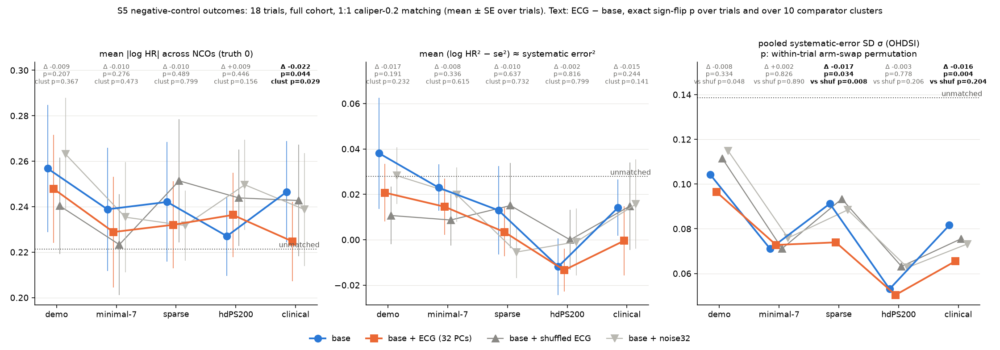
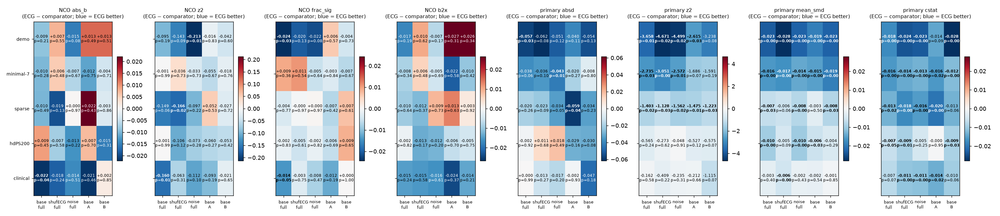

# S5 — negative-control outcomes across PS set points (v1.6 exploratory sweep)

Script `scripts/v16/s5_nco.py` (NCO extraction `scripts/v16/s5_nco_extract.py`); aggregates in `/mnt/raid0/rbc58/ecg-tte/audits/claude-v16-s5-nco/`. Exploratory and post hoc (docs/V16_SWEEP_PLAN.md guardrails). Aggregates only; event counts 1–10 shown as <11.

## Key findings (plain language)

**Short answer: no robust evidence. Adding the ECG does not reliably move negative-control HRs toward the null.** The direction mostly favours ECG. The only nominally significant signals are at the *clinical* rung (and for the pooled σ at sparse). None of them passes all of these: placebo-specific in test (not just in direction), FDR, comparator clustering, and both split halves.

1. **NCO systematic error is small and noise dominates.** Setup: 18 trials, median 26 eligible NCOs per trial (range 13–35; out of 37 candidates, after pharmacological exclusions and the ≥ 30-event rule). Unmatched: mean |log HR_NCO| = 0.221, but mean (b² − se²) is only 0.028 and the pooled OHDSI σ = 0.139. Any PS matching cuts σ to 0.05–0.10 (hdPS200 lowest, 0.053). Mean |log HR| gets *larger*, though (0.23–0.26), because the matched samples are smaller. So per-trial NCO metrics have low power, and differences of ~0.01 in log HR are within noise.
2. **Thin bases (demo, minimal-7), where ECG gives the largest held-out balance gains (S1): no NCO gain.** ECG − base mean |log HR_NCO| −0.009 (10/18, p = 0.21) and −0.010 (p = 0.28). The same holds for b² − se² (p = 0.19 and 0.34), fixed-SE z² (p = 0.68 and 0.35) and pooled σ (−0.008, p = 0.33; +0.002, p = 0.83). One exception: demo "fraction of CIs excluding 1" is −0.024 (p = 0.026, cluster p = 0.031), but q = 0.12 and both halves go the wrong way (+0.006, −0.004).
3. **Sparse: only the pooled σ moves.** Pooled σ 0.091 → 0.074 (−0.017, arm-swap permutation p = 0.034; BH over the 5 rungs: sparse σ q = 0.085; clinical σ q = 0.020). It beats shufECG (p = 0.008), but noise only marginally (p = 0.064), and it is not significant in either half (A p = 0.89, B p = 0.48). Per-trial metrics are null: |log HR| p = 0.49, z² −0.149 (p = 0.056), fixed-SE z² p = 0.13. In the strict NCO set, z² −0.205 (p = 0.018, q = 0.045) is placebo-specific (ECG − shufECG p = 0.007), but cluster p = 0.18 and the halves disagree (A +0.086, B −0.034).
4. **hdPS200: null.** No NCO metric reaches p < 0.05; the closest is EASE +0.014 (p = 0.067), with ECG worse. Shuffled ECG and noise are *worse* than base here (for example shufECG EASE +0.022, p = 0.005).
5. **Clinical: the strongest, but not ECG-specific in test and not replicated.**
   - Mean |log HR_NCO| 0.246 → 0.225 (−0.022, 12/18, p = 0.044, cluster p = 0.029, q = 0.22).
   - z² −0.160 (14/18, p = 0.007, q = 0.036, cluster p = 0.041). But shufECG also lowers z² (−0.097, p = 0.026), and ECG − shufECG gives p = 0.31. The fixed-SE z² is −0.143 (p = 0.028, q = 0.14).
   - Pooled σ 0.082 → 0.065 (p = 0.004), yet ECG − shufECG p = 0.20 and ECG − noise p = 0.09.
   - Halves: every clinical metric has p ≥ 0.18 in each half.
   - Strict set (caution NCOs dropped): the gain is larger (|log HR| −0.029, p = 0.009, q = 0.047, cluster p = 0.014; b² − se² −0.024, p = 0.021). In the ≥ 20-events-per-arm set it weakens (|log HR| p = 0.10).
   - Read this as suggestive only.
6. **Placebo guardrail.** Across 60 placebo − base tests, 2 are better and 7 worse at p < 0.05 (about 1.5 of each expected). ECG − base is better at p < 0.05 in 7/30 tests and worse in 0/30. BH within metric over the 5 rungs leaves only clinical z² in the main set (q = 0.036). Over the whole family (5 rungs × 6 metrics, column q_bh_family) nothing in the main set survives (smallest q = 0.20). In the strict set, clinical z², fixed-SE z² and fraction of CIs excluding 1 survive (family q 0.036–0.039) within the strict set only. Over all three NCO sets (90 tests) nothing survives (min q 0.107). In the ≥ 20-per-arm set nothing does. With the v2b strict set (extra CCB/AAD/THZ cautions, below) the same three survive within the strict set (family q 0.032–0.039).
7. **NCO-calibrated primary estimates: ECG does not help any more (or less) after calibration.** Calibration mostly widens CIs, because the fitted systematic-error means are near 0 (pooled |μ| ≤ 0.024).
   - Pooled leave-one-trial-out calibration keeps the pre-calibration picture: demo |Δlog HR| vs RCT −0.058 (p = 0.030; shuffled-benchmark p = 0.038), and z² −1.56 (p = 0.024) is *not* benchmark-specific (shuffled p = 0.42). Minimal-7 is borderline (|Δ| −0.039, p = 0.056; z² −1.67, p = 0.042, shuffled p = 0.54). Sparse, hdPS200 and clinical are null.
   - With each trial's own NCO fit, demo |Δ| is −0.091 (p = 0.009, shuffled p = 0.032), but both halves are null (A p = 0.76, B p = 0.27).
   - At clinical, own-NCO calibration makes ECG look worse on z² (+0.67, p = 0.028), because its smaller σ widens CIs less.
   - With own-NCO calibration, demo z² −3.79 (p = 0.018) is benchmark-specific (shuffled p = 0.002). Sparse own-calibrated z² is −1.40 (p = 0.22, shuffled p = 0.004). Own calibration changes each arm's se* through its own noisy σ (13–35 NCOs), so this is not clean agreement evidence. The halves are null.
8. **Bottom line (uninformative, not null).** Negative controls give no placebo-specific, replicated evidence that the AI-ECG reduces residual confounding at any PS set point. The held-out-balance gains at thin bases (S1) do not show up as less NCO bias. The only hints are at the richest (clinical) PS and in the sparse σ. The 80% minimum detectable change in pooled σ is about 0.02 (about 22% of base σ). The per-trial noise-corrected metric cannot detect even complete removal of systematic error at sparse/clinical. S5 is uninformative about ECG effects of the size seen in balance, not evidence of no effect.

## Design

- **Why NCOs.** A negative-control outcome has a known truth (HR = 1, log HR = 0) for the drug contrast, so any non-zero NCO HR after adjustment is systematic error (residual confounding, detection or selection bias). Unlike RCT agreement (AUDIT_V16 check 11, where ECG gains were mostly generic shrinkage toward the null), moving NCO HRs toward 0 *is* the correct direction, so it directly tests confounding reduction.
- **NCOs.** 25 v1.3 NCOs (`trial_specs.NCO_EXT`: 3 frozen protocol-v1 NCOs + 22 from amendment I8) plus 12 new v1.6 NCOs extracted with identical conventions (`s5_nco_extract.py`; re-extraction of C44 and K02 reproduces the v1.3 file exactly in all 18 trials): hearing_loss (H90/H91), benign_skin_neoplasm (D22/D23), cholelithiasis (K80), appendicitis (K35), radiculopathy (M541/M511), knee_oa (M17), hip_oa (M16), actinic_keratosis (L570), lateral_epicondylitis (M771), blepharitis (H010), de_quervain (M654), low_back_pain (M545).
- **Outcome conventions (same as v1.3 / primary).** First diagnosis (or procedure) strictly after index; patients with the code in the 365 d before or on index are removed for that NCO; death censors; follow-up from index capped at the trial horizon (same as the primary outcome); primary-outcome exclusions (exclude_phase2, missing primary time) applied.
- **Eligibility** (fixed on the full unmatched cohort, before matching): pooled events ≥ 30 at the horizon and no pharmacological exclusion (main set). Sensitivity sets: *strict* (also drops caution NCOs) and *≥ 20 events per arm*. Within a trial × half, only NCOs estimable in all 21 arms are used, so every arm is compared on the same NCOs.
- **Arms.** Rungs demo, minimal-7, sparse, hdPS200, clinical (S1 definitions, `s1_ladder.base_designs`), each as base, +ECG (32 BCL PCs), +shufECG (same PCs, rows permuted with `T.shuffle_perm`), +noise32 (`T.noise32`); plus unmatched. Matched sets replicate `E.run_cell` (L2 C=1 PS, 1:1 greedy caliper 0.2). The primary Cox reproduced S1's run_cell output exactly (see Audit).
- **NCO estimation.** Cox (lifelines, Efron) on the matched set with pair-clustered robust SE, exactly as v13_design.
- **Metrics per trial × rung × arm** (over that trial's NCOs): mean |log HR|; mean z² = b²/se²; fraction of 95% CIs excluding 1; mean (b² − se²) (a noise-corrected estimate of mean squared systematic error); per-trial OHDSI systematic-error fit b ~ N(μ, σ² + se²) and its EASE = E|N(μ, σ²)|. Pooled across trials: μ, σ, EASE from all trial-NCO estimates.
- **Inference.** Exact sign-flip over 18 trials on per-trial (ECG − base), (ECG − shufECG), (ECG − noise); clustered sign-flip over 10 comparator clusters (`audit_v16.CLUSTER`); leave-one-trial-out; halves A/B (seeded split, 16060 + trial index, eligibility from the full cohort). BH-FDR within metric over the 5 rungs (ECG vs base, full) and over all 25 rung × metric tests (column q_bh_family in the CSV). ECG-specific = ECG vs base p < 0.05, ECG better, and ECG better than both placebos in direction.
- **Calibration.** Each primary log HR is calibrated with a simplified OHDSI model (constant μ, σ; not the se-dependent systematic-error model) using its own arm's NCO systematic-error fit (b* = b − μ, se* = √(se² + σ²); trial-specific fit if ≥ 8 NCOs else pooled over the other trials, same rung/arm/half) and, as a variant, always with the leave-this-trial-out pooled fit. Agreement with the RCT (|Δlog HR|, z²) is re-evaluated, with the shuffled-benchmark null of AUDIT_V16 check 11 (RCT HRs permuted across trials, 2000 draws; p = P(null ≤ observed)).

### NCO inventory per trial

| trial | drug classes | NCOs main | NCOs strict | NCOs ≥20/arm | hard exclusions | cautions (strict set drops) |
|---|---|---|---|---|---|---|
| comet | BB (both) | 29 | 29 | 23 | – | – |
| paradigm-hf-seq | ARNI vs ACEi | 21 | 21 | 8 | allergic_rhinitis | – |
| transform-hf | LOOP (both) | 16 | 14 | 3 | hearing_loss | skin_cancer, actinic_keratosis |
| elite-ii | ARB vs ACEi | 13 | 13 | 8 | allergic_rhinitis | – |
| life | ARB vs BB | 27 | 27 | 19 | – | – |
| plato | P2Y12 (both) | 18 | 17 | 12 | – | cataract, hernia |
| aristotle | OAC (both) | 30 | 28 | 20 | – | cataract, hernia |
| rocket-af | OAC (both) | 23 | 21 | 20 | – | cataract, hernia |
| rely | OAC (both) | 17 | 16 | 5 | – | cataract, hernia |
| allhat | CCB vs THZ | 33 | 32 | 31 | carpal_tunnel, dental_caries, skin_cancer, actinic_keratosis | plantar_fasciitis |
| emperor-preserved-v2 | SGLT2 vs DPP4 | 15 | 12 | 6 | cholelithiasis, allergic_rhinitis | onychomycosis, knee_oa, hip_oa, rotator_cuff |
| east-afnet4 | AAD vs BB | 30 | 28 | 24 | skin_cancer, actinic_keratosis, cataract | conjunctivitis, carpal_tunnel |
| cabana-v2 | ABL vs AAD | 30 | 28 | 14 | hernia, skin_cancer, actinic_keratosis, cataract | conjunctivitis, carpal_tunnel |
| ontarget | ARB vs ACEi | 34 | 34 | 32 | allergic_rhinitis | – |
| value | ARB vs CCB | 35 | 34 | 34 | carpal_tunnel, dental_caries | plantar_fasciitis |
| ascot | CCB vs BB | 35 | 34 | 34 | carpal_tunnel, dental_caries | plantar_fasciitis |
| empa-reg | SGLT2 vs DPP4 | 25 | 21 | 24 | cholelithiasis, allergic_rhinitis | onychomycosis, knee_oa, hip_oa, rotator_cuff |
| carolina | DPP4 vs SU | 16 | 11 | 11 | cholelithiasis, allergic_rhinitis | knee_oa, hip_oa, rotator_cuff, skin_cancer, actinic_keratosis |

Exclusion rationale (hard): **ACEi** – allergic_rhinitis (ACEi/ARNI bradykinin rhinitis and cough can be coded as rhinitis); **ARNI** – allergic_rhinitis (ACEi/ARNI bradykinin rhinitis and cough can be coded as rhinitis); **CCB** – carpal_tunnel (dihydropyridine CCB peripheral oedema (median-nerve compression)), dental_caries (CCB gingival hyperplasia (dental visits / plaque)); **THZ** – skin_cancer (thiazide photosensitivity; HCTZ-NMSC association), actinic_keratosis (thiazide photosensitivity); **LOOP** – hearing_loss (loop-diuretic ototoxicity (furosemide vs torsemide potency/dosing)); **AAD** – skin_cancer (amiodarone photosensitivity), actinic_keratosis (amiodarone photosensitivity), cataract (amiodarone lens/corneal deposits and eye monitoring); **ABL** – hernia (femoral venous access for ablation (groin complications / exam)); **DPP4** – cholelithiasis (DPP-4 inhibitor gallbladder/biliary signal), allergic_rhinitis (DPP-4 inhibitor nasopharyngitis / upper-airway adverse events).

Cautions (kept in main, dropped in strict): **OAC** – cataract (elective surgery timing around anticoagulation (warfarin bridging)), hernia (elective surgery timing around anticoagulation (warfarin bridging)); **P2Y12** – cataract (elective surgery deferred on potent antiplatelet therapy), hernia (elective surgery deferred on potent antiplatelet therapy); **DPP4** – knee_oa (DPP-4 inhibitor arthralgia warning), hip_oa (DPP-4 inhibitor arthralgia warning), rotator_cuff (DPP-4 inhibitor arthralgia warning); **SGLT2** – onychomycosis (glycosuria-related fungal infection (dermatophyte, weak)), knee_oa (weight loss), hip_oa (weight loss); **LOOP** – skin_cancer (furosemide photosensitivity (weak)), actinic_keratosis (furosemide photosensitivity (weak)); **SU** – skin_cancer (sulfonylurea photosensitivity (rare)), actinic_keratosis (sulfonylurea photosensitivity (rare)); **AAD** – conjunctivitis (amiodarone ocular effects), carpal_tunnel (amiodarone neuropathy); **CCB** – plantar_fasciitis (peripheral oedema (weak)).

**v2b cautions (AUDIT_V16_ROUND2 §3, 2026-09-27; `s5_nco.py` CAUTION_CLASS, re-run `scripts/v16/s5_strict_v2b.py`, outputs `claude-v16-s5-nco-v2b/`).** Added to the strict set only (the main set is unchanged): **NDCCB** (EAST-AFNET4 rate control includes diltiazem/verapamil, `trial_specs.RATE_CONTROL`) – dental_caries (gingival hyperplasia), plantar_fasciitis and carpal_tunnel (oedema); **AAD** (EAST-AFNET4, CABANA-v2) – blepharitis, chalazion, pterygium (amiodarone eye monitoring raises ascertainment), benign_skin_neoplasm, seborrheic_keratosis (dermatology surveillance under a photosensitising drug); **THZ** (ALLHAT) – benign_skin_neoplasm, seborrheic_keratosis. Strict-set NCOs per trial change only in EAST-AFNET4 (28 → 23), CABANA-v2 (28 → 25) and ALLHAT (32 → 30). Strict-set ECG − base (full cohort), v2 → v2b: clinical z² −0.199 (p = 0.0024, family q 0.036) → −0.212 (14/18, p = 0.0022, q 0.032); clinical fixed-SE z² −0.198 (p = 0.0013) → −0.212 (p = 0.0011, q 0.032); clinical fraction of CIs excluding 1 q 0.039 → 0.039; clinical \|log HR\| −0.029 (p = 0.009) → −0.030 (p = 0.011, q 0.084); sparse z² −0.205 (p = 0.018) → −0.209 (p = 0.019, family q 0.107). So the strict-set conclusions do not change. They are still within-set only: nothing survives BH over the three NCO sets. Warfarin INR-clinic contact in the three DOAC trials is a differential post-index ascertainment route for every visit-detected NCO. A baseline ECG cannot correct it, so those trials dilute any ECG signal.

Not used anywhere (not in the candidate list by design): bleeding and bleeding-adjacent outcomes (anticoagulant/antiplatelet trials), gout, angioedema/cough, hypoglycaemia, genital infection/UTI, ketoacidosis, fractures/falls/syncope/sprains, hyperkalaemia, oedema.

Classes: BB beta-blocker, ARNI sacubitril/valsartan, ACEi, ARB, LOOP loop diuretic, P2Y12 inhibitor, OAC (DOAC vs warfarin), CCB amlodipine, THZ thiazide, SGLT2i, DPP4i, SU sulfonylurea, AAD antiarrhythmic (incl. amiodarone), ABL catheter ablation.

### NCO events at the horizon, full unmatched cohort (treated/comparator; – = pharmacologically excluded or pooled events < 30 in that trial, not estimated)

| NCO | comet | paradigm-hf-seq | transform-hf | elite-ii | life | plato | aristotle | rocket-af | rely | allhat | emperor-preserved-v2 | east-afnet4 | cabana-v2 | ontarget | value | ascot | empa-reg | carolina |
|---|---|---|---|---|---|---|---|---|---|---|---|---|---|---|---|---|---|---|
| cataract | 50/85 | 13/54 | <11/79 | <11/24 | 36/49 | 16/18 | 142/56 | 48/62 | 13/67 | 486/239 | 19/17 | – | – | 148/208 | 190/384 | 340/288 | 55/64 | 20/19 |
| hernia | 30/36 | <11/20 | <11/47 | – | 16/17 | – | 91/11 | 24/11 | – | 182/69 | – | 28/128 | – | 70/85 | 90/142 | 123/129 | – | – |
| skin_cancer | 94/100 | 19/69 | <11/185 | 22/35 | 40/60 | 49/35 | 458/113 | 108/125 | 30/131 | – | 23/18 | – | – | 267/287 | 372/553 | 354/464 | 56/60 | 22/28 |
| ingrown_nail | 11/24 | – | <11/28 | – | – | – | 30/12 | – | – | 106/57 | – | 18/64 | <11/59 | 35/38 | 32/101 | 105/67 | 19/11 | – |
| otitis_externa | 22/37 | – | 0/36 | – | 15/17 | – | 47/<11 | – | – | 127/68 | – | 19/82 | <11/64 | 55/68 | 81/114 | 139/127 | 33/20 | – |
| seborrheic_keratosis | 72/82 | 11/51 | <11/118 | 21/22 | 51/84 | 44/31 | 299/73 | 102/74 | <11/77 | 722/390 | 28/18 | 125/454 | 70/404 | 261/269 | 389/616 | 530/610 | 71/70 | 37/39 |
| carpal_tunnel | 35/64 | 17/48 | 12/86 | – | 35/40 | 31/16 | 141/31 | 36/34 | <11/35 | – | 32/<11 | 66/203 | 31/147 | 174/186 | – | – | 64/49 | 21/30 |
| plantar_fasciitis | 18/23 | – | <11/33 | – | 14/19 | – | 51/<11 | – | – | 169/90 | – | 23/88 | 16/73 | 68/70 | 108/162 | 214/162 | 35/30 | – |
| conjunctivitis | 34/60 | <11/62 | <11/89 | – | 22/23 | 17/15 | 106/26 | 23/27 | <11/31 | 300/105 | 20/12 | 59/196 | 15/141 | 98/132 | 130/266 | 302/227 | 48/47 | – |
| allergic_rhinitis | 93/124 | – | 13/223 | – | 73/90 | 55/50 | 345/51 | 102/56 | 15/56 | 762/447 | – | 142/487 | 53/408 | – | 468/724 | 832/637 | – | – |
| lipoma | 24/36 | <11/26 | <11/62 | – | 25/39 | – | 99/23 | 37/24 | – | 293/159 | – | 42/181 | 18/143 | 115/118 | 163/252 | 270/232 | 37/35 | 17/14 |
| contact_dermatitis | 38/42 | <11/33 | <11/99 | – | 22/35 | 17/15 | 113/40 | 32/42 | <11/43 | 296/134 | 21/14 | 58/222 | 21/174 | 121/129 | 165/266 | 283/261 | 47/43 | 17/16 |
| acne | 13/17 | – | – | – | – | – | 45/<11 | – | – | 96/62 | – | 19/67 | <11/45 | 40/31 | 58/83 | 99/106 | – | – |
| warts | – | – | – | – | <11/21 | – | 56/13 | – | – | 128/68 | – | 28/105 | 13/81 | 50/39 | 77/115 | 123/121 | – | – |
| onychomycosis | 69/102 | 26/104 | 13/156 | 19/24 | 36/60 | 40/26 | 177/79 | 46/82 | 12/82 | 458/263 | 33/28 | 88/340 | 23/237 | 179/230 | 218/449 | 411/319 | 99/92 | 34/25 |
| epidermal_cyst | 27/34 | – | <11/31 | – | 15/25 | – | 76/23 | 24/23 | – | 233/119 | – | 49/133 | 19/116 | 79/78 | 111/180 | 196/195 | 23/24 | – |
| rotator_cuff | 19/36 | 15/31 | <11/54 | – | 26/44 | 21/13 | 118/16 | 23/17 | – | 275/144 | – | 42/184 | 22/131 | 100/104 | 148/252 | 239/225 | 41/52 | 19/17 |
| trigger_finger | 17/27 | – | – | – | 21/18 | – | 41/<11 | – | – | 168/86 | – | 29/86 | 12/61 | 75/72 | 109/141 | 157/134 | 27/25 | – |
| dupuytren | – | – | – | – | – | – | – | – | – | 53/18 | – | <11/28 | <11/29 | 23/23 | 30/48 | 40/38 | – | – |
| cerumen | 54/62 | 20/57 | <11/121 | 22/12 | 25/41 | 27/14 | 159/38 | 40/39 | <11/39 | 426/192 | 23/15 | 60/281 | 23/214 | 162/188 | 196/338 | 287/265 | 49/49 | 24/19 |
| pterygium | – | – | – | – | – | – | – | – | – | 22/<11 | – | – | – | – | 15/29 | 34/17 | – | – |
| ganglion | – | – | – | – | – | – | – | – | – | 70/52 | – | 12/43 | <11/33 | 26/20 | 45/81 | 95/56 | – | – |
| hallux_valgus | 20/26 | <11/32 | <11/45 | – | 12/25 | – | 47/16 | 17/17 | – | 166/77 | – | 22/104 | <11/62 | 44/71 | 87/147 | 163/117 | 26/24 | – |
| chalazion | – | – | – | – | – | – | – | – | – | 48/23 | – | – | – | – | 22/38 | 45/35 | – | – |
| dental_caries | 40/45 | <11/44 | <11/64 | – | 13/22 | – | 63/12 | – | – | – | – | 28/138 | <11/85 | 51/79 | – | – | 32/32 | – |
| hearing_loss | 139/186 | 37/191 | – | 60/67 | 82/108 | 77/82 | 629/153 | 149/159 | 28/160 | 1273/541 | 71/40 | 210/860 | 63/616 | 474/509 | 568/975 | 663/674 | 146/174 | 59/65 |
| benign_skin_neoplasm | 66/84 | <11/53 | <11/107 | 15/15 | 48/75 | 53/24 | 256/57 | 88/61 | <11/63 | 644/363 | 28/11 | 114/412 | 76/358 | 228/244 | 369/540 | 542/609 | 74/65 | 30/32 |
| cholelithiasis | 164/205 | 47/182 | 27/432 | 50/65 | 53/108 | 85/45 | 520/157 | 114/171 | 21/181 | 871/404 | – | 236/734 | 59/640 | 335/451 | 379/755 | 625/603 | – | – |
| appendicitis | – | – | – | – | – | – | 26/<11 | – | – | 55/34 | – | <11/51 | <11/35 | 16/19 | 28/51 | 58/50 | – | – |
| radiculopathy | 95/159 | 42/121 | 18/220 | 27/32 | 96/111 | 77/42 | 360/72 | 107/77 | 13/83 | 1058/589 | 50/26 | 140/626 | 74/415 | 422/458 | 598/899 | 973/910 | 156/123 | 72/54 |
| knee_oa | 158/238 | 72/233 | 27/357 | 42/62 | 123/156 | 74/49 | 663/118 | 188/122 | 27/131 | 1484/802 | 105/56 | 249/918 | 104/692 | 580/608 | 792/1288 | 1227/1057 | 209/194 | 88/79 |
| hip_oa | 113/145 | 38/159 | 13/240 | 34/44 | 86/111 | 47/32 | 413/97 | 104/98 | 17/104 | 969/535 | 70/38 | 145/663 | 66/461 | 343/396 | 459/813 | 732/697 | 141/111 | 53/46 |
| actinic_keratosis | 62/63 | 11/55 | <11/125 | 15/28 | 32/44 | 36/20 | 278/71 | 78/75 | 15/80 | – | 20/12 | – | – | 206/210 | 291/440 | 322/419 | 60/44 | 21/24 |
| lateral_epicondylitis | – | – | – | – | – | – | – | – | – | 27/26 | – | – | <11/24 | 25/22 | 39/35 | 47/62 | – | – |
| blepharitis | 17/16 | – | <11/42 | – | – | – | 75/24 | 21/24 | <11/25 | 162/81 | – | 28/123 | 14/93 | 59/65 | 75/121 | 109/139 | 24/24 | – |
| de_quervain | – | – | – | – | – | – | – | – | – | 36/23 | – | – | – | 16/21 | 29/34 | 58/40 | – | – |
| low_back_pain | 263/379 | 102/375 | 36/744 | 78/91 | 160/256 | 183/122 | 1010/235 | 231/251 | 43/264 | 2263/1173 | 143/102 | 371/1557 | 126/1111 | 864/990 | 1078/2063 | 2003/1726 | 345/315 | 147/129 |

## Results

### Levels (full cohort; mean over trials; pooled = OHDSI fit over all trial-NCO estimates)

| rung | arm | trials | mean_NCOs | mean_abs_logHR | mean_z2 | pct_CI_excl_1 | mean_b2_minus_se2 | pooled_mu | pooled_sigma | pooled_EASE |
|---|---|---|---|---|---|---|---|---|---|---|
| unmatched | unmatched | 18 | 24.833 | 0.221 | 1.974 | 13.863 | 0.028 | -0.004 | 0.139 | 0.111 |
| demo | base | 18 | 24.833 | 0.257 | 1.455 | 10.289 | 0.038 | 0.007 | 0.104 | 0.083 |
| demo | ECG | 18 | 24.833 | 0.248 | 1.359 | 7.850 | 0.021 | 0.008 | 0.097 | 0.077 |
| demo | shufECG | 18 | 24.833 | 0.240 | 1.502 | 9.882 | 0.011 | 0.001 | 0.111 | 0.089 |
| demo | noise | 18 | 24.833 | 0.263 | 1.572 | 10.021 | 0.028 | 0.001 | 0.115 | 0.092 |
| minimal-7 | base | 18 | 24.833 | 0.239 | 1.296 | 8.449 | 0.023 | 0.003 | 0.071 | 0.057 |
| minimal-7 | ECG | 18 | 24.833 | 0.229 | 1.295 | 9.365 | 0.015 | 0.002 | 0.073 | 0.058 |
| minimal-7 | shufECG | 18 | 24.833 | 0.223 | 1.259 | 8.287 | 0.009 | -0.003 | 0.071 | 0.057 |
| minimal-7 | noise | 18 | 24.833 | 0.235 | 1.328 | 9.903 | 0.020 | -0.002 | 0.076 | 0.061 |
| sparse | base | 18 | 24.833 | 0.242 | 1.307 | 7.684 | 0.013 | 0.008 | 0.091 | 0.073 |
| sparse | ECG | 18 | 24.833 | 0.232 | 1.158 | 7.309 | 0.003 | 0.013 | 0.074 | 0.060 |
| sparse | shufECG | 18 | 24.833 | 0.251 | 1.324 | 7.358 | 0.015 | 0.014 | 0.093 | 0.075 |
| sparse | noise | 18 | 24.833 | 0.232 | 1.255 | 7.260 | -0.005 | 0.013 | 0.088 | 0.071 |
| hdPS200 | base | 18 | 24.833 | 0.227 | 1.047 | 5.042 | -0.012 | 0.015 | 0.053 | 0.044 |
| hdPS200 | ECG | 18 | 24.833 | 0.236 | 1.048 | 4.870 | -0.013 | 0.008 | 0.050 | 0.041 |
| hdPS200 | shufECG | 18 | 24.833 | 0.244 | 1.154 | 5.374 | -0.000 | 0.024 | 0.063 | 0.054 |
| hdPS200 | noise | 18 | 24.833 | 0.250 | 1.121 | 5.056 | -0.001 | 0.014 | 0.063 | 0.051 |
| clinical | base | 18 | 24.833 | 0.246 | 1.255 | 7.756 | 0.014 | 0.002 | 0.082 | 0.065 |
| clinical | ECG | 18 | 24.833 | 0.225 | 1.094 | 6.333 | -0.000 | 0.011 | 0.065 | 0.053 |
| clinical | shufECG | 18 | 24.833 | 0.243 | 1.157 | 6.645 | 0.015 | 0.007 | 0.076 | 0.061 |
| clinical | noise | 18 | 24.833 | 0.239 | 1.206 | 7.101 | 0.016 | 0.010 | 0.073 | 0.059 |

### ECG vs base and placebos on NCO metrics (main NCO set)

| rung | metric | ECG−base d | k | p | q (BH, metric) | cluster p (k) | LOO p range | shuf−base d (p) | noise−base d (p) | ECG−shuf p | ECG−noise p | half A d (p) | half B d (p) | ECG-specific |
|---|---|---|---|---|---|---|---|---|---|---|---|---|---|---|
| demo | mean |log HR_NCO| | -0.009 | 10/18 | 0.207 | 0.460 | 0.367 (5/10) | 0.136–0.413 | -0.016 (0.326) | +0.006 (0.515) | 0.549 | 0.079 | +0.013 (0.486) | +0.013 (0.508) | no |
| demo | mean z² (b²/se²) | -0.095 | 10/18 | 0.191 | 0.318 | 0.299 (6/10) | 0.069–0.367 | +0.048 (0.436) | +0.117 (0.037) | 0.087 | 0.007 | -0.016 (0.835) | -0.042 (0.603) | no |
| demo | mean b²/se_base² (fixed SE) | -0.027 | 9/18 | 0.681 | 0.681 | 0.904 (4/10) | 0.277–0.982 | +0.030 (0.667) | +0.123 (0.036) | 0.478 | 0.045 | +0.082 (0.337) | +0.049 (0.642) | no |
| demo | fraction 95% CI excl. 1 | -0.024 | 8/18 | 0.026 | 0.117 | 0.031 (6/10) | 0.014–0.053 | -0.004 (0.749) | -0.003 (0.822) | 0.129 | 0.082 | +0.006 (0.570) | -0.004 (0.733) | yes |
| demo | mean (b² − se²) | -0.017 | 10/18 | 0.191 | 0.560 | 0.232 (5/10) | 0.098–0.381 | -0.027 (0.423) | -0.010 (0.592) | 0.622 | 0.168 | +0.027 (0.308) | +0.026 (0.343) | no |
| demo | trial EASE (E|syst. error|) | -0.020 | 15/18 | 0.038 | 0.096 | 0.127 (8/10) | 0.005–0.076 | -0.005 (0.568) | +0.006 (0.540) | 0.280 | 0.030 | +0.005 (0.829) | +0.001 (0.962) | yes |
| demo | mean log(se/se_base) (precision) | 0.000 | 8/18 | 0.969 | 0.969 | 0.990 (5/10) | 0.595–0.993 | -0.012 (0.058) | -0.002 (0.618) | 0.140 | 0.697 | +0.014 (0.107) | +0.012 (0.126) | no |
| minimal-7 | mean |log HR_NCO| | -0.010 | 10/18 | 0.276 | 0.460 | 0.473 (5/10) | 0.133–0.527 | -0.016 (0.158) | -0.003 (0.684) | 0.479 | 0.671 | -0.012 (0.746) | -0.004 (0.708) | no |
| minimal-7 | mean z² (b²/se²) | -0.001 | 9/18 | 0.991 | 0.991 | 0.613 (4/10) | 0.461–0.974 | -0.037 (0.536) | +0.032 (0.571) | 0.725 | 0.728 | -0.055 (0.670) | -0.018 (0.759) | no |
| minimal-7 | mean b²/se_base² (fixed SE) | 0.061 | 7/18 | 0.346 | 0.577 | 0.717 (2/10) | 0.077–0.622 | -0.031 (0.610) | +0.053 (0.314) | 0.275 | 0.938 | +0.015 (0.904) | +0.073 (0.389) | no |
| minimal-7 | fraction 95% CI excl. 1 | 0.009 | 4/18 | 0.357 | 0.596 | 0.484 (3/10) | 0.158–0.588 | -0.002 (0.938) | +0.015 (0.229) | 0.543 | 0.644 | -0.003 (0.844) | -0.007 (0.674) | no |
| minimal-7 | mean (b² − se²) | -0.008 | 10/18 | 0.336 | 0.560 | 0.615 (5/10) | 0.161–0.663 | -0.014 (0.206) | -0.003 (0.758) | 0.481 | 0.688 | -0.022 (0.578) | -0.010 (0.422) | no |
| minimal-7 | trial EASE (E|syst. error|) | 0.011 | 9/18 | 0.375 | 0.375 | 0.600 (5/10) | 0.276–0.751 | +0.004 (0.388) | +0.005 (0.630) | 0.581 | 0.699 | -0.005 (0.774) | -0.003 (0.827) | no |
| minimal-7 | mean log(se/se_base) (precision) | 0.009 | 6/18 | 0.231 | 0.385 | 0.055 (3/10) | 0.035–0.452 | -0.003 (0.449) | -0.003 (0.430) | 0.017 | 0.047 | +0.014 (0.036) | +0.017 (0.036) | no |
| sparse | mean |log HR_NCO| | -0.010 | 11/18 | 0.489 | 0.489 | 0.799 (5/10) | 0.262–0.975 | +0.009 (0.258) | -0.010 (0.754) | 0.135 | 0.973 | +0.022 (0.430) | -0.003 (0.856) | no |
| sparse | mean z² (b²/se²) | -0.149 | 13/18 | 0.056 | 0.141 | 0.350 (7/10) | 0.011–0.104 | +0.017 (0.774) | -0.052 (0.560) | 0.024 | 0.223 | +0.052 (0.529) | -0.027 (0.718) | no |
| sparse | mean b²/se_base² (fixed SE) | -0.103 | 11/18 | 0.134 | 0.335 | 0.598 (6/10) | 0.033–0.227 | +0.075 (0.239) | -0.037 (0.699) | 0.024 | 0.434 | +0.143 (0.133) | +0.026 (0.767) | no |
| sparse | fraction 95% CI excl. 1 | -0.004 | 5/18 | 0.772 | 0.828 | 0.750 (2/10) | 0.527–0.984 | -0.003 (0.747) | -0.004 (0.766) | 0.971 | 0.972 | -0.007 (0.422) | +0.007 (0.614) | no |
| sparse | mean (b² − se²) | -0.010 | 10/18 | 0.637 | 0.796 | 0.732 (5/10) | 0.435–0.757 | +0.002 (0.802) | -0.018 (0.799) | 0.368 | 0.732 | +0.013 (0.633) | +0.003 (0.919) | no |
| sparse | trial EASE (E|syst. error|) | -0.018 | 12/18 | 0.097 | 0.122 | 0.334 (7/10) | 0.015–0.177 | -0.000 (0.964) | -0.002 (0.852) | 0.135 | 0.128 | -0.002 (0.894) | +0.004 (0.827) | no |
| sparse | mean log(se/se_base) (precision) | 0.010 | 7/18 | 0.171 | 0.385 | 0.357 (3/10) | 0.044–0.324 | +0.007 (0.183) | -0.001 (0.915) | 0.747 | 0.035 | +0.008 (0.243) | -0.005 (0.616) | no |
| hdPS200 | mean |log HR_NCO| | 0.009 | 10/18 | 0.446 | 0.489 | 0.156 (4/10) | 0.286–0.799 | +0.017 (0.128) | +0.023 (0.008) | 0.584 | 0.222 | +0.007 (0.698) | -0.015 (0.308) | no |
| hdPS200 | mean z² (b²/se²) | 0.001 | 8/18 | 0.991 | 0.991 | 0.484 (4/10) | 0.610–0.995 | +0.106 (0.027) | +0.073 (0.141) | 0.121 | 0.282 | -0.060 (0.265) | -0.053 (0.418) | no |
| hdPS200 | mean b²/se_base² (fixed SE) | 0.039 | 8/18 | 0.504 | 0.630 | 0.227 (3/10) | 0.243–0.794 | +0.135 (0.009) | +0.112 (0.044) | 0.191 | 0.288 | +0.015 (0.814) | -0.007 (0.928) | no |
| hdPS200 | fraction 95% CI excl. 1 | -0.002 | 4/18 | 0.828 | 0.828 | 0.938 (3/10) | 0.531–1.000 | +0.003 (0.771) | +0.000 (0.992) | 0.613 | 0.818 | -0.006 (0.690) | +0.009 (0.651) | no |
| hdPS200 | mean (b² − se²) | -0.002 | 11/18 | 0.816 | 0.816 | 0.799 (5/10) | 0.350–0.999 | +0.012 (0.115) | +0.011 (0.122) | 0.172 | 0.197 | -0.006 (0.699) | -0.005 (0.749) | no |
| hdPS200 | trial EASE (E|syst. error|) | 0.014 | 7/18 | 0.067 | 0.111 | 0.070 (2/10) | 0.010–0.126 | +0.022 (0.005) | +0.004 (0.673) | 0.294 | 0.339 | -0.003 (0.821) | -0.001 (0.927) | no |
| hdPS200 | mean log(se/se_base) (precision) | 0.011 | 6/18 | 0.042 | 0.210 | 0.086 (3/10) | 0.020–0.084 | +0.004 (0.383) | +0.007 (0.078) | 0.218 | 0.429 | +0.019 (0.021) | +0.000 (0.957) | no |
| clinical | mean |log HR_NCO| | -0.022 | 12/18 | 0.044 | 0.220 | 0.029 (8/10) | 0.010–0.088 | -0.004 (0.723) | -0.008 (0.610) | 0.242 | 0.506 | -0.021 (0.457) | +0.002 (0.854) | yes |
| clinical | mean z² (b²/se²) | -0.160 | 14/18 | 0.007 | 0.036 | 0.041 (8/10) | 0.001–0.014 | -0.097 (0.026) | -0.049 (0.478) | 0.312 | 0.100 | -0.093 (0.194) | -0.021 (0.645) | yes |
| clinical | mean b²/se_base² (fixed SE) | -0.143 | 14/18 | 0.028 | 0.141 | 0.033 (7/10) | <0.001–0.056 | -0.021 (0.763) | +0.007 (0.940) | 0.237 | 0.080 | -0.040 (0.616) | +0.023 (0.643) | yes |
| clinical | fraction 95% CI excl. 1 | -0.014 | 7/18 | 0.047 | 0.117 | 0.125 (4/10) | 0.016–0.094 | -0.011 (0.382) | -0.007 (0.637) | 0.754 | 0.473 | -0.012 (0.188) | +0.000 (1.000) | yes |
| clinical | mean (b² − se²) | -0.015 | 12/18 | 0.244 | 0.560 | 0.141 (6/10) | 0.029–0.486 | +0.001 (0.960) | +0.002 (0.933) | 0.578 | 0.609 | -0.024 (0.373) | -0.014 (0.206) | no |
| clinical | trial EASE (E|syst. error|) | -0.019 | 13/18 | 0.013 | 0.066 | 0.047 (7/10) | 0.005–0.026 | -0.023 (0.002) | -0.012 (0.240) | 0.702 | 0.507 | -0.009 (0.510) | +0.005 (0.765) | no |
| clinical | mean log(se/se_base) (precision) | 0.003 | 8/18 | 0.556 | 0.695 | 0.361 (4/10) | 0.167–0.854 | +0.008 (0.181) | +0.004 (0.446) | 0.457 | 0.802 | +0.015 (0.028) | +0.012 (0.014) | no |

### Sensitivity: strict NCO set (cautions dropped)

| rung | metric | ECG−base d | k | p | q (BH, metric) | cluster p (k) | LOO p range | shuf−base d (p) | noise−base d (p) | ECG−shuf p | ECG−noise p | half A d (p) | half B d (p) | ECG-specific |
|---|---|---|---|---|---|---|---|---|---|---|---|---|---|---|
| demo | mean |log HR_NCO| | -0.013 | 11/18 | 0.269 | 0.449 | 0.408 (5/10) | 0.101–0.538 | -0.022 (0.237) | +0.005 (0.551) | 0.497 | 0.117 | -0.000 (0.992) | +0.017 (0.387) | no |
| demo | mean z² (b²/se²) | -0.110 | 11/18 | 0.140 | 0.233 | 0.246 (6/10) | 0.044–0.263 | +0.026 (0.688) | +0.102 (0.033) | 0.114 | 0.009 | -0.083 (0.388) | -0.027 (0.745) | no |
| demo | mean b²/se_base² (fixed SE) | -0.047 | 12/18 | 0.507 | 0.698 | 0.686 (5/10) | 0.141–0.767 | +0.004 (0.960) | +0.108 (0.034) | 0.543 | 0.053 | +0.003 (0.974) | +0.075 (0.488) | no |
| demo | mean (b² − se²) | -0.023 | 9/18 | 0.170 | 0.283 | 0.246 (5/10) | 0.101–0.340 | -0.035 (0.281) | -0.012 (0.533) | 0.427 | 0.138 | +0.018 (0.502) | +0.029 (0.292) | no |
| minimal-7 | mean |log HR_NCO| | -0.007 | 10/18 | 0.468 | 0.585 | 0.770 (6/10) | 0.268–0.834 | -0.014 (0.199) | -0.001 (0.929) | 0.405 | 0.655 | -0.016 (0.642) | -0.010 (0.466) | no |
| minimal-7 | mean z² (b²/se²) | -0.028 | 10/18 | 0.624 | 0.780 | 0.518 (4/10) | 0.376–0.910 | -0.037 (0.565) | +0.022 (0.698) | 0.913 | 0.595 | -0.083 (0.467) | -0.026 (0.680) | no |
| minimal-7 | mean b²/se_base² (fixed SE) | 0.028 | 6/18 | 0.628 | 0.698 | 0.807 (3/10) | 0.180–0.917 | -0.031 (0.659) | +0.039 (0.497) | 0.420 | 0.901 | -0.021 (0.871) | +0.062 (0.490) | no |
| minimal-7 | mean (b² − se²) | -0.006 | 10/18 | 0.680 | 0.680 | 0.945 (4/10) | 0.111–0.987 | -0.013 (0.368) | -0.000 (0.963) | 0.379 | 0.705 | -0.023 (0.543) | -0.015 (0.378) | no |
| sparse | mean |log HR_NCO| | -0.015 | 10/18 | 0.269 | 0.449 | 0.613 (5/10) | 0.138–0.538 | +0.009 (0.310) | -0.006 (0.836) | 0.109 | 0.393 | +0.030 (0.298) | -0.005 (0.782) | no |
| sparse | mean z² (b²/se²) | -0.205 | 13/18 | 0.018 | 0.045 | 0.180 (7/10) | 0.002–0.036 | -0.002 (0.975) | -0.039 (0.667) | 0.007 | 0.048 | +0.086 (0.367) | -0.034 (0.650) | yes |
| sparse | mean b²/se_base² (fixed SE) | -0.167 | 12/18 | 0.042 | 0.104 | 0.346 (6/10) | 0.006–0.083 | +0.059 (0.426) | -0.021 (0.826) | 0.003 | 0.115 | +0.182 (0.110) | +0.019 (0.816) | yes |
| sparse | mean (b² − se²) | -0.017 | 11/18 | 0.149 | 0.283 | 0.352 (7/10) | 0.046–0.297 | +0.002 (0.815) | -0.017 (0.861) | 0.215 | 0.994 | +0.020 (0.441) | +0.002 (0.950) | no |
| hdPS200 | mean |log HR_NCO| | 0.006 | 10/18 | 0.644 | 0.644 | 0.396 (5/10) | 0.468–0.994 | +0.015 (0.165) | +0.022 (0.022) | 0.549 | 0.159 | +0.008 (0.784) | -0.011 (0.471) | no |
| hdPS200 | mean z² (b²/se²) | -0.013 | 11/18 | 0.836 | 0.836 | 0.588 (6/10) | 0.355–0.987 | +0.102 (0.020) | +0.077 (0.170) | 0.098 | 0.209 | -0.062 (0.352) | -0.027 (0.693) | no |
| hdPS200 | mean b²/se_base² (fixed SE) | 0.027 | 10/18 | 0.698 | 0.698 | 0.334 (5/10) | 0.431–0.989 | +0.133 (0.007) | +0.116 (0.057) | 0.158 | 0.228 | +0.015 (0.850) | +0.022 (0.778) | no |
| hdPS200 | mean (b² − se²) | -0.004 | 12/18 | 0.607 | 0.680 | 0.963 (6/10) | 0.234–0.856 | +0.012 (0.093) | +0.011 (0.197) | 0.089 | 0.153 | -0.004 (0.874) | -0.000 (0.983) | no |
| clinical | mean |log HR_NCO| | -0.029 | 13/18 | 0.009 | 0.047 | 0.014 (9/10) | 0.005–0.019 | -0.006 (0.602) | -0.010 (0.525) | 0.137 | 0.359 | -0.013 (0.679) | -0.002 (0.855) | yes |
| clinical | mean z² (b²/se²) | -0.198 | 14/18 | 0.002 | 0.012 | 0.020 (8/10) | <0.001–0.005 | -0.104 (0.019) | -0.060 (0.441) | 0.159 | 0.088 | -0.076 (0.281) | -0.032 (0.538) | yes |
| clinical | mean b²/se_base² (fixed SE) | -0.198 | 14/18 | 0.001 | 0.006 | 0.008 (8/10) | <0.001–0.003 | -0.024 (0.756) | +0.005 (0.964) | 0.090 | 0.055 | -0.022 (0.783) | +0.014 (0.792) | yes |
| clinical | mean (b² − se²) | -0.024 | 12/18 | 0.021 | 0.107 | 0.023 (7/10) | 0.010–0.043 | -0.001 (0.918) | +0.001 (0.946) | 0.384 | 0.335 | -0.017 (0.534) | -0.018 (0.178) | yes |

### Sensitivity: NCOs with ≥ 20 events per arm

| rung | metric | ECG−base d | k | p | q (BH, metric) | cluster p (k) | LOO p range | shuf−base d (p) | noise−base d (p) | ECG−shuf p | ECG−noise p | half A d (p) | half B d (p) | ECG-specific |
|---|---|---|---|---|---|---|---|---|---|---|---|---|---|---|
| demo | mean |log HR_NCO| | -0.005 | 8/18 | 0.927 | 0.940 | 0.885 (3/10) | 0.147–0.983 | +0.012 (0.134) | +0.017 (0.113) | 0.164 | 0.031 | +0.001 (0.919) | -0.002 (0.881) | no |
| demo | mean z² (b²/se²) | -0.125 | 7/18 | 0.398 | 0.664 | 0.705 (4/10) | 0.267–0.797 | +0.184 (0.013) | +0.228 (0.010) | 0.044 | 0.002 | -0.075 (0.425) | -0.084 (0.307) | no |
| demo | mean b²/se_base² (fixed SE) | -0.049 | 6/18 | 0.797 | 0.879 | 0.719 (4/10) | 0.421–0.930 | +0.163 (0.025) | +0.244 (0.009) | 0.216 | 0.011 | +0.010 (0.919) | -0.065 (0.394) | no |
| demo | mean (b² − se²) | -0.001 | 6/18 | 0.996 | 0.996 | 0.635 (2/10) | 0.009–0.998 | +0.010 (0.002) | +0.012 (0.081) | 0.252 | 0.029 | +0.014 (0.194) | -0.001 (0.900) | no |
| minimal-7 | mean |log HR_NCO| | -0.004 | 7/18 | 0.940 | 0.940 | 0.939 (4/10) | 0.121–0.983 | +0.001 (0.944) | +0.001 (0.946) | 0.793 | 0.652 | +0.004 (0.868) | +0.012 (0.734) | no |
| minimal-7 | mean z² (b²/se²) | -0.023 | 9/18 | 0.849 | 0.903 | 0.773 (5/10) | 0.378–0.961 | +0.027 (0.818) | +0.044 (0.766) | 0.764 | 0.549 | -0.034 (0.818) | +0.015 (0.910) | no |
| minimal-7 | mean b²/se_base² (fixed SE) | 0.024 | 6/18 | 0.879 | 0.879 | 0.939 (2/10) | 0.110–0.988 | +0.012 (0.915) | +0.033 (0.851) | 0.940 | 0.937 | +0.036 (0.781) | +0.101 (0.654) | no |
| minimal-7 | mean (b² − se²) | -0.007 | 7/18 | 0.841 | 0.996 | 0.881 (3/10) | 0.318–0.899 | +0.000 (0.968) | -0.004 (0.954) | 0.571 | 0.546 | -0.007 (0.898) | +0.004 (0.945) | no |
| sparse | mean |log HR_NCO| | -0.015 | 11/18 | 0.292 | 0.730 | 0.824 (6/10) | 0.133–0.571 | +0.002 (0.786) | -0.016 (0.370) | 0.079 | 0.962 | +0.034 (0.069) | +0.002 (0.844) | no |
| sparse | mean z² (b²/se²) | -0.254 | 12/18 | 0.056 | 0.140 | 0.354 (6/10) | 0.010–0.107 | -0.025 (0.746) | -0.109 (0.315) | 0.033 | 0.285 | +0.065 (0.482) | -0.027 (0.732) | no |
| sparse | mean b²/se_base² (fixed SE) | -0.225 | 12/18 | 0.091 | 0.226 | 0.447 (6/10) | 0.023–0.171 | -0.005 (0.954) | -0.098 (0.384) | 0.028 | 0.354 | +0.160 (0.163) | +0.012 (0.895) | no |
| sparse | mean (b² − se²) | -0.011 | 11/18 | 0.197 | 0.984 | 0.611 (6/10) | 0.058–0.369 | -0.002 (0.684) | -0.008 (0.354) | 0.136 | 0.759 | +0.028 (0.117) | +0.012 (0.361) | no |
| hdPS200 | mean |log HR_NCO| | 0.004 | 10/18 | 0.719 | 0.940 | 0.713 (5/10) | 0.419–0.885 | +0.019 (0.116) | +0.017 (0.085) | 0.166 | 0.118 | +0.010 (0.351) | -0.010 (0.405) | no |
| hdPS200 | mean z² (b²/se²) | -0.012 | 8/18 | 0.903 | 0.903 | 0.975 (4/10) | 0.467–0.995 | +0.097 (0.177) | +0.060 (0.418) | 0.144 | 0.362 | -0.061 (0.380) | -0.017 (0.835) | no |
| hdPS200 | mean b²/se_base² (fixed SE) | 0.019 | 8/18 | 0.853 | 0.879 | 0.820 (4/10) | 0.276–0.972 | +0.123 (0.111) | +0.078 (0.335) | 0.203 | 0.471 | +0.007 (0.926) | +0.053 (0.621) | no |
| hdPS200 | mean (b² − se²) | -0.004 | 11/18 | 0.685 | 0.996 | 0.832 (6/10) | 0.422–0.946 | +0.005 (0.483) | +0.001 (0.902) | 0.117 | 0.390 | -0.005 (0.799) | +0.002 (0.841) | no |
| clinical | mean |log HR_NCO| | -0.015 | 11/18 | 0.104 | 0.521 | 0.158 (8/10) | 0.048–0.208 | -0.010 (0.247) | +0.003 (0.696) | 0.517 | 0.053 | -0.006 (0.633) | -0.013 (0.599) | no |
| clinical | mean z² (b²/se²) | -0.171 | 11/18 | 0.017 | 0.086 | 0.152 (6/10) | 0.008–0.034 | -0.133 (0.041) | -0.018 (0.844) | 0.552 | 0.081 | -0.059 (0.333) | -0.081 (0.521) | yes |
| clinical | mean b²/se_base² (fixed SE) | -0.154 | 12/18 | 0.037 | 0.185 | 0.164 (6/10) | 0.019–0.074 | -0.120 (0.083) | +0.017 (0.866) | 0.591 | 0.102 | -0.046 (0.474) | -0.044 (0.732) | yes |
| clinical | mean (b² − se²) | -0.006 | 10/18 | 0.450 | 0.996 | 0.564 (5/10) | 0.267–0.899 | -0.006 (0.404) | +0.005 (0.338) | 0.936 | 0.099 | -0.007 (0.473) | -0.011 (0.639) | no |

### Base (no ECG) vs unmatched on NCO metrics

| cell | metric | d | k | p |
|---|---|---|---|---|
| demo | abs_b | 0.035 | 4/18 | 0.004 |
| demo | b2x | 0.010 | 12/18 | 0.967 |
| minimal-7 | abs_b | 0.017 | 9/18 | 0.183 |
| minimal-7 | b2x | -0.005 | 15/18 | 0.440 |
| sparse | abs_b | 0.021 | 4/18 | 0.149 |
| sparse | b2x | -0.015 | 15/18 | 0.368 |
| hdPS200 | abs_b | 0.006 | 9/18 | 0.605 |
| hdPS200 | b2x | -0.040 | 13/18 | 0.005 |
| clinical | abs_b | 0.025 | 6/18 | 0.016 |
| clinical | b2x | -0.014 | 13/18 | 0.081 |

### Pooled systematic-error distribution by rung, arm and half

| cell | arm_role | ease A | ease B | ease full | mu A | mu B | mu full | sigma A | sigma B | sigma full |
|---|---|---|---|---|---|---|---|---|---|---|
| demo | ECG | 0.075 | 0.064 | 0.077 | 0.004 | 0.011 | 0.008 | 0.094 | 0.079 | 0.097 |
| demo | base | 0.082 | 0.081 | 0.083 | -0.001 | 0.006 | 0.007 | 0.103 | 0.101 | 0.104 |
| demo | noise | 0.085 | 0.089 | 0.092 | -0.005 | 0.012 | 0.001 | 0.107 | 0.111 | 0.115 |
| demo | shufECG | 0.087 | 0.086 | 0.089 | 0.001 | 0.013 | 0.001 | 0.109 | 0.107 | 0.111 |
| minimal-7 | ECG | 0.045 | 0.054 | 0.058 | -0.011 | 0.012 | 0.002 | 0.056 | 0.066 | 0.073 |
| minimal-7 | base | 0.052 | 0.049 | 0.057 | -0.013 | 0.004 | 0.003 | 0.064 | 0.062 | 0.071 |
| minimal-7 | noise | 0.068 | 0.040 | 0.061 | -0.010 | 0.012 | -0.002 | 0.085 | 0.049 | 0.076 |
| minimal-7 | shufECG | 0.064 | 0.049 | 0.057 | -0.009 | -0.000 | -0.003 | 0.080 | 0.062 | 0.071 |
| sparse | ECG | 0.065 | 0.058 | 0.060 | -0.001 | 0.006 | 0.013 | 0.082 | 0.073 | 0.074 |
| sparse | base | 0.066 | 0.069 | 0.073 | -0.010 | 0.015 | 0.008 | 0.083 | 0.085 | 0.091 |
| sparse | noise | 0.063 | 0.064 | 0.071 | -0.008 | 0.023 | 0.013 | 0.078 | 0.077 | 0.088 |
| sparse | shufECG | 0.070 | 0.056 | 0.075 | -0.008 | 0.023 | 0.014 | 0.087 | 0.067 | 0.093 |
| hdPS200 | ECG | 0.033 | 0.015 | 0.041 | -0.008 | 0.015 | 0.008 | 0.041 | 0.000 | 0.050 |
| hdPS200 | base | 0.047 | 0.030 | 0.044 | 0.002 | 0.017 | 0.015 | 0.059 | 0.034 | 0.053 |
| hdPS200 | noise | 0.047 | 0.027 | 0.051 | -0.003 | 0.015 | 0.014 | 0.059 | 0.030 | 0.063 |
| hdPS200 | shufECG | 0.046 | 0.040 | 0.054 | -0.011 | 0.026 | 0.024 | 0.056 | 0.043 | 0.063 |
| clinical | ECG | 0.051 | 0.037 | 0.053 | -0.003 | 0.020 | 0.011 | 0.064 | 0.042 | 0.065 |
| clinical | base | 0.058 | 0.036 | 0.065 | -0.007 | 0.009 | 0.002 | 0.072 | 0.045 | 0.082 |
| clinical | noise | 0.049 | 0.045 | 0.059 | 0.005 | 0.018 | 0.010 | 0.061 | 0.053 | 0.073 |
| clinical | shufECG | 0.045 | 0.054 | 0.061 | -0.009 | 0.030 | 0.007 | 0.055 | 0.060 | 0.076 |

Pooled σ and EASE contrasts (arm a − arm b); p from randomly swapping the two arms' NCO sets within trials (500 draws):

| half | cell | a | b | d_sigma | p_sigma | d_ease | p_ease |
|---|---|---|---|---|---|---|---|
| full | demo | ECG | base | -0.008 | 0.334 | -0.006 | 0.342 |
| full | demo | shufECG | base | 0.007 | 0.184 | 0.006 | 0.208 |
| full | demo | noise | base | 0.011 | 0.000 | 0.008 | 0.000 |
| full | demo | ECG | shufECG | -0.015 | 0.048 | -0.012 | 0.050 |
| full | demo | ECG | noise | -0.018 | 0.026 | -0.014 | 0.032 |
| full | minimal-7 | ECG | base | 0.002 | 0.826 | 0.001 | 0.828 |
| full | minimal-7 | shufECG | base | 0.000 | 0.998 | 0.000 | 0.998 |
| full | minimal-7 | noise | base | 0.005 | 0.540 | 0.004 | 0.544 |
| full | minimal-7 | ECG | shufECG | 0.002 | 0.890 | 0.001 | 0.890 |
| full | minimal-7 | ECG | noise | -0.003 | 0.784 | -0.002 | 0.784 |
| full | sparse | ECG | base | -0.017 | 0.034 | -0.013 | 0.042 |
| full | sparse | shufECG | base | 0.002 | 0.638 | 0.002 | 0.570 |
| full | sparse | noise | base | -0.003 | 0.666 | -0.002 | 0.754 |
| full | sparse | ECG | shufECG | -0.019 | 0.008 | -0.015 | 0.016 |
| full | sparse | ECG | noise | -0.015 | 0.064 | -0.011 | 0.090 |
| full | hdPS200 | ECG | base | -0.003 | 0.778 | -0.003 | 0.630 |
| full | hdPS200 | shufECG | base | 0.010 | 0.060 | 0.010 | 0.036 |
| full | hdPS200 | noise | base | 0.010 | 0.424 | 0.007 | 0.420 |
| full | hdPS200 | ECG | shufECG | -0.013 | 0.206 | -0.013 | 0.100 |
| full | hdPS200 | ECG | noise | -0.012 | 0.472 | -0.010 | 0.418 |
| full | clinical | ECG | base | -0.016 | 0.004 | -0.012 | 0.008 |
| full | clinical | shufECG | base | -0.006 | 0.134 | -0.005 | 0.138 |
| full | clinical | noise | base | -0.008 | 0.172 | -0.006 | 0.204 |
| full | clinical | ECG | shufECG | -0.010 | 0.204 | -0.008 | 0.238 |
| full | clinical | ECG | noise | -0.008 | 0.090 | -0.006 | 0.114 |
| A | demo | ECG | base | -0.009 | 0.438 | -0.007 | 0.442 |
| A | minimal-7 | ECG | base | -0.009 | 0.364 | -0.007 | 0.334 |
| A | sparse | ECG | base | -0.001 | 0.888 | -0.001 | 0.826 |
| A | hdPS200 | ECG | base | -0.017 | 0.404 | -0.013 | 0.452 |
| A | clinical | ECG | base | -0.009 | 0.616 | -0.007 | 0.602 |
| B | demo | ECG | base | -0.022 | 0.098 | -0.017 | 0.104 |
| B | minimal-7 | ECG | base | 0.004 | 0.764 | 0.004 | 0.726 |
| B | sparse | ECG | base | -0.012 | 0.484 | -0.010 | 0.380 |
| B | hdPS200 | ECG | base | -0.034 | 0.096 | -0.016 | 0.262 |
| B | clinical | ECG | base | -0.003 | 0.788 | 0.000 | 0.974 |

### Primary outcome on the same matched sets (common sweep layout; balance metrics from S1 run_cell)

| rung | metric | ECG−base d | k | p | q | ECG−shuf d (p) | ECG−noise d (p) | half A p | half B p | cons % base→ECG | phi base→ECG |
|---|---|---|---|---|---|---|---|---|---|---|---|
| demo | absd | -0.057 | 14/18 | 0.033 | 0.144 | -0.062 (0.083) | -0.051 (0.120) | 0.106 | 0.125 | 56→61 | 9.76→6.08 |
| demo | z2 | -3.658 | 14/18 | 0.006 | 0.029 | -4.671 (0.021) | -4.499 (0.015) | 0.032 | 0.083 | 56→61 | 9.76→6.08 |
| demo | mean_smd | -0.023 | 17/18 | <0.001 | <0.001 | -0.028 (<0.001) | -0.023 (<0.001) | 0.003 | <0.001 | 56→61 | 9.76→6.08 |
| demo | cstat | -0.018 | 15/18 | 0.003 | 0.008 | -0.024 (<0.001) | -0.023 (<0.001) | 0.091 | <0.001 | 56→61 | 9.76→6.08 |
| minimal-7 | absd | -0.038 | 11/18 | 0.058 | 0.144 | -0.036 (0.101) | -0.043 (0.007) | 0.269 | 0.805 | 56→61 | 8.17→5.13 |
| minimal-7 | z2 | -2.735 | 11/18 | 0.033 | 0.056 | -3.051 (0.005) | -2.572 (0.006) | 0.073 | 0.188 | 56→61 | 8.17→5.13 |
| minimal-7 | mean_smd | -0.016 | 16/18 | <0.001 | 0.002 | -0.017 (<0.001) | -0.014 (0.003) | 0.002 | 0.003 | 56→61 | 8.17→5.13 |
| minimal-7 | cstat | -0.016 | 17/18 | <0.001 | <0.001 | -0.014 (<0.001) | -0.013 (<0.001) | 0.017 | <0.001 | 56→61 | 8.17→5.13 |
| sparse | absd | -0.020 | 14/18 | 0.264 | 0.441 | -0.023 (0.088) | -0.034 (0.053) | 0.042 | 0.231 | 61→78 | 4.70→3.41 |
| sparse | z2 | -1.403 | 14/18 | 0.024 | 0.056 | -1.128 (0.026) | -1.562 (0.015) | 0.013 | 0.030 | 61→78 | 4.70→3.41 |
| sparse | mean_smd | -0.007 | 14/18 | 0.026 | 0.033 | -0.006 (0.059) | -0.008 (0.004) | 0.504 | 0.033 | 61→78 | 4.70→3.41 |
| sparse | cstat | -0.013 | 15/18 | 0.023 | 0.038 | -0.018 (0.004) | -0.016 (0.002) | <0.001 | 0.055 | 61→78 | 4.70→3.41 |
| hdPS200 | absd | -0.002 | 10/18 | 0.918 | 0.989 | +0.011 (0.678) | +0.018 (0.493) | 0.159 | 0.079 | 56→72 | 3.28→2.71 |
| hdPS200 | z2 | -0.565 | 10/18 | 0.242 | 0.303 | -0.273 (0.621) | -0.048 (0.913) | 0.120 | 0.067 | 56→72 | 3.28→2.71 |
| hdPS200 | mean_smd | -0.010 | 15/18 | 0.003 | 0.005 | -0.005 (0.087) | -0.010 (<0.001) | 0.032 | 0.285 | 56→72 | 3.28→2.71 |
| hdPS200 | cstat | -0.007 | 12/18 | 0.048 | 0.061 | -0.009 (0.015) | -0.005 (0.254) | 0.954 | 0.028 | 56→72 | 3.28→2.71 |
| clinical | absd | 0.000 | 9/18 | 0.989 | 0.989 | -0.013 (0.268) | -0.017 (0.204) | 0.928 | 0.183 | 72→78 | 2.72→2.61 |
| clinical | z2 | -0.162 | 9/18 | 0.584 | 0.584 | -0.409 (0.222) | -0.235 (0.314) | 0.660 | 0.071 | 72→78 | 2.72→2.61 |
| clinical | mean_smd | -0.003 | 13/18 | 0.401 | 0.401 | -0.006 (0.003) | -0.002 (0.432) | 0.541 | 0.846 | 72→78 | 2.72→2.61 |
| clinical | cstat | -0.007 | 14/18 | 0.074 | 0.074 | -0.011 (0.004) | -0.011 (0.004) | 0.020 | 0.062 | 72→78 | 2.72→2.61 |

### NCO-calibrated primary estimates: agreement with the RCT, ECG vs base (full cohort)

Calibration source counts (own variant, full): {'trial': 360}.

| rung | metric | raw: base→ECG | raw: d, k, p | raw: shuffled-RCT null median (p) | calibrated (own NCOs): base→ECG | calibrated (own NCOs): d, k, p | calibrated (own NCOs): shuffled-RCT null median (p) | calibrated (pooled LOO): base→ECG | calibrated (pooled LOO): d, k, p | calibrated (pooled LOO): shuffled-RCT null median (p) |
|---|---|---|---|---|---|---|---|---|---|---|
| demo | absd | 0.265→0.208 | -0.057, 14/18, 0.033 | -0.027 (0.039) | 0.309→0.218 | -0.091, 15/18, 0.009 | -0.058 (0.032) | 0.267→0.209 | -0.058, 14/18, 0.030 | -0.026 (0.038) |
| demo | z2 | 9.967→6.308 | -3.658, 14/18, 0.006 | -3.618 (0.483) | 8.772→4.980 | -3.793, 13/18, 0.018 | -1.237 (0.003) | 4.944→3.387 | -1.557, 14/18, 0.024 | -1.468 (0.417) |
| minimal-7 | absd | 0.238→0.200 | -0.038, 11/18, 0.058 | -0.028 (0.096) | 0.276→0.249 | -0.027, 13/18, 0.205 | -0.014 (0.091) | 0.239→0.200 | -0.039, 12/18, 0.056 | -0.027 (0.101) |
| minimal-7 | z2 | 8.367→5.632 | -2.735, 11/18, 0.033 | -2.415 (0.327) | 6.855→5.551 | -1.304, 12/18, 0.121 | -1.535 (0.684) | 5.058→3.390 | -1.668, 13/18, 0.042 | -1.711 (0.536) |
| sparse | absd | 0.182→0.162 | -0.020, 14/18, 0.264 | -0.017 (0.416) | 0.234→0.205 | -0.030, 12/18, 0.102 | -0.024 (0.243) | 0.183→0.166 | -0.018, 13/18, 0.318 | -0.018 (0.500) |
| sparse | z2 | 4.900→3.497 | -1.403, 14/18, 0.024 | -1.827 (0.792) | 5.892→4.490 | -1.402, 10/18, 0.220 | -0.056 (0.004) | 2.610→2.229 | -0.380, 10/18, 0.479 | -0.493 (0.716) |
| hdPS200 | absd | 0.162→0.160 | -0.002, 10/18, 0.918 | -0.002 (0.487) | 0.167→0.175 | +0.008, 11/18, 0.708 | -0.003 (0.843) | 0.164→0.160 | -0.004, 9/18, 0.836 | -0.002 (0.417) |
| hdPS200 | z2 | 3.151→2.586 | -0.565, 10/18, 0.242 | -0.342 (0.301) | 3.179→2.853 | -0.325, 12/18, 0.465 | -0.240 (0.409) | 2.288→1.935 | -0.353, 9/18, 0.366 | -0.261 (0.379) |
| clinical | absd | 0.137→0.138 | +0.000, 9/18, 0.989 | -0.020 (0.966) | 0.158→0.165 | +0.007, 11/18, 0.755 | -0.015 (0.975) | 0.138→0.138 | +0.000, 11/18, 0.984 | -0.021 (0.969) |
| clinical | z2 | 2.733→2.571 | -0.162, 9/18, 0.584 | -0.673 (0.956) | 1.956→2.623 | +0.667, 7/18, 0.028 | +0.078 (0.986) | 1.464→1.593 | +0.129, 11/18, 0.616 | -0.087 (0.849) |

Placebo arms after calibration (vs base):

| cell | a | metric | d | k | p |
|---|---|---|---|---|---|
| demo | shufECG | absd | 0.003 | 10/18 | 0.826 |
| demo | shufECG | z2 | 1.554 | 10/18 | 0.602 |
| demo | noise | absd | -0.023 | 12/18 | 0.232 |
| demo | noise | z2 | -2.613 | 12/18 | 0.165 |
| minimal-7 | shufECG | absd | -0.004 | 7/18 | 0.679 |
| minimal-7 | shufECG | z2 | 1.609 | 8/18 | 0.356 |
| minimal-7 | noise | absd | 0.001 | 9/18 | 0.897 |
| minimal-7 | noise | z2 | 1.324 | 9/18 | 0.840 |
| sparse | shufECG | absd | 0.001 | 8/18 | 0.946 |
| sparse | shufECG | z2 | 0.522 | 8/18 | 0.623 |
| sparse | noise | absd | 0.005 | 10/18 | 0.718 |
| sparse | noise | z2 | 1.379 | 6/18 | 0.079 |
| hdPS200 | shufECG | absd | 0.006 | 7/18 | 0.673 |
| hdPS200 | shufECG | z2 | -0.416 | 10/18 | 0.405 |
| hdPS200 | noise | absd | -0.014 | 9/18 | 0.450 |
| hdPS200 | noise | z2 | -0.950 | 11/18 | 0.054 |
| clinical | shufECG | absd | 0.014 | 9/18 | 0.329 |
| clinical | shufECG | z2 | 0.779 | 5/18 | 0.056 |
| clinical | noise | absd | 0.021 | 6/18 | 0.195 |
| clinical | noise | z2 | 0.726 | 6/18 | 0.077 |

Halves after calibration (ECG vs base):

| half | cell | metric | d | k | p |
|---|---|---|---|---|---|
| A | demo | absd | -0.011 | 11/18 | 0.760 |
| A | demo | z2 | -1.920 | 11/18 | 0.681 |
| A | minimal-7 | absd | -0.026 | 12/18 | 0.261 |
| A | minimal-7 | z2 | -2.661 | 11/18 | 0.167 |
| A | sparse | absd | -0.052 | 11/18 | 0.162 |
| A | sparse | z2 | -1.413 | 12/18 | 0.016 |
| A | hdPS200 | absd | -0.014 | 8/18 | 0.601 |
| A | hdPS200 | z2 | -0.273 | 8/18 | 0.753 |
| A | clinical | absd | 0.022 | 10/18 | 0.632 |
| A | clinical | z2 | -0.737 | 10/18 | 0.467 |
| B | demo | absd | -0.045 | 10/18 | 0.267 |
| B | demo | z2 | -2.863 | 10/18 | 0.121 |
| B | minimal-7 | absd | -0.000 | 9/18 | 0.994 |
| B | minimal-7 | z2 | -0.844 | 9/18 | 0.493 |
| B | sparse | absd | -0.033 | 13/18 | 0.403 |
| B | sparse | z2 | -0.803 | 11/18 | 0.557 |
| B | hdPS200 | absd | -0.021 | 11/18 | 0.320 |
| B | hdPS200 | z2 | -0.500 | 10/18 | 0.424 |
| B | clinical | absd | -0.032 | 14/18 | 0.283 |
| B | clinical | z2 | -0.626 | 13/18 | 0.247 |

## Audit

1. **New-NCO extraction reproduces v1.3 conventions.** Re-extracting nco_skin_cancer (C44) and nco_dental_caries (K02) with `s5_nco_extract.py` gives times and event indicators identical to `restricted_outcomes_v13.parquet` in 18/18 trials.
2. **Matched sets = run_cell's.** All 1134 primary rows (18 trials × 3 halves × 21 arms) found in S1 results: 1134; max |Δ pairs| = 0; max |Δ log HR| = 0.00e+00.
3. **Engine validation reproduced** (ENGINE_VALIDATION estimates vs this sweep, full cohort):

| arm | trials | max_abs_dloghr | max_abs_dpairs |
|---|---|---|---|
| unmatched | 18 | 0.000000 | – |
| sparse | 18 | 0.000040 | 0.000000 |
| sparse+ECG | 18 | 0.000000 | 0.000000 |
| hdPS200 | 18 | 0.000000 | 0.000000 |
| clinical (reference) | 18 | 0.000000 | 0.000000 |

4. **NCO Cox reproduces v13_design** (imputation 1, saved phase-2 matched sets; v1.3 NCOs only) — max |Δ log HR_NCO| (ECG arms: v13 `sparse+ECG`/`hdPS200+ECG` use the same 32 PCs):

| arm | trials | nco_pairs | max_abs_dloghr |
|---|---|---|---|
| clinical (reference) | 18 | 294 | 0.000000 |
| hdPS200 | 18 | 294 | 0.000000 |
| hdPS200+ECG | 18 | 294 | 0.000000 |
| sparse | 18 | 294 | 0.000033 |
| sparse+ECG | 18 | 294 | 0.000000 |
| unmatched | 18 | 294 | 0.000000 |

5. **Placebo null.** Placebo − base over 60 rung × metric tests (main set, full): mean d by metric abs_b -0.0002, z2 +0.0159, z2_fixse +0.0447, frac_sig -0.0016, b2x -0.0046, ease -0.0003; p < 0.05 with placebo better in 2, worse in 7 (≈1.5 each expected by chance). ECG − base: better at p < 0.05 in 7/30, worse in 0. So the NCO metrics have a placebo false-positive rate close to nominal, and ECG's hit rate is only modestly above it.
6. **Precision / pair-count route.** Mean log(se_NCO / se_NCO,base) by rung (positive = wider CIs than base). Wider CIs mechanically lower z² and the fraction of CIs excluding 1, so `z2_fixse` (each arm's b² over the base arm's se²) and b² − se² are the precision-robust metrics:

| rung | ECG | base | noise | shufECG |
|---|---|---|---|---|
| demo | 0.0003 | 0.0000 | -0.0025 | -0.0116 |
| minimal-7 | 0.0094 | 0.0000 | -0.0029 | -0.0034 |
| sparse | 0.0098 | 0.0000 | -0.0009 | 0.0072 |
| hdPS200 | 0.0107 | 0.0000 | 0.0066 | 0.0043 |
| clinical | 0.0028 | 0.0000 | 0.0044 | 0.0080 |

7. **Sparse NCO cells.** Main set, full cohort: 26 NCOs per trial (median; range 13–35); 15.4% of arm-level NCO estimates have < 11 events in one matched arm (kept; they are noisy but unbiased for the null; the ≥ 20-per-arm sensitivity set removes most).
8. **Eligibility is outcome-blind to arm contrasts.** Eligibility uses only pooled event counts in the full unmatched cohort (no HR), is fixed before matching and is shared by all arms and halves; hard exclusions were written from pharmacology before any NCO HR was computed (the plausibility table is in the script header).
9. **Privacy.** All written event counts pass through the 1–10 suppression (`<11`); markdown tables contain trial-level aggregates, counts ≥ 11 or `<11`, and no identifiers. Restricted parquet outputs stay in the audits dir (umask 077).

