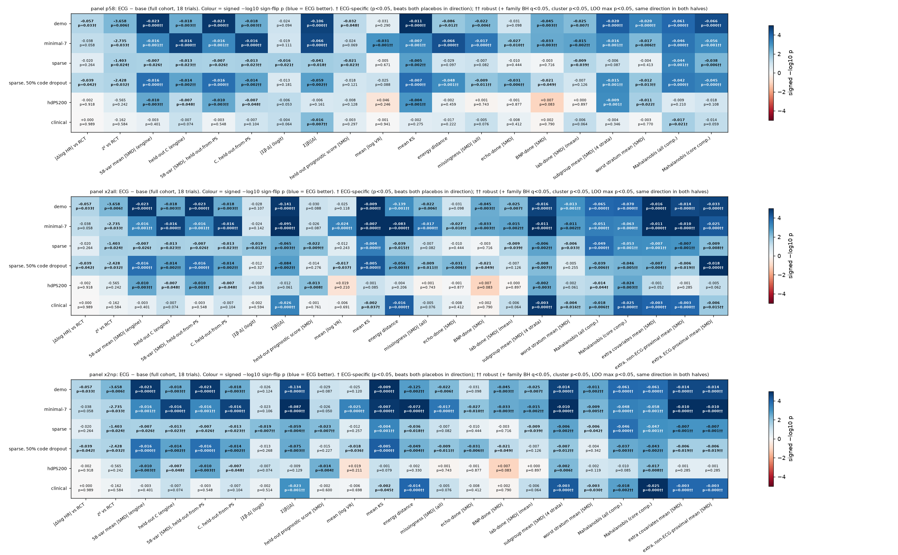

# v1.6 S6 — extended held-out balance measures, ECG vs no-ECG (2026-09-26)

**Exploratory, post-hoc specification (docs/V16_SWEEP_PLAN.md).** 18 trials; 1:1 greedy caliper-0.2 matching on an L2 (C=1) logistic PS; imputation 1, pool-split seed 0. ECG = 32 BCL PCs; placebos `shufECG` (rows permuted) and `noise32`. d = mean over trials of (ECG arm − comparator); every measure is 'lower = better', so negative d = ECG better. p = exact sign-flip over trials. Script `scripts/v16/s6_balance.py`; aggregates in `/mnt/raid0/rbc58/ecg-tte/audits/claude-v16-s6-balance/`.

## Key findings (plain language)

Throughout, "ECG" means adding 32 BCL ECG PCs to the base PS. Numbers are ECG − base, averaged over 18 trials (full cohort). k = the number of trials where ECG is better. p = exact sign-flip p. "Robust" means all of the following:
- p < 0.05;
- ECG beats shuffled ECG and noise32 in direction;
- BH q < 0.05 within the measure family;
- comparator-clustered p < 0.05 (10 clusters);
- leave-one-trial-out max p < 0.05;
- same direction in both halves.

Following the coordinator's guidance, **the headline expanded-panel claims use the non-ECG-proximal panel (`x2np`)**, because the ECG partly "sees" HF, arrhythmia and conduction variables.

1. **Thin PS (demo, minimal-7) and sparse with 50% code dropout: ECG improves almost every balance measure, and the gains are robust.**
   - These measures pass all criteria and are also p < 0.05 in both halves in most cells:
     - absolute outcome-weighted imbalance Σ|β||Δ|;
     - mean KS;
     - energy distance;
     - Mahalanobis;
     - subgroup (age/sex strata) |SMD|;
     - the new non-ECG-proximal covariates.
   - New non-proximal covariates, mean |SMD| (x2np, about 300–350 variables per trial):
     - demo 0.113 → 0.098 (16/18, p < 1e-4, cluster p = 0.002);
     - minimal-7 0.094 → 0.085 (18/18, p < 1e-4);
     - sparse-50%-dropout 0.088 → 0.082 (14/18, p = 0.02, cluster p = 0.04).
   - Energy distance falls by 26% (demo) and 21% (minimal-7).
2. **The signed outcome-bias proxy does not robustly improve at the thin rungs.** This measure is |Σβ·Δ| (the net difference in held-out prognostic logit, which allows cancellation), and the held-out prognostic-score |SMD| behaves the same way. ECG lowers both on average (demo −0.026 / −0.029), but p = 0.05–0.27 at demo, minimal-7 and 50% dropout.
   - So ECG reduces outcome-relevant imbalance variable by variable.
   - It does not significantly shrink the net predicted bias. Imbalances with opposite prognostic signs partly cancel even without ECG.
3. **Sparse (real codes): smaller gains, which pass the automatic criteria but replicate weakly.**
   - On x2np, the following all flag robust:
     - |Σβ·Δ| −0.019 (12/18, p = 0.007);
     - prognostic-score |SMD| −0.023 (p = 0.007);
     - non-proximal covariates −0.007 (14/18, p = 0.001, cluster p = 0.008);
     - Mahalanobis, energy and subgroup |SMD|.
   - The signed and prognostic measures are carried by half A (p ≈ 0.04); half B has p = 0.67 and 0.82. On the 58-panel, the sparse missingness, energy and subgroup gains are not significant.
4. **hdPS200: essentially null.** On the 58-panel, only mean |SMD| (−0.010), mean KS and (x2np) core Mahalanobis (−0.017, half B p = 0.57) flag robust. Everything else is not significant: outcome-weighted, energy, variance ratio, missingness and new-covariate balance (x2np −0.001, p = 0.29).
5. **Clinical PS: null on the 58-panel, but a small robust gain on the expanded panel.**
   - On x2np:
     - non-proximal covariates |SMD| 0.057 → 0.054 (16/18, p = 1e-4, cluster p = 0.008);
     - energy −12% (16/18, p = 1e-4);
     - core Mahalanobis (18/18);
     - subgroup |SMD| and Σ|β||Δ|.
   - None of these is p < 0.05 in both halves (half A p 0.0002–0.09, half B p 0.16–0.50), and the absolute size is tiny. The signed bias and prognostic-score SMD are null (p = 0.51 / 0.60).
6. **Missingness / testing intensity (possible unmeasured-confounding proxy).** ECG balances "BNP done", "echo done" and "labs done" at the thin rungs:
   - demo BNP-done |SMD| 0.192 → 0.148, robust;
   - minimal-7 all indicators 0.130 → 0.113, robust;
   - 50% dropout: echo-done 0.146 → 0.115, robust.
   - It is largely null at sparse, hdPS200 and clinical: the only p < 0.05 is sparse lab-done (−0.009, p = 0.039), which is not robust (cluster p = 0.05, LOO max p = 0.08). At hdPS200 the BNP-done imbalance is slightly worse with ECG (+0.007, p = 0.08).
7. **Variance ratios** improve robustly only at minimal-7 (−0.031, 16/18). They are null elsewhere, including a non-significant worsening at hdPS200.
8. **ECG-proximal vs other.** Gains on the ECG-proximal block (x2all) are about twice as large at thin rungs (demo −0.033 vs −0.014 non-proximal), as expected. The non-proximal gains, which carry the claim, remain robust at demo, minimal-7, sparse, 50% dropout and clinical, but not at hdPS200.
9. **Distributional balance is not achieved by any design.** In the four permutation-test trials, the matched arms remain distinguishable by energy distance (permutation p ≤ 0.05) in almost every cell and arm, with or without ECG. ECG shrinks the distance but does not remove it.
10. **RCT agreement (reference, same matched sets as S1):** \|Δlog HR\| is not robust at any rung. The z² gains (sparse flagged "robust") are not specific to each trial's own RCT benchmark (AUDIT_V16 check 11), so they are not evidence of "closer to the RCT".

**Bottom line.**
- The ECG balance benefit is broad across measure types (outcome-weighted absolute, distributional, multivariate, subgroup, missingness) and holds on about 300 new non-ECG-proximal covariates when the PS is thin (demo / minimal-7) or the coding is degraded.
- It shrinks with richer PS: small at sparse, near zero at hdPS200, and tiny at clinical, where it appears only on the expanded panel.
- It does not significantly reduce the *net* outcome-weighted bias proxy except at sparse, and there it rests on one half only.
- The measures read the same matched sets and are strongly correlated, so agreement across families is not independent confirmation.

## Automatic flags

*ECG-specific*: ECG vs base p<0.05 with d<0 AND d(ECG−shufECG)<0 AND d(ECG−noise)<0 (direction only). *Robust*: ECG-specific AND BH q<0.05 within measure family (metrics × 6 rungs) AND comparator-clustered sign-flip p<0.05 (10 clusters) AND leave-one-trial-out max p<0.05 AND same direction in both halves (within-trial split halves of the same 18 trials, not independent replication). Panels: `p58` = engine 58-variable panel only; `x2all` = 58 + claude-v16-covars2 (per trial: status kept, exposure-leak variables removed; per cell: PS duplicates removed); `x2np` = as x2all but without the dictionary `ecg_proximal` block (HF, cardiomyopathy, arrhythmia, conduction, devices, rate/rhythm drugs, ECG counts, CHA2DS2-VASc; 48 registered). Missingness measures (family c) use the 58-panel labs/echo only, so they are identical across panels.

### panel p58

| metric | family | p<0.05 better | ECG-specific | robust | robust + p<0.05 in both halves | ECG worse (p<0.05) |
|---|---|---|---|---|---|---|
| \|Δlog HR\| vs RCT | RCT agreement (reference) | demo, sparse, 50% code dropout | demo, sparse, 50% code dropout | – | – | – |
| z² vs RCT | RCT agreement (reference) | demo, minimal-7, sparse, sparse, 50% code dropout | demo, minimal-7, sparse, sparse, 50% code dropout | – | – | – |
| 58-var mean \|SMD\| (engine) | engine balance (reference) | demo, minimal-7, sparse, sparse, 50% code dropout, hdPS200 | demo, minimal-7, sparse, sparse, 50% code dropout, hdPS200 | demo, minimal-7, sparse, 50% code dropout, hdPS200 | demo, minimal-7, sparse, 50% code dropout | – |
| held-out C (engine) | engine balance (reference) | demo, minimal-7, sparse, sparse, 50% code dropout, hdPS200 | demo, minimal-7, sparse, sparse, 50% code dropout, hdPS200 | demo, minimal-7, sparse, sparse, 50% code dropout | minimal-7 | – |
| 58-var \|SMD\|, held-out-from-PS | engine balance (reference) | demo, minimal-7, sparse, sparse, 50% code dropout, hdPS200 | demo, minimal-7, sparse, sparse, 50% code dropout, hdPS200 | demo, minimal-7, sparse, 50% code dropout, hdPS200 | demo, minimal-7, sparse, 50% code dropout | – |
| C, held-out-from-PS | engine balance (reference) | demo, minimal-7, sparse, sparse, 50% code dropout, hdPS200 | demo, minimal-7, sparse, sparse, 50% code dropout, hdPS200 | demo, minimal-7, sparse, sparse, 50% code dropout | minimal-7 | – |
| \|Σβ·Δ\| (logit) | a. outcome-weighted | sparse | sparse | – | – | – |
| Σ\|β\|\|Δ\| | a. outcome-weighted | demo, minimal-7, sparse, sparse, 50% code dropout, clinical | demo, minimal-7, sparse, sparse, 50% code dropout, clinical | demo, minimal-7, sparse, 50% code dropout, clinical | demo, minimal-7, sparse, 50% code dropout | – |
| held-out prognostic score \|SMD\| | a. outcome-weighted | demo, sparse | demo, sparse | – | – | – |
| mean \|log VR\| | b. distributional | minimal-7 | minimal-7 | minimal-7 | minimal-7 | – |
| mean KS | b. distributional | demo, minimal-7, sparse, sparse, 50% code dropout, hdPS200 | demo, minimal-7, sparse, sparse, 50% code dropout, hdPS200 | demo, minimal-7, sparse, sparse, 50% code dropout, hdPS200 | demo, minimal-7, sparse, 50% code dropout | – |
| energy distance | b. distributional | demo, minimal-7, sparse, 50% code dropout | demo, minimal-7, sparse, 50% code dropout | minimal-7, sparse, 50% code dropout | sparse, 50% code dropout | – |
| missingness \|SMD\| (all) | c. missingness | demo, minimal-7, sparse, 50% code dropout | demo, minimal-7, sparse, 50% code dropout | minimal-7, sparse, 50% code dropout | sparse, 50% code dropout | – |
| echo-done \|SMD\| | c. missingness | minimal-7, sparse, 50% code dropout | minimal-7, sparse, 50% code dropout | minimal-7, sparse, 50% code dropout | – | – |
| BNP-done \|SMD\| | c. missingness | demo, minimal-7, sparse, 50% code dropout | demo, minimal-7, sparse, 50% code dropout | demo, minimal-7 | demo | – |
| lab-done \|SMD\| (mean) | c. missingness | demo, minimal-7, sparse | demo, minimal-7, sparse | minimal-7 | – | – |
| subgroup mean \|SMD\| (4 strata) | d. subgroup | demo, minimal-7, sparse, 50% code dropout, hdPS200 | demo, minimal-7, sparse, 50% code dropout, hdPS200 | demo, minimal-7, sparse, 50% code dropout | demo, minimal-7 | – |
| worst stratum mean \|SMD\| | d. subgroup | demo, minimal-7, sparse, 50% code dropout, hdPS200 | demo, minimal-7, sparse, 50% code dropout, hdPS200 | demo, minimal-7, sparse, 50% code dropout | demo | – |
| Mahalanobis (all comp.) | e. Mahalanobis | demo, minimal-7, sparse, sparse, 50% code dropout, clinical | demo, minimal-7, sparse, sparse, 50% code dropout, clinical | demo, minimal-7, sparse, sparse, 50% code dropout | demo, minimal-7 | – |
| Mahalanobis (core comp.) | e. Mahalanobis | demo, minimal-7, sparse, sparse, 50% code dropout | demo, minimal-7, sparse, sparse, 50% code dropout | demo, minimal-7, sparse, sparse, 50% code dropout | demo, minimal-7, sparse, 50% code dropout | – |

### panel x2all

| metric | family | p<0.05 better | ECG-specific | robust | robust + p<0.05 in both halves | ECG worse (p<0.05) |
|---|---|---|---|---|---|---|
| \|Δlog HR\| vs RCT | RCT agreement (reference) | demo, sparse, 50% code dropout | demo, sparse, 50% code dropout | – | – | – |
| z² vs RCT | RCT agreement (reference) | demo, minimal-7, sparse, sparse, 50% code dropout | demo, minimal-7, sparse, sparse, 50% code dropout | – | – | – |
| 58-var mean \|SMD\| (engine) | engine balance (reference) | demo, minimal-7, sparse, sparse, 50% code dropout, hdPS200 | demo, minimal-7, sparse, sparse, 50% code dropout, hdPS200 | demo, minimal-7, sparse, 50% code dropout, hdPS200 | demo, minimal-7, sparse, 50% code dropout | – |
| held-out C (engine) | engine balance (reference) | demo, minimal-7, sparse, sparse, 50% code dropout, hdPS200 | demo, minimal-7, sparse, sparse, 50% code dropout, hdPS200 | demo, minimal-7, sparse, sparse, 50% code dropout | minimal-7 | – |
| 58-var \|SMD\|, held-out-from-PS | engine balance (reference) | demo, minimal-7, sparse, sparse, 50% code dropout, hdPS200 | demo, minimal-7, sparse, sparse, 50% code dropout, hdPS200 | demo, minimal-7, sparse, 50% code dropout, hdPS200 | demo, minimal-7, sparse, 50% code dropout | – |
| C, held-out-from-PS | engine balance (reference) | demo, minimal-7, sparse, sparse, 50% code dropout, hdPS200 | demo, minimal-7, sparse, sparse, 50% code dropout, hdPS200 | demo, minimal-7, sparse, sparse, 50% code dropout | minimal-7 | – |
| \|Σβ·Δ\| (logit) | a. outcome-weighted | sparse | sparse | sparse | – | – |
| Σ\|β\|\|Δ\| | a. outcome-weighted | demo, minimal-7, sparse, sparse, 50% code dropout, clinical | demo, minimal-7, sparse, sparse, 50% code dropout, clinical | demo, minimal-7, sparse, sparse, 50% code dropout, clinical | demo, minimal-7, sparse, 50% code dropout, clinical | – |
| held-out prognostic score \|SMD\| | a. outcome-weighted | sparse, hdPS200 | sparse, hdPS200 | sparse | – | – |
| mean \|log VR\| | b. distributional | minimal-7, sparse, 50% code dropout | minimal-7, sparse, 50% code dropout | minimal-7 | minimal-7 | – |
| mean KS | b. distributional | demo, minimal-7, sparse, sparse, 50% code dropout, clinical | demo, minimal-7, sparse, sparse, 50% code dropout, clinical | demo, minimal-7, sparse, sparse, 50% code dropout | demo, minimal-7, sparse, 50% code dropout | – |
| energy distance | b. distributional | demo, minimal-7, sparse, sparse, 50% code dropout, clinical | demo, minimal-7, sparse, sparse, 50% code dropout, clinical | demo, minimal-7, sparse, sparse, 50% code dropout, clinical | demo, minimal-7, sparse, 50% code dropout | – |
| missingness \|SMD\| (all) | c. missingness | demo, minimal-7, sparse, 50% code dropout | demo, minimal-7, sparse, 50% code dropout | minimal-7, sparse, 50% code dropout | sparse, 50% code dropout | – |
| echo-done \|SMD\| | c. missingness | minimal-7, sparse, 50% code dropout | minimal-7, sparse, 50% code dropout | minimal-7, sparse, 50% code dropout | – | – |
| BNP-done \|SMD\| | c. missingness | demo, minimal-7, sparse, 50% code dropout | demo, minimal-7, sparse, 50% code dropout | demo, minimal-7 | demo | – |
| lab-done \|SMD\| (mean) | c. missingness | demo, minimal-7, sparse | demo, minimal-7, sparse | minimal-7 | – | – |
| subgroup mean \|SMD\| (4 strata) | d. subgroup | demo, minimal-7, sparse, sparse, 50% code dropout, hdPS200, clinical | demo, minimal-7, sparse, sparse, 50% code dropout, hdPS200, clinical | demo, minimal-7, sparse, sparse, 50% code dropout, clinical | demo, minimal-7, sparse, 50% code dropout | – |
| worst stratum mean \|SMD\| | d. subgroup | demo, minimal-7, sparse, clinical | demo, minimal-7, sparse, clinical | demo, minimal-7, clinical | demo | – |
| Mahalanobis (all comp.) | e. Mahalanobis | demo, minimal-7, sparse, sparse, 50% code dropout, hdPS200, clinical | demo, minimal-7, sparse, sparse, 50% code dropout, hdPS200, clinical | demo, minimal-7, sparse, sparse, 50% code dropout, clinical | demo, minimal-7, sparse, 50% code dropout | – |
| Mahalanobis (core comp.) | e. Mahalanobis | demo, minimal-7, sparse, sparse, 50% code dropout, hdPS200, clinical | demo, minimal-7, sparse, sparse, 50% code dropout, hdPS200, clinical | demo, minimal-7, sparse, sparse, 50% code dropout, hdPS200, clinical | demo, minimal-7, sparse, sparse, 50% code dropout | – |
| extra covariates mean \|SMD\| | extra-panel mean |SMD| | demo, minimal-7, sparse, sparse, 50% code dropout, clinical | demo, minimal-7, sparse, sparse, 50% code dropout, clinical | demo, minimal-7, sparse, sparse, 50% code dropout, clinical | demo, minimal-7, sparse, 50% code dropout | – |
| extra, non-ECG-proximal mean \|SMD\| | extra-panel mean |SMD| | demo, minimal-7, sparse, sparse, 50% code dropout, clinical | demo, minimal-7, sparse, sparse, 50% code dropout, clinical | demo, minimal-7, sparse, sparse, 50% code dropout, clinical | demo, minimal-7, sparse, 50% code dropout | – |
| extra, ECG-proximal mean \|SMD\| | extra-panel mean |SMD| | demo, minimal-7, sparse, sparse, 50% code dropout, clinical | demo, minimal-7, sparse, sparse, 50% code dropout, clinical | demo, minimal-7, sparse, sparse, 50% code dropout, clinical | demo, minimal-7, sparse, 50% code dropout, clinical | – |

### panel x2np

| metric | family | p<0.05 better | ECG-specific | robust | robust + p<0.05 in both halves | ECG worse (p<0.05) |
|---|---|---|---|---|---|---|
| \|Δlog HR\| vs RCT | RCT agreement (reference) | demo, sparse, 50% code dropout | demo, sparse, 50% code dropout | – | – | – |
| z² vs RCT | RCT agreement (reference) | demo, minimal-7, sparse, sparse, 50% code dropout | demo, minimal-7, sparse, sparse, 50% code dropout | – | – | – |
| 58-var mean \|SMD\| (engine) | engine balance (reference) | demo, minimal-7, sparse, sparse, 50% code dropout, hdPS200 | demo, minimal-7, sparse, sparse, 50% code dropout, hdPS200 | demo, minimal-7, sparse, 50% code dropout, hdPS200 | demo, minimal-7, sparse, 50% code dropout | – |
| held-out C (engine) | engine balance (reference) | demo, minimal-7, sparse, sparse, 50% code dropout, hdPS200 | demo, minimal-7, sparse, sparse, 50% code dropout, hdPS200 | demo, minimal-7, sparse, sparse, 50% code dropout | minimal-7 | – |
| 58-var \|SMD\|, held-out-from-PS | engine balance (reference) | demo, minimal-7, sparse, sparse, 50% code dropout, hdPS200 | demo, minimal-7, sparse, sparse, 50% code dropout, hdPS200 | demo, minimal-7, sparse, 50% code dropout, hdPS200 | demo, minimal-7, sparse, 50% code dropout | – |
| C, held-out-from-PS | engine balance (reference) | demo, minimal-7, sparse, sparse, 50% code dropout, hdPS200 | demo, minimal-7, sparse, sparse, 50% code dropout, hdPS200 | demo, minimal-7, sparse, sparse, 50% code dropout | minimal-7 | – |
| \|Σβ·Δ\| (logit) | a. outcome-weighted | sparse | sparse | sparse | – | – |
| Σ\|β\|\|Δ\| | a. outcome-weighted | demo, minimal-7, sparse, sparse, 50% code dropout, clinical | demo, minimal-7, sparse, sparse, 50% code dropout, clinical | demo, minimal-7, sparse, sparse, 50% code dropout, clinical | demo, minimal-7, sparse, 50% code dropout | – |
| held-out prognostic score \|SMD\| | a. outcome-weighted | sparse, hdPS200 | sparse, hdPS200 | sparse | – | – |
| mean \|log VR\| | b. distributional | minimal-7, sparse, 50% code dropout | minimal-7, sparse, 50% code dropout | minimal-7 | minimal-7 | – |
| mean KS | b. distributional | demo, minimal-7, sparse, sparse, 50% code dropout, clinical | demo, minimal-7, sparse, sparse, 50% code dropout, clinical | demo, minimal-7, sparse, sparse, 50% code dropout | demo, minimal-7, sparse, 50% code dropout | – |
| energy distance | b. distributional | demo, minimal-7, sparse, sparse, 50% code dropout, clinical | demo, minimal-7, sparse, sparse, 50% code dropout, clinical | demo, minimal-7, sparse, sparse, 50% code dropout, clinical | demo, minimal-7, sparse, 50% code dropout | – |
| missingness \|SMD\| (all) | c. missingness | demo, minimal-7, sparse, 50% code dropout | demo, minimal-7, sparse, 50% code dropout | minimal-7, sparse, 50% code dropout | sparse, 50% code dropout | – |
| echo-done \|SMD\| | c. missingness | minimal-7, sparse, 50% code dropout | minimal-7, sparse, 50% code dropout | minimal-7, sparse, 50% code dropout | – | – |
| BNP-done \|SMD\| | c. missingness | demo, minimal-7, sparse, 50% code dropout | demo, minimal-7, sparse, 50% code dropout | demo, minimal-7 | demo | – |
| lab-done \|SMD\| (mean) | c. missingness | demo, minimal-7, sparse | demo, minimal-7, sparse | minimal-7 | – | – |
| subgroup mean \|SMD\| (4 strata) | d. subgroup | demo, minimal-7, sparse, sparse, 50% code dropout, hdPS200, clinical | demo, minimal-7, sparse, sparse, 50% code dropout, hdPS200, clinical | demo, minimal-7, sparse, sparse, 50% code dropout, clinical | demo, minimal-7, sparse, 50% code dropout | – |
| worst stratum mean \|SMD\| | d. subgroup | demo, minimal-7, sparse, clinical | demo, minimal-7, sparse, clinical | demo, minimal-7 | demo | – |
| Mahalanobis (all comp.) | e. Mahalanobis | demo, minimal-7, sparse, sparse, 50% code dropout, clinical | demo, minimal-7, sparse, sparse, 50% code dropout, clinical | demo, minimal-7, sparse, sparse, 50% code dropout, clinical | demo, minimal-7, sparse, 50% code dropout | – |
| Mahalanobis (core comp.) | e. Mahalanobis | demo, minimal-7, sparse, sparse, 50% code dropout, hdPS200, clinical | demo, minimal-7, sparse, sparse, 50% code dropout, hdPS200, clinical | demo, minimal-7, sparse, sparse, 50% code dropout, hdPS200, clinical | demo, minimal-7, sparse, sparse, 50% code dropout | – |
| extra covariates mean \|SMD\| | extra-panel mean |SMD| | demo, minimal-7, sparse, sparse, 50% code dropout, clinical | demo, minimal-7, sparse, sparse, 50% code dropout, clinical | demo, minimal-7, sparse, sparse, 50% code dropout, clinical | demo, minimal-7, sparse, 50% code dropout | – |
| extra, non-ECG-proximal mean \|SMD\| | extra-panel mean |SMD| | demo, minimal-7, sparse, sparse, 50% code dropout, clinical | demo, minimal-7, sparse, sparse, 50% code dropout, clinical | demo, minimal-7, sparse, sparse, 50% code dropout, clinical | demo, minimal-7, sparse, 50% code dropout | – |

## Measures

| family | metric | definition |
|---|---|---|
| a | ob_signed | \|Σ_j β_j Δ_j\|: β = ridge logistic (event by horizon) on all held-out components (median-imputed + missingness indicators, standardised by pooled within-arm SD), fitted in the comparator arm of the unmatched analysed rows, C by 3-fold CV; Δ_j = matched treated − comparator mean. = difference in mean held-out prognostic logit |
| a | ob_abs | Σ_j \|β_j\|\|Δ_j\| (outcome-relevant imbalance, no cancellation) |
| a | prog_ho_smd | \|SMD\| of the held-out prognostic score (5-fold cross-fitted in comparators) |
| b | vr_logdev | mean \|log(var_T/var_C)\| over continuous non-code components (util, prog_full, observed vitals/labs, echo; ≥ 50 observed per arm), observed values winsorised at the 1st/99th percentile of the analysed rows |
| b | ks_mean | mean two-sample KS statistic over the same components |
| b | energy | energy distance between arms on standardised core components (+ indicators), ≤ 5,000 per arm |
| c | miss_* | \|SMD\| of 'measured' indicators: echo done (any echo, masked pre-2016), NT-proBNP done, each lab done (miss_lab = mean), vitals done; miss_mean = mean over all |
| d | sub_smd / sub_max | mean over 58 variables of \|SMD\| within age ≥65, <65, male, female strata of the matched sample; mean / max of the 4 strata |
| e | maha_* | sqrt(Δ'(S+0.1·I)^-1 Δ), S = pooled within-arm covariance of standardised components (analysed rows); all components / non-code core |
| engine | absd, z2, mean_smd, cstat | run_cell outputs; *_ho = held-out-from-PS subset (differs only for clinical) |

Clinical: the PS contains meds, utilisation and the observed vitals/labs (completed); those components are removed from every S6 measure (not their missingness indicators, which are not in the PS).

## Full results, panel p58

Each cell: d (sign-flip p). vs base = ECG − base; cluster = comparator-clustered p; LOO = max p leaving one trial out; q_fam = BH within measure family.

### |Δlog HR| vs RCT (`absd`)

| rung | base | ECG | k | vs base | q_metric | q_fam | vs shufECG | vs noise | cluster | LOO max p | half A | half B | flag |
|---|---|---|---|---|---|---|---|---|---|---|---|---|---|
| demo | 0.2650 | 0.2076 | 14/18 | -0.0574 (0.033) | 0.1155 | 0.0802 | -0.0617 (0.083) | -0.0512 (0.120) | 6/10 p=0.238 | 0.0656 | -0.0401 (0.106) | -0.0543 (0.125) | ECG-specific |
| minimal-7 | 0.2379 | 0.1996 | 11/18 | -0.0383 (0.058) | 0.1155 | 0.0990 | -0.0355 (0.101) | -0.0431 (0.007) | 7/10 p=0.068 | 0.1155 | -0.0196 (0.269) | -0.0075 (0.805) |  |
| sparse | 0.1816 | 0.1615 | 14/18 | -0.0201 (0.264) | 0.3965 | 0.3525 | -0.0230 (0.088) | -0.0340 (0.053) | 8/10 p=0.061 | 0.5174 | -0.0592 (0.042) | -0.0335 (0.231) |  |
| sparse, 50% code dropout | 0.2185 | 0.1797 | 13/18 | -0.0388 (0.042) | 0.1155 | 0.0840 | -0.0495 (0.016) | -0.0506 (0.002) | 8/10 p=0.027 | 0.0839 | -0.0599 (0.029) | -0.0264 (0.320) | ECG-specific |
| hdPS200 | 0.1617 | 0.1597 | 10/18 | -0.0020 (0.918) | 0.9888 | 0.9888 | +0.0115 (0.678) | +0.0180 (0.493) | 6/10 p=0.873 | 0.9854 | -0.0294 (0.159) | -0.0305 (0.079) |  |
| clinical | 0.1374 | 0.1377 | 9/18 | +0.0003 (0.989) | 0.9888 | 0.9888 | -0.0125 (0.268) | -0.0170 (0.204) | 4/10 p=0.900 | 0.9947 | -0.0016 (0.928) | -0.0474 (0.183) |  |

### z² vs RCT (`z2`)

| rung | base | ECG | k | vs base | q_metric | q_fam | vs shufECG | vs noise | cluster | LOO max p | half A | half B | flag |
|---|---|---|---|---|---|---|---|---|---|---|---|---|---|
| demo | 9.9668 | 6.3085 | 14/18 | -3.66 (0.006) | 0.0347 | 0.0695 | -4.67 (0.021) | -4.50 (0.015) | 6/10 p=0.084 | 0.0116 | -2.62 (0.032) | -3.24 (0.083) | ECG-specific |
| minimal-7 | 8.3672 | 5.6323 | 11/18 | -2.73 (0.033) | 0.0500 | 0.0802 | -3.05 (0.005) | -2.57 (0.006) | 7/10 p=0.094 | 0.0667 | -1.69 (0.073) | -1.59 (0.188) | ECG-specific |
| sparse | 4.9000 | 3.4966 | 14/18 | -1.40 (0.024) | 0.0500 | 0.0802 | -1.13 (0.026) | -1.56 (0.015) | 8/10 p=0.025 | 0.0481 | -1.47 (0.013) | -1.22 (0.030) | ECG-specific |
| sparse, 50% code dropout | 6.9686 | 4.5408 | 13/18 | -2.43 (0.032) | 0.0500 | 0.0802 | -2.42 (0.017) | -2.73 (0.002) | 8/10 p=0.070 | 0.0646 | -2.31 (0.062) | -1.24 (0.270) | ECG-specific |
| hdPS200 | 3.1508 | 2.5860 | 10/18 | -0.5648 (0.242) | 0.2907 | 0.3525 | -0.2729 (0.621) | -0.0482 (0.913) | 6/10 p=0.326 | 0.4652 | -0.5272 (0.120) | -0.5754 (0.067) |  |
| clinical | 2.7329 | 2.5708 | 9/18 | -0.1621 (0.584) | 0.5840 | 0.7008 | -0.4094 (0.222) | -0.2348 (0.314) | 5/10 p=0.600 | 0.8207 | -0.2122 (0.660) | -1.11 (0.071) |  |

### 58-var mean |SMD| (engine) (`mean_smd`)

| rung | base | ECG | k | vs base | q_metric | q_fam | vs shufECG | vs noise | cluster | LOO max p | half A | half B | flag |
|---|---|---|---|---|---|---|---|---|---|---|---|---|---|
| demo | 0.1348 | 0.1115 | 17/18 | -0.0233 (0.000) | 0.0001 | 0.0001 | -0.0280 (0.000) | -0.0228 (0.000) | 9/10 p=0.004 | 0.0000 | -0.0191 (0.003) | -0.0227 (0.001) | robust |
| minimal-7 | 0.1278 | 0.1116 | 16/18 | -0.0162 (0.001) | 0.0012 | 0.0018 | -0.0170 (0.001) | -0.0143 (0.003) | 10/10 p=0.002 | 0.0012 | -0.0151 (0.002) | -0.0191 (0.003) | robust |
| sparse | 0.1073 | 0.1006 | 14/18 | -0.0067 (0.026) | 0.0317 | 0.0352 | -0.0061 (0.059) | -0.0079 (0.004) | 7/10 p=0.105 | 0.0528 | -0.0029 (0.504) | -0.0083 (0.033) | ECG-specific |
| sparse, 50% code dropout | 0.1187 | 0.1027 | 16/18 | -0.0160 (0.000) | 0.0005 | 0.0007 | -0.0160 (0.001) | -0.0170 (0.000) | 9/10 p=0.004 | 0.0004 | -0.0096 (0.030) | -0.0164 (0.001) | robust |
| hdPS200 | 0.0909 | 0.0812 | 15/18 | -0.0097 (0.003) | 0.0041 | 0.0054 | -0.0047 (0.087) | -0.0101 (0.000) | 10/10 p=0.002 | 0.0055 | -0.0060 (0.032) | -0.0042 (0.285) | robust |
| clinical | 0.0812 | 0.0785 | 13/18 | -0.0027 (0.401) | 0.4006 | 0.4180 | -0.0056 (0.003) | -0.0020 (0.432) | 8/10 p=0.076 | 0.6718 | -0.0022 (0.541) | -0.0007 (0.846) |  |

### held-out C (engine) (`cstat`)

| rung | base | ECG | k | vs base | q_metric | q_fam | vs shufECG | vs noise | cluster | LOO max p | half A | half B | flag |
|---|---|---|---|---|---|---|---|---|---|---|---|---|---|
| demo | 0.6956 | 0.6780 | 15/18 | -0.0176 (0.003) | 0.0063 | 0.0054 | -0.0241 (0.000) | -0.0233 (0.000) | 9/10 p=0.006 | 0.0063 | -0.0144 (0.091) | -0.0278 (0.000) | robust |
| minimal-7 | 0.7201 | 0.7042 | 17/18 | -0.0159 (0.000) | 0.0001 | 0.0001 | -0.0139 (0.000) | -0.0132 (0.000) | 10/10 p=0.002 | 0.0000 | -0.0159 (0.017) | -0.0121 (0.000) | robust |
| sparse | 0.6647 | 0.6515 | 15/18 | -0.0133 (0.023) | 0.0346 | 0.0346 | -0.0176 (0.004) | -0.0156 (0.002) | 7/10 p=0.031 | 0.0461 | -0.0203 (0.001) | -0.0133 (0.055) | robust |
| sparse, 50% code dropout | 0.6781 | 0.6642 | 14/18 | -0.0139 (0.002) | 0.0063 | 0.0054 | -0.0185 (0.000) | -0.0197 (0.000) | 8/10 p=0.010 | 0.0045 | -0.0062 (0.461) | -0.0106 (0.095) | robust |
| hdPS200 | 0.5931 | 0.5866 | 12/18 | -0.0065 (0.048) | 0.0582 | 0.0582 | -0.0090 (0.015) | -0.0048 (0.254) | 8/10 p=0.066 | 0.0969 | -0.0003 (0.954) | -0.0088 (0.028) | ECG-specific |
| clinical | 0.6295 | 0.6221 | 14/18 | -0.0074 (0.074) | 0.0741 | 0.0847 | -0.0110 (0.004) | -0.0114 (0.004) | 8/10 p=0.137 | 0.1482 | -0.0136 (0.020) | -0.0096 (0.062) |  |

### 58-var |SMD|, held-out-from-PS (`mean_smd_ho`)

| rung | base | ECG | k | vs base | q_metric | q_fam | vs shufECG | vs noise | cluster | LOO max p | half A | half B | flag |
|---|---|---|---|---|---|---|---|---|---|---|---|---|---|
| demo | 0.1348 | 0.1115 | 17/18 | -0.0233 (0.000) | 0.0001 | 0.0001 | -0.0280 (0.000) | -0.0228 (0.000) | 9/10 p=0.004 | 0.0000 | -0.0191 (0.003) | -0.0227 (0.001) | robust |
| minimal-7 | 0.1278 | 0.1116 | 16/18 | -0.0162 (0.001) | 0.0012 | 0.0018 | -0.0170 (0.001) | -0.0143 (0.003) | 10/10 p=0.002 | 0.0012 | -0.0151 (0.002) | -0.0191 (0.003) | robust |
| sparse | 0.1073 | 0.1006 | 14/18 | -0.0067 (0.026) | 0.0317 | 0.0352 | -0.0061 (0.059) | -0.0079 (0.004) | 7/10 p=0.105 | 0.0528 | -0.0029 (0.504) | -0.0083 (0.033) | ECG-specific |
| sparse, 50% code dropout | 0.1187 | 0.1027 | 16/18 | -0.0160 (0.000) | 0.0005 | 0.0007 | -0.0160 (0.001) | -0.0170 (0.000) | 9/10 p=0.004 | 0.0004 | -0.0096 (0.030) | -0.0164 (0.001) | robust |
| hdPS200 | 0.0909 | 0.0812 | 15/18 | -0.0097 (0.003) | 0.0041 | 0.0054 | -0.0047 (0.087) | -0.0101 (0.000) | 10/10 p=0.002 | 0.0055 | -0.0060 (0.032) | -0.0042 (0.285) | robust |
| clinical | 0.0901 | 0.0876 | 12/18 | -0.0025 (0.548) | 0.5484 | 0.5484 | -0.0064 (0.009) | -0.0032 (0.325) | 8/10 p=0.100 | 0.8252 | -0.0028 (0.551) | -0.0017 (0.678) |  |

### C, held-out-from-PS (`cstat_ho`)

| rung | base | ECG | k | vs base | q_metric | q_fam | vs shufECG | vs noise | cluster | LOO max p | half A | half B | flag |
|---|---|---|---|---|---|---|---|---|---|---|---|---|---|
| demo | 0.6956 | 0.6780 | 15/18 | -0.0176 (0.003) | 0.0063 | 0.0054 | -0.0241 (0.000) | -0.0233 (0.000) | 9/10 p=0.006 | 0.0063 | -0.0144 (0.091) | -0.0278 (0.000) | robust |
| minimal-7 | 0.7201 | 0.7042 | 17/18 | -0.0159 (0.000) | 0.0001 | 0.0001 | -0.0139 (0.000) | -0.0132 (0.000) | 10/10 p=0.002 | 0.0000 | -0.0159 (0.017) | -0.0121 (0.000) | robust |
| sparse | 0.6647 | 0.6515 | 15/18 | -0.0133 (0.023) | 0.0346 | 0.0346 | -0.0176 (0.004) | -0.0156 (0.002) | 7/10 p=0.031 | 0.0461 | -0.0203 (0.001) | -0.0133 (0.055) | robust |
| sparse, 50% code dropout | 0.6781 | 0.6642 | 14/18 | -0.0139 (0.002) | 0.0063 | 0.0054 | -0.0185 (0.000) | -0.0197 (0.000) | 8/10 p=0.010 | 0.0045 | -0.0062 (0.461) | -0.0106 (0.095) | robust |
| hdPS200 | 0.5931 | 0.5866 | 12/18 | -0.0065 (0.048) | 0.0582 | 0.0582 | -0.0090 (0.015) | -0.0048 (0.254) | 8/10 p=0.066 | 0.0969 | -0.0003 (0.954) | -0.0088 (0.028) | ECG-specific |
| clinical | 0.6274 | 0.6205 | 14/18 | -0.0068 (0.104) | 0.1040 | 0.1134 | -0.0106 (0.006) | -0.0111 (0.006) | 8/10 p=0.213 | 0.2078 | -0.0138 (0.011) | -0.0101 (0.026) |  |

### |Σβ·Δ| (logit) (`ob_signed`)

| rung | base | ECG | k | vs base | q_metric | q_fam | vs shufECG | vs noise | cluster | LOO max p | half A | half B | flag |
|---|---|---|---|---|---|---|---|---|---|---|---|---|---|
| demo | 0.1478 | 0.1241 | 13/18 | -0.0237 (0.094) | 0.1330 | 0.1406 | -0.0320 (0.062) | -0.0206 (0.183) | 8/10 p=0.029 | 0.1870 | -0.0308 (0.077) | -0.0170 (0.346) |  |
| minimal-7 | 0.1458 | 0.1269 | 15/18 | -0.0188 (0.111) | 0.1330 | 0.1534 | -0.0152 (0.224) | -0.0133 (0.271) | 8/10 p=0.051 | 0.2216 | -0.0161 (0.117) | -0.0134 (0.204) |  |
| sparse | 0.0924 | 0.0764 | 14/18 | -0.0160 (0.021) | 0.1269 | 0.0580 | -0.0127 (0.069) | -0.0148 (0.042) | 9/10 p=0.014 | 0.0423 | -0.0170 (0.068) | -0.0028 (0.764) | ECG-specific |
| sparse, 50% code dropout | 0.1167 | 0.1036 | 11/18 | -0.0131 (0.181) | 0.1812 | 0.1918 | -0.0160 (0.155) | -0.0112 (0.328) | 7/10 p=0.172 | 0.3564 | -0.0044 (0.759) | -0.0117 (0.302) |  |
| hdPS200 | 0.0348 | 0.0286 | 12/18 | -0.0062 (0.053) | 0.1282 | 0.1063 | -0.0059 (0.026) | -0.0047 (0.192) | 8/10 p=0.014 | 0.1011 | +0.0012 (0.806) | -0.0019 (0.620) |  |
| clinical | 0.0515 | 0.0473 | 11/18 | -0.0042 (0.064) | 0.1282 | 0.1127 | -0.0101 (0.020) | -0.0100 (0.044) | 9/10 p=0.014 | 0.1234 | -0.0026 (0.605) | -0.0001 (0.990) |  |

### Σ|β||Δ| (`ob_abs`)

| rung | base | ECG | k | vs base | q_metric | q_fam | vs shufECG | vs noise | cluster | LOO max p | half A | half B | flag |
|---|---|---|---|---|---|---|---|---|---|---|---|---|---|
| demo | 0.7688 | 0.6627 | 17/18 | -0.1060 (0.000) | 0.0001 | 0.0003 | -0.1131 (0.000) | -0.1003 (0.000) | 10/10 p=0.002 | 0.0000 | -0.1032 (0.000) | -0.1115 (0.000) | robust |
| minimal-7 | 0.6846 | 0.6185 | 16/18 | -0.0661 (0.000) | 0.0001 | 0.0003 | -0.0658 (0.000) | -0.0554 (0.001) | 10/10 p=0.002 | 0.0001 | -0.0486 (0.000) | -0.0639 (0.001) | robust |
| sparse | 0.5296 | 0.4888 | 13/18 | -0.0408 (0.018) | 0.0220 | 0.0580 | -0.0392 (0.006) | -0.0456 (0.001) | 7/10 p=0.066 | 0.0366 | -0.0456 (0.011) | -0.0383 (0.057) | ECG-specific |
| sparse, 50% code dropout | 0.6133 | 0.5539 | 15/18 | -0.0594 (0.002) | 0.0038 | 0.0113 | -0.0649 (0.000) | -0.0615 (0.001) | 8/10 p=0.012 | 0.0038 | -0.0600 (0.000) | -0.0590 (0.002) | robust |
| hdPS200 | 0.2649 | 0.2586 | 11/18 | -0.0063 (0.161) | 0.1611 | 0.1812 | -0.0134 (0.021) | -0.0102 (0.037) | 7/10 p=0.168 | 0.3159 | -0.0058 (0.075) | -0.0011 (0.836) |  |
| clinical | 0.3969 | 0.3806 | 13/18 | -0.0163 (0.007) | 0.0104 | 0.0313 | -0.0151 (0.017) | -0.0235 (0.017) | 8/10 p=0.035 | 0.0139 | -0.0175 (0.017) | -0.0155 (0.056) | robust |

### held-out prognostic score |SMD| (`prog_ho_smd`)

| rung | base | ECG | k | vs base | q_metric | q_fam | vs shufECG | vs noise | cluster | LOO max p | half A | half B | flag |
|---|---|---|---|---|---|---|---|---|---|---|---|---|---|
| demo | 0.2347 | 0.2024 | 13/18 | -0.0324 (0.048) | 0.1377 | 0.1063 | -0.0432 (0.020) | -0.0256 (0.138) | 8/10 p=0.031 | 0.0944 | -0.0482 (0.021) | -0.0264 (0.191) | ECG-specific |
| minimal-7 | 0.2285 | 0.2048 | 13/18 | -0.0236 (0.069) | 0.1377 | 0.1127 | -0.0200 (0.117) | -0.0159 (0.231) | 8/10 p=0.035 | 0.1377 | -0.0201 (0.095) | -0.0244 (0.073) |  |
| sparse | 0.1455 | 0.1242 | 12/18 | -0.0213 (0.023) | 0.1354 | 0.0580 | -0.0194 (0.023) | -0.0219 (0.023) | 8/10 p=0.023 | 0.0451 | -0.0233 (0.107) | -0.0040 (0.689) | ECG-specific |
| sparse, 50% code dropout | 0.1825 | 0.1645 | 11/18 | -0.0181 (0.121) | 0.1539 | 0.1539 | -0.0229 (0.064) | -0.0152 (0.249) | 8/10 p=0.119 | 0.2341 | -0.0161 (0.176) | -0.0097 (0.506) |  |
| hdPS200 | 0.0597 | 0.0512 | 11/18 | -0.0085 (0.128) | 0.1539 | 0.1539 | -0.0088 (0.028) | -0.0099 (0.062) | 7/10 p=0.117 | 0.2516 | +0.0045 (0.502) | -0.0053 (0.453) |  |
| clinical | 0.0787 | 0.0755 | 11/18 | -0.0032 (0.297) | 0.2970 | 0.2970 | -0.0118 (0.022) | -0.0114 (0.052) | 7/10 p=0.148 | 0.4968 | -0.0030 (0.700) | -0.0019 (0.880) |  |

### mean |log VR| (`vr_logdev`)

| rung | base | ECG | k | vs base | q_metric | q_fam | vs shufECG | vs noise | cluster | LOO max p | half A | half B | flag |
|---|---|---|---|---|---|---|---|---|---|---|---|---|---|
| demo | 0.2471 | 0.2163 | 13/18 | -0.0308 (0.290) | 0.4348 | 0.3479 | -0.0050 (0.955) | -0.0181 (0.503) | 8/10 p=0.418 | 0.5554 | -0.0314 (0.006) | -0.0240 (0.435) |  |
| minimal-7 | 0.2172 | 0.1866 | 16/18 | -0.0307 (0.001) | 0.0068 | 0.0031 | -0.0177 (0.002) | -0.0333 (0.006) | 10/10 p=0.002 | 0.0023 | -0.0580 (0.020) | -0.0217 (0.002) | robust |
| sparse | 0.1956 | 0.1903 | 13/18 | -0.0053 (0.671) | 0.8057 | 0.7109 | -0.0268 (0.271) | -0.0117 (0.032) | 7/10 p=0.658 | 0.7508 | -0.0122 (0.706) | +0.0221 (0.395) |  |
| sparse, 50% code dropout | 0.2265 | 0.2017 | 12/18 | -0.0248 (0.088) | 0.2644 | 0.1579 | -0.0147 (0.040) | +0.0005 (0.993) | 8/10 p=0.021 | 0.1763 | -0.0088 (0.035) | -0.0533 (0.016) |  |
| hdPS200 | 0.1624 | 0.2079 | 11/18 | +0.0455 (0.246) | 0.4348 | 0.3402 | +0.0243 (0.435) | +0.0389 (0.245) | 5/10 p=0.232 | 0.4915 | -0.0023 (0.595) | -0.0089 (0.141) |  |
| clinical | 0.1979 | 0.1967 | 7/18 | -0.0012 (0.941) | 0.9410 | 0.9410 | -0.0339 (0.276) | -0.0005 (0.970) | 4/10 p=0.695 | 0.9764 | +0.0127 (0.801) | -0.0198 (0.516) |  |

### mean KS (`ks_mean`)

| rung | base | ECG | k | vs base | q_metric | q_fam | vs shufECG | vs noise | cluster | LOO max p | half A | half B | flag |
|---|---|---|---|---|---|---|---|---|---|---|---|---|---|
| demo | 0.0883 | 0.0769 | 18/18 | -0.0114 (0.000) | 0.0000 | 0.0001 | -0.0132 (0.000) | -0.0109 (0.000) | 10/10 p=0.002 | 0.0000 | -0.0103 (0.001) | -0.0103 (0.000) | robust |
| minimal-7 | 0.0824 | 0.0750 | 15/18 | -0.0074 (0.001) | 0.0011 | 0.0025 | -0.0077 (0.001) | -0.0069 (0.000) | 10/10 p=0.002 | 0.0011 | -0.0069 (0.000) | -0.0076 (0.002) | robust |
| sparse | 0.0747 | 0.0698 | 16/18 | -0.0048 (0.002) | 0.0023 | 0.0043 | -0.0037 (0.009) | -0.0048 (0.000) | 8/10 p=0.008 | 0.0039 | -0.0034 (0.100) | -0.0036 (0.064) | robust |
| sparse, 50% code dropout | 0.0793 | 0.0719 | 15/18 | -0.0074 (0.000) | 0.0005 | 0.0009 | -0.0081 (0.000) | -0.0090 (0.000) | 8/10 p=0.008 | 0.0003 | -0.0040 (0.021) | -0.0069 (0.000) | robust |
| hdPS200 | 0.0648 | 0.0611 | 15/18 | -0.0038 (0.001) | 0.0018 | 0.0031 | -0.0026 (0.052) | -0.0035 (0.000) | 9/10 p=0.004 | 0.0024 | -0.0045 (0.027) | -0.0018 (0.313) | robust |
| clinical | 0.0664 | 0.0645 | 12/18 | -0.0019 (0.275) | 0.2750 | 0.3479 | -0.0033 (0.030) | -0.0013 (0.316) | 6/10 p=0.090 | 0.4384 | -0.0032 (0.077) | -0.0036 (0.106) |  |

### energy distance (`energy`)

| rung | base | ECG | k | vs base | q_metric | q_fam | vs shufECG | vs noise | cluster | LOO max p | half A | half B | flag |
|---|---|---|---|---|---|---|---|---|---|---|---|---|---|
| demo | 0.2788 | 0.1932 | 15/18 | -0.0856 (0.012) | 0.0245 | 0.0245 | -0.0821 (0.005) | -0.0806 (0.001) | 8/10 p=0.090 | 0.0245 | -0.0999 (0.005) | -0.0994 (0.000) | ECG-specific |
| minimal-7 | 0.2525 | 0.1864 | 16/18 | -0.0660 (0.000) | 0.0003 | 0.0004 | -0.0609 (0.000) | -0.0560 (0.012) | 10/10 p=0.002 | 0.0001 | -0.0403 (0.184) | -0.0428 (0.028) | robust |
| sparse | 0.1271 | 0.0985 | 12/18 | -0.0286 (0.097) | 0.1448 | 0.1579 | -0.0271 (0.005) | -0.0271 (0.076) | 7/10 p=0.105 | 0.1930 | -0.0239 (0.102) | -0.0199 (0.272) |  |
| sparse, 50% code dropout | 0.1723 | 0.1241 | 14/18 | -0.0482 (0.001) | 0.0023 | 0.0028 | -0.0546 (0.001) | -0.0523 (0.001) | 8/10 p=0.014 | 0.0016 | -0.0458 (0.000) | -0.0526 (0.001) | robust |
| hdPS200 | 0.0482 | 0.0462 | 10/18 | -0.0020 (0.459) | 0.4593 | 0.5167 | -0.0076 (0.012) | -0.0013 (0.660) | 6/10 p=0.320 | 0.8807 | -0.0043 (0.119) | -0.0081 (0.048) |  |
| clinical | 0.0816 | 0.0648 | 12/18 | -0.0168 (0.222) | 0.2669 | 0.3336 | -0.0116 (0.085) | -0.0173 (0.028) | 6/10 p=0.215 | 0.4448 | -0.0078 (0.615) | -0.0271 (0.005) |  |

### missingness |SMD| (all) (`miss_mean`)

| rung | base | ECG | k | vs base | q_metric | q_fam | vs shufECG | vs noise | cluster | LOO max p | half A | half B | flag |
|---|---|---|---|---|---|---|---|---|---|---|---|---|---|
| demo | 0.1543 | 0.1324 | 16/18 | -0.0219 (0.006) | 0.0195 | 0.0231 | -0.0199 (0.009) | -0.0222 (0.001) | 9/10 p=0.098 | 0.0130 | -0.0242 (0.001) | -0.0240 (0.000) | ECG-specific |
| minimal-7 | 0.1303 | 0.1130 | 16/18 | -0.0172 (0.000) | 0.0015 | 0.0060 | -0.0113 (0.001) | -0.0096 (0.011) | 10/10 p=0.002 | 0.0005 | -0.0085 (0.128) | -0.0105 (0.034) | robust |
| sparse | 0.0914 | 0.0841 | 11/18 | -0.0073 (0.082) | 0.0982 | 0.1323 | -0.0087 (0.003) | -0.0091 (0.009) | 7/10 p=0.055 | 0.1610 | -0.0065 (0.166) | -0.0005 (0.905) |  |
| sparse, 50% code dropout | 0.1102 | 0.1011 | 12/18 | -0.0091 (0.011) | 0.0211 | 0.0281 | -0.0134 (0.005) | -0.0097 (0.007) | 7/10 p=0.027 | 0.0211 | -0.0107 (0.006) | -0.0110 (0.032) | robust |
| hdPS200 | 0.0529 | 0.0535 | 7/18 | +0.0006 (0.743) | 0.7431 | 0.8493 | -0.0052 (0.041) | +0.0002 (0.944) | 6/10 p=0.867 | 0.9285 | +0.0028 (0.372) | +0.0002 (0.941) |  |
| clinical | 0.0591 | 0.0538 | 11/18 | -0.0053 (0.076) | 0.0982 | 0.1323 | -0.0045 (0.116) | -0.0064 (0.026) | 7/10 p=0.096 | 0.1448 | -0.0008 (0.841) | -0.0057 (0.197) |  |

### echo-done |SMD| (`miss_echo`)

| rung | base | ECG | k | vs base | q_metric | q_fam | vs shufECG | vs noise | cluster | LOO max p | half A | half B | flag |
|---|---|---|---|---|---|---|---|---|---|---|---|---|---|
| demo | 0.2024 | 0.1710 | 12/18 | -0.0315 (0.098) | 0.1962 | 0.1471 | -0.0310 (0.048) | -0.0265 (0.057) | 7/10 p=0.285 | 0.1960 | -0.0434 (0.057) | -0.0459 (0.001) |  |
| minimal-7 | 0.2185 | 0.1917 | 12/18 | -0.0267 (0.010) | 0.0291 | 0.0281 | -0.0226 (0.039) | -0.0127 (0.537) | 7/10 p=0.016 | 0.0194 | -0.0050 (0.716) | -0.0123 (0.319) | robust |
| sparse | 0.1050 | 0.0953 | 9/18 | -0.0097 (0.444) | 0.5324 | 0.5604 | -0.0075 (0.514) | -0.0066 (0.584) | 6/10 p=0.602 | 0.8872 | -0.0068 (0.524) | -0.0036 (0.783) |  |
| sparse, 50% code dropout | 0.1458 | 0.1150 | 12/18 | -0.0308 (0.006) | 0.0291 | 0.0231 | -0.0248 (0.009) | -0.0248 (0.028) | 8/10 p=0.010 | 0.0114 | -0.0185 (0.133) | -0.0259 (0.054) | robust |
| hdPS200 | 0.0557 | 0.0551 | 11/18 | -0.0006 (0.877) | 0.8766 | 0.8966 | -0.0066 (0.339) | +0.0024 (0.702) | 7/10 p=0.908 | 0.9837 | -0.0046 (0.270) | -0.0086 (0.390) |  |
| clinical | 0.0969 | 0.0891 | 8/18 | -0.0078 (0.412) | 0.5324 | 0.5497 | -0.0074 (0.368) | -0.0073 (0.380) | 6/10 p=0.496 | 0.8009 | +0.0014 (0.834) | -0.0196 (0.089) |  |

### BNP-done |SMD| (`miss_bnp`)

| rung | base | ECG | k | vs base | q_metric | q_fam | vs shufECG | vs noise | cluster | LOO max p | half A | half B | flag |
|---|---|---|---|---|---|---|---|---|---|---|---|---|---|
| demo | 0.1923 | 0.1475 | 14/18 | -0.0448 (0.003) | 0.0102 | 0.0204 | -0.0477 (0.003) | -0.0456 (0.000) | 8/10 p=0.039 | 0.0068 | -0.0476 (0.004) | -0.0681 (0.000) | robust |
| minimal-7 | 0.1422 | 0.1094 | 14/18 | -0.0328 (0.003) | 0.0102 | 0.0204 | -0.0322 (0.001) | -0.0274 (0.017) | 9/10 p=0.004 | 0.0062 | -0.0155 (0.384) | -0.0289 (0.028) | robust |
| sparse | 0.0917 | 0.0891 | 10/18 | -0.0026 (0.716) | 0.7896 | 0.8493 | -0.0116 (0.118) | -0.0069 (0.348) | 5/10 p=0.693 | 0.8980 | +0.0029 (0.706) | +0.0058 (0.366) |  |
| sparse, 50% code dropout | 0.1281 | 0.1072 | 13/18 | -0.0208 (0.049) | 0.0970 | 0.1058 | -0.0251 (0.010) | -0.0232 (0.010) | 7/10 p=0.133 | 0.0968 | -0.0218 (0.085) | -0.0159 (0.037) | ECG-specific |
| hdPS200 | 0.0366 | 0.0436 | 7/18 | +0.0070 (0.083) | 0.1241 | 0.1323 | -0.0046 (0.316) | +0.0061 (0.626) | 5/10 p=0.102 | 0.1654 | +0.0079 (0.249) | -0.0041 (0.622) |  |
| clinical | 0.0614 | 0.0631 | 7/18 | +0.0017 (0.790) | 0.7896 | 0.8614 | -0.0025 (0.715) | -0.0031 (0.629) | 4/10 p=0.871 | 0.9867 | +0.0089 (0.229) | -0.0016 (0.811) |  |

### lab-done |SMD| (mean) (`miss_lab`)

| rung | base | ECG | k | vs base | q_metric | q_fam | vs shufECG | vs noise | cluster | LOO max p | half A | half B | flag |
|---|---|---|---|---|---|---|---|---|---|---|---|---|---|
| demo | 0.1553 | 0.1302 | 15/18 | -0.0250 (0.007) | 0.0202 | 0.0231 | -0.0218 (0.005) | -0.0238 (0.005) | 9/10 p=0.105 | 0.0134 | -0.0282 (0.001) | -0.0234 (0.000) | ECG-specific |
| minimal-7 | 0.1195 | 0.1044 | 15/18 | -0.0151 (0.002) | 0.0139 | 0.0204 | -0.0102 (0.021) | -0.0113 (0.011) | 9/10 p=0.004 | 0.0046 | -0.0121 (0.047) | -0.0090 (0.087) | robust |
| sparse | 0.0914 | 0.0819 | 13/18 | -0.0095 (0.039) | 0.0782 | 0.0938 | -0.0117 (0.000) | -0.0122 (0.006) | 8/10 p=0.049 | 0.0777 | -0.0063 (0.259) | +0.0008 (0.873) | ECG-specific |
| sparse, 50% code dropout | 0.1074 | 0.1003 | 11/18 | -0.0071 (0.126) | 0.1514 | 0.1781 | -0.0140 (0.010) | -0.0095 (0.027) | 6/10 p=0.248 | 0.2353 | -0.0126 (0.007) | -0.0109 (0.139) |  |
| hdPS200 | 0.0505 | 0.0510 | 11/18 | +0.0005 (0.897) | 0.8966 | 0.8966 | -0.0047 (0.138) | -0.0025 (0.391) | 7/10 p=0.986 | 0.9806 | +0.0033 (0.469) | -0.0025 (0.455) |  |
| clinical | 0.0546 | 0.0488 | 12/18 | -0.0057 (0.064) | 0.0957 | 0.1276 | -0.0044 (0.141) | -0.0067 (0.018) | 7/10 p=0.041 | 0.1276 | -0.0021 (0.620) | -0.0046 (0.352) |  |

### subgroup mean |SMD| (4 strata) (`sub_smd`)

| rung | base | ECG | k | vs base | q_metric | q_fam | vs shufECG | vs noise | cluster | LOO max p | half A | half B | flag |
|---|---|---|---|---|---|---|---|---|---|---|---|---|---|
| demo | 0.1553 | 0.1357 | 16/18 | -0.0196 (0.000) | 0.0005 | 0.0009 | -0.0251 (0.000) | -0.0189 (0.000) | 9/10 p=0.006 | 0.0002 | -0.0178 (0.006) | -0.0229 (0.000) | robust |
| minimal-7 | 0.1479 | 0.1316 | 15/18 | -0.0162 (0.001) | 0.0012 | 0.0020 | -0.0161 (0.001) | -0.0139 (0.000) | 9/10 p=0.006 | 0.0013 | -0.0147 (0.001) | -0.0137 (0.036) | robust |
| sparse | 0.1288 | 0.1231 | 13/18 | -0.0057 (0.087) | 0.1040 | 0.1156 | -0.0082 (0.031) | -0.0092 (0.000) | 6/10 p=0.137 | 0.1734 | -0.0085 (0.027) | -0.0077 (0.054) |  |
| sparse, 50% code dropout | 0.1401 | 0.1250 | 16/18 | -0.0151 (0.001) | 0.0012 | 0.0020 | -0.0155 (0.000) | -0.0191 (0.000) | 9/10 p=0.004 | 0.0013 | -0.0068 (0.150) | -0.0125 (0.002) | robust |
| hdPS200 | 0.1161 | 0.1070 | 15/18 | -0.0091 (0.001) | 0.0012 | 0.0020 | -0.0048 (0.079) | -0.0099 (0.001) | 10/10 p=0.002 | 0.0016 | +0.0014 (0.974) | -0.0001 (0.972) | ECG-specific |
| clinical | 0.1172 | 0.1134 | 11/18 | -0.0038 (0.346) | 0.3457 | 0.4149 | -0.0064 (0.039) | -0.0044 (0.157) | 7/10 p=0.062 | 0.5701 | -0.0057 (0.157) | +0.0018 (0.657) |  |

### worst stratum mean |SMD| (`sub_max`)

| rung | base | ECG | k | vs base | q_metric | q_fam | vs shufECG | vs noise | cluster | LOO max p | half A | half B | flag |
|---|---|---|---|---|---|---|---|---|---|---|---|---|---|
| demo | 0.1857 | 0.1657 | 17/18 | -0.0200 (0.000) | 0.0027 | 0.0020 | -0.0270 (0.000) | -0.0177 (0.011) | 9/10 p=0.006 | 0.0009 | -0.0238 (0.011) | -0.0265 (0.002) | robust |
| minimal-7 | 0.1778 | 0.1605 | 15/18 | -0.0173 (0.006) | 0.0185 | 0.0123 | -0.0173 (0.017) | -0.0109 (0.014) | 9/10 p=0.004 | 0.0122 | -0.0133 (0.072) | -0.0161 (0.140) | robust |
| sparse | 0.1567 | 0.1525 | 12/18 | -0.0043 (0.413) | 0.4954 | 0.4504 | -0.0098 (0.134) | -0.0156 (0.002) | 6/10 p=0.184 | 0.7150 | -0.0111 (0.191) | -0.0071 (0.260) |  |
| sparse, 50% code dropout | 0.1669 | 0.1550 | 13/18 | -0.0118 (0.013) | 0.0256 | 0.0219 | -0.0189 (0.002) | -0.0233 (0.001) | 8/10 p=0.025 | 0.0256 | -0.0056 (0.502) | -0.0121 (0.075) | robust |
| hdPS200 | 0.1450 | 0.1337 | 14/18 | -0.0113 (0.022) | 0.0327 | 0.0327 | -0.0106 (0.045) | -0.0142 (0.016) | 9/10 p=0.014 | 0.0436 | +0.0119 (0.252) | +0.0093 (0.272) | ECG-specific |
| clinical | 0.1468 | 0.1442 | 12/18 | -0.0027 (0.770) | 0.7696 | 0.7696 | -0.0092 (0.273) | -0.0061 (0.288) | 6/10 p=0.334 | 0.9371 | -0.0110 (0.097) | +0.0042 (0.570) |  |

### Mahalanobis (all comp.) (`maha_all`)

| rung | base | ECG | k | vs base | q_metric | q_fam | vs shufECG | vs noise | cluster | LOO max p | half A | half B | flag |
|---|---|---|---|---|---|---|---|---|---|---|---|---|---|
| demo | 1.2636 | 1.2023 | 16/18 | -0.0613 (0.000) | 0.0006 | 0.0007 | -0.0644 (0.000) | -0.0690 (0.000) | 9/10 p=0.010 | 0.0002 | -0.0643 (0.001) | -0.0554 (0.001) | robust |
| minimal-7 | 1.2914 | 1.2456 | 15/18 | -0.0458 (0.000) | 0.0006 | 0.0008 | -0.0479 (0.000) | -0.0408 (0.000) | 9/10 p=0.010 | 0.0004 | -0.0328 (0.007) | -0.0307 (0.011) | robust |
| sparse | 1.1650 | 1.1206 | 15/18 | -0.0444 (0.001) | 0.0008 | 0.0010 | -0.0443 (0.000) | -0.0418 (0.001) | 9/10 p=0.010 | 0.0010 | -0.0205 (0.145) | -0.0279 (0.010) | robust |
| sparse, 50% code dropout | 1.2008 | 1.1584 | 15/18 | -0.0423 (0.000) | 0.0006 | 0.0008 | -0.0428 (0.001) | -0.0544 (0.000) | 8/10 p=0.008 | 0.0006 | -0.0383 (0.025) | -0.0296 (0.081) | robust |
| hdPS200 | 0.9569 | 0.9483 | 10/18 | -0.0086 (0.210) | 0.2098 | 0.2098 | -0.0186 (0.007) | -0.0151 (0.024) | 7/10 p=0.227 | 0.3773 | -0.0136 (0.020) | +0.0065 (0.399) |  |
| clinical | 1.0420 | 1.0252 | 15/18 | -0.0168 (0.021) | 0.0256 | 0.0284 | -0.0281 (0.000) | -0.0206 (0.005) | 9/10 p=0.107 | 0.0427 | -0.0192 (0.053) | -0.0096 (0.391) | ECG-specific |

### Mahalanobis (core comp.) (`maha_core`)

| rung | base | ECG | k | vs base | q_metric | q_fam | vs shufECG | vs noise | cluster | LOO max p | half A | half B | flag |
|---|---|---|---|---|---|---|---|---|---|---|---|---|---|
| demo | 0.7298 | 0.6634 | 17/18 | -0.0665 (0.000) | 0.0002 | 0.0005 | -0.0749 (0.000) | -0.0675 (0.000) | 9/10 p=0.004 | 0.0001 | -0.0644 (0.001) | -0.0638 (0.000) | robust |
| minimal-7 | 0.7638 | 0.7077 | 16/18 | -0.0562 (0.001) | 0.0014 | 0.0012 | -0.0526 (0.000) | -0.0446 (0.001) | 9/10 p=0.008 | 0.0014 | -0.0364 (0.014) | -0.0400 (0.003) | robust |
| sparse | 0.6162 | 0.5784 | 13/18 | -0.0378 (0.006) | 0.0087 | 0.0087 | -0.0429 (0.000) | -0.0372 (0.013) | 7/10 p=0.037 | 0.0115 | -0.0284 (0.098) | -0.0203 (0.076) | robust |
| sparse, 50% code dropout | 0.6591 | 0.6139 | 16/18 | -0.0452 (0.000) | 0.0014 | 0.0010 | -0.0484 (0.001) | -0.0591 (0.000) | 9/10 p=0.021 | 0.0009 | -0.0376 (0.005) | -0.0435 (0.002) | robust |
| hdPS200 | 0.4683 | 0.4506 | 11/18 | -0.0177 (0.108) | 0.1085 | 0.1184 | -0.0208 (0.002) | -0.0192 (0.032) | 7/10 p=0.127 | 0.2170 | -0.0223 (0.018) | -0.0087 (0.335) |  |
| clinical | 0.4100 | 0.3965 | 12/18 | -0.0135 (0.059) | 0.0713 | 0.0713 | -0.0189 (0.001) | -0.0178 (0.023) | 9/10 p=0.018 | 0.1189 | -0.0135 (0.108) | -0.0174 (0.026) |  |

Unmatched reference (panel p58, full, mean over trials): 58-var mean \|SMD\| (engine) 0.1396; held-out C (engine) 0.7383; 58-var \|SMD\|, held-out-from-PS 0.1396; C, held-out-from-PS 0.7383; \|Σβ·Δ\| (logit) 0.1867; Σ\|β\|\|Δ\| 0.7793; held-out prognostic score \|SMD\| 0.2856; mean \|log VR\| 0.2107; mean KS 0.08686; energy distance 0.3185; missingness \|SMD\| (all) 0.1561; echo-done \|SMD\| 0.2346; BNP-done \|SMD\| 0.1832; lab-done \|SMD\| (mean) 0.1511; subgroup mean \|SMD\| (4 strata) 0.1541; worst stratum mean \|SMD\| 0.1815; Mahalanobis (all comp.) 1.294; Mahalanobis (core comp.) 0.8046

## Full results, panel x2all

Each cell: d (sign-flip p). vs base = ECG − base; cluster = comparator-clustered p; LOO = max p leaving one trial out; q_fam = BH within measure family.

### |Δlog HR| vs RCT (`absd`)

| rung | base | ECG | k | vs base | q_metric | q_fam | vs shufECG | vs noise | cluster | LOO max p | half A | half B | flag |
|---|---|---|---|---|---|---|---|---|---|---|---|---|---|
| demo | 0.2650 | 0.2076 | 14/18 | -0.0574 (0.033) | 0.1155 | 0.0802 | -0.0617 (0.083) | -0.0512 (0.120) | 6/10 p=0.238 | 0.0656 | -0.0401 (0.106) | -0.0543 (0.125) | ECG-specific |
| minimal-7 | 0.2379 | 0.1996 | 11/18 | -0.0383 (0.058) | 0.1155 | 0.0990 | -0.0355 (0.101) | -0.0431 (0.007) | 7/10 p=0.068 | 0.1155 | -0.0196 (0.269) | -0.0075 (0.805) |  |
| sparse | 0.1816 | 0.1615 | 14/18 | -0.0201 (0.264) | 0.3965 | 0.3525 | -0.0230 (0.088) | -0.0340 (0.053) | 8/10 p=0.061 | 0.5174 | -0.0592 (0.042) | -0.0335 (0.231) |  |
| sparse, 50% code dropout | 0.2185 | 0.1797 | 13/18 | -0.0388 (0.042) | 0.1155 | 0.0840 | -0.0495 (0.016) | -0.0506 (0.002) | 8/10 p=0.027 | 0.0839 | -0.0599 (0.029) | -0.0264 (0.320) | ECG-specific |
| hdPS200 | 0.1617 | 0.1597 | 10/18 | -0.0020 (0.918) | 0.9888 | 0.9888 | +0.0115 (0.678) | +0.0180 (0.493) | 6/10 p=0.873 | 0.9854 | -0.0294 (0.159) | -0.0305 (0.079) |  |
| clinical | 0.1374 | 0.1377 | 9/18 | +0.0003 (0.989) | 0.9888 | 0.9888 | -0.0125 (0.268) | -0.0170 (0.204) | 4/10 p=0.900 | 0.9947 | -0.0016 (0.928) | -0.0474 (0.183) |  |

### z² vs RCT (`z2`)

| rung | base | ECG | k | vs base | q_metric | q_fam | vs shufECG | vs noise | cluster | LOO max p | half A | half B | flag |
|---|---|---|---|---|---|---|---|---|---|---|---|---|---|
| demo | 9.9668 | 6.3085 | 14/18 | -3.66 (0.006) | 0.0347 | 0.0695 | -4.67 (0.021) | -4.50 (0.015) | 6/10 p=0.084 | 0.0116 | -2.62 (0.032) | -3.24 (0.083) | ECG-specific |
| minimal-7 | 8.3672 | 5.6323 | 11/18 | -2.73 (0.033) | 0.0500 | 0.0802 | -3.05 (0.005) | -2.57 (0.006) | 7/10 p=0.094 | 0.0667 | -1.69 (0.073) | -1.59 (0.188) | ECG-specific |
| sparse | 4.9000 | 3.4966 | 14/18 | -1.40 (0.024) | 0.0500 | 0.0802 | -1.13 (0.026) | -1.56 (0.015) | 8/10 p=0.025 | 0.0481 | -1.47 (0.013) | -1.22 (0.030) | ECG-specific |
| sparse, 50% code dropout | 6.9686 | 4.5408 | 13/18 | -2.43 (0.032) | 0.0500 | 0.0802 | -2.42 (0.017) | -2.73 (0.002) | 8/10 p=0.070 | 0.0646 | -2.31 (0.062) | -1.24 (0.270) | ECG-specific |
| hdPS200 | 3.1508 | 2.5860 | 10/18 | -0.5648 (0.242) | 0.2907 | 0.3525 | -0.2729 (0.621) | -0.0482 (0.913) | 6/10 p=0.326 | 0.4652 | -0.5272 (0.120) | -0.5754 (0.067) |  |
| clinical | 2.7329 | 2.5708 | 9/18 | -0.1621 (0.584) | 0.5840 | 0.7008 | -0.4094 (0.222) | -0.2348 (0.314) | 5/10 p=0.600 | 0.8207 | -0.2122 (0.660) | -1.11 (0.071) |  |

### 58-var mean |SMD| (engine) (`mean_smd`)

| rung | base | ECG | k | vs base | q_metric | q_fam | vs shufECG | vs noise | cluster | LOO max p | half A | half B | flag |
|---|---|---|---|---|---|---|---|---|---|---|---|---|---|
| demo | 0.1348 | 0.1115 | 17/18 | -0.0233 (0.000) | 0.0001 | 0.0001 | -0.0280 (0.000) | -0.0228 (0.000) | 9/10 p=0.004 | 0.0000 | -0.0191 (0.003) | -0.0227 (0.001) | robust |
| minimal-7 | 0.1278 | 0.1116 | 16/18 | -0.0162 (0.001) | 0.0012 | 0.0018 | -0.0170 (0.001) | -0.0143 (0.003) | 10/10 p=0.002 | 0.0012 | -0.0151 (0.002) | -0.0191 (0.003) | robust |
| sparse | 0.1073 | 0.1006 | 14/18 | -0.0067 (0.026) | 0.0317 | 0.0352 | -0.0061 (0.059) | -0.0079 (0.004) | 7/10 p=0.105 | 0.0528 | -0.0029 (0.504) | -0.0083 (0.033) | ECG-specific |
| sparse, 50% code dropout | 0.1187 | 0.1027 | 16/18 | -0.0160 (0.000) | 0.0005 | 0.0007 | -0.0160 (0.001) | -0.0170 (0.000) | 9/10 p=0.004 | 0.0004 | -0.0096 (0.030) | -0.0164 (0.001) | robust |
| hdPS200 | 0.0909 | 0.0812 | 15/18 | -0.0097 (0.003) | 0.0041 | 0.0054 | -0.0047 (0.087) | -0.0101 (0.000) | 10/10 p=0.002 | 0.0055 | -0.0060 (0.032) | -0.0042 (0.285) | robust |
| clinical | 0.0812 | 0.0785 | 13/18 | -0.0027 (0.401) | 0.4006 | 0.4180 | -0.0056 (0.003) | -0.0020 (0.432) | 8/10 p=0.076 | 0.6718 | -0.0022 (0.541) | -0.0007 (0.846) |  |

### held-out C (engine) (`cstat`)

| rung | base | ECG | k | vs base | q_metric | q_fam | vs shufECG | vs noise | cluster | LOO max p | half A | half B | flag |
|---|---|---|---|---|---|---|---|---|---|---|---|---|---|
| demo | 0.6956 | 0.6780 | 15/18 | -0.0176 (0.003) | 0.0063 | 0.0054 | -0.0241 (0.000) | -0.0233 (0.000) | 9/10 p=0.006 | 0.0063 | -0.0144 (0.091) | -0.0278 (0.000) | robust |
| minimal-7 | 0.7201 | 0.7042 | 17/18 | -0.0159 (0.000) | 0.0001 | 0.0001 | -0.0139 (0.000) | -0.0132 (0.000) | 10/10 p=0.002 | 0.0000 | -0.0159 (0.017) | -0.0121 (0.000) | robust |
| sparse | 0.6647 | 0.6515 | 15/18 | -0.0133 (0.023) | 0.0346 | 0.0346 | -0.0176 (0.004) | -0.0156 (0.002) | 7/10 p=0.031 | 0.0461 | -0.0203 (0.001) | -0.0133 (0.055) | robust |
| sparse, 50% code dropout | 0.6781 | 0.6642 | 14/18 | -0.0139 (0.002) | 0.0063 | 0.0054 | -0.0185 (0.000) | -0.0197 (0.000) | 8/10 p=0.010 | 0.0045 | -0.0062 (0.461) | -0.0106 (0.095) | robust |
| hdPS200 | 0.5931 | 0.5866 | 12/18 | -0.0065 (0.048) | 0.0582 | 0.0582 | -0.0090 (0.015) | -0.0048 (0.254) | 8/10 p=0.066 | 0.0969 | -0.0003 (0.954) | -0.0088 (0.028) | ECG-specific |
| clinical | 0.6295 | 0.6221 | 14/18 | -0.0074 (0.074) | 0.0741 | 0.0847 | -0.0110 (0.004) | -0.0114 (0.004) | 8/10 p=0.137 | 0.1482 | -0.0136 (0.020) | -0.0096 (0.062) |  |

### 58-var |SMD|, held-out-from-PS (`mean_smd_ho`)

| rung | base | ECG | k | vs base | q_metric | q_fam | vs shufECG | vs noise | cluster | LOO max p | half A | half B | flag |
|---|---|---|---|---|---|---|---|---|---|---|---|---|---|
| demo | 0.1348 | 0.1115 | 17/18 | -0.0233 (0.000) | 0.0001 | 0.0001 | -0.0280 (0.000) | -0.0228 (0.000) | 9/10 p=0.004 | 0.0000 | -0.0191 (0.003) | -0.0227 (0.001) | robust |
| minimal-7 | 0.1278 | 0.1116 | 16/18 | -0.0162 (0.001) | 0.0012 | 0.0018 | -0.0170 (0.001) | -0.0143 (0.003) | 10/10 p=0.002 | 0.0012 | -0.0151 (0.002) | -0.0191 (0.003) | robust |
| sparse | 0.1073 | 0.1006 | 14/18 | -0.0067 (0.026) | 0.0317 | 0.0352 | -0.0061 (0.059) | -0.0079 (0.004) | 7/10 p=0.105 | 0.0528 | -0.0029 (0.504) | -0.0083 (0.033) | ECG-specific |
| sparse, 50% code dropout | 0.1187 | 0.1027 | 16/18 | -0.0160 (0.000) | 0.0005 | 0.0007 | -0.0160 (0.001) | -0.0170 (0.000) | 9/10 p=0.004 | 0.0004 | -0.0096 (0.030) | -0.0164 (0.001) | robust |
| hdPS200 | 0.0909 | 0.0812 | 15/18 | -0.0097 (0.003) | 0.0041 | 0.0054 | -0.0047 (0.087) | -0.0101 (0.000) | 10/10 p=0.002 | 0.0055 | -0.0060 (0.032) | -0.0042 (0.285) | robust |
| clinical | 0.0901 | 0.0876 | 12/18 | -0.0025 (0.548) | 0.5484 | 0.5484 | -0.0064 (0.009) | -0.0032 (0.325) | 8/10 p=0.100 | 0.8252 | -0.0028 (0.551) | -0.0017 (0.678) |  |

### C, held-out-from-PS (`cstat_ho`)

| rung | base | ECG | k | vs base | q_metric | q_fam | vs shufECG | vs noise | cluster | LOO max p | half A | half B | flag |
|---|---|---|---|---|---|---|---|---|---|---|---|---|---|
| demo | 0.6956 | 0.6780 | 15/18 | -0.0176 (0.003) | 0.0063 | 0.0054 | -0.0241 (0.000) | -0.0233 (0.000) | 9/10 p=0.006 | 0.0063 | -0.0144 (0.091) | -0.0278 (0.000) | robust |
| minimal-7 | 0.7201 | 0.7042 | 17/18 | -0.0159 (0.000) | 0.0001 | 0.0001 | -0.0139 (0.000) | -0.0132 (0.000) | 10/10 p=0.002 | 0.0000 | -0.0159 (0.017) | -0.0121 (0.000) | robust |
| sparse | 0.6647 | 0.6515 | 15/18 | -0.0133 (0.023) | 0.0346 | 0.0346 | -0.0176 (0.004) | -0.0156 (0.002) | 7/10 p=0.031 | 0.0461 | -0.0203 (0.001) | -0.0133 (0.055) | robust |
| sparse, 50% code dropout | 0.6781 | 0.6642 | 14/18 | -0.0139 (0.002) | 0.0063 | 0.0054 | -0.0185 (0.000) | -0.0197 (0.000) | 8/10 p=0.010 | 0.0045 | -0.0062 (0.461) | -0.0106 (0.095) | robust |
| hdPS200 | 0.5931 | 0.5866 | 12/18 | -0.0065 (0.048) | 0.0582 | 0.0582 | -0.0090 (0.015) | -0.0048 (0.254) | 8/10 p=0.066 | 0.0969 | -0.0003 (0.954) | -0.0088 (0.028) | ECG-specific |
| clinical | 0.6274 | 0.6205 | 14/18 | -0.0068 (0.104) | 0.1040 | 0.1134 | -0.0106 (0.006) | -0.0111 (0.006) | 8/10 p=0.213 | 0.2078 | -0.0138 (0.011) | -0.0101 (0.026) |  |

### |Σβ·Δ| (logit) (`ob_signed`)

| rung | base | ECG | k | vs base | q_metric | q_fam | vs shufECG | vs noise | cluster | LOO max p | half A | half B | flag |
|---|---|---|---|---|---|---|---|---|---|---|---|---|---|
| demo | 0.1821 | 0.1538 | 12/18 | -0.0283 (0.107) | 0.2135 | 0.1482 | -0.0360 (0.129) | -0.0262 (0.210) | 8/10 p=0.062 | 0.2139 | -0.0461 (0.019) | -0.0193 (0.374) |  |
| minimal-7 | 0.1770 | 0.1534 | 13/18 | -0.0236 (0.142) | 0.2135 | 0.1830 | -0.0193 (0.258) | -0.0158 (0.344) | 8/10 p=0.061 | 0.2846 | -0.0182 (0.156) | -0.0130 (0.334) |  |
| sparse | 0.1113 | 0.0921 | 12/18 | -0.0192 (0.012) | 0.0726 | 0.0272 | -0.0121 (0.067) | -0.0163 (0.031) | 8/10 p=0.018 | 0.0242 | -0.0230 (0.032) | -0.0019 (0.840) | robust |
| sparse, 50% code dropout | 0.1396 | 0.1274 | 10/18 | -0.0122 (0.327) | 0.3928 | 0.3682 | -0.0163 (0.265) | -0.0108 (0.474) | 7/10 p=0.289 | 0.6060 | -0.0125 (0.465) | -0.0109 (0.404) |  |
| hdPS200 | 0.0484 | 0.0406 | 10/18 | -0.0078 (0.106) | 0.2135 | 0.1482 | -0.0100 (0.072) | -0.0003 (0.939) | 7/10 p=0.049 | 0.2117 | +0.0038 (0.541) | -0.0018 (0.872) |  |
| clinical | 0.0663 | 0.0643 | 8/18 | -0.0019 (0.594) | 0.5937 | 0.6286 | -0.0113 (0.075) | -0.0071 (0.324) | 5/10 p=0.408 | 0.9458 | +0.0011 (0.857) | +0.0049 (0.715) |  |

### Σ|β||Δ| (`ob_abs`)

| rung | base | ECG | k | vs base | q_metric | q_fam | vs shufECG | vs noise | cluster | LOO max p | half A | half B | flag |
|---|---|---|---|---|---|---|---|---|---|---|---|---|---|
| demo | 1.0395 | 0.8986 | 17/18 | -0.1409 (0.000) | 0.0000 | 0.0001 | -0.1552 (0.000) | -0.1403 (0.000) | 10/10 p=0.002 | 0.0000 | -0.1251 (0.000) | -0.1397 (0.000) | robust |
| minimal-7 | 0.9095 | 0.8142 | 18/18 | -0.0953 (0.000) | 0.0000 | 0.0001 | -0.0883 (0.000) | -0.0749 (0.000) | 10/10 p=0.002 | 0.0000 | -0.0578 (0.000) | -0.0772 (0.000) | robust |
| sparse | 0.7451 | 0.6801 | 14/18 | -0.0650 (0.003) | 0.0036 | 0.0108 | -0.0579 (0.003) | -0.0642 (0.001) | 8/10 p=0.012 | 0.0060 | -0.0542 (0.006) | -0.0417 (0.051) | robust |
| sparse, 50% code dropout | 0.8519 | 0.7676 | 15/18 | -0.0844 (0.002) | 0.0025 | 0.0076 | -0.0975 (0.000) | -0.0908 (0.000) | 8/10 p=0.021 | 0.0034 | -0.0718 (0.000) | -0.0750 (0.001) | robust |
| hdPS200 | 0.3951 | 0.3828 | 11/18 | -0.0123 (0.061) | 0.0611 | 0.1221 | -0.0205 (0.005) | -0.0155 (0.041) | 6/10 p=0.074 | 0.1221 | -0.0115 (0.050) | -0.0030 (0.606) |  |
| clinical | 0.5242 | 0.4980 | 16/18 | -0.0262 (0.000) | 0.0010 | 0.0030 | -0.0302 (0.001) | -0.0368 (0.003) | 9/10 p=0.012 | 0.0010 | -0.0258 (0.022) | -0.0184 (0.044) | robust |

### held-out prognostic score |SMD| (`prog_ho_smd`)

| rung | base | ECG | k | vs base | q_metric | q_fam | vs shufECG | vs noise | cluster | LOO max p | half A | half B | flag |
|---|---|---|---|---|---|---|---|---|---|---|---|---|---|
| demo | 0.2381 | 0.2083 | 12/18 | -0.0298 (0.088) | 0.1317 | 0.1437 | -0.0389 (0.072) | -0.0256 (0.198) | 8/10 p=0.068 | 0.1725 | -0.0561 (0.006) | -0.0276 (0.203) |  |
| minimal-7 | 0.2317 | 0.2058 | 13/18 | -0.0260 (0.087) | 0.1317 | 0.1437 | -0.0222 (0.124) | -0.0169 (0.267) | 8/10 p=0.037 | 0.1731 | -0.0185 (0.148) | -0.0258 (0.092) |  |
| sparse | 0.1474 | 0.1255 | 12/18 | -0.0219 (0.009) | 0.0279 | 0.0239 | -0.0149 (0.059) | -0.0191 (0.023) | 8/10 p=0.018 | 0.0186 | -0.0265 (0.044) | -0.0015 (0.912) | robust |
| sparse, 50% code dropout | 0.1818 | 0.1683 | 10/18 | -0.0135 (0.276) | 0.3314 | 0.3314 | -0.0191 (0.164) | -0.0124 (0.400) | 7/10 p=0.250 | 0.5123 | -0.0210 (0.154) | -0.0063 (0.672) |  |
| hdPS200 | 0.0683 | 0.0548 | 12/18 | -0.0135 (0.008) | 0.0279 | 0.0236 | -0.0096 (0.076) | -0.0067 (0.182) | 8/10 p=0.010 | 0.0158 | +0.0043 (0.502) | -0.0026 (0.541) | ECG-specific |
| clinical | 0.0856 | 0.0844 | 9/18 | -0.0012 (0.761) | 0.7612 | 0.7612 | -0.0114 (0.107) | -0.0063 (0.432) | 5/10 p=0.449 | 0.9896 | -0.0042 (0.559) | +0.0040 (0.734) |  |

### mean |log VR| (`vr_logdev`)

| rung | base | ECG | k | vs base | q_metric | q_fam | vs shufECG | vs noise | cluster | LOO max p | half A | half B | flag |
|---|---|---|---|---|---|---|---|---|---|---|---|---|---|
| demo | 0.2591 | 0.2345 | 15/18 | -0.0247 (0.118) | 0.2368 | 0.1523 | -0.0179 (0.169) | -0.0211 (0.126) | 8/10 p=0.182 | 0.2350 | -0.0190 (0.039) | -0.0179 (0.179) |  |
| minimal-7 | 0.2381 | 0.2136 | 16/18 | -0.0245 (0.000) | 0.0027 | 0.0011 | -0.0167 (0.001) | -0.0217 (0.020) | 9/10 p=0.010 | 0.0009 | -0.0338 (0.000) | -0.0251 (0.000) | robust |
| sparse | 0.2127 | 0.2006 | 14/18 | -0.0121 (0.243) | 0.2920 | 0.2576 | -0.0192 (0.150) | -0.0129 (0.005) | 8/10 p=0.195 | 0.4808 | -0.0165 (0.341) | +0.0020 (0.863) |  |
| sparse, 50% code dropout | 0.2334 | 0.2160 | 14/18 | -0.0173 (0.037) | 0.1112 | 0.0562 | -0.0131 (0.004) | -0.0064 (0.442) | 8/10 p=0.045 | 0.0741 | -0.0156 (0.007) | -0.0292 (0.002) | ECG-specific |
| hdPS200 | 0.1577 | 0.1765 | 11/18 | +0.0188 (0.210) | 0.2920 | 0.2367 | +0.0085 (0.494) | +0.0154 (0.220) | 5/10 p=0.236 | 0.4208 | -0.0004 (0.905) | +0.0020 (0.560) |  |
| clinical | 0.1825 | 0.1761 | 10/18 | -0.0064 (0.691) | 0.6906 | 0.6906 | -0.0167 (0.248) | -0.0032 (0.753) | 6/10 p=0.527 | 0.9727 | -0.0065 (0.388) | -0.0115 (0.471) |  |

### mean KS (`ks_mean`)

| rung | base | ECG | k | vs base | q_metric | q_fam | vs shufECG | vs noise | cluster | LOO max p | half A | half B | flag |
|---|---|---|---|---|---|---|---|---|---|---|---|---|---|
| demo | 0.0811 | 0.0719 | 18/18 | -0.0092 (0.000) | 0.0000 | 0.0000 | -0.0101 (0.000) | -0.0089 (0.000) | 10/10 p=0.002 | 0.0000 | -0.0084 (0.001) | -0.0091 (0.000) | robust |
| minimal-7 | 0.0743 | 0.0676 | 18/18 | -0.0067 (0.000) | 0.0000 | 0.0000 | -0.0061 (0.000) | -0.0056 (0.000) | 10/10 p=0.002 | 0.0000 | -0.0043 (0.002) | -0.0063 (0.000) | robust |
| sparse | 0.0646 | 0.0603 | 15/18 | -0.0043 (0.000) | 0.0005 | 0.0011 | -0.0034 (0.000) | -0.0039 (0.000) | 9/10 p=0.010 | 0.0007 | -0.0034 (0.013) | -0.0027 (0.068) | robust |
| sparse, 50% code dropout | 0.0700 | 0.0647 | 17/18 | -0.0053 (0.000) | 0.0001 | 0.0002 | -0.0061 (0.000) | -0.0063 (0.000) | 10/10 p=0.002 | 0.0001 | -0.0033 (0.004) | -0.0050 (0.000) | robust |
| hdPS200 | 0.0511 | 0.0501 | 13/18 | -0.0010 (0.085) | 0.0852 | 0.1180 | -0.0013 (0.039) | -0.0015 (0.003) | 8/10 p=0.043 | 0.1677 | -0.0018 (0.043) | -0.0016 (0.027) |  |
| clinical | 0.0534 | 0.0515 | 13/18 | -0.0019 (0.037) | 0.0450 | 0.0562 | -0.0024 (0.003) | -0.0019 (0.041) | 8/10 p=0.021 | 0.0748 | -0.0021 (0.012) | -0.0018 (0.072) | ECG-specific |

### energy distance (`energy`)

| rung | base | ECG | k | vs base | q_metric | q_fam | vs shufECG | vs noise | cluster | LOO max p | half A | half B | flag |
|---|---|---|---|---|---|---|---|---|---|---|---|---|---|
| demo | 0.5111 | 0.3716 | 16/18 | -0.1395 (0.001) | 0.0016 | 0.0018 | -0.1456 (0.001) | -0.1412 (0.000) | 9/10 p=0.016 | 0.0016 | -0.1568 (0.000) | -0.1684 (0.000) | robust |
| minimal-7 | 0.3604 | 0.2776 | 18/18 | -0.0828 (0.000) | 0.0000 | 0.0000 | -0.0724 (0.000) | -0.0628 (0.000) | 10/10 p=0.002 | 0.0000 | -0.0587 (0.018) | -0.0637 (0.001) | robust |
| sparse | 0.2192 | 0.1797 | 13/18 | -0.0395 (0.015) | 0.0176 | 0.0264 | -0.0391 (0.001) | -0.0393 (0.002) | 8/10 p=0.041 | 0.0293 | -0.0378 (0.010) | -0.0264 (0.099) | robust |
| sparse, 50% code dropout | 0.2796 | 0.2240 | 13/18 | -0.0556 (0.003) | 0.0042 | 0.0056 | -0.0700 (0.001) | -0.0635 (0.002) | 6/10 p=0.031 | 0.0056 | -0.0585 (0.000) | -0.0665 (0.002) | robust |
| hdPS200 | 0.0939 | 0.0900 | 12/18 | -0.0039 (0.206) | 0.2062 | 0.2367 | -0.0092 (0.002) | -0.0030 (0.344) | 7/10 p=0.215 | 0.4026 | -0.0024 (0.450) | -0.0086 (0.027) |  |
| clinical | 0.1276 | 0.1114 | 16/18 | -0.0162 (0.000) | 0.0002 | 0.0003 | -0.0176 (0.001) | -0.0191 (0.003) | 10/10 p=0.002 | 0.0002 | -0.0117 (0.054) | -0.0131 (0.102) | robust |

### missingness |SMD| (all) (`miss_mean`)

| rung | base | ECG | k | vs base | q_metric | q_fam | vs shufECG | vs noise | cluster | LOO max p | half A | half B | flag |
|---|---|---|---|---|---|---|---|---|---|---|---|---|---|
| demo | 0.1543 | 0.1324 | 16/18 | -0.0219 (0.006) | 0.0195 | 0.0231 | -0.0199 (0.009) | -0.0222 (0.001) | 9/10 p=0.098 | 0.0130 | -0.0242 (0.001) | -0.0240 (0.000) | ECG-specific |
| minimal-7 | 0.1303 | 0.1130 | 16/18 | -0.0172 (0.000) | 0.0015 | 0.0060 | -0.0113 (0.001) | -0.0096 (0.011) | 10/10 p=0.002 | 0.0005 | -0.0085 (0.128) | -0.0105 (0.034) | robust |
| sparse | 0.0914 | 0.0841 | 11/18 | -0.0073 (0.082) | 0.0982 | 0.1323 | -0.0087 (0.003) | -0.0091 (0.009) | 7/10 p=0.055 | 0.1610 | -0.0065 (0.166) | -0.0005 (0.905) |  |
| sparse, 50% code dropout | 0.1102 | 0.1011 | 12/18 | -0.0091 (0.011) | 0.0211 | 0.0281 | -0.0134 (0.005) | -0.0097 (0.007) | 7/10 p=0.027 | 0.0211 | -0.0107 (0.006) | -0.0110 (0.032) | robust |
| hdPS200 | 0.0529 | 0.0535 | 7/18 | +0.0006 (0.743) | 0.7431 | 0.8493 | -0.0052 (0.041) | +0.0002 (0.944) | 6/10 p=0.867 | 0.9285 | +0.0028 (0.372) | +0.0002 (0.941) |  |
| clinical | 0.0591 | 0.0538 | 11/18 | -0.0053 (0.076) | 0.0982 | 0.1323 | -0.0045 (0.116) | -0.0064 (0.026) | 7/10 p=0.096 | 0.1448 | -0.0008 (0.841) | -0.0057 (0.197) |  |

### echo-done |SMD| (`miss_echo`)

| rung | base | ECG | k | vs base | q_metric | q_fam | vs shufECG | vs noise | cluster | LOO max p | half A | half B | flag |
|---|---|---|---|---|---|---|---|---|---|---|---|---|---|
| demo | 0.2024 | 0.1710 | 12/18 | -0.0315 (0.098) | 0.1962 | 0.1471 | -0.0310 (0.048) | -0.0265 (0.057) | 7/10 p=0.285 | 0.1960 | -0.0434 (0.057) | -0.0459 (0.001) |  |
| minimal-7 | 0.2185 | 0.1917 | 12/18 | -0.0267 (0.010) | 0.0291 | 0.0281 | -0.0226 (0.039) | -0.0127 (0.537) | 7/10 p=0.016 | 0.0194 | -0.0050 (0.716) | -0.0123 (0.319) | robust |
| sparse | 0.1050 | 0.0953 | 9/18 | -0.0097 (0.444) | 0.5324 | 0.5604 | -0.0075 (0.514) | -0.0066 (0.584) | 6/10 p=0.602 | 0.8872 | -0.0068 (0.524) | -0.0036 (0.783) |  |
| sparse, 50% code dropout | 0.1458 | 0.1150 | 12/18 | -0.0308 (0.006) | 0.0291 | 0.0231 | -0.0248 (0.009) | -0.0248 (0.028) | 8/10 p=0.010 | 0.0114 | -0.0185 (0.133) | -0.0259 (0.054) | robust |
| hdPS200 | 0.0557 | 0.0551 | 11/18 | -0.0006 (0.877) | 0.8766 | 0.8966 | -0.0066 (0.339) | +0.0024 (0.702) | 7/10 p=0.908 | 0.9837 | -0.0046 (0.270) | -0.0086 (0.390) |  |
| clinical | 0.0969 | 0.0891 | 8/18 | -0.0078 (0.412) | 0.5324 | 0.5497 | -0.0074 (0.368) | -0.0073 (0.380) | 6/10 p=0.496 | 0.8009 | +0.0014 (0.834) | -0.0196 (0.089) |  |

### BNP-done |SMD| (`miss_bnp`)

| rung | base | ECG | k | vs base | q_metric | q_fam | vs shufECG | vs noise | cluster | LOO max p | half A | half B | flag |
|---|---|---|---|---|---|---|---|---|---|---|---|---|---|
| demo | 0.1923 | 0.1475 | 14/18 | -0.0448 (0.003) | 0.0102 | 0.0204 | -0.0477 (0.003) | -0.0456 (0.000) | 8/10 p=0.039 | 0.0068 | -0.0476 (0.004) | -0.0681 (0.000) | robust |
| minimal-7 | 0.1422 | 0.1094 | 14/18 | -0.0328 (0.003) | 0.0102 | 0.0204 | -0.0322 (0.001) | -0.0274 (0.017) | 9/10 p=0.004 | 0.0062 | -0.0155 (0.384) | -0.0289 (0.028) | robust |
| sparse | 0.0917 | 0.0891 | 10/18 | -0.0026 (0.716) | 0.7896 | 0.8493 | -0.0116 (0.118) | -0.0069 (0.348) | 5/10 p=0.693 | 0.8980 | +0.0029 (0.706) | +0.0058 (0.366) |  |
| sparse, 50% code dropout | 0.1281 | 0.1072 | 13/18 | -0.0208 (0.049) | 0.0970 | 0.1058 | -0.0251 (0.010) | -0.0232 (0.010) | 7/10 p=0.133 | 0.0968 | -0.0218 (0.085) | -0.0159 (0.037) | ECG-specific |
| hdPS200 | 0.0366 | 0.0436 | 7/18 | +0.0070 (0.083) | 0.1241 | 0.1323 | -0.0046 (0.316) | +0.0061 (0.626) | 5/10 p=0.102 | 0.1654 | +0.0079 (0.249) | -0.0041 (0.622) |  |
| clinical | 0.0614 | 0.0631 | 7/18 | +0.0017 (0.790) | 0.7896 | 0.8614 | -0.0025 (0.715) | -0.0031 (0.629) | 4/10 p=0.871 | 0.9867 | +0.0089 (0.229) | -0.0016 (0.811) |  |

### lab-done |SMD| (mean) (`miss_lab`)

| rung | base | ECG | k | vs base | q_metric | q_fam | vs shufECG | vs noise | cluster | LOO max p | half A | half B | flag |
|---|---|---|---|---|---|---|---|---|---|---|---|---|---|
| demo | 0.1553 | 0.1302 | 15/18 | -0.0250 (0.007) | 0.0202 | 0.0231 | -0.0218 (0.005) | -0.0238 (0.005) | 9/10 p=0.105 | 0.0134 | -0.0282 (0.001) | -0.0234 (0.000) | ECG-specific |
| minimal-7 | 0.1195 | 0.1044 | 15/18 | -0.0151 (0.002) | 0.0139 | 0.0204 | -0.0102 (0.021) | -0.0113 (0.011) | 9/10 p=0.004 | 0.0046 | -0.0121 (0.047) | -0.0090 (0.087) | robust |
| sparse | 0.0914 | 0.0819 | 13/18 | -0.0095 (0.039) | 0.0782 | 0.0938 | -0.0117 (0.000) | -0.0122 (0.006) | 8/10 p=0.049 | 0.0777 | -0.0063 (0.259) | +0.0008 (0.873) | ECG-specific |
| sparse, 50% code dropout | 0.1074 | 0.1003 | 11/18 | -0.0071 (0.126) | 0.1514 | 0.1781 | -0.0140 (0.010) | -0.0095 (0.027) | 6/10 p=0.248 | 0.2353 | -0.0126 (0.007) | -0.0109 (0.139) |  |
| hdPS200 | 0.0505 | 0.0510 | 11/18 | +0.0005 (0.897) | 0.8966 | 0.8966 | -0.0047 (0.138) | -0.0025 (0.391) | 7/10 p=0.986 | 0.9806 | +0.0033 (0.469) | -0.0025 (0.455) |  |
| clinical | 0.0546 | 0.0488 | 12/18 | -0.0057 (0.064) | 0.0957 | 0.1276 | -0.0044 (0.141) | -0.0067 (0.018) | 7/10 p=0.041 | 0.1276 | -0.0021 (0.620) | -0.0046 (0.352) |  |

### subgroup mean |SMD| (4 strata) (`sub_smd`)

| rung | base | ECG | k | vs base | q_metric | q_fam | vs shufECG | vs noise | cluster | LOO max p | half A | half B | flag |
|---|---|---|---|---|---|---|---|---|---|---|---|---|---|
| demo | 0.1269 | 0.1113 | 17/18 | -0.0156 (0.000) | 0.0000 | 0.0001 | -0.0180 (0.000) | -0.0154 (0.000) | 10/10 p=0.002 | 0.0000 | -0.0154 (0.000) | -0.0166 (0.000) | robust |
| minimal-7 | 0.1098 | 0.0987 | 18/18 | -0.0111 (0.000) | 0.0000 | 0.0001 | -0.0107 (0.000) | -0.0089 (0.000) | 10/10 p=0.002 | 0.0000 | -0.0076 (0.000) | -0.0085 (0.003) | robust |
| sparse | 0.0947 | 0.0883 | 14/18 | -0.0064 (0.002) | 0.0035 | 0.0047 | -0.0065 (0.001) | -0.0070 (0.000) | 9/10 p=0.021 | 0.0047 | -0.0063 (0.009) | -0.0047 (0.063) | robust |
| sparse, 50% code dropout | 0.1041 | 0.0966 | 14/18 | -0.0075 (0.007) | 0.0066 | 0.0100 | -0.0095 (0.001) | -0.0098 (0.000) | 9/10 p=0.006 | 0.0133 | -0.0078 (0.006) | -0.0093 (0.001) | robust |
| hdPS200 | 0.0674 | 0.0654 | 12/18 | -0.0020 (0.003) | 0.0040 | 0.0057 | -0.0022 (0.008) | -0.0023 (0.002) | 7/10 p=0.029 | 0.0066 | +0.0003 (0.805) | -0.0007 (0.457) | ECG-specific |
| clinical | 0.0755 | 0.0724 | 17/18 | -0.0032 (0.000) | 0.0000 | 0.0001 | -0.0030 (0.015) | -0.0033 (0.003) | 10/10 p=0.002 | 0.0000 | -0.0030 (0.030) | -0.0016 (0.293) | robust |

### worst stratum mean |SMD| (`sub_max`)

| rung | base | ECG | k | vs base | q_metric | q_fam | vs shufECG | vs noise | cluster | LOO max p | half A | half B | flag |
|---|---|---|---|---|---|---|---|---|---|---|---|---|---|
| demo | 0.1435 | 0.1308 | 16/18 | -0.0127 (0.001) | 0.0050 | 0.0029 | -0.0190 (0.000) | -0.0146 (0.001) | 9/10 p=0.004 | 0.0019 | -0.0160 (0.000) | -0.0156 (0.001) | robust |
| minimal-7 | 0.1260 | 0.1153 | 17/18 | -0.0108 (0.002) | 0.0050 | 0.0040 | -0.0118 (0.000) | -0.0089 (0.008) | 10/10 p=0.002 | 0.0033 | -0.0067 (0.037) | -0.0071 (0.143) | robust |
| sparse | 0.1108 | 0.1050 | 12/18 | -0.0058 (0.033) | 0.0496 | 0.0396 | -0.0076 (0.009) | -0.0089 (0.001) | 7/10 p=0.057 | 0.0661 | -0.0048 (0.204) | -0.0024 (0.459) | ECG-specific |
| sparse, 50% code dropout | 0.1215 | 0.1163 | 11/18 | -0.0051 (0.255) | 0.2554 | 0.2554 | -0.0097 (0.006) | -0.0094 (0.003) | 6/10 p=0.094 | 0.4714 | -0.0072 (0.052) | -0.0129 (0.000) |  |
| hdPS200 | 0.0799 | 0.0777 | 15/18 | -0.0022 (0.061) | 0.0737 | 0.0670 | -0.0039 (0.017) | -0.0028 (0.000) | 8/10 p=0.146 | 0.1228 | +0.0018 (0.396) | -0.0002 (0.919) |  |
| clinical | 0.0901 | 0.0864 | 13/18 | -0.0037 (0.016) | 0.0330 | 0.0220 | -0.0016 (0.353) | -0.0030 (0.140) | 8/10 p=0.037 | 0.0330 | -0.0024 (0.148) | -0.0014 (0.586) | robust |

### Mahalanobis (all comp.) (`maha_all`)

| rung | base | ECG | k | vs base | q_metric | q_fam | vs shufECG | vs noise | cluster | LOO max p | half A | half B | flag |
|---|---|---|---|---|---|---|---|---|---|---|---|---|---|
| demo | 1.5241 | 1.4592 | 16/18 | -0.0649 (0.000) | 0.0005 | 0.0005 | -0.0670 (0.000) | -0.0731 (0.000) | 9/10 p=0.010 | 0.0002 | -0.0605 (0.001) | -0.0606 (0.000) | robust |
| minimal-7 | 1.5480 | 1.4967 | 16/18 | -0.0513 (0.000) | 0.0007 | 0.0009 | -0.0525 (0.000) | -0.0444 (0.001) | 9/10 p=0.018 | 0.0007 | -0.0267 (0.022) | -0.0331 (0.007) | robust |
| sparse | 1.4128 | 1.3642 | 16/18 | -0.0486 (0.000) | 0.0005 | 0.0005 | -0.0473 (0.000) | -0.0431 (0.000) | 9/10 p=0.010 | 0.0003 | -0.0272 (0.070) | -0.0405 (0.001) | robust |
| sparse, 50% code dropout | 1.4361 | 1.3973 | 15/18 | -0.0388 (0.006) | 0.0076 | 0.0069 | -0.0466 (0.000) | -0.0551 (0.000) | 8/10 p=0.023 | 0.0123 | -0.0410 (0.031) | -0.0314 (0.040) | robust |
| hdPS200 | 1.2208 | 1.2070 | 9/18 | -0.0138 (0.044) | 0.0444 | 0.0444 | -0.0194 (0.010) | -0.0204 (0.016) | 6/10 p=0.107 | 0.0887 | -0.0122 (0.175) | +0.0025 (0.724) | ECG-specific |
| clinical | 1.2915 | 1.2739 | 15/18 | -0.0176 (0.006) | 0.0076 | 0.0069 | -0.0347 (0.000) | -0.0274 (0.000) | 9/10 p=0.049 | 0.0126 | -0.0227 (0.010) | -0.0118 (0.306) | robust |

### Mahalanobis (core comp.) (`maha_core`)

| rung | base | ECG | k | vs base | q_metric | q_fam | vs shufECG | vs noise | cluster | LOO max p | half A | half B | flag |
|---|---|---|---|---|---|---|---|---|---|---|---|---|---|
| demo | 1.2759 | 1.2063 | 16/18 | -0.0695 (0.000) | 0.0003 | 0.0005 | -0.0799 (0.000) | -0.0769 (0.000) | 9/10 p=0.006 | 0.0002 | -0.0676 (0.000) | -0.0672 (0.000) | robust |
| minimal-7 | 1.3099 | 1.2464 | 16/18 | -0.0635 (0.000) | 0.0010 | 0.0010 | -0.0678 (0.000) | -0.0560 (0.001) | 9/10 p=0.014 | 0.0010 | -0.0323 (0.035) | -0.0437 (0.003) | robust |
| sparse | 1.1422 | 1.0890 | 14/18 | -0.0532 (0.001) | 0.0011 | 0.0013 | -0.0490 (0.000) | -0.0450 (0.001) | 7/10 p=0.023 | 0.0015 | -0.0424 (0.022) | -0.0415 (0.002) | robust |
| sparse, 50% code dropout | 1.1692 | 1.1230 | 15/18 | -0.0462 (0.005) | 0.0048 | 0.0064 | -0.0534 (0.001) | -0.0613 (0.000) | 8/10 p=0.016 | 0.0096 | -0.0513 (0.008) | -0.0459 (0.002) | robust |
| hdPS200 | 0.9519 | 0.9279 | 14/18 | -0.0240 (0.003) | 0.0035 | 0.0043 | -0.0242 (0.005) | -0.0265 (0.008) | 9/10 p=0.010 | 0.0058 | -0.0193 (0.048) | -0.0060 (0.561) | robust |
| clinical | 0.9974 | 0.9721 | 15/18 | -0.0253 (0.000) | 0.0003 | 0.0005 | -0.0380 (0.000) | -0.0335 (0.000) | 9/10 p=0.004 | 0.0001 | -0.0316 (0.000) | -0.0140 (0.173) | robust |

### extra covariates mean |SMD| (`xsmd`)

| rung | base | ECG | k | vs base | q_metric | q_fam | vs shufECG | vs noise | cluster | LOO max p | half A | half B | flag |
|---|---|---|---|---|---|---|---|---|---|---|---|---|---|
| demo | 0.1146 | 0.0982 | 18/18 | -0.0164 (0.000) | 0.0000 | 0.0000 | -0.0181 (0.000) | -0.0162 (0.000) | 10/10 p=0.002 | 0.0000 | -0.0165 (0.000) | -0.0167 (0.000) | robust |
| minimal-7 | 0.0958 | 0.0844 | 18/18 | -0.0114 (0.000) | 0.0000 | 0.0000 | -0.0105 (0.000) | -0.0086 (0.000) | 10/10 p=0.002 | 0.0000 | -0.0082 (0.001) | -0.0090 (0.000) | robust |
| sparse | 0.0787 | 0.0714 | 14/18 | -0.0074 (0.001) | 0.0013 | 0.0015 | -0.0065 (0.002) | -0.0069 (0.000) | 9/10 p=0.006 | 0.0017 | -0.0066 (0.003) | -0.0046 (0.080) | robust |
| sparse, 50% code dropout | 0.0884 | 0.0812 | 15/18 | -0.0072 (0.004) | 0.0052 | 0.0065 | -0.0091 (0.001) | -0.0087 (0.001) | 8/10 p=0.021 | 0.0087 | -0.0089 (0.001) | -0.0091 (0.000) | robust |
| hdPS200 | 0.0460 | 0.0449 | 13/18 | -0.0011 (0.052) | 0.0517 | 0.0582 | -0.0017 (0.020) | -0.0011 (0.144) | 8/10 p=0.045 | 0.1032 | -0.0013 (0.118) | -0.0006 (0.448) |  |
| clinical | 0.0575 | 0.0543 | 15/18 | -0.0033 (0.000) | 0.0002 | 0.0002 | -0.0033 (0.002) | -0.0033 (0.003) | 8/10 p=0.008 | 0.0002 | -0.0025 (0.059) | -0.0022 (0.057) | robust |

### extra, non-ECG-proximal mean |SMD| (`xsmd_other`)

| rung | base | ECG | k | vs base | q_metric | q_fam | vs shufECG | vs noise | cluster | LOO max p | half A | half B | flag |
|---|---|---|---|---|---|---|---|---|---|---|---|---|---|
| demo | 0.1129 | 0.0984 | 16/18 | -0.0145 (0.000) | 0.0001 | 0.0001 | -0.0162 (0.000) | -0.0141 (0.000) | 10/10 p=0.002 | 0.0001 | -0.0147 (0.000) | -0.0147 (0.000) | robust |
| minimal-7 | 0.0944 | 0.0847 | 18/18 | -0.0097 (0.000) | 0.0000 | 0.0000 | -0.0089 (0.000) | -0.0072 (0.000) | 10/10 p=0.002 | 0.0000 | -0.0069 (0.001) | -0.0079 (0.001) | robust |
| sparse | 0.0793 | 0.0722 | 14/18 | -0.0070 (0.001) | 0.0017 | 0.0018 | -0.0061 (0.002) | -0.0065 (0.000) | 8/10 p=0.008 | 0.0023 | -0.0063 (0.005) | -0.0040 (0.120) | robust |
| sparse, 50% code dropout | 0.0880 | 0.0821 | 14/18 | -0.0059 (0.019) | 0.0234 | 0.0234 | -0.0080 (0.002) | -0.0074 (0.005) | 7/10 p=0.039 | 0.0390 | -0.0082 (0.001) | -0.0081 (0.002) | robust |
| hdPS200 | 0.0455 | 0.0450 | 9/18 | -0.0006 (0.285) | 0.2852 | 0.2852 | -0.0013 (0.064) | -0.0007 (0.274) | 5/10 p=0.242 | 0.5591 | -0.0010 (0.168) | -0.0001 (0.887) |  |
| clinical | 0.0571 | 0.0541 | 16/18 | -0.0029 (0.000) | 0.0002 | 0.0002 | -0.0027 (0.004) | -0.0029 (0.004) | 8/10 p=0.008 | 0.0002 | -0.0019 (0.087) | -0.0016 (0.184) | robust |

### extra, ECG-proximal mean |SMD| (`xsmd_prox`)

| rung | base | ECG | k | vs base | q_metric | q_fam | vs shufECG | vs noise | cluster | LOO max p | half A | half B | flag |
|---|---|---|---|---|---|---|---|---|---|---|---|---|---|
| demo | 0.1287 | 0.0956 | 17/18 | -0.0332 (0.000) | 0.0001 | 0.0001 | -0.0342 (0.000) | -0.0336 (0.000) | 10/10 p=0.002 | 0.0000 | -0.0321 (0.000) | -0.0341 (0.000) | robust |
| minimal-7 | 0.1069 | 0.0819 | 16/18 | -0.0250 (0.000) | 0.0001 | 0.0002 | -0.0234 (0.000) | -0.0205 (0.000) | 10/10 p=0.002 | 0.0001 | -0.0200 (0.004) | -0.0179 (0.000) | robust |
| sparse | 0.0712 | 0.0618 | 13/18 | -0.0094 (0.008) | 0.0122 | 0.0112 | -0.0087 (0.013) | -0.0090 (0.009) | 9/10 p=0.018 | 0.0162 | -0.0093 (0.002) | -0.0094 (0.067) | robust |
| sparse, 50% code dropout | 0.0894 | 0.0711 | 18/18 | -0.0183 (0.000) | 0.0000 | 0.0000 | -0.0180 (0.000) | -0.0197 (0.000) | 10/10 p=0.002 | 0.0000 | -0.0141 (0.002) | -0.0175 (0.000) | robust |
| hdPS200 | 0.0491 | 0.0437 | 11/18 | -0.0054 (0.062) | 0.0622 | 0.0659 | -0.0048 (0.082) | -0.0037 (0.131) | 8/10 p=0.039 | 0.1237 | -0.0037 (0.136) | -0.0042 (0.136) |  |
| clinical | 0.0609 | 0.0550 | 14/18 | -0.0059 (0.015) | 0.0180 | 0.0193 | -0.0083 (0.002) | -0.0066 (0.027) | 9/10 p=0.014 | 0.0300 | -0.0079 (0.037) | -0.0084 (0.001) | robust |

Unmatched reference (panel x2all, full, mean over trials): 58-var mean \|SMD\| (engine) 0.1396; held-out C (engine) 0.7383; 58-var \|SMD\|, held-out-from-PS 0.1396; C, held-out-from-PS 0.7383; \|Σβ·Δ\| (logit) 0.2357; Σ\|β\|\|Δ\| 1.051; held-out prognostic score \|SMD\| 0.2983; mean \|log VR\| 0.2406; mean KS 0.08103; energy distance 0.5228; missingness \|SMD\| (all) 0.1561; echo-done \|SMD\| 0.2346; BNP-done \|SMD\| 0.1832; lab-done \|SMD\| (mean) 0.1511; subgroup mean \|SMD\| (4 strata) 0.1229; worst stratum mean \|SMD\| 0.139; Mahalanobis (all comp.) 1.541; Mahalanobis (core comp.) 1.333; extra covariates mean \|SMD\| 0.113; extra, non-ECG-proximal mean \|SMD\| 0.1107; extra, ECG-proximal mean \|SMD\| 0.1321

## Full results, panel x2np

Each cell: d (sign-flip p). vs base = ECG − base; cluster = comparator-clustered p; LOO = max p leaving one trial out; q_fam = BH within measure family.

### |Δlog HR| vs RCT (`absd`)

| rung | base | ECG | k | vs base | q_metric | q_fam | vs shufECG | vs noise | cluster | LOO max p | half A | half B | flag |
|---|---|---|---|---|---|---|---|---|---|---|---|---|---|
| demo | 0.2650 | 0.2076 | 14/18 | -0.0574 (0.033) | 0.1155 | 0.0802 | -0.0617 (0.083) | -0.0512 (0.120) | 6/10 p=0.238 | 0.0656 | -0.0401 (0.106) | -0.0543 (0.125) | ECG-specific |
| minimal-7 | 0.2379 | 0.1996 | 11/18 | -0.0383 (0.058) | 0.1155 | 0.0990 | -0.0355 (0.101) | -0.0431 (0.007) | 7/10 p=0.068 | 0.1155 | -0.0196 (0.269) | -0.0075 (0.805) |  |
| sparse | 0.1816 | 0.1615 | 14/18 | -0.0201 (0.264) | 0.3965 | 0.3525 | -0.0230 (0.088) | -0.0340 (0.053) | 8/10 p=0.061 | 0.5174 | -0.0592 (0.042) | -0.0335 (0.231) |  |
| sparse, 50% code dropout | 0.2185 | 0.1797 | 13/18 | -0.0388 (0.042) | 0.1155 | 0.0840 | -0.0495 (0.016) | -0.0506 (0.002) | 8/10 p=0.027 | 0.0839 | -0.0599 (0.029) | -0.0264 (0.320) | ECG-specific |
| hdPS200 | 0.1617 | 0.1597 | 10/18 | -0.0020 (0.918) | 0.9888 | 0.9888 | +0.0115 (0.678) | +0.0180 (0.493) | 6/10 p=0.873 | 0.9854 | -0.0294 (0.159) | -0.0305 (0.079) |  |
| clinical | 0.1374 | 0.1377 | 9/18 | +0.0003 (0.989) | 0.9888 | 0.9888 | -0.0125 (0.268) | -0.0170 (0.204) | 4/10 p=0.900 | 0.9947 | -0.0016 (0.928) | -0.0474 (0.183) |  |

### z² vs RCT (`z2`)

| rung | base | ECG | k | vs base | q_metric | q_fam | vs shufECG | vs noise | cluster | LOO max p | half A | half B | flag |
|---|---|---|---|---|---|---|---|---|---|---|---|---|---|
| demo | 9.9668 | 6.3085 | 14/18 | -3.66 (0.006) | 0.0347 | 0.0695 | -4.67 (0.021) | -4.50 (0.015) | 6/10 p=0.084 | 0.0116 | -2.62 (0.032) | -3.24 (0.083) | ECG-specific |
| minimal-7 | 8.3672 | 5.6323 | 11/18 | -2.73 (0.033) | 0.0500 | 0.0802 | -3.05 (0.005) | -2.57 (0.006) | 7/10 p=0.094 | 0.0667 | -1.69 (0.073) | -1.59 (0.188) | ECG-specific |
| sparse | 4.9000 | 3.4966 | 14/18 | -1.40 (0.024) | 0.0500 | 0.0802 | -1.13 (0.026) | -1.56 (0.015) | 8/10 p=0.025 | 0.0481 | -1.47 (0.013) | -1.22 (0.030) | ECG-specific |
| sparse, 50% code dropout | 6.9686 | 4.5408 | 13/18 | -2.43 (0.032) | 0.0500 | 0.0802 | -2.42 (0.017) | -2.73 (0.002) | 8/10 p=0.070 | 0.0646 | -2.31 (0.062) | -1.24 (0.270) | ECG-specific |
| hdPS200 | 3.1508 | 2.5860 | 10/18 | -0.5648 (0.242) | 0.2907 | 0.3525 | -0.2729 (0.621) | -0.0482 (0.913) | 6/10 p=0.326 | 0.4652 | -0.5272 (0.120) | -0.5754 (0.067) |  |
| clinical | 2.7329 | 2.5708 | 9/18 | -0.1621 (0.584) | 0.5840 | 0.7008 | -0.4094 (0.222) | -0.2348 (0.314) | 5/10 p=0.600 | 0.8207 | -0.2122 (0.660) | -1.11 (0.071) |  |

### 58-var mean |SMD| (engine) (`mean_smd`)

| rung | base | ECG | k | vs base | q_metric | q_fam | vs shufECG | vs noise | cluster | LOO max p | half A | half B | flag |
|---|---|---|---|---|---|---|---|---|---|---|---|---|---|
| demo | 0.1348 | 0.1115 | 17/18 | -0.0233 (0.000) | 0.0001 | 0.0001 | -0.0280 (0.000) | -0.0228 (0.000) | 9/10 p=0.004 | 0.0000 | -0.0191 (0.003) | -0.0227 (0.001) | robust |
| minimal-7 | 0.1278 | 0.1116 | 16/18 | -0.0162 (0.001) | 0.0012 | 0.0018 | -0.0170 (0.001) | -0.0143 (0.003) | 10/10 p=0.002 | 0.0012 | -0.0151 (0.002) | -0.0191 (0.003) | robust |
| sparse | 0.1073 | 0.1006 | 14/18 | -0.0067 (0.026) | 0.0317 | 0.0352 | -0.0061 (0.059) | -0.0079 (0.004) | 7/10 p=0.105 | 0.0528 | -0.0029 (0.504) | -0.0083 (0.033) | ECG-specific |
| sparse, 50% code dropout | 0.1187 | 0.1027 | 16/18 | -0.0160 (0.000) | 0.0005 | 0.0007 | -0.0160 (0.001) | -0.0170 (0.000) | 9/10 p=0.004 | 0.0004 | -0.0096 (0.030) | -0.0164 (0.001) | robust |
| hdPS200 | 0.0909 | 0.0812 | 15/18 | -0.0097 (0.003) | 0.0041 | 0.0054 | -0.0047 (0.087) | -0.0101 (0.000) | 10/10 p=0.002 | 0.0055 | -0.0060 (0.032) | -0.0042 (0.285) | robust |
| clinical | 0.0812 | 0.0785 | 13/18 | -0.0027 (0.401) | 0.4006 | 0.4180 | -0.0056 (0.003) | -0.0020 (0.432) | 8/10 p=0.076 | 0.6718 | -0.0022 (0.541) | -0.0007 (0.846) |  |

### held-out C (engine) (`cstat`)

| rung | base | ECG | k | vs base | q_metric | q_fam | vs shufECG | vs noise | cluster | LOO max p | half A | half B | flag |
|---|---|---|---|---|---|---|---|---|---|---|---|---|---|
| demo | 0.6956 | 0.6780 | 15/18 | -0.0176 (0.003) | 0.0063 | 0.0054 | -0.0241 (0.000) | -0.0233 (0.000) | 9/10 p=0.006 | 0.0063 | -0.0144 (0.091) | -0.0278 (0.000) | robust |
| minimal-7 | 0.7201 | 0.7042 | 17/18 | -0.0159 (0.000) | 0.0001 | 0.0001 | -0.0139 (0.000) | -0.0132 (0.000) | 10/10 p=0.002 | 0.0000 | -0.0159 (0.017) | -0.0121 (0.000) | robust |
| sparse | 0.6647 | 0.6515 | 15/18 | -0.0133 (0.023) | 0.0346 | 0.0346 | -0.0176 (0.004) | -0.0156 (0.002) | 7/10 p=0.031 | 0.0461 | -0.0203 (0.001) | -0.0133 (0.055) | robust |
| sparse, 50% code dropout | 0.6781 | 0.6642 | 14/18 | -0.0139 (0.002) | 0.0063 | 0.0054 | -0.0185 (0.000) | -0.0197 (0.000) | 8/10 p=0.010 | 0.0045 | -0.0062 (0.461) | -0.0106 (0.095) | robust |
| hdPS200 | 0.5931 | 0.5866 | 12/18 | -0.0065 (0.048) | 0.0582 | 0.0582 | -0.0090 (0.015) | -0.0048 (0.254) | 8/10 p=0.066 | 0.0969 | -0.0003 (0.954) | -0.0088 (0.028) | ECG-specific |
| clinical | 0.6295 | 0.6221 | 14/18 | -0.0074 (0.074) | 0.0741 | 0.0847 | -0.0110 (0.004) | -0.0114 (0.004) | 8/10 p=0.137 | 0.1482 | -0.0136 (0.020) | -0.0096 (0.062) |  |

### 58-var |SMD|, held-out-from-PS (`mean_smd_ho`)

| rung | base | ECG | k | vs base | q_metric | q_fam | vs shufECG | vs noise | cluster | LOO max p | half A | half B | flag |
|---|---|---|---|---|---|---|---|---|---|---|---|---|---|
| demo | 0.1348 | 0.1115 | 17/18 | -0.0233 (0.000) | 0.0001 | 0.0001 | -0.0280 (0.000) | -0.0228 (0.000) | 9/10 p=0.004 | 0.0000 | -0.0191 (0.003) | -0.0227 (0.001) | robust |
| minimal-7 | 0.1278 | 0.1116 | 16/18 | -0.0162 (0.001) | 0.0012 | 0.0018 | -0.0170 (0.001) | -0.0143 (0.003) | 10/10 p=0.002 | 0.0012 | -0.0151 (0.002) | -0.0191 (0.003) | robust |
| sparse | 0.1073 | 0.1006 | 14/18 | -0.0067 (0.026) | 0.0317 | 0.0352 | -0.0061 (0.059) | -0.0079 (0.004) | 7/10 p=0.105 | 0.0528 | -0.0029 (0.504) | -0.0083 (0.033) | ECG-specific |
| sparse, 50% code dropout | 0.1187 | 0.1027 | 16/18 | -0.0160 (0.000) | 0.0005 | 0.0007 | -0.0160 (0.001) | -0.0170 (0.000) | 9/10 p=0.004 | 0.0004 | -0.0096 (0.030) | -0.0164 (0.001) | robust |
| hdPS200 | 0.0909 | 0.0812 | 15/18 | -0.0097 (0.003) | 0.0041 | 0.0054 | -0.0047 (0.087) | -0.0101 (0.000) | 10/10 p=0.002 | 0.0055 | -0.0060 (0.032) | -0.0042 (0.285) | robust |
| clinical | 0.0901 | 0.0876 | 12/18 | -0.0025 (0.548) | 0.5484 | 0.5484 | -0.0064 (0.009) | -0.0032 (0.325) | 8/10 p=0.100 | 0.8252 | -0.0028 (0.551) | -0.0017 (0.678) |  |

### C, held-out-from-PS (`cstat_ho`)

| rung | base | ECG | k | vs base | q_metric | q_fam | vs shufECG | vs noise | cluster | LOO max p | half A | half B | flag |
|---|---|---|---|---|---|---|---|---|---|---|---|---|---|
| demo | 0.6956 | 0.6780 | 15/18 | -0.0176 (0.003) | 0.0063 | 0.0054 | -0.0241 (0.000) | -0.0233 (0.000) | 9/10 p=0.006 | 0.0063 | -0.0144 (0.091) | -0.0278 (0.000) | robust |
| minimal-7 | 0.7201 | 0.7042 | 17/18 | -0.0159 (0.000) | 0.0001 | 0.0001 | -0.0139 (0.000) | -0.0132 (0.000) | 10/10 p=0.002 | 0.0000 | -0.0159 (0.017) | -0.0121 (0.000) | robust |
| sparse | 0.6647 | 0.6515 | 15/18 | -0.0133 (0.023) | 0.0346 | 0.0346 | -0.0176 (0.004) | -0.0156 (0.002) | 7/10 p=0.031 | 0.0461 | -0.0203 (0.001) | -0.0133 (0.055) | robust |
| sparse, 50% code dropout | 0.6781 | 0.6642 | 14/18 | -0.0139 (0.002) | 0.0063 | 0.0054 | -0.0185 (0.000) | -0.0197 (0.000) | 8/10 p=0.010 | 0.0045 | -0.0062 (0.461) | -0.0106 (0.095) | robust |
| hdPS200 | 0.5931 | 0.5866 | 12/18 | -0.0065 (0.048) | 0.0582 | 0.0582 | -0.0090 (0.015) | -0.0048 (0.254) | 8/10 p=0.066 | 0.0969 | -0.0003 (0.954) | -0.0088 (0.028) | ECG-specific |
| clinical | 0.6274 | 0.6205 | 14/18 | -0.0068 (0.104) | 0.1040 | 0.1134 | -0.0106 (0.006) | -0.0111 (0.006) | 8/10 p=0.213 | 0.2078 | -0.0138 (0.011) | -0.0101 (0.026) |  |

### |Σβ·Δ| (logit) (`ob_signed`)

| rung | base | ECG | k | vs base | q_metric | q_fam | vs shufECG | vs noise | cluster | LOO max p | half A | half B | flag |
|---|---|---|---|---|---|---|---|---|---|---|---|---|---|
| demo | 0.1771 | 0.1512 | 12/18 | -0.0259 (0.124) | 0.1866 | 0.1653 | -0.0355 (0.105) | -0.0249 (0.196) | 8/10 p=0.062 | 0.2472 | -0.0442 (0.015) | -0.0182 (0.379) |  |
| minimal-7 | 0.1756 | 0.1529 | 14/18 | -0.0227 (0.106) | 0.1866 | 0.1593 | -0.0188 (0.209) | -0.0154 (0.298) | 8/10 p=0.047 | 0.2123 | -0.0187 (0.087) | -0.0129 (0.312) |  |
| sparse | 0.1096 | 0.0911 | 12/18 | -0.0185 (0.007) | 0.0439 | 0.0165 | -0.0114 (0.063) | -0.0148 (0.027) | 8/10 p=0.012 | 0.0146 | -0.0222 (0.038) | -0.0054 (0.670) | robust |
| sparse, 50% code dropout | 0.1382 | 0.1251 | 10/18 | -0.0131 (0.268) | 0.3221 | 0.3020 | -0.0163 (0.226) | -0.0106 (0.455) | 7/10 p=0.260 | 0.5086 | -0.0112 (0.456) | -0.0151 (0.272) |  |
| hdPS200 | 0.0437 | 0.0363 | 12/18 | -0.0075 (0.074) | 0.1866 | 0.1336 | -0.0078 (0.102) | -0.0016 (0.688) | 9/10 p=0.008 | 0.1484 | +0.0038 (0.475) | -0.0005 (0.922) |  |
| clinical | 0.0637 | 0.0617 | 8/18 | -0.0020 (0.514) | 0.5142 | 0.5444 | -0.0103 (0.061) | -0.0070 (0.266) | 6/10 p=0.215 | 0.8686 | +0.0018 (0.733) | +0.0027 (0.815) |  |

### Σ|β||Δ| (`ob_abs`)

| rung | base | ECG | k | vs base | q_metric | q_fam | vs shufECG | vs noise | cluster | LOO max p | half A | half B | flag |
|---|---|---|---|---|---|---|---|---|---|---|---|---|---|
| demo | 1.0281 | 0.8943 | 16/18 | -0.1338 (0.000) | 0.0001 | 0.0003 | -0.1455 (0.000) | -0.1313 (0.000) | 10/10 p=0.002 | 0.0001 | -0.1156 (0.000) | -0.1277 (0.000) | robust |
| minimal-7 | 0.9016 | 0.8146 | 18/18 | -0.0870 (0.000) | 0.0000 | 0.0001 | -0.0809 (0.000) | -0.0683 (0.000) | 10/10 p=0.002 | 0.0000 | -0.0536 (0.000) | -0.0719 (0.001) | robust |
| sparse | 0.7057 | 0.6466 | 14/18 | -0.0591 (0.004) | 0.0048 | 0.0122 | -0.0545 (0.005) | -0.0609 (0.000) | 8/10 p=0.014 | 0.0079 | -0.0513 (0.008) | -0.0502 (0.058) | robust |
| sparse, 50% code dropout | 0.7997 | 0.7245 | 14/18 | -0.0752 (0.003) | 0.0047 | 0.0122 | -0.0875 (0.000) | -0.0822 (0.001) | 7/10 p=0.023 | 0.0063 | -0.0681 (0.000) | -0.0831 (0.003) | robust |
| hdPS200 | 0.3688 | 0.3603 | 12/18 | -0.0085 (0.129) | 0.1285 | 0.1653 | -0.0176 (0.014) | -0.0123 (0.075) | 7/10 p=0.143 | 0.2560 | -0.0085 (0.088) | +0.0000 (1.000) |  |
| clinical | 0.5060 | 0.4829 | 14/18 | -0.0232 (0.001) | 0.0018 | 0.0054 | -0.0262 (0.001) | -0.0340 (0.004) | 8/10 p=0.023 | 0.0018 | -0.0219 (0.027) | -0.0153 (0.163) | robust |

### held-out prognostic score |SMD| (`prog_ho_smd`)

| rung | base | ECG | k | vs base | q_metric | q_fam | vs shufECG | vs noise | cluster | LOO max p | half A | half B | flag |
|---|---|---|---|---|---|---|---|---|---|---|---|---|---|
| demo | 0.2377 | 0.2089 | 12/18 | -0.0288 (0.087) | 0.1307 | 0.1426 | -0.0401 (0.045) | -0.0256 (0.167) | 8/10 p=0.068 | 0.1704 | -0.0570 (0.005) | -0.0299 (0.162) |  |
| minimal-7 | 0.2371 | 0.2106 | 13/18 | -0.0265 (0.050) | 0.1007 | 0.1007 | -0.0224 (0.086) | -0.0171 (0.222) | 8/10 p=0.029 | 0.1007 | -0.0202 (0.079) | -0.0266 (0.073) |  |
| sparse | 0.1508 | 0.1282 | 12/18 | -0.0226 (0.007) | 0.0207 | 0.0165 | -0.0149 (0.051) | -0.0188 (0.017) | 8/10 p=0.014 | 0.0138 | -0.0272 (0.038) | -0.0029 (0.819) | robust |
| sparse, 50% code dropout | 0.1874 | 0.1726 | 10/18 | -0.0148 (0.227) | 0.2725 | 0.2725 | -0.0188 (0.144) | -0.0116 (0.419) | 7/10 p=0.229 | 0.4256 | -0.0187 (0.167) | -0.0103 (0.461) |  |
| hdPS200 | 0.0681 | 0.0542 | 13/18 | -0.0139 (0.004) | 0.0207 | 0.0122 | -0.0093 (0.042) | -0.0062 (0.228) | 9/10 p=0.010 | 0.0081 | +0.0025 (0.684) | -0.0018 (0.726) | ECG-specific |
| clinical | 0.0857 | 0.0837 | 10/18 | -0.0020 (0.600) | 0.5999 | 0.5999 | -0.0100 (0.127) | -0.0070 (0.345) | 7/10 p=0.375 | 0.8803 | -0.0033 (0.643) | -0.0005 (0.966) |  |

### mean |log VR| (`vr_logdev`)

| rung | base | ECG | k | vs base | q_metric | q_fam | vs shufECG | vs noise | cluster | LOO max p | half A | half B | flag |
|---|---|---|---|---|---|---|---|---|---|---|---|---|---|
| demo | 0.2613 | 0.2363 | 15/18 | -0.0250 (0.120) | 0.2404 | 0.1545 | -0.0177 (0.185) | -0.0212 (0.132) | 8/10 p=0.184 | 0.2385 | -0.0187 (0.049) | -0.0179 (0.188) |  |
| minimal-7 | 0.2402 | 0.2154 | 16/18 | -0.0248 (0.000) | 0.0027 | 0.0014 | -0.0170 (0.001) | -0.0222 (0.018) | 9/10 p=0.010 | 0.0009 | -0.0349 (0.000) | -0.0255 (0.000) | robust |
| sparse | 0.2149 | 0.2031 | 14/18 | -0.0118 (0.257) | 0.3082 | 0.2889 | -0.0195 (0.152) | -0.0128 (0.006) | 8/10 p=0.215 | 0.5056 | -0.0166 (0.347) | +0.0020 (0.866) |  |
| sparse, 50% code dropout | 0.2358 | 0.2182 | 14/18 | -0.0176 (0.036) | 0.1069 | 0.0583 | -0.0133 (0.005) | -0.0060 (0.479) | 8/10 p=0.039 | 0.0712 | -0.0157 (0.007) | -0.0301 (0.002) | ECG-specific |
| hdPS200 | 0.1595 | 0.1789 | 11/18 | +0.0194 (0.211) | 0.3082 | 0.2530 | +0.0089 (0.490) | +0.0159 (0.216) | 5/10 p=0.229 | 0.4216 | -0.0001 (0.981) | +0.0023 (0.479) |  |
| clinical | 0.1850 | 0.1787 | 10/18 | -0.0064 (0.698) | 0.6980 | 0.6980 | -0.0169 (0.255) | -0.0031 (0.761) | 6/10 p=0.527 | 0.9625 | -0.0069 (0.384) | -0.0122 (0.460) |  |

### mean KS (`ks_mean`)

| rung | base | ECG | k | vs base | q_metric | q_fam | vs shufECG | vs noise | cluster | LOO max p | half A | half B | flag |
|---|---|---|---|---|---|---|---|---|---|---|---|---|---|
| demo | 0.0809 | 0.0719 | 18/18 | -0.0090 (0.000) | 0.0000 | 0.0001 | -0.0099 (0.000) | -0.0087 (0.000) | 10/10 p=0.002 | 0.0000 | -0.0083 (0.001) | -0.0088 (0.000) | robust |
| minimal-7 | 0.0747 | 0.0681 | 17/18 | -0.0066 (0.000) | 0.0000 | 0.0001 | -0.0061 (0.000) | -0.0056 (0.000) | 10/10 p=0.002 | 0.0000 | -0.0043 (0.002) | -0.0063 (0.000) | robust |
| sparse | 0.0651 | 0.0609 | 14/18 | -0.0043 (0.001) | 0.0008 | 0.0014 | -0.0034 (0.001) | -0.0039 (0.000) | 9/10 p=0.010 | 0.0011 | -0.0034 (0.018) | -0.0027 (0.069) | robust |
| sparse, 50% code dropout | 0.0703 | 0.0650 | 17/18 | -0.0053 (0.000) | 0.0002 | 0.0003 | -0.0061 (0.000) | -0.0064 (0.000) | 10/10 p=0.002 | 0.0002 | -0.0033 (0.005) | -0.0050 (0.000) | robust |
| hdPS200 | 0.0516 | 0.0505 | 13/18 | -0.0010 (0.079) | 0.0788 | 0.1092 | -0.0014 (0.039) | -0.0015 (0.003) | 9/10 p=0.037 | 0.1555 | -0.0018 (0.034) | -0.0016 (0.038) |  |
| clinical | 0.0540 | 0.0521 | 12/18 | -0.0018 (0.045) | 0.0538 | 0.0672 | -0.0024 (0.003) | -0.0018 (0.050) | 7/10 p=0.023 | 0.0895 | -0.0020 (0.017) | -0.0019 (0.072) | ECG-specific |

### energy distance (`energy`)

| rung | base | ECG | k | vs base | q_metric | q_fam | vs shufECG | vs noise | cluster | LOO max p | half A | half B | flag |
|---|---|---|---|---|---|---|---|---|---|---|---|---|---|
| demo | 0.4867 | 0.3612 | 15/18 | -0.1255 (0.002) | 0.0037 | 0.0041 | -0.1318 (0.002) | -0.1252 (0.000) | 9/10 p=0.023 | 0.0037 | -0.1413 (0.000) | -0.1536 (0.000) | robust |
| minimal-7 | 0.3413 | 0.2690 | 18/18 | -0.0723 (0.000) | 0.0000 | 0.0001 | -0.0618 (0.000) | -0.0532 (0.000) | 10/10 p=0.002 | 0.0000 | -0.0491 (0.020) | -0.0569 (0.003) | robust |
| sparse | 0.2107 | 0.1749 | 13/18 | -0.0358 (0.018) | 0.0215 | 0.0323 | -0.0361 (0.001) | -0.0361 (0.003) | 8/10 p=0.041 | 0.0359 | -0.0340 (0.015) | -0.0230 (0.119) | robust |
| sparse, 50% code dropout | 0.2676 | 0.2189 | 13/18 | -0.0488 (0.004) | 0.0063 | 0.0085 | -0.0636 (0.001) | -0.0562 (0.003) | 6/10 p=0.031 | 0.0085 | -0.0531 (0.000) | -0.0606 (0.004) | robust |
| hdPS200 | 0.0888 | 0.0864 | 11/18 | -0.0024 (0.330) | 0.3303 | 0.3497 | -0.0080 (0.003) | -0.0021 (0.410) | 5/10 p=0.330 | 0.5603 | -0.0010 (0.730) | -0.0075 (0.059) |  |
| clinical | 0.1204 | 0.1062 | 16/18 | -0.0142 (0.000) | 0.0003 | 0.0004 | -0.0150 (0.001) | -0.0171 (0.003) | 10/10 p=0.002 | 0.0002 | -0.0084 (0.092) | -0.0099 (0.166) | robust |

### missingness |SMD| (all) (`miss_mean`)

| rung | base | ECG | k | vs base | q_metric | q_fam | vs shufECG | vs noise | cluster | LOO max p | half A | half B | flag |
|---|---|---|---|---|---|---|---|---|---|---|---|---|---|
| demo | 0.1543 | 0.1324 | 16/18 | -0.0219 (0.006) | 0.0195 | 0.0231 | -0.0199 (0.009) | -0.0222 (0.001) | 9/10 p=0.098 | 0.0130 | -0.0242 (0.001) | -0.0240 (0.000) | ECG-specific |
| minimal-7 | 0.1303 | 0.1130 | 16/18 | -0.0172 (0.000) | 0.0015 | 0.0060 | -0.0113 (0.001) | -0.0096 (0.011) | 10/10 p=0.002 | 0.0005 | -0.0085 (0.128) | -0.0105 (0.034) | robust |
| sparse | 0.0914 | 0.0841 | 11/18 | -0.0073 (0.082) | 0.0982 | 0.1323 | -0.0087 (0.003) | -0.0091 (0.009) | 7/10 p=0.055 | 0.1610 | -0.0065 (0.166) | -0.0005 (0.905) |  |
| sparse, 50% code dropout | 0.1102 | 0.1011 | 12/18 | -0.0091 (0.011) | 0.0211 | 0.0281 | -0.0134 (0.005) | -0.0097 (0.007) | 7/10 p=0.027 | 0.0211 | -0.0107 (0.006) | -0.0110 (0.032) | robust |
| hdPS200 | 0.0529 | 0.0535 | 7/18 | +0.0006 (0.743) | 0.7431 | 0.8493 | -0.0052 (0.041) | +0.0002 (0.944) | 6/10 p=0.867 | 0.9285 | +0.0028 (0.372) | +0.0002 (0.941) |  |
| clinical | 0.0591 | 0.0538 | 11/18 | -0.0053 (0.076) | 0.0982 | 0.1323 | -0.0045 (0.116) | -0.0064 (0.026) | 7/10 p=0.096 | 0.1448 | -0.0008 (0.841) | -0.0057 (0.197) |  |

### echo-done |SMD| (`miss_echo`)

| rung | base | ECG | k | vs base | q_metric | q_fam | vs shufECG | vs noise | cluster | LOO max p | half A | half B | flag |
|---|---|---|---|---|---|---|---|---|---|---|---|---|---|
| demo | 0.2024 | 0.1710 | 12/18 | -0.0315 (0.098) | 0.1962 | 0.1471 | -0.0310 (0.048) | -0.0265 (0.057) | 7/10 p=0.285 | 0.1960 | -0.0434 (0.057) | -0.0459 (0.001) |  |
| minimal-7 | 0.2185 | 0.1917 | 12/18 | -0.0267 (0.010) | 0.0291 | 0.0281 | -0.0226 (0.039) | -0.0127 (0.537) | 7/10 p=0.016 | 0.0194 | -0.0050 (0.716) | -0.0123 (0.319) | robust |
| sparse | 0.1050 | 0.0953 | 9/18 | -0.0097 (0.444) | 0.5324 | 0.5604 | -0.0075 (0.514) | -0.0066 (0.584) | 6/10 p=0.602 | 0.8872 | -0.0068 (0.524) | -0.0036 (0.783) |  |
| sparse, 50% code dropout | 0.1458 | 0.1150 | 12/18 | -0.0308 (0.006) | 0.0291 | 0.0231 | -0.0248 (0.009) | -0.0248 (0.028) | 8/10 p=0.010 | 0.0114 | -0.0185 (0.133) | -0.0259 (0.054) | robust |
| hdPS200 | 0.0557 | 0.0551 | 11/18 | -0.0006 (0.877) | 0.8766 | 0.8966 | -0.0066 (0.339) | +0.0024 (0.702) | 7/10 p=0.908 | 0.9837 | -0.0046 (0.270) | -0.0086 (0.390) |  |
| clinical | 0.0969 | 0.0891 | 8/18 | -0.0078 (0.412) | 0.5324 | 0.5497 | -0.0074 (0.368) | -0.0073 (0.380) | 6/10 p=0.496 | 0.8009 | +0.0014 (0.834) | -0.0196 (0.089) |  |

### BNP-done |SMD| (`miss_bnp`)

| rung | base | ECG | k | vs base | q_metric | q_fam | vs shufECG | vs noise | cluster | LOO max p | half A | half B | flag |
|---|---|---|---|---|---|---|---|---|---|---|---|---|---|
| demo | 0.1923 | 0.1475 | 14/18 | -0.0448 (0.003) | 0.0102 | 0.0204 | -0.0477 (0.003) | -0.0456 (0.000) | 8/10 p=0.039 | 0.0068 | -0.0476 (0.004) | -0.0681 (0.000) | robust |
| minimal-7 | 0.1422 | 0.1094 | 14/18 | -0.0328 (0.003) | 0.0102 | 0.0204 | -0.0322 (0.001) | -0.0274 (0.017) | 9/10 p=0.004 | 0.0062 | -0.0155 (0.384) | -0.0289 (0.028) | robust |
| sparse | 0.0917 | 0.0891 | 10/18 | -0.0026 (0.716) | 0.7896 | 0.8493 | -0.0116 (0.118) | -0.0069 (0.348) | 5/10 p=0.693 | 0.8980 | +0.0029 (0.706) | +0.0058 (0.366) |  |
| sparse, 50% code dropout | 0.1281 | 0.1072 | 13/18 | -0.0208 (0.049) | 0.0970 | 0.1058 | -0.0251 (0.010) | -0.0232 (0.010) | 7/10 p=0.133 | 0.0968 | -0.0218 (0.085) | -0.0159 (0.037) | ECG-specific |
| hdPS200 | 0.0366 | 0.0436 | 7/18 | +0.0070 (0.083) | 0.1241 | 0.1323 | -0.0046 (0.316) | +0.0061 (0.626) | 5/10 p=0.102 | 0.1654 | +0.0079 (0.249) | -0.0041 (0.622) |  |
| clinical | 0.0614 | 0.0631 | 7/18 | +0.0017 (0.790) | 0.7896 | 0.8614 | -0.0025 (0.715) | -0.0031 (0.629) | 4/10 p=0.871 | 0.9867 | +0.0089 (0.229) | -0.0016 (0.811) |  |

### lab-done |SMD| (mean) (`miss_lab`)

| rung | base | ECG | k | vs base | q_metric | q_fam | vs shufECG | vs noise | cluster | LOO max p | half A | half B | flag |
|---|---|---|---|---|---|---|---|---|---|---|---|---|---|
| demo | 0.1553 | 0.1302 | 15/18 | -0.0250 (0.007) | 0.0202 | 0.0231 | -0.0218 (0.005) | -0.0238 (0.005) | 9/10 p=0.105 | 0.0134 | -0.0282 (0.001) | -0.0234 (0.000) | ECG-specific |
| minimal-7 | 0.1195 | 0.1044 | 15/18 | -0.0151 (0.002) | 0.0139 | 0.0204 | -0.0102 (0.021) | -0.0113 (0.011) | 9/10 p=0.004 | 0.0046 | -0.0121 (0.047) | -0.0090 (0.087) | robust |
| sparse | 0.0914 | 0.0819 | 13/18 | -0.0095 (0.039) | 0.0782 | 0.0938 | -0.0117 (0.000) | -0.0122 (0.006) | 8/10 p=0.049 | 0.0777 | -0.0063 (0.259) | +0.0008 (0.873) | ECG-specific |
| sparse, 50% code dropout | 0.1074 | 0.1003 | 11/18 | -0.0071 (0.126) | 0.1514 | 0.1781 | -0.0140 (0.010) | -0.0095 (0.027) | 6/10 p=0.248 | 0.2353 | -0.0126 (0.007) | -0.0109 (0.139) |  |
| hdPS200 | 0.0505 | 0.0510 | 11/18 | +0.0005 (0.897) | 0.8966 | 0.8966 | -0.0047 (0.138) | -0.0025 (0.391) | 7/10 p=0.986 | 0.9806 | +0.0033 (0.469) | -0.0025 (0.455) |  |
| clinical | 0.0546 | 0.0488 | 12/18 | -0.0057 (0.064) | 0.0957 | 0.1276 | -0.0044 (0.141) | -0.0067 (0.018) | 7/10 p=0.041 | 0.1276 | -0.0021 (0.620) | -0.0046 (0.352) |  |

### subgroup mean |SMD| (4 strata) (`sub_smd`)

| rung | base | ECG | k | vs base | q_metric | q_fam | vs shufECG | vs noise | cluster | LOO max p | half A | half B | flag |
|---|---|---|---|---|---|---|---|---|---|---|---|---|---|
| demo | 0.1260 | 0.1120 | 17/18 | -0.0140 (0.000) | 0.0001 | 0.0001 | -0.0165 (0.000) | -0.0138 (0.000) | 10/10 p=0.002 | 0.0000 | -0.0140 (0.000) | -0.0151 (0.000) | robust |
| minimal-7 | 0.1094 | 0.0996 | 18/18 | -0.0098 (0.000) | 0.0000 | 0.0001 | -0.0094 (0.000) | -0.0078 (0.000) | 10/10 p=0.002 | 0.0000 | -0.0065 (0.000) | -0.0075 (0.009) | robust |
| sparse | 0.0958 | 0.0896 | 14/18 | -0.0062 (0.002) | 0.0036 | 0.0059 | -0.0062 (0.002) | -0.0069 (0.000) | 9/10 p=0.021 | 0.0047 | -0.0061 (0.013) | -0.0043 (0.075) | robust |
| sparse, 50% code dropout | 0.1046 | 0.0979 | 14/18 | -0.0067 (0.012) | 0.0124 | 0.0187 | -0.0086 (0.002) | -0.0090 (0.000) | 8/10 p=0.025 | 0.0249 | -0.0074 (0.009) | -0.0087 (0.001) | robust |
| hdPS200 | 0.0678 | 0.0662 | 12/18 | -0.0016 (0.006) | 0.0074 | 0.0106 | -0.0020 (0.007) | -0.0022 (0.001) | 6/10 p=0.035 | 0.0124 | +0.0007 (0.535) | -0.0005 (0.575) | ECG-specific |
| clinical | 0.0758 | 0.0728 | 17/18 | -0.0030 (0.000) | 0.0001 | 0.0002 | -0.0026 (0.021) | -0.0030 (0.004) | 10/10 p=0.002 | 0.0001 | -0.0027 (0.036) | -0.0010 (0.499) | robust |

### worst stratum mean |SMD| (`sub_max`)

| rung | base | ECG | k | vs base | q_metric | q_fam | vs shufECG | vs noise | cluster | LOO max p | half A | half B | flag |
|---|---|---|---|---|---|---|---|---|---|---|---|---|---|
| demo | 0.1429 | 0.1316 | 14/18 | -0.0113 (0.002) | 0.0148 | 0.0059 | -0.0175 (0.000) | -0.0129 (0.002) | 9/10 p=0.008 | 0.0049 | -0.0151 (0.000) | -0.0141 (0.002) | robust |
| minimal-7 | 0.1255 | 0.1162 | 17/18 | -0.0093 (0.005) | 0.0161 | 0.0106 | -0.0104 (0.001) | -0.0081 (0.015) | 9/10 p=0.006 | 0.0107 | -0.0056 (0.096) | -0.0059 (0.253) | robust |
| sparse | 0.1122 | 0.1067 | 12/18 | -0.0056 (0.042) | 0.0628 | 0.0502 | -0.0073 (0.013) | -0.0091 (0.001) | 6/10 p=0.072 | 0.0837 | -0.0045 (0.255) | -0.0020 (0.529) | ECG-specific |
| sparse, 50% code dropout | 0.1221 | 0.1177 | 11/18 | -0.0044 (0.342) | 0.3417 | 0.3417 | -0.0089 (0.011) | -0.0089 (0.006) | 6/10 p=0.131 | 0.6150 | -0.0069 (0.065) | -0.0126 (0.000) |  |
| hdPS200 | 0.0806 | 0.0788 | 14/18 | -0.0018 (0.119) | 0.1423 | 0.1293 | -0.0038 (0.027) | -0.0026 (0.002) | 7/10 p=0.271 | 0.2336 | +0.0027 (0.223) | +0.0001 (0.972) |  |
| clinical | 0.0905 | 0.0871 | 12/18 | -0.0034 (0.030) | 0.0596 | 0.0397 | -0.0010 (0.554) | -0.0025 (0.230) | 8/10 p=0.033 | 0.0571 | -0.0025 (0.150) | -0.0011 (0.686) | ECG-specific |

### Mahalanobis (all comp.) (`maha_all`)

| rung | base | ECG | k | vs base | q_metric | q_fam | vs shufECG | vs noise | cluster | LOO max p | half A | half B | flag |
|---|---|---|---|---|---|---|---|---|---|---|---|---|---|
| demo | 1.4891 | 1.4276 | 16/18 | -0.0615 (0.000) | 0.0005 | 0.0005 | -0.0661 (0.000) | -0.0710 (0.000) | 9/10 p=0.010 | 0.0003 | -0.0610 (0.001) | -0.0560 (0.000) | robust |
| minimal-7 | 1.5144 | 1.4667 | 16/18 | -0.0477 (0.000) | 0.0008 | 0.0010 | -0.0501 (0.000) | -0.0413 (0.001) | 9/10 p=0.018 | 0.0008 | -0.0263 (0.015) | -0.0318 (0.005) | robust |
| sparse | 1.3827 | 1.3366 | 15/18 | -0.0461 (0.000) | 0.0005 | 0.0005 | -0.0445 (0.000) | -0.0407 (0.000) | 9/10 p=0.010 | 0.0003 | -0.0246 (0.085) | -0.0336 (0.003) | robust |
| sparse, 50% code dropout | 1.4068 | 1.3695 | 15/18 | -0.0372 (0.003) | 0.0037 | 0.0037 | -0.0435 (0.000) | -0.0528 (0.000) | 8/10 p=0.016 | 0.0062 | -0.0409 (0.024) | -0.0294 (0.035) | robust |
| hdPS200 | 1.1899 | 1.1797 | 10/18 | -0.0102 (0.085) | 0.0847 | 0.0847 | -0.0165 (0.010) | -0.0179 (0.024) | 6/10 p=0.172 | 0.1586 | -0.0144 (0.072) | +0.0031 (0.610) |  |
| clinical | 1.2605 | 1.2427 | 15/18 | -0.0178 (0.002) | 0.0029 | 0.0028 | -0.0345 (0.000) | -0.0272 (0.000) | 9/10 p=0.020 | 0.0038 | -0.0205 (0.012) | -0.0096 (0.376) | robust |

### Mahalanobis (core comp.) (`maha_core`)

| rung | base | ECG | k | vs base | q_metric | q_fam | vs shufECG | vs noise | cluster | LOO max p | half A | half B | flag |
|---|---|---|---|---|---|---|---|---|---|---|---|---|---|
| demo | 1.2127 | 1.1516 | 16/18 | -0.0611 (0.000) | 0.0004 | 0.0005 | -0.0750 (0.000) | -0.0703 (0.000) | 8/10 p=0.008 | 0.0003 | -0.0668 (0.000) | -0.0599 (0.000) | robust |
| minimal-7 | 1.2506 | 1.1926 | 16/18 | -0.0580 (0.001) | 0.0011 | 0.0011 | -0.0623 (0.000) | -0.0504 (0.001) | 9/10 p=0.016 | 0.0011 | -0.0290 (0.032) | -0.0388 (0.002) | robust |
| sparse | 1.0895 | 1.0422 | 15/18 | -0.0473 (0.001) | 0.0015 | 0.0017 | -0.0442 (0.000) | -0.0399 (0.001) | 8/10 p=0.021 | 0.0020 | -0.0368 (0.033) | -0.0298 (0.009) | robust |
| sparse, 50% code dropout | 1.1183 | 1.0754 | 15/18 | -0.0430 (0.002) | 0.0025 | 0.0028 | -0.0480 (0.001) | -0.0564 (0.000) | 8/10 p=0.012 | 0.0041 | -0.0500 (0.004) | -0.0387 (0.002) | robust |
| hdPS200 | 0.9034 | 0.8861 | 12/18 | -0.0173 (0.008) | 0.0077 | 0.0084 | -0.0176 (0.015) | -0.0215 (0.014) | 7/10 p=0.031 | 0.0153 | -0.0201 (0.013) | -0.0056 (0.572) | robust |
| clinical | 0.9415 | 0.9167 | 18/18 | -0.0247 (0.000) | 0.0000 | 0.0001 | -0.0359 (0.000) | -0.0300 (0.000) | 10/10 p=0.002 | 0.0000 | -0.0295 (0.000) | -0.0103 (0.248) | robust |

### extra covariates mean |SMD| (`xsmd`)

| rung | base | ECG | k | vs base | q_metric | q_fam | vs shufECG | vs noise | cluster | LOO max p | half A | half B | flag |
|---|---|---|---|---|---|---|---|---|---|---|---|---|---|
| demo | 0.1129 | 0.0984 | 16/18 | -0.0145 (0.000) | 0.0001 | 0.0001 | -0.0162 (0.000) | -0.0141 (0.000) | 10/10 p=0.002 | 0.0001 | -0.0147 (0.000) | -0.0147 (0.000) | robust |
| minimal-7 | 0.0944 | 0.0847 | 18/18 | -0.0097 (0.000) | 0.0000 | 0.0000 | -0.0089 (0.000) | -0.0072 (0.000) | 10/10 p=0.002 | 0.0000 | -0.0069 (0.001) | -0.0079 (0.001) | robust |
| sparse | 0.0793 | 0.0722 | 14/18 | -0.0070 (0.001) | 0.0017 | 0.0017 | -0.0061 (0.002) | -0.0065 (0.000) | 8/10 p=0.008 | 0.0023 | -0.0063 (0.005) | -0.0040 (0.120) | robust |
| sparse, 50% code dropout | 0.0880 | 0.0821 | 14/18 | -0.0059 (0.019) | 0.0234 | 0.0234 | -0.0080 (0.002) | -0.0074 (0.005) | 7/10 p=0.039 | 0.0390 | -0.0082 (0.001) | -0.0081 (0.002) | robust |
| hdPS200 | 0.0455 | 0.0450 | 9/18 | -0.0006 (0.285) | 0.2852 | 0.2852 | -0.0013 (0.064) | -0.0007 (0.274) | 5/10 p=0.242 | 0.5591 | -0.0010 (0.168) | -0.0001 (0.887) |  |
| clinical | 0.0571 | 0.0541 | 16/18 | -0.0029 (0.000) | 0.0002 | 0.0002 | -0.0027 (0.004) | -0.0029 (0.004) | 8/10 p=0.008 | 0.0002 | -0.0019 (0.087) | -0.0016 (0.184) | robust |

### extra, non-ECG-proximal mean |SMD| (`xsmd_other`)

| rung | base | ECG | k | vs base | q_metric | q_fam | vs shufECG | vs noise | cluster | LOO max p | half A | half B | flag |
|---|---|---|---|---|---|---|---|---|---|---|---|---|---|
| demo | 0.1129 | 0.0984 | 16/18 | -0.0145 (0.000) | 0.0001 | 0.0001 | -0.0162 (0.000) | -0.0141 (0.000) | 10/10 p=0.002 | 0.0001 | -0.0147 (0.000) | -0.0147 (0.000) | robust |
| minimal-7 | 0.0944 | 0.0847 | 18/18 | -0.0097 (0.000) | 0.0000 | 0.0000 | -0.0089 (0.000) | -0.0072 (0.000) | 10/10 p=0.002 | 0.0000 | -0.0069 (0.001) | -0.0079 (0.001) | robust |
| sparse | 0.0793 | 0.0722 | 14/18 | -0.0070 (0.001) | 0.0017 | 0.0017 | -0.0061 (0.002) | -0.0065 (0.000) | 8/10 p=0.008 | 0.0023 | -0.0063 (0.005) | -0.0040 (0.120) | robust |
| sparse, 50% code dropout | 0.0880 | 0.0821 | 14/18 | -0.0059 (0.019) | 0.0234 | 0.0234 | -0.0080 (0.002) | -0.0074 (0.005) | 7/10 p=0.039 | 0.0390 | -0.0082 (0.001) | -0.0081 (0.002) | robust |
| hdPS200 | 0.0455 | 0.0450 | 9/18 | -0.0006 (0.285) | 0.2852 | 0.2852 | -0.0013 (0.064) | -0.0007 (0.274) | 5/10 p=0.242 | 0.5591 | -0.0010 (0.168) | -0.0001 (0.887) |  |
| clinical | 0.0571 | 0.0541 | 16/18 | -0.0029 (0.000) | 0.0002 | 0.0002 | -0.0027 (0.004) | -0.0029 (0.004) | 8/10 p=0.008 | 0.0002 | -0.0019 (0.087) | -0.0016 (0.184) | robust |

Unmatched reference (panel x2np, full, mean over trials): 58-var mean \|SMD\| (engine) 0.1396; held-out C (engine) 0.7383; 58-var \|SMD\|, held-out-from-PS 0.1396; C, held-out-from-PS 0.7383; \|Σβ·Δ\| (logit) 0.2303; Σ\|β\|\|Δ\| 1.036; held-out prognostic score \|SMD\| 0.2989; mean \|log VR\| 0.2421; mean KS 0.08082; energy distance 0.4936; missingness \|SMD\| (all) 0.1561; echo-done \|SMD\| 0.2346; BNP-done \|SMD\| 0.1832; lab-done \|SMD\| (mean) 0.1511; subgroup mean \|SMD\| (4 strata) 0.1217; worst stratum mean \|SMD\| 0.1375; Mahalanobis (all comp.) 1.508; Mahalanobis (core comp.) 1.276; extra covariates mean \|SMD\| 0.1107; extra, non-ECG-proximal mean \|SMD\| 0.1107

## Energy-distance permutation p (2,000 per arm subsample, 200 permutations; full cohort)

Small p = arms still distributionally distinguishable on held-out core components after matching.

| panel | trial | cell | ECG | base | noise | shufECG | unmatched |
|---|---|---|---|---|---|---|---|
| p58 | comet | clinical | 0.035 | 0.005 | 0.005 | 0.005 | – |
| p58 | comet | demo | 0.005 | 0.005 | 0.005 | 0.005 | – |
| p58 | comet | hdPS200 | 0.005 | 0.005 | 0.005 | 0.005 | – |
| p58 | comet | minimal-7 | 0.005 | 0.005 | 0.005 | 0.005 | – |
| p58 | comet | sparse | 0.005 | 0.005 | 0.005 | 0.005 | – |
| p58 | comet | sparse, 50% code dropout | 0.005 | 0.005 | 0.005 | 0.005 | – |
| p58 | comet | unmatched | – | – | – | – | 0.005 |
| p58 | empa-reg | clinical | 0.005 | 0.005 | 0.005 | 0.005 | – |
| p58 | empa-reg | demo | 0.005 | 0.005 | 0.005 | 0.005 | – |
| p58 | empa-reg | hdPS200 | 0.005 | 0.005 | 0.015 | 0.005 | – |
| p58 | empa-reg | minimal-7 | 0.005 | 0.005 | 0.005 | 0.005 | – |
| p58 | empa-reg | sparse | 0.005 | 0.005 | 0.005 | 0.005 | – |
| p58 | empa-reg | sparse, 50% code dropout | 0.005 | 0.005 | 0.005 | 0.005 | – |
| p58 | empa-reg | unmatched | – | – | – | – | 0.005 |
| p58 | plato | clinical | 0.045 | 0.119 | 0.075 | 0.124 | – |
| p58 | plato | demo | 0.005 | 0.005 | 0.005 | 0.005 | – |
| p58 | plato | hdPS200 | 0.144 | 0.134 | 0.080 | 0.050 | – |
| p58 | plato | minimal-7 | 0.005 | 0.005 | 0.005 | 0.005 | – |
| p58 | plato | sparse | 0.015 | 0.005 | 0.010 | 0.035 | – |
| p58 | plato | sparse, 50% code dropout | 0.005 | 0.005 | 0.005 | 0.005 | – |
| p58 | plato | unmatched | – | – | – | – | 0.005 |
| p58 | rely | clinical | 0.025 | 0.005 | 0.005 | 0.005 | – |
| p58 | rely | demo | 0.005 | 0.005 | 0.005 | 0.005 | – |
| p58 | rely | hdPS200 | 0.025 | 0.040 | 0.010 | 0.005 | – |
| p58 | rely | minimal-7 | 0.005 | 0.005 | 0.005 | 0.005 | – |
| p58 | rely | sparse | 0.005 | 0.005 | 0.005 | 0.005 | – |
| p58 | rely | sparse, 50% code dropout | 0.005 | 0.005 | 0.005 | 0.005 | – |
| p58 | rely | unmatched | – | – | – | – | 0.005 |
| x2all | comet | clinical | 0.005 | 0.005 | 0.005 | 0.005 | – |
| x2all | comet | demo | 0.005 | 0.005 | 0.005 | 0.005 | – |
| x2all | comet | hdPS200 | 0.005 | 0.005 | 0.005 | 0.005 | – |
| x2all | comet | minimal-7 | 0.005 | 0.005 | 0.005 | 0.005 | – |
| x2all | comet | sparse | 0.005 | 0.005 | 0.005 | 0.005 | – |
| x2all | comet | sparse, 50% code dropout | 0.005 | 0.005 | 0.005 | 0.005 | – |
| x2all | comet | unmatched | – | – | – | – | 0.005 |
| x2all | empa-reg | clinical | 0.010 | 0.005 | 0.005 | 0.005 | – |
| x2all | empa-reg | demo | 0.005 | 0.005 | 0.005 | 0.005 | – |
| x2all | empa-reg | hdPS200 | 0.005 | 0.005 | 0.010 | 0.005 | – |
| x2all | empa-reg | minimal-7 | 0.005 | 0.005 | 0.005 | 0.005 | – |
| x2all | empa-reg | sparse | 0.005 | 0.005 | 0.005 | 0.005 | – |
| x2all | empa-reg | sparse, 50% code dropout | 0.005 | 0.005 | 0.005 | 0.005 | – |
| x2all | empa-reg | unmatched | – | – | – | – | 0.005 |
| x2all | plato | clinical | 0.005 | 0.005 | 0.005 | 0.005 | – |
| x2all | plato | demo | 0.005 | 0.005 | 0.005 | 0.005 | – |
| x2all | plato | hdPS200 | 0.010 | 0.005 | 0.005 | 0.005 | – |
| x2all | plato | minimal-7 | 0.005 | 0.005 | 0.005 | 0.005 | – |
| x2all | plato | sparse | 0.005 | 0.005 | 0.005 | 0.005 | – |
| x2all | plato | sparse, 50% code dropout | 0.005 | 0.005 | 0.005 | 0.005 | – |
| x2all | plato | unmatched | – | – | – | – | 0.005 |
| x2all | rely | clinical | 0.015 | 0.015 | 0.005 | 0.005 | – |
| x2all | rely | demo | 0.005 | 0.005 | 0.005 | 0.005 | – |
| x2all | rely | hdPS200 | 0.015 | 0.050 | 0.015 | 0.005 | – |
| x2all | rely | minimal-7 | 0.005 | 0.005 | 0.005 | 0.005 | – |
| x2all | rely | sparse | 0.005 | 0.005 | 0.005 | 0.005 | – |
| x2all | rely | sparse, 50% code dropout | 0.005 | 0.005 | 0.005 | 0.005 | – |
| x2all | rely | unmatched | – | – | – | – | 0.005 |
| x2np | comet | clinical | 0.005 | 0.005 | 0.005 | 0.005 | – |
| x2np | comet | demo | 0.005 | 0.005 | 0.005 | 0.005 | – |
| x2np | comet | hdPS200 | 0.005 | 0.005 | 0.005 | 0.005 | – |
| x2np | comet | minimal-7 | 0.005 | 0.005 | 0.005 | 0.005 | – |
| x2np | comet | sparse | 0.005 | 0.005 | 0.005 | 0.005 | – |
| x2np | comet | sparse, 50% code dropout | 0.005 | 0.005 | 0.005 | 0.005 | – |
| x2np | comet | unmatched | – | – | – | – | 0.005 |
| x2np | empa-reg | clinical | 0.010 | 0.005 | 0.005 | 0.005 | – |
| x2np | empa-reg | demo | 0.005 | 0.005 | 0.005 | 0.005 | – |
| x2np | empa-reg | hdPS200 | 0.005 | 0.005 | 0.010 | 0.005 | – |
| x2np | empa-reg | minimal-7 | 0.005 | 0.005 | 0.005 | 0.005 | – |
| x2np | empa-reg | sparse | 0.005 | 0.005 | 0.005 | 0.005 | – |
| x2np | empa-reg | sparse, 50% code dropout | 0.005 | 0.005 | 0.005 | 0.005 | – |
| x2np | empa-reg | unmatched | – | – | – | – | 0.005 |
| x2np | plato | clinical | 0.005 | 0.005 | 0.005 | 0.005 | – |
| x2np | plato | demo | 0.005 | 0.005 | 0.005 | 0.005 | – |
| x2np | plato | hdPS200 | 0.010 | 0.005 | 0.005 | 0.005 | – |
| x2np | plato | minimal-7 | 0.005 | 0.005 | 0.005 | 0.005 | – |
| x2np | plato | sparse | 0.005 | 0.005 | 0.005 | 0.005 | – |
| x2np | plato | sparse, 50% code dropout | 0.005 | 0.005 | 0.005 | 0.005 | – |
| x2np | plato | unmatched | – | – | – | – | 0.005 |
| x2np | rely | clinical | 0.015 | 0.010 | 0.005 | 0.005 | – |
| x2np | rely | demo | 0.005 | 0.005 | 0.005 | 0.005 | – |
| x2np | rely | hdPS200 | 0.015 | 0.050 | 0.020 | 0.005 | – |
| x2np | rely | minimal-7 | 0.005 | 0.005 | 0.005 | 0.005 | – |
| x2np | rely | sparse | 0.005 | 0.005 | 0.005 | 0.005 | – |
| x2np | rely | sparse, 50% code dropout | 0.005 | 0.005 | 0.005 | 0.005 | – |
| x2np | rely | unmatched | – | – | – | – | 0.005 |

## Audit

Checks run before and after the full run. All numbers are trial-level aggregates.

1. **Matched-sample helper.** `matched_sample()` refits the PS and rematches (`ps_logit` L2 C=1, then `match` caliper 0.2 1:1), which is exactly what `E.run_cell` does. The check covers all 1,350 rows of the 58-panel run (18 trials × 3 halves × (6 rungs × 4 arms + unmatched)), and for the expanded panels all their rows too:
   - n_pairs equals run_cell's in every row (the run raises an error otherwise);
   - the engine 58-variable mean |SMD|, recomputed from the replicated matched sample, differs from run_cell by at most 0.0 (`rep_dev_mean_smd`).
2. **Reproduction of earlier sweeps.**
   - demo, minimal-7, sparse, hdPS200, clinical and unmatched, all arms and halves (1,134 rows): log HR, mean |SMD| and C-statistic are identical to `claude-v16-s1-ladder/results.csv` (max |Δ| = 0), and pair counts are equal.
   - The sparse base at full size gives mean |SMD| 0.1073 and C 0.665; sparse+ECG gives 0.1006 and 0.651. Both equal `ENGINE_VALIDATION.md` (0.107 / 0.665 and 0.101 / 0.651).
   - sparse with 50% dropout reproduces `claude-v16-s2-dropout` (sparse, p = 0.5, seed 0) exactly for log HR. Mean |SMD| differs by ≤ 3e-5, which is floating-point noise in the S2 run. Balance is always evaluated on the TRUE, undegraded `T.H`: the degraded copy shares `H` (asserted), and every S6 measure is built from the original trial.
3. **Pre-run 2-trial checks** (carolina, emperor-preserved-v2, then carolina and rely; test outputs in `test/`).
   - All measures are finite.
   - The outcome-model C picked by CV hit the lowest grid value (0.001). The grid was therefore extended to 1e-4…0.1. In the final run C = 0.001 in 1,167/1,350 rows, 0.003 in 133 and 3e-4 in 50, so the optimum is interior.
   - |log VR| was volatile, driven by heavy-tailed labs (NT-proBNP, troponin) and sparse echo items. It was redefined before the full run: values winsorised at the analysed-rows 1st/99th percentile, and ≥ 50 observed values per arm required (KS uses the same ≥ 50 rule).
   - The extra-panel path was tested with `claude-v16-covars` and, before READY, with the `claude-v16-covars2` files. The engine outputs are unchanged by the extra panel (max |Δ| = 0).
4. **Placebo null (58-panel, full cohort, 6 rungs × 20 metrics = 120 contrasts per arm; `audit_placebo_null.csv`).**
   - shufECG − base: p<0.05 better in 1/120 and worse in 7/120.
   - noise − base: better in 3/120 and worse in 4/120.
   - ECG − base: better in 71/120 and worse in 0/120.
   - The placebos therefore do not systematically beat base.
5. **Pair counts.**
   - ECG/base matched-pair ratio: median 0.998, minimum 0.84. shufECG: 1.000 (0.94). noise: 1.000 (0.93).
   - Minimum matched pairs are 435 in the full cohort and 175 in a half.
   - The smaller ECG matched set raises the noise floor of the |SMD|, Mahalanobis and energy measures, which works against ECG.
6. **Held-out definitions.**
   - For clinical, the PS components (meds, utilisation, observed vitals/labs) are removed from every S6 measure. Their "measured" indicators are kept, because the completed values in the PS carry no missingness.
   - The 58-panel still contains ECG-proximal items (heart rate, and echo structure that the ECG partly sees). This is noted, not removed.
   - The expanded panel is handled per trial:
     - only variables with status `kept` in `trial_variable_status.csv` are used, so exposure-leaking variables are dropped (e.g. INR and anticoagulation-clinic variables in the warfarin trials);
     - per cell, a variable is dropped if it has the same name as a PS variable, is a listed proxy (PROXY; e.g. charlson_age_score vs age), or is tagged as partly duplicating a PS variable of that cell (dictionary `ps_overlap_candidates` plus the per-trial note);
     - for minimal-7, t2d/cad_ihd/hypertension_v11 map to diabetes / ischemic_heart_disease_or_mi / hypertension.
7. **Privacy.** Outputs hold trial-level aggregates only: means, SMDs, p-values and median pair counts ≥ 175. No counts of 1–10 appear.

## Limitations

Exploratory; measures chosen post hoc. One imputation, one pool split; halves are within-trial patient splits, not independent replication. 18 overlapping trials (10 comparator clusters); per-trial measures are strongly correlated across measures (they all read the same matched sets), so the families are not independent evidence. Outcome model is logistic on the event indicator by horizon (ignores censoring before horizon). Energy distance is subsampled (≤ 5,000 per arm; seeded, same seed for every arm of a trial/half). Echo-done is masked before the echo data start, so it also reflects index year. External confirmation deferred.
