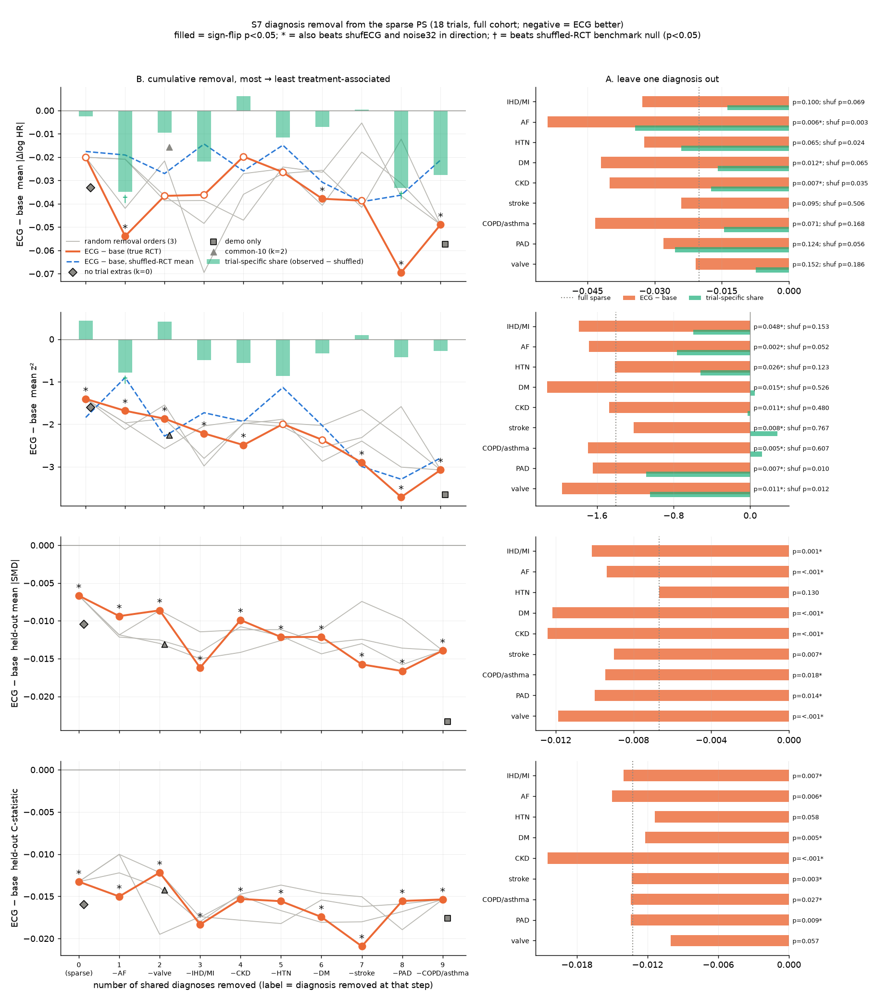
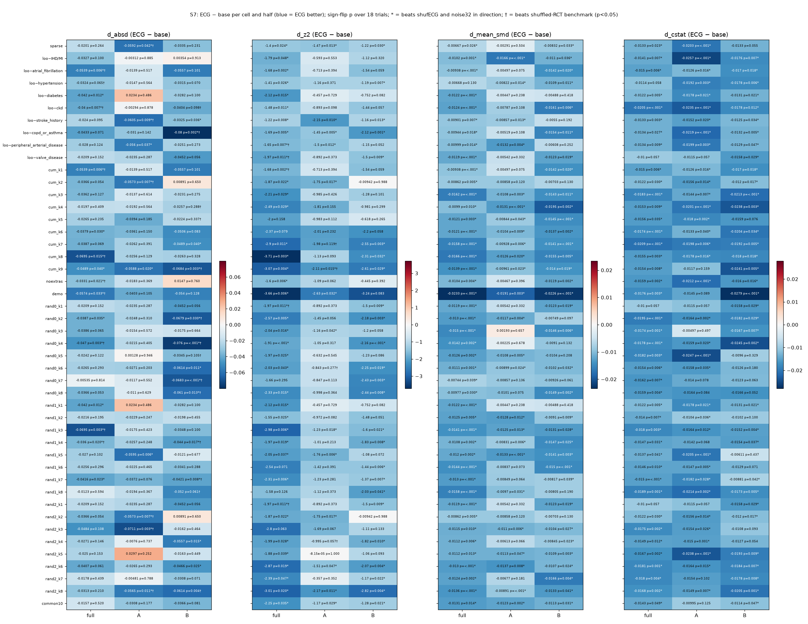

# v1.6 S7: structured removal of diagnoses from the sparse PS (2026-09-26)

**Exploratory, post-hoc specification (docs/V16_SWEEP_PLAN.md).** 18 trials; 1:1 greedy caliper-0.2 matching on an L2 (C=1) logistic PS; imputation 1, pool-split seed 0; primary outcome at the trial horizon. ECG = 32 BCL PCs. Placebos: `shufECG` (the same PCs with rows permuted by `T.shuffle_perm`) and `noise32`. Paired exact sign-flip across trials; d = mean over trials of (ECG arm − base). Negative d means ECG is better. BH-FDR is taken over the 46 cells per metric (ECG vs base, full cohort). The additional guardrails from `AUDIT_V16.md` are:
- a benchmark-shuffle permutation: RCT log HR and SE permuted jointly across trials, 5,000 draws in the full cohort and 2,000 in each half;
- a comparator-clustered sign-flip over the 10 clusters of `audit_v16.CLUSTER`;
- the leave-one-trial-out maximum p.

Script: `scripts/v16/s7_dxremoval.py`. Aggregates: `/mnt/raid0/rbc58/ecg-tte/audits/claude-v16-s7-dxremoval/` (`results.csv`, `summary_ecg.csv`, `summary_specificity.csv`, `summary_substitution.csv`, `profile_shared.csv`, `spec.json`).

## Key findings (plain language)

Central question: at how many (and which) removed diagnoses does the ECG gain become significant **and** specific to each trial's own RCT? And which diagnoses does the ECG substitute for?

1. **Balance on held-out variables. ECG's gain roughly doubles once diagnoses are removed, and this depends on how many are removed, not which ones.**
   - **Size of the gain (ECG − base mean |SMD|).**
     - Full sparse: −0.0067 (p = 0.026). This does not survive clustering (cluster p = 0.105) and is not significant in half A (p = 0.50).
     - One diagnosis removed: −0.009 to −0.012 (8 of 9 leave-one-out cells p ≤ 0.018; hypertension p = 0.13).
     - Three to nine removed: −0.010 to −0.017.
     - Demo only: −0.023.
   - **Random removal orders give the same curve** (−0.007 to −0.016), so the amount removed matters, not the particular diagnosis.
   - **How many cells pass each criterion.**
     - 45/46 cells are ECG-specific in direction and pass FDR, and 44 of them beat both placebos at p < 0.05.
     - 19/46 also reach p < 0.05 in both split halves and survive clustering plus leave-one-out: cum k = 3–9, demo, common-10, leave-out IHD/MI, and 9 random-order cells.
   - **Held-out C-statistic:** 25/46 cells meet all four criteria (significance, placebo, FDR, both halves); 21 of them also survive clustering and leave-one-out.
   - **This is the robust S7 result.**
2. **RCT agreement, |Δlog HR|: no cell meets every criterion, and no clean dose–response appears.**
   - **Nominal results.** ECG − base |Δ| is nominally significant in 15/46 cells. **None passes within-sweep FDR** (minimum q = 0.063). Only 1 beats both placebos at p < 0.05, and only 3 reach p < 0.05 in both halves (1 if full-cohort significance is also required; AUDIT_V16_ROUND2 §5).
   - **The best single cell: removing atrial fibrillation.** This is the most treatment-associated flag and also the one the ECG predicts best (cross-fitted AUC 0.71). Here:
     - d = −0.054 (14/18 trials, p = 0.006);
     - about 2/3 of it is trial-specific: shuffled-RCT mean −0.020, specific share −0.034, benchmark-shuffle p = 0.003, and BH over the 46 cells q = 0.049 (0.055 over the 42 distinct designs; 0.18 under the global S1–S7 BH, AUDIT_V16_ROUND2);
     - it survives comparator clustering (p = 0.025, 10 clusters) and leave-one-trial-out (max p = 0.012).
   - **The AF cell still fails three criteria:**
     - FDR on the sign-flip (q = 0.063);
     - shufECG, which it beats in direction only (p = 0.34);
     - the split halves: A d = −0.014 (p = 0.52), B d = −0.056 (p = 0.10).
   - **Mechanism.** The sparse−AF+ECG arm has the same |Δ| as sparse+ECG (0.162). The "gain" arises because the base worsens without AF (0.182 → 0.216) while ECG makes the AF flag redundant for the HR estimate. The largest single trial (transform-hf) contributes 28% of Σ\|d\|.
   - **Other cells.** Of the other cells, those that are significant and benchmark-specific are cum k = 8, CKD, no-extras, demo and two random-order cells (rand0_k4, rand1_k3). They are scattered, show no monotone pattern, and none passes FDR or replicates in both halves.
   - **Across the cumulative path, the trial-specific share is not monotone in k** (curve figure). So there is no "threshold number of removed diagnoses" beyond which the |Δ| gain becomes trial-specific.
3. **RCT agreement, z²: the gain is significant almost everywhere but almost never trial-specific.**
   - ECG − base z² is p < 0.05 in 40/46 cells and passes FDR in 37. It grows from −1.4 (sparse) to about −3 to −3.7 (cum k = 7–9, demo).
   - The shuffled-benchmark null grows in step (for example cum k = 8: −3.71 vs null −3.29; demo −3.66 vs −3.60).
   - **Benchmark-specific z² (shuffle p < 0.05) occurs only when a single diagnosis is removed:** PAD (p = 0.010), valve disease (p = 0.012) and, borderline, AF (p = 0.050–0.052).
     - Only leave-out-PAD also survives clustering (0.020) and leave-one-out (0.013), and it is p < 0.05 in half A only (half B p = 0.052).
     - The cells that pass all four sweep criteria for z² (sparse, leave-out stroke, leave-out COPD/asthma, cum k = 9, rand2_k8) all have shuffle p ≥ 0.37. Their gain is generic shrinkage toward typical RCT effects, not each trial's own RCT.
4. **Which diagnoses does ECG substitute for?**
   - **Balance on the removed flag itself: little direct substitution.** Removing a flag raises its own matched |SMD| from about 0.02 to 0.04–0.16. Adding ECG recovers only 0–18% of that. It is significant only for valve disease (18% recovered, 14/18 trials, p = 0.015; vs shufECG p = 0.095) and borderline for CKD (10%, p = 0.051). For AF, despite the highest ECG AUC, the recovery is 8.5% (p = 0.27).
   - **Aggregate substitution.** The ECG arm with k removed flags is statistically indistinguishable from the full sparse base without ECG for every k (at k ≥ 4: |Δ| −0.010 to +0.014, p ≥ 0.47; mean |SMD| −0.003 to −0.0005, p ≥ 0.47). It is better than full sparse for k = 1 (removing AF: z² p = 0.015, mean |SMD| p = 0.005). The demo+ECG arm is not significantly worse than sparse without ECG (|Δ| +0.026, p = 0.36).
   - **Caveat on the aggregate result.** Non-inferiority was not tested formally. The removed diagnoses themselves cost little: removing any one flag changes base |Δ| by only +0.013 to +0.035 (all p > 0.05) and base mean |SMD| by −0.003 to +0.003.
   - **Reading.** ECG substitutes for the diagnoses mainly through their association with the *outcome and the rest of the panel*, not by rebalancing the coded flag itself. AF and valve disease are the clearest cases.
5. **Common set of 10 variables** (age, sex, index year + hypertension, IHD/MI, AF, diabetes, valve disease, COPD/asthma, CKD, which are the 7 most prevalent shared flags; stroke, PAD and the trial extras are dropped):
   - balance gains are robust (mean |SMD| −0.013; all four criteria + cluster);
   - z² −2.25 (p = 0.035) is not benchmark-specific (shuffle p = 0.75);
   - |Δ| −0.016 (p = 0.52) is null.
6. **Trial-specific extras** (heart failure, TIA, prior bleed, ...; 10 trials):
   - Removing only the extras raises the ECG |Δ| gain from −0.020 to −0.033 (p = 0.021; shuffle p = 0.023; cluster p = 0.025; LOO max p = 0.042). This fails FDR (q = 0.095), the placebo tests (p = 0.18/0.08) and the halves (A p = 0.37, B d = +0.015).
   - Going from cum k = 9 (demo + extras) to demo only raises the balance gain from −0.014 to −0.023.

**Bottom line.** Stripping diagnoses from the sparse PS makes ECG's **balance** contribution larger and robust (ECG-specific, FDR, both halves, clustering, leave-one-out) from about 3 removed diagnoses onward. The contribution depends on the number removed, not on which. For **RCT agreement**, no number of removed diagnoses gives a gain that is significant, placebo-beating, FDR-surviving, replicated in both halves and benchmark-specific. The only cell that is significant, benchmark-specific and cluster/LOO-robust is **removing AF** (|Δ| −0.054, 2/3 trial-specific), and it fails FDR, the shufECG test and half replication. The mechanism is that the base worsens when AF is dropped (+0.035, p = 0.10) while the ECG arm does not (+0.0007). ECG rebalances the AF flag itself by only 8.5% (p = 0.27), so this is not direct evidence that the ECG encodes AF. With only 18 trials and post-hoc selection among 46 cells it is hypothesis-generating. The z² gain grows with removal, but so does its shuffled-benchmark null. It is shrinkage toward the null, not agreement with each trial's RCT.

Figure. Left column (B): x = number of shared diagnoses removed, cumulatively from most to least treatment-associated (the tick labels give the diagnosis removed at each step).
- Orange line: ECG − base. Filled points = p < 0.05 and ECG better; * = also beats shufECG and noise32 in direction.
- Grey lines: 3 random removal orders.
- Dashed blue: mean ECG − base over 5,000 shuffled-RCT draws.
- Green bars: trial-specific share (observed − shuffled mean); † = benchmark-shuffle p < 0.05.
- Grey markers: no-extras (k = 0), common-10 (k = 2 shared removed + extras), demo only.

Right column (A): leave-one-diagnosis-out, orange = ECG − base, green = trial-specific share; dotted line = full sparse.

## Design

**Diagnosis profile** (unmatched full cohort, mean over the 18 trials; `profile_shared.csv`). The order for B is set by treatment association (mean |SMD|), and the set for C by prevalence. "AUC from ECG" is the 5-fold cross-fitted L2 logistic AUC of the flag from the 32 ECG PCs.

| flag | mean \|SMD\| treatment | rank (removal order) | mean prevalence | common-10 | AUC from ECG |
|---|---|---|---|---|---|
| atrial_fibrillation | 0.205 | 1 | 40% | yes | 0.706 |
| valve_disease | 0.200 | 2 | 29% | yes | 0.624 |
| ischemic_heart_disease_or_mi | 0.190 | 3 | 42% | yes | 0.647 |
| ckd | 0.186 | 4 | 20% | yes | 0.642 |
| hypertension | 0.123 | 5 | 75% | yes | 0.578 |
| diabetes | 0.114 | 6 | 38% | yes | 0.627 |
| stroke_history | 0.093 | 7 | 9% | no | 0.564 |
| peripheral_arterial_disease | 0.084 | 8 | 8% | no | 0.612 |
| copd_or_asthma | 0.074 | 9 | 22% | yes | 0.590 |

Trial-specific extras (trials having them): heart_failure (9), tia (5), prior_bleed (3), liver_disease (3), gi_bleed / prior_pci_cabg_z / stemi_30d (1 each). Eight trials have no extras, so for them noextras = sparse and cum k = 9 = demo.

**Random orders** (rng 7070 + r), abbreviated:
- rand0: valve, stroke, COPD, PAD, IHD, AF, DM, HTN, CKD;
- rand1: DM, CKD, AF, PAD, valve, COPD, HTN, stroke, IHD;
- rand2: valve, AF, DM, stroke, COPD, HTN, IHD, CKD, PAD.

**Duplicate designs.** Some cells are identical by construction and give identical numbers: cum_k1 = loo_AF, rand0_k1 = rand2_k1 = loo_valve, and rand2_k2 = cum_k2. That leaves 42 distinct designs among the 46 cells, and all 46 are reported. The benchmark-shuffle p of duplicates differs only by Monte-Carlo error (for example 0.050 vs 0.052).

**Cells** (each run as base, +ECG, +shufECG, +noise32; unmatched once per trial/half; halves full/A/B):

| family | cells | base design |
|---|---|---|
| sparse | 1 | `T.demo + T.dxc` (k = 0) |
| A. loo | 9 | sparse minus one shared flag |
| B. cum | 9 | sparse minus the k most treatment-associated shared flags, k = 1..9 (k = 9 = demo + extras) |
| B. noextras | 1 | demo + 9 shared flags |
| B. demo | 1 | age, sex, index year |
| B. rand | 24 | 3 random orders × k = 1..8 (extras kept) |
| C. common10 | 1 | demo + 7 most prevalent shared flags |

Additional per-arm output: the |SMD| in the matched sample of every sparse flag (`smdflag:*`), taken from the matched set captured inside `run_cell`.

## Audit (done before and after the full run)

- **Pilot (comet, rely), then all 18 trials: the default cell reproduces the engine exactly.** Base = sparse and +ECG match `claude-v16-engine/validation_estimates.csv` (log HR, SE, pair counts, mean |SMD|, C-statistic): max |deviation| 0 in all 18 trials. The unmatched arm also matches exactly.
- **The demo cell equals the S1 `r1_demo` rung** in all four arms (max |Δlog HR| 0, identical pair counts).
- **Duplicate designs are numerically identical** (max |Δ| 0).
- **Design dimensions are as intended.** For comet (no extras), cum_k9 ≡ demo and noextras ≡ sparse; for rely (extras) they differ, as intended.
- **The removed-flag diagnostic behaves as expected.** Removing a flag raises its matched |SMD| (for example comet AF 0.10 → 0.47, rely valve 0.03 → 0.27).
- **Placebo null** across the 46 full-cohort cells (placebo − base mean d; cells significantly better / worse):
  - noise32: |Δ| +0.004 (0/1), z² +0.02 (0/0), mean |SMD| +0.0005 (1/0), C +0.0014 (0/1).
  - shufECG: |Δ| −0.007 (1/0), z² −0.21 (1/0), mean |SMD| +0.0006 (2/2), C +0.0013 (1/4).
  - The shufECG |Δ| null leans slightly favourable. This makes "ECG beats shufECG" on |Δ| slightly harder, not easier.
- **Pair counts.** The ECG/base pair ratio has median 1.000 (mean 0.986, minimum 0.84, in a trial where ECG strongly separates arms). For the placebos the median is 1.000 and the minimum 0.94. For each half, pairs(A) + pairs(B) / pairs(full) has median 0.999 (range 0.95–1.04).
- **Engine speed-up.** For speed, `E.sign_flip` is replaced in-process by an identical exact implementation with a cached sign matrix; its output was checked to be equal to `v13_summarize.sign_flip`. The matched-set capture wraps `v16_engine.match` without changing its call.
- **Limitations.**
  - The cells are nested and correlated, so 46 cells are not independent tests.
  - The halves come from the same 18 trials, and the rosters overlap (AUDIT_V16 check 7).
  - The removal order is estimated on the full cohort (treatment only, no outcomes) and reused in the halves.
  - Pool-B held-out codes include ICD roots of some removed flags (AUDIT_V16 check 2). After removal they act as a partially held-out check, which applies equally to the base and ECG arms.

## Synthesis per metric (full cohort; counts over 46 cells)

| metric | p<0.05 & ECG better | + FDR q<0.05 | + both placebos p<0.05 | p<0.05 in both halves | all four | all four + cluster p<0.05 + LOO max p<0.05 | significant & benchmark-shuffle p<0.05 | ... + cluster + LOO |
|---|---|---|---|---|---|---|---|---|
| \|Δlog HR\| | 15 | 0 | 1 | 3 | 0 | 0 | 9 | 5 cells = 4 distinct designs (loo_AF ≡ cum_k1, noextras, rand0_k4, rand1_k3) |
| z² | 40 | 37 | 23 | 8 | 5 | 4 | 5 | 2 cells = 2 distinct designs (loo_PAD, cum_k1; cum_k1 ≡ loo_AF, whose own shuffle p is 0.052 vs 0.050 by Monte-Carlo error) |
| mean \|SMD\| | 45 | 45 | 44 | 20 | 19 | 19 | – | – |
| C-statistic | 42 | 41 | 40 | 26 | 25 | 21 | – | – |

Cells that are significant and benchmark-specific (`summary_specificity.csv`):

| metric | cell | d | p | q | trial-specific share | shuffle p | shuffle BH q | cluster p | LOO max p | vs shufECG p | vs noise p | half A d (p) | half B d (p) |
|---|---|---|---|---|---|---|---|---|---|---|---|---|---|
| \|Δ\| | loo_AF (= cum_k1) | −0.054 | 0.006 | 0.063 | −0.034 | 0.003 | 0.049 | 0.025 | 0.012 | 0.339 | 0.011 | −0.014 (0.517) | −0.056 (0.101) |
| \|Δ\| | loo_ckd | −0.040 | 0.007 | 0.063 | −0.017 | 0.035 | 0.187 | 0.064 | 0.014 | 0.008 | 0.724 | −0.003 (0.878) | −0.040 (0.098) |
| \|Δ\| | cum_k8 | −0.069 | 0.015 | 0.087 | −0.033 | 0.026 | 0.187 | 0.070 | 0.030 | <.001 | 0.007 | −0.026 (0.129) | −0.026 (0.328) |
| \|Δ\| | noextras | −0.033 | 0.021 | 0.095 | −0.017 | 0.023 | 0.187 | 0.025 | 0.042 | 0.175 | 0.075 | −0.018 (0.369) | +0.015 (0.760) |
| \|Δ\| | demo | −0.057 | 0.033 | 0.114 | −0.030 | 0.041 | 0.187 | 0.238 | 0.066 | 0.083 | 0.120 | −0.040 (0.105) | −0.054 (0.128) |
| \|Δ\| | rand0_k4 | −0.047 | 0.003 | 0.063 | −0.022 | 0.038 | 0.187 | 0.033 | 0.005 | 0.144 | 0.004 | −0.022 (0.405) | −0.076 (0.001) |
| \|Δ\| | rand1_k3 | −0.069 | 0.003 | 0.063 | −0.041 | 0.001 | 0.049 | 0.020 | 0.006 | 0.066 | 0.001 | −0.017 (0.423) | −0.035 (0.100) |
| \|Δ\| | rand1_k4 | −0.036 | 0.020 | 0.095 | −0.016 | 0.035 | 0.187 | 0.055 | 0.041 | 0.359 | 0.234 | −0.026 (0.248) | −0.044 (0.017) |
| z² | loo_PAD | −1.65 | 0.007 | 0.025 | −1.09 | 0.010 | 0.143 | 0.020 | 0.013 | 0.059 | 0.026 | −1.50 (0.012) | −1.15 (0.052) |
| z² | loo_valve (= rand0_k1 = rand2_k1) | −1.97 | 0.011 | 0.028 | −1.05 | 0.012 | 0.143 | 0.066 | 0.021 | 0.024 | 0.040 | −0.89 (0.373) | −1.50 (0.009) |
| z² | cum_k1 (= loo_AF) | −1.68 | 0.002 | 0.025 | −0.78 | 0.050 | 0.371 | 0.016 | 0.004 | 0.039 | 0.003 | −0.71 (0.394) | −1.54 (0.059) |

Substitution (full cohort, leave-one-out; `summary_substitution.csv`). "Cost" = base(sparse − f) − base(sparse); "ECG" = ECG − base within the loo cell. The flag |SMD| is the matched |SMD| of the removed flag f.

| flag | flag \|SMD\| sparse → loo base → loo +ECG | ECG recovery of flag \|SMD\| (k better; p) | vs shufECG p | cost \|Δ\| (p) | ECG \|Δ\| (p) | cost mean \|SMD\| | ECG mean \|SMD\| |
|---|---|---|---|---|---|---|---|
| IHD/MI | 0.018 → 0.098 → 0.097 | 1% (9/18; 0.97) | 0.41 | +0.035 (0.16) | −0.033 (0.10) | +0.0005 | −0.0102 |
| AF | 0.025 → 0.156 → 0.145 | 8% (10/18; 0.27) | 0.006 | +0.035 (0.10) | −0.054 (0.006) | −0.0025 | −0.0094 |
| HTN | 0.019 → 0.086 → 0.081 | 8% (10/18; 0.42) | 0.59 | +0.020 (0.29) | −0.032 (0.065) | −0.0010 | −0.0067 |
| DM | 0.020 → 0.060 → 0.053 | 17% (12/18; 0.30) | 0.39 | +0.019 (0.069) | −0.042 (0.012) | +0.0015 | −0.0122 |
| CKD | 0.021 → 0.146 → 0.133 | 10% (12/18; 0.051) | 0.58 | +0.019 (0.099) | −0.040 (0.007) | +0.0028 | −0.0124 |
| stroke | 0.024 → 0.071 → 0.068 | 6% (12/18; 0.70) | 0.21 | +0.018 (0.13) | −0.024 (0.095) | −0.0006 | −0.0090 |
| COPD/asthma | 0.025 → 0.048 → 0.047 | 1% (10/18; 0.97) | 1.00 | +0.019 (0.30) | −0.043 (0.071) | −0.0010 | −0.0094 |
| PAD | 0.016 → 0.038 → 0.039 | −5% (7/18; 0.85) | 0.40 | +0.013 (0.30) | −0.028 (0.12) | −0.0007 | −0.0100 |
| valve | 0.019 → 0.130 → 0.110 | 18% (14/18; 0.015) | 0.095 | +0.019 (0.35) | −0.021 (0.15) | +0.0028 | −0.0119 |

ECG arm at each cell vs the full-sparse base without ECG (per-trial sign-flip; does ECG + reduced PS match the full sparse PS?):

| cell | \|Δ\| | z² | mean \|SMD\| | C-stat |
|---|---|---|---|---|
| cum_k1 (−AF) | −0.019 (p = 0.066) | −0.97 (0.015) | −0.0119 (0.005) | −0.0106 (0.10) |
| cum_k2 | −0.032 (0.052) | −1.37 (0.033) | −0.0063 (0.11) | −0.0028 (0.51) |
| cum_k3 | −0.018 (0.30) | −1.17 (0.095) | −0.0074 (0.10) | −0.0026 (0.63) |
| cum_k4 | +0.005 (0.88) | −0.67 (0.17) | −0.0021 (0.62) | +0.0030 (0.50) |
| cum_k5 | −0.010 (0.49) | −0.51 (0.28) | −0.0014 (0.75) | +0.0056 (0.35) |
| cum_k6 | −0.008 (0.50) | −0.28 (0.55) | −0.0012 (0.76) | +0.0051 (0.36) |
| cum_k7 | +0.011 (0.54) | −0.02 (0.97) | −0.0005 (0.91) | +0.0033 (0.53) |
| cum_k8 | +0.004 (0.82) | +0.04 (0.93) | −0.0007 (0.88) | +0.0062 (0.17) |
| cum_k9 | +0.014 (0.48) | +0.45 (0.37) | −0.0027 (0.47) | +0.0053 (0.23) |
| noextras | −0.019 (0.16) | −1.33 (0.023) | −0.0069 (0.095) | −0.0089 (0.19) |
| demo | +0.026 (0.36) | +1.41 (0.12) | +0.0042 (0.37) | +0.0132 (0.063) |
| common10 | +0.018 (0.39) | −0.53 (0.55) | −0.0081 (0.088) | −0.0077 (0.39) |

## Full tables (all 46 cells; generated by `s7_dxremoval.py summarize`)

Entry: d (trials ECG better / n; sign-flip p; BH q over 46 cells in 'full'). **S** = ECG-specific significant (p < 0.05, and ECG beats shufECG and noise32 in direction). cons = % of trials with |z| < 1.96 (base → ECG); phi = dispersion Q/(k−1). Benchmark-shuffle columns: `bs_*_null_mean` = mean ECG − base with shuffled RCTs; `bs_*_specific` = observed − null mean; `bs_*_p` = P(null ≤ observed); `bh_q_bs_*` = BH over 46 cells. `cl_p` = comparator-clustered sign-flip (10 clusters), `cl_k` = clusters better, `loo_pmax` = max p when dropping one trial.

### ECG vs base, half = full

| cell | k_removed | n_trials | absd | z2 | mean_smd | cstat | cons base→ECG | phi base→ECG |
|---|---|---|---|---|---|---|---|---|
| sparse | 0 | 18 | -0.020 (14/18; p=0.264; q=0.312) | -1.403 (14/18; p=0.024; q=0.038) **S** | -0.007 (14/18; p=0.026; q=0.028) **S** | -0.013 (15/18; p=0.023; q=0.030) **S** | 61→78 | 4.70→3.41 |
| loo_ischemic_heart_disease_or_mi | 1 | 18 | -0.033 (12/18; p=0.100; q=0.180) | -1.788 (12/18; p=0.048; q=0.055) **S** | -0.010 (15/18; p=0.001; q=0.002) **S** | -0.014 (15/18; p=0.007; q=0.011) **S** | 67→72 | 5.70→3.96 |
| loo_atrial_fibrillation | 1 | 18 | -0.054 (14/18; p=0.006; q=0.063) **S** | -1.683 (15/18; p=0.002; q=0.025) **S** | -0.009 (16/18; p=<.001; q=0.001) **S** | -0.015 (13/18; p=0.006; q=0.011) **S** | 61→78 | 5.47→3.76 |
| loo_hypertension | 1 | 18 | -0.032 (12/18; p=0.065; q=0.141) | -1.414 (13/18; p=0.026; q=0.039) **S** | -0.007 (12/18; p=0.130; q=0.130) | -0.011 (11/18; p=0.058; q=0.058) | 67→72 | 4.85→3.62 |
| loo_diabetes | 1 | 18 | -0.042 (16/18; p=0.012; q=0.078) **S** | -2.122 (16/18; p=0.015; q=0.033) **S** | -0.012 (16/18; p=<.001; q=0.002) **S** | -0.012 (15/18; p=0.005; q=0.010) **S** | 56→72 | 5.42→3.27 |
| loo_ckd | 1 | 18 | -0.040 (14/18; p=0.007; q=0.063) **S** | -1.475 (14/18; p=0.011; q=0.028) **S** | -0.012 (15/18; p=<.001; q=0.002) **S** | -0.020 (17/18; p=<.001; q=0.004) **S** | 72→67 | 5.19→3.92 |
| loo_stroke_history | 1 | 18 | -0.024 (11/18; p=0.095; q=0.180) | -1.215 (13/18; p=0.008; q=0.028) **S** | -0.009 (16/18; p=0.007; q=0.009) **S** | -0.013 (14/18; p=0.003; q=0.007) **S** | 61→72 | 4.68→3.66 |
| loo_copd_or_asthma | 1 | 18 | -0.043 (14/18; p=0.071; q=0.141) | -1.693 (14/18; p=0.005; q=0.025) **S** | -0.009 (14/18; p=0.018; q=0.020) **S** | -0.013 (13/18; p=0.027; q=0.034) **S** | 61→78 | 4.99→3.51 |
| loo_peripheral_arterial_disease | 1 | 18 | -0.028 (12/18; p=0.124; q=0.195) | -1.646 (12/18; p=0.007; q=0.025) **S** | -0.010 (13/18; p=0.014; q=0.016) **S** | -0.013 (13/18; p=0.009; q=0.014) **S** | 61→78 | 5.03→3.26 |
| loo_valve_disease | 1 | 18 | -0.021 (12/18; p=0.152; q=0.200) | -1.967 (12/18; p=0.011; q=0.028) **S** | -0.012 (16/18; p=<.001; q=0.002) **S** | -0.010 (15/18; p=0.057; q=0.058) | 67→72 | 6.08→3.95 |
| cum_k1 | 1 | 18 | -0.054 (14/18; p=0.006; q=0.063) **S** | -1.683 (15/18; p=0.002; q=0.025) **S** | -0.009 (16/18; p=<.001; q=0.001) **S** | -0.015 (13/18; p=0.006; q=0.011) **S** | 61→78 | 5.47→3.76 |
| cum_k2 | 2 | 18 | -0.037 (12/18; p=0.054; q=0.137) | -1.869 (12/18; p=0.022; q=0.037) **S** | -0.009 (15/18; p=0.005; q=0.007) **S** | -0.012 (15/18; p=0.030; q=0.036) **S** | 67→72 | 5.59→3.57 |
| cum_k3 | 3 | 18 | -0.036 (12/18; p=0.127; q=0.195) | -2.215 (13/18; p=0.029; q=0.039) **S** | -0.016 (17/18; p=<.001; q=<.001) **S** | -0.018 (16/18; p=<.001; q=0.005) **S** | 67→72 | 6.11→3.68 |
| cum_k4 | 4 | 18 | -0.020 (12/18; p=0.409; q=0.448) | -2.489 (12/18; p=0.029; q=0.039) **S** | -0.010 (15/18; p=0.010; q=0.012) **S** | -0.015 (14/18; p=0.009; q=0.014) **S** | 67→72 | 6.82→4.11 |
| cum_k5 | 5 | 18 | -0.026 (12/18; p=0.235; q=0.285) | -1.995 (12/18; p=0.158; q=0.161) | -0.012 (15/18; p=0.003; q=0.004) **S** | -0.016 (14/18; p=0.035; q=0.040) **S** | 72→72 | 6.43→4.35 |
| cum_k6 | 6 | 18 | -0.038 (13/18; p=0.030; q=0.114) **S** | -2.366 (12/18; p=0.079; q=0.085) | -0.012 (16/18; p=<.001; q=<.001) **S** | -0.017 (16/18; p=<.001; q=0.005) **S** | 67→67 | 7.05→4.37 |
| cum_k7 | 7 | 18 | -0.039 (13/18; p=0.069; q=0.141) | -2.900 (13/18; p=0.011; q=0.028) **S** | -0.016 (14/18; p=<.001; q=0.001) **S** | -0.021 (16/18; p=<.001; q=0.005) **S** | 61→67 | 7.83→4.60 |
| cum_k8 | 8 | 18 | -0.069 (15/18; p=0.015; q=0.087) **S** | -3.712 (15/18; p=0.003; q=0.025) **S** | -0.017 (16/18; p=<.001; q=0.001) **S** | -0.016 (13/18; p=0.003; q=0.008) **S** | 50→67 | 8.74→4.68 |
| cum_k9 | 9 | 18 | -0.049 (13/18; p=0.040; q=0.124) **S** | -3.073 (13/18; p=0.004; q=0.025) **S** | -0.014 (16/18; p=<.001; q=0.001) **S** | -0.015 (13/18; p=0.008; q=0.012) **S** | 61→72 | 8.16→5.24 |
| noextras | 0 | 18 | -0.033 (15/18; p=0.021; q=0.095) **S** | -1.603 (15/18; p=0.006; q=0.025) **S** | -0.010 (15/18; p=0.004; q=0.005) **S** | -0.016 (15/18; p=0.002; q=0.007) **S** | 61→78 | 5.06→3.36 |
| demo | 9 | 18 | -0.057 (14/18; p=0.033; q=0.114) **S** | -3.658 (14/18; p=0.006; q=0.025) **S** | -0.023 (17/18; p=<.001; q=<.001) **S** | -0.018 (15/18; p=0.003; q=0.008) **S** | 56→61 | 9.76→6.08 |
| rand0_k1 | 1 | 18 | -0.021 (12/18; p=0.152; q=0.200) | -1.967 (12/18; p=0.011; q=0.028) **S** | -0.012 (16/18; p=<.001; q=0.002) **S** | -0.010 (15/18; p=0.057; q=0.058) | 67→72 | 6.08→3.95 |
| rand0_k2 | 2 | 18 | -0.039 (13/18; p=0.035; q=0.114) **S** | -2.572 (13/18; p=0.005; q=0.025) **S** | -0.013 (17/18; p=<.001; q=<.001) **S** | -0.019 (16/18; p=<.001; q=0.005) **S** | 50→78 | 6.32→3.78 |
| rand0_k3 | 3 | 18 | -0.039 (13/18; p=0.065; q=0.141) | -2.038 (13/18; p=0.016; q=0.033) **S** | -0.015 (17/18; p=<.001; q=<.001) **S** | -0.017 (14/18; p=0.001; q=0.006) **S** | 72→72 | 5.58→3.67 |
| rand0_k4 | 4 | 18 | -0.047 (14/18; p=0.003; q=0.063) **S** | -1.914 (14/18; p=<.001; q=0.015) **S** | -0.014 (15/18; p=0.002; q=0.003) **S** | -0.018 (15/18; p=<.001; q=0.005) **S** | 56→72 | 5.97→4.25 |
| rand0_k5 | 5 | 18 | -0.024 (11/18; p=0.122; q=0.195) | -1.970 (11/18; p=0.025; q=0.038) **S** | -0.013 (15/18; p=0.002; q=0.003) **S** | -0.018 (15/18; p=0.003; q=0.007) **S** | 61→67 | 6.60→4.51 |
| rand0_k6 | 6 | 18 | -0.026 (12/18; p=0.293; q=0.332) | -2.028 (13/18; p=0.043; q=0.052) **S** | -0.011 (15/18; p=0.001; q=0.002) **S** | -0.015 (14/18; p=0.006; q=0.011) **S** | 50→67 | 6.94→4.75 |
| rand0_k7 | 7 | 18 | -0.005 (9/18; p=0.814; q=0.814) | -1.655 (9/18; p=0.295; q=0.295) | -0.007 (12/18; p=0.039; q=0.040) **S** | -0.016 (14/18; p=0.007; q=0.011) **S** | 72→67 | 6.50→4.78 |
| rand0_k8 | 8 | 18 | -0.037 (12/18; p=0.053; q=0.137) | -2.331 (12/18; p=0.015; q=0.033) **S** | -0.010 (14/18; p=0.030; q=0.031) **S** | -0.016 (16/18; p=0.004; q=0.009) **S** | 61→67 | 7.25→4.92 |
| rand1_k1 | 1 | 18 | -0.042 (16/18; p=0.012; q=0.078) **S** | -2.122 (16/18; p=0.015; q=0.033) **S** | -0.012 (16/18; p=<.001; q=0.002) **S** | -0.012 (15/18; p=0.005; q=0.010) **S** | 56→72 | 5.42→3.27 |
| rand1_k2 | 2 | 18 | -0.022 (13/18; p=0.195; q=0.249) | -1.547 (13/18; p=0.025; q=0.038) **S** | -0.013 (14/18; p=0.005; q=0.007) **S** | -0.014 (16/18; p=0.007; q=0.011) **S** | 61→72 | 5.64→4.02 |
| rand1_k3 | 3 | 18 | -0.069 (13/18; p=0.003; q=0.063) **S** | -2.981 (14/18; p=0.006; q=0.025) **S** | -0.014 (14/18; p=<.001; q=0.002) **S** | -0.018 (15/18; p=0.003; q=0.007) **S** | 67→72 | 6.41→3.55 |
| rand1_k4 | 4 | 18 | -0.036 (13/18; p=0.020; q=0.095) **S** | -1.971 (13/18; p=0.019; q=0.036) **S** | -0.011 (14/18; p=0.002; q=0.004) **S** | -0.015 (15/18; p=0.031; q=0.036) **S** | 72→72 | 5.93→3.93 |
| rand1_k5 | 5 | 18 | -0.027 (13/18; p=0.102; q=0.180) | -2.055 (13/18; p=0.037; q=0.047) **S** | -0.012 (14/18; p=0.002; q=0.003) **S** | -0.014 (14/18; p=0.041; q=0.046) **S** | 67→72 | 6.56→4.24 |
| rand1_k6 | 6 | 18 | -0.026 (11/18; p=0.296; q=0.332) | -2.541 (11/18; p=0.071; q=0.078) | -0.014 (15/18; p=<.001; q=0.002) **S** | -0.015 (14/18; p=0.010; q=0.014) **S** | 61→67 | 6.99→4.26 |
| rand1_k7 | 7 | 18 | -0.042 (12/18; p=0.023; q=0.095) **S** | -2.312 (12/18; p=0.006; q=0.025) **S** | -0.013 (16/18; p=<.001; q=<.001) **S** | -0.015 (16/18; p=<.001; q=0.005) **S** | 67→72 | 6.98→4.53 |
| rand1_k8 | 8 | 18 | -0.012 (12/18; p=0.594; q=0.607) | -1.583 (12/18; p=0.126; q=0.132) | -0.016 (16/18; p=<.001; q=0.001) **S** | -0.019 (15/18; p=0.001; q=0.006) **S** | 61→61 | 7.16→5.52 |
| rand2_k1 | 1 | 18 | -0.021 (12/18; p=0.152; q=0.200) | -1.967 (12/18; p=0.011; q=0.028) **S** | -0.012 (16/18; p=<.001; q=0.002) **S** | -0.010 (15/18; p=0.057; q=0.058) | 67→72 | 6.08→3.95 |
| rand2_k2 | 2 | 18 | -0.037 (12/18; p=0.054; q=0.137) | -1.869 (12/18; p=0.022; q=0.037) **S** | -0.009 (15/18; p=0.005; q=0.007) **S** | -0.012 (15/18; p=0.030; q=0.036) **S** | 67→72 | 5.59→3.57 |
| rand2_k3 | 3 | 18 | -0.048 (12/18; p=0.108; q=0.184) | -2.801 (12/18; p=0.063; q=0.071) | -0.011 (15/18; p=0.010; q=0.012) **S** | -0.017 (14/18; p=0.002; q=0.007) **S** | 67→78 | 6.54→3.49 |
| rand2_k4 | 4 | 18 | -0.027 (11/18; p=0.146; q=0.200) | -1.987 (11/18; p=0.028; q=0.039) **S** | -0.011 (15/18; p=0.006; q=0.008) **S** | -0.015 (13/18; p=0.012; q=0.016) **S** | 72→78 | 6.11→3.88 |
| rand2_k5 | 5 | 18 | -0.025 (11/18; p=0.153; q=0.200) | -1.882 (11/18; p=0.039; q=0.048) **S** | -0.011 (14/18; p=0.013; q=0.015) **S** | -0.017 (15/18; p=0.002; q=0.007) **S** | 67→72 | 6.35→4.27 |
| rand2_k6 | 6 | 18 | -0.041 (12/18; p=0.061; q=0.141) | -2.870 (13/18; p=0.019; q=0.036) **S** | -0.013 (15/18; p=<.001; q=0.001) **S** | -0.018 (16/18; p=0.001; q=0.006) **S** | 61→67 | 7.81→4.60 |
| rand2_k7 | 7 | 18 | -0.018 (10/18; p=0.439; q=0.470) | -2.395 (10/18; p=0.047; q=0.055) **S** | -0.012 (14/18; p=0.002; q=0.003) **S** | -0.018 (16/18; p=0.004; q=0.008) **S** | 61→72 | 7.40→4.69 |
| rand2_k8 | 8 | 18 | -0.031 (12/18; p=0.210; q=0.261) | -3.007 (12/18; p=0.020; q=0.037) **S** | -0.014 (16/18; p=<.001; q=0.002) **S** | -0.017 (14/18; p=0.002; q=0.007) **S** | 56→67 | 7.83→4.72 |
| common10 | 2 | 18 | -0.016 (10/18; p=0.520; q=0.544) | -2.255 (10/18; p=0.035; q=0.046) **S** | -0.013 (15/18; p=0.014; q=0.016) **S** | -0.014 (15/18; p=0.049; q=0.053) **S** | 61→72 | 6.52→4.04 |

### ECG vs base, half = A

| cell | k_removed | n_trials | absd | z2 | mean_smd | cstat | cons base→ECG | phi base→ECG |
|---|---|---|---|---|---|---|---|---|
| sparse | 0 | 18 | -0.059 (14/18; p=0.042) **S** | -1.475 (14/18; p=0.013) **S** | -0.003 (13/18; p=0.504) | -0.020 (16/18; p=<.001) **S** | 67→72 | 4.50→3.13 |
| loo_ischemic_heart_disease_or_mi | 1 | 18 | -0.003 (8/18; p=0.885) | -0.593 (8/18; p=0.553) | -0.017 (16/18; p=<.001) **S** | -0.026 (16/18; p=<.001) **S** | 78→72 | 4.36→3.71 |
| loo_atrial_fibrillation | 1 | 18 | -0.014 (13/18; p=0.517) | -0.713 (12/18; p=0.394) | -0.005 (12/18; p=0.075) | -0.013 (14/18; p=0.016) **S** | 72→72 | 3.78→3.28 |
| loo_hypertension | 1 | 18 | -0.015 (13/18; p=0.564) | -1.161 (13/18; p=0.371) | -0.008 (13/18; p=0.014) **S** | -0.019 (13/18; p=0.003) **S** | 72→78 | 4.32→3.02 |
| loo_diabetes | 1 | 18 | +0.023 (10/18; p=0.486) | -0.457 (10/18; p=0.729) | -0.004 (12/18; p=0.238) | -0.018 (15/18; p=0.021) **S** | 67→78 | 4.02→3.88 |
| loo_ckd | 1 | 18 | -0.003 (8/18; p=0.878) | -0.893 (8/18; p=0.098) | -0.008 (11/18; p=0.108) | -0.024 (15/18; p=<.001) **S** | 67→72 | 4.53→3.78 |
| loo_stroke_history | 1 | 18 | -0.060 (12/18; p=0.009) **S** | -2.146 (12/18; p=0.010) **S** | -0.009 (13/18; p=0.013) **S** | -0.015 (13/18; p=0.020) **S** | 61→83 | 5.20→2.86 |
| loo_copd_or_asthma | 1 | 18 | -0.031 (12/18; p=0.142) | -1.448 (13/18; p=0.005) **S** | -0.005 (11/18; p=0.108) | -0.022 (15/18; p=<.001) **S** | 61→83 | 4.19→2.66 |
| loo_peripheral_arterial_disease | 1 | 18 | -0.056 (12/18; p=0.037) **S** | -1.501 (12/18; p=0.012) **S** | -0.013 (14/18; p=0.004) **S** | -0.020 (15/18; p=0.003) **S** | 67→83 | 4.71→3.16 |
| loo_valve_disease | 1 | 18 | -0.024 (11/18; p=0.287) | -0.892 (11/18; p=0.373) | -0.005 (12/18; p=0.332) | -0.012 (14/18; p=0.057) | 72→67 | 4.90→3.94 |
| cum_k1 | 1 | 18 | -0.014 (13/18; p=0.517) | -0.713 (12/18; p=0.394) | -0.005 (12/18; p=0.075) | -0.013 (14/18; p=0.016) **S** | 72→72 | 3.78→3.28 |
| cum_k2 | 2 | 18 | -0.057 (12/18; p=0.007) **S** | -1.750 (12/18; p=0.017) **S** | -0.009 (12/18; p=0.120) | -0.016 (15/18; p=0.014) **S** | 67→78 | 5.23→3.30 |
| cum_k3 | 3 | 18 | -0.014 (8/18; p=0.614) | -0.985 (8/18; p=0.426) | -0.011 (13/18; p=0.003) **S** | -0.014 (15/18; p=0.007) **S** | 72→72 | 5.09→3.99 |
| cum_k4 | 4 | 18 | -0.019 (9/18; p=0.564) | -1.812 (9/18; p=0.155) | -0.013 (17/18; p=<.001) **S** | -0.020 (15/18; p=<.001) **S** | 72→72 | 5.94→4.13 |
| cum_k5 | 5 | 18 | -0.039 (13/18; p=0.185) | -0.983 (14/18; p=0.112) | -0.008 (14/18; p=0.043) **S** | -0.018 (15/18; p=0.002) **S** | 67→67 | 5.34→4.58 |
| cum_k6 | 6 | 18 | -0.036 (11/18; p=0.150) | -2.008 (12/18; p=0.232) | -0.010 (14/18; p=0.009) **S** | -0.013 (12/18; p=0.040) **S** | 72→67 | 6.45→4.19 |
| cum_k7 | 7 | 18 | -0.026 (10/18; p=0.391) | -1.977 (11/18; p=0.119) | -0.009 (14/18; p=0.006) **S** | -0.020 (14/18; p=0.006) **S** | 67→61 | 6.88→4.84 |
| cum_k8 | 8 | 18 | -0.026 (12/18; p=0.129) | -1.133 (12/18; p=0.093) | -0.013 (14/18; p=0.020) **S** | -0.018 (14/18; p=0.016) **S** | 67→61 | 5.97→4.61 |
| cum_k9 | 9 | 18 | -0.059 (15/18; p=0.020) **S** | -2.112 (15/18; p=0.015) **S** | -0.010 (15/18; p=0.023) **S** | -0.012 (12/18; p=0.159) | 61→72 | 6.75→4.54 |
| noextras | 0 | 18 | -0.018 (13/18; p=0.369) | -1.091 (13/18; p=0.062) | -0.005 (12/18; p=0.396) | -0.021 (16/18; p=<.001) **S** | 67→72 | 4.13→3.07 |
| demo | 9 | 18 | -0.040 (14/18; p=0.105) | -2.625 (14/18; p=0.032) **S** | -0.019 (16/18; p=0.003) **S** | -0.015 (13/18; p=0.089) | 61→67 | 7.59→4.92 |
| rand0_k1 | 1 | 18 | -0.024 (11/18; p=0.287) | -0.892 (11/18; p=0.373) | -0.005 (12/18; p=0.332) | -0.012 (14/18; p=0.057) | 72→67 | 4.90→3.94 |
| rand0_k2 | 2 | 18 | -0.025 (11/18; p=0.310) | -1.453 (10/18; p=0.056) | -0.012 (15/18; p=0.004) **S** | -0.016 (16/18; p=0.002) **S** | 72→72 | 5.26→3.52 |
| rand0_k3 | 3 | 18 | -0.015 (12/18; p=0.572) | -1.155 (12/18; p=0.042) **S** | +0.002 (10/18; p=0.657) | -0.005 (12/18; p=0.497) | 72→78 | 4.63→3.50 |
| rand0_k4 | 4 | 18 | -0.022 (11/18; p=0.405) | -1.049 (11/18; p=0.317) | -0.002 (13/18; p=0.678) | -0.016 (15/18; p=0.020) **S** | 72→72 | 5.01→3.85 |
| rand0_k5 | 5 | 18 | +0.001 (11/18; p=0.946) | -0.632 (11/18; p=0.545) | -0.011 (13/18; p=0.005) **S** | -0.025 (15/18; p=<.001) **S** | 72→61 | 5.03→4.32 |
| rand0_k6 | 6 | 18 | -0.027 (12/18; p=0.203) | -0.843 (12/18; p=0.277) | -0.009 (14/18; p=0.024) **S** | -0.016 (13/18; p=0.035) **S** | 72→72 | 5.21→4.51 |
| rand0_k7 | 7 | 18 | -0.012 (11/18; p=0.552) | -0.847 (11/18; p=0.113) | -0.009 (16/18; p=0.136) | -0.014 (14/18; p=0.078) | 61→67 | 4.91→4.35 |
| rand0_k8 | 8 | 18 | -0.011 (10/18; p=0.629) | -0.998 (10/18; p=0.364) | -0.010 (13/18; p=0.075) | -0.016 (13/18; p=0.084) | 78→72 | 5.49→4.54 |
| rand1_k1 | 1 | 18 | +0.023 (10/18; p=0.486) | -0.457 (10/18; p=0.729) | -0.004 (12/18; p=0.238) | -0.018 (15/18; p=0.021) **S** | 67→78 | 4.02→3.88 |
| rand1_k2 | 2 | 18 | -0.023 (12/18; p=0.247) | -0.972 (12/18; p=0.082) | -0.013 (12/18; p=0.012) **S** | -0.010 (13/18; p=0.036) **S** | 72→78 | 4.76→3.65 |
| rand1_k3 | 3 | 18 | -0.017 (14/18; p=0.423) | -1.225 (14/18; p=0.018) **S** | -0.013 (14/18; p=0.013) **S** | -0.016 (15/18; p=0.012) **S** | 67→67 | 5.11→3.88 |
| rand1_k4 | 4 | 18 | -0.026 (11/18; p=0.248) | -1.011 (11/18; p=0.213) | -0.008 (15/18; p=0.006) **S** | -0.014 (13/18; p=0.068) | 72→78 | 4.76→3.77 |
| rand1_k5 | 5 | 18 | -0.060 (13/18; p=0.006) **S** | -1.756 (13/18; p=0.006) **S** | -0.013 (15/18; p=<.001) **S** | -0.020 (16/18; p=<.001) **S** | 72→78 | 5.60→3.89 |
| rand1_k6 | 6 | 18 | -0.022 (13/18; p=0.465) | -1.423 (13/18; p=0.391) | -0.008 (13/18; p=0.073) | -0.015 (15/18; p=0.005) **S** | 72→67 | 6.04→4.64 |
| rand1_k7 | 7 | 18 | -0.037 (9/18; p=0.076) | -1.233 (9/18; p=0.281) | -0.008 (15/18; p=0.064) | -0.018 (14/18; p=0.028) **S** | 72→78 | 5.57→4.08 |
| rand1_k8 | 8 | 18 | -0.019 (10/18; p=0.367) | -1.118 (10/18; p=0.373) | -0.010 (10/18; p=0.031) **S** | -0.021 (15/18; p=0.002) **S** | 72→67 | 5.16→3.88 |
| rand2_k1 | 1 | 18 | -0.024 (11/18; p=0.287) | -0.892 (11/18; p=0.373) | -0.005 (12/18; p=0.332) | -0.012 (14/18; p=0.057) | 72→67 | 4.90→3.94 |
| rand2_k2 | 2 | 18 | -0.057 (12/18; p=0.007) **S** | -1.750 (12/18; p=0.017) **S** | -0.009 (12/18; p=0.120) | -0.016 (15/18; p=0.014) **S** | 67→78 | 5.23→3.30 |
| rand2_k3 | 3 | 18 | -0.071 (13/18; p=0.003) **S** | -1.690 (14/18; p=0.067) | -0.011 (13/18; p=0.006) **S** | -0.015 (13/18; p=0.026) **S** | 67→67 | 5.41→3.43 |
| rand2_k4 | 4 | 18 | -0.008 (13/18; p=0.737) | -0.995 (13/18; p=0.057) | -0.006 (13/18; p=0.066) | -0.015 (15/18; p=0.001) **S** | 72→72 | 4.74→3.86 |
| rand2_k5 | 5 | 18 | +0.030 (7/18; p=0.252) | -0.000 (7/18; p=1.000) | -0.011 (14/18; p=0.047) **S** | -0.024 (16/18; p=<.001) **S** | 78→67 | 4.66→4.57 |
| rand2_k6 | 6 | 18 | -0.027 (12/18; p=0.293) | -1.507 (12/18; p=0.047) **S** | -0.014 (14/18; p=0.008) **S** | -0.016 (15/18; p=0.015) **S** | 67→72 | 5.09→3.70 |
| rand2_k7 | 7 | 18 | -0.005 (14/18; p=0.788) | -0.357 (13/18; p=0.352) | -0.007 (12/18; p=0.181) | -0.015 (13/18; p=0.102) | 78→72 | 4.29→4.07 |
| rand2_k8 | 8 | 18 | -0.056 (15/18; p=0.011) **S** | -2.174 (15/18; p=0.011) **S** | -0.009 (16/18; p=<.001) **S** | -0.015 (15/18; p=0.007) **S** | 61→67 | 6.44→4.28 |
| common10 | 2 | 18 | -0.031 (11/18; p=0.177) | -1.173 (11/18; p=0.029) **S** | -0.012 (13/18; p=0.002) **S** | -0.010 (11/18; p=0.125) | 61→78 | 4.52→3.43 |

### ECG vs base, half = B

| cell | k_removed | n_trials | absd | z2 | mean_smd | cstat | cons base→ECG | phi base→ECG |
|---|---|---|---|---|---|---|---|---|
| sparse | 0 | 18 | -0.034 (13/18; p=0.231) | -1.223 (13/18; p=0.030) **S** | -0.008 (12/18; p=0.033) **S** | -0.013 (13/18; p=0.055) | 61→78 | 3.52→2.17 |
| loo_ischemic_heart_disease_or_mi | 1 | 18 | +0.004 (9/18; p=0.913) | -1.118 (9/18; p=0.320) | -0.011 (12/18; p=0.036) **S** | -0.018 (14/18; p=0.007) **S** | 72→72 | 3.68→2.47 |
| loo_atrial_fibrillation | 1 | 18 | -0.056 (12/18; p=0.101) | -1.540 (12/18; p=0.059) | -0.014 (15/18; p=0.020) **S** | -0.017 (15/18; p=0.018) **S** | 72→83 | 3.54→1.80 |
| loo_hypertension | 1 | 18 | -0.032 (14/18; p=0.070) | -1.187 (14/18; p=0.007) **S** | -0.011 (13/18; p=0.011) **S** | -0.018 (14/18; p=0.006) **S** | 72→83 | 3.26→1.95 |
| loo_diabetes | 1 | 18 | -0.028 (11/18; p=0.100) | -0.752 (11/18; p=0.082) | -0.005 (14/18; p=0.418) | -0.013 (13/18; p=0.021) **S** | 72→78 | 3.22→2.57 |
| loo_ckd | 1 | 18 | -0.040 (11/18; p=0.098) | -1.443 (12/18; p=0.057) | -0.016 (14/18; p=0.006) **S** | -0.018 (13/18; p=0.012) **S** | 72→83 | 3.57→1.90 |
| loo_stroke_history | 1 | 18 | -0.033 (13/18; p=0.036) **S** | -1.157 (13/18; p=0.013) **S** | -0.006 (13/18; p=0.192) | -0.013 (12/18; p=0.034) **S** | 61→78 | 3.39→2.27 |
| loo_copd_or_asthma | 1 | 18 | -0.080 (15/18; p=0.002) **S** | -2.119 (15/18; p=0.001) **S** | -0.015 (16/18; p=0.011) **S** | -0.013 (14/18; p=0.005) **S** | 72→83 | 3.51→1.53 |
| loo_peripheral_arterial_disease | 1 | 18 | -0.025 (10/18; p=0.273) | -1.152 (10/18; p=0.052) | -0.006 (13/18; p=0.252) | -0.013 (15/18; p=0.047) **S** | 67→72 | 3.53→2.12 |
| loo_valve_disease | 1 | 18 | -0.045 (12/18; p=0.056) | -1.503 (12/18; p=0.009) **S** | -0.012 (15/18; p=0.019) **S** | -0.016 (11/18; p=0.029) **S** | 67→83 | 3.59→2.00 |
| cum_k1 | 1 | 18 | -0.056 (12/18; p=0.101) | -1.540 (12/18; p=0.059) | -0.014 (15/18; p=0.020) **S** | -0.017 (15/18; p=0.018) **S** | 72→83 | 3.54→1.80 |
| cum_k2 | 2 | 18 | +0.009 (9/18; p=0.650) | -0.009 (9/18; p=0.988) | -0.007 (14/18; p=0.130) | -0.012 (12/18; p=0.017) **S** | 78→67 | 3.21→3.20 |
| cum_k3 | 3 | 18 | -0.023 (11/18; p=0.275) | -1.282 (11/18; p=0.101) | -0.014 (13/18; p=0.011) **S** | -0.021 (16/18; p=<.001) **S** | 72→72 | 3.92→2.51 |
| cum_k4 | 4 | 18 | -0.026 (8/18; p=0.288) | -0.981 (9/18; p=0.299) | -0.020 (15/18; p=0.002) **S** | -0.024 (14/18; p=0.003) **S** | 72→72 | 3.96→2.85 |
| cum_k5 | 5 | 18 | -0.022 (10/18; p=0.337) | -0.618 (11/18; p=0.265) | -0.014 (17/18; p=<.001) **S** | -0.016 (10/18; p=0.076) | 72→72 | 3.93→3.13 |
| cum_k6 | 6 | 18 | -0.051 (13/18; p=0.083) | -2.204 (13/18; p=0.058) | -0.014 (14/18; p=0.002) **S** | -0.020 (13/18; p=0.034) **S** | 67→78 | 4.76→2.23 |
| cum_k7 | 7 | 18 | -0.049 (13/18; p=0.040) **S** | -2.551 (13/18; p=0.003) **S** | -0.014 (15/18; p=<.001) **S** | -0.019 (14/18; p=0.005) **S** | 56→72 | 5.23→2.43 |
| cum_k8 | 8 | 18 | -0.026 (11/18; p=0.328) | -2.313 (11/18; p=0.032) **S** | -0.016 (13/18; p=0.005) **S** | -0.018 (14/18; p=0.018) **S** | 61→72 | 6.06→3.54 |
| cum_k9 | 9 | 18 | -0.068 (15/18; p=0.003) **S** | -2.611 (15/18; p=0.029) **S** | -0.014 (13/18; p=0.019) **S** | -0.024 (14/18; p=0.005) **S** | 56→78 | 6.05→3.21 |
| noextras | 0 | 18 | +0.015 (12/18; p=0.760) | -0.445 (12/18; p=0.392) | -0.012 (14/18; p=0.002) **S** | -0.016 (14/18; p=0.016) **S** | 72→67 | 3.47→2.83 |
| demo | 9 | 18 | -0.054 (11/18; p=0.128) | -3.243 (11/18; p=0.083) | -0.023 (16/18; p=<.001) **S** | -0.028 (16/18; p=<.001) **S** | 56→67 | 7.84→4.10 |
| rand0_k1 | 1 | 18 | -0.045 (12/18; p=0.056) | -1.503 (12/18; p=0.009) **S** | -0.012 (15/18; p=0.019) **S** | -0.016 (11/18; p=0.029) **S** | 67→83 | 3.59→2.00 |
| rand0_k2 | 2 | 18 | -0.068 (13/18; p=0.030) **S** | -2.179 (13/18; p=0.003) **S** | -0.007 (12/18; p=0.097) | -0.018 (13/18; p=0.029) **S** | 67→72 | 4.38→2.13 |
| rand0_k3 | 3 | 18 | -0.017 (11/18; p=0.664) | -1.197 (11/18; p=0.058) | -0.015 (13/18; p=0.006) **S** | -0.017 (12/18; p=0.007) **S** | 61→67 | 4.13→3.12 |
| rand0_k4 | 4 | 18 | -0.076 (14/18; p=<.001) **S** | -2.155 (14/18; p=<.001) **S** | -0.009 (11/18; p=0.132) | -0.024 (16/18; p=0.002) **S** | 67→78 | 4.36→2.35 |
| rand0_k5 | 5 | 18 | -0.034 (14/18; p=0.105) | -1.229 (14/18; p=0.086) | -0.010 (13/18; p=0.208) | -0.010 (12/18; p=0.329) | 61→72 | 4.19→2.73 |
| rand0_k6 | 6 | 18 | -0.061 (12/18; p=0.011) **S** | -2.255 (12/18; p=0.019) **S** | -0.010 (13/18; p=0.032) **S** | -0.013 (12/18; p=0.180) | 56→72 | 5.36→2.82 |
| rand0_k7 | 7 | 18 | -0.068 (14/18; p=<.001) **S** | -2.434 (15/18; p=0.003) **S** | -0.009 (11/18; p=0.061) | -0.012 (13/18; p=0.063) | 61→72 | 4.97→2.41 |
| rand0_k8 | 8 | 18 | -0.061 (13/18; p=0.013) **S** | -2.437 (14/18; p=0.008) **S** | -0.015 (15/18; p=0.002) **S** | -0.017 (13/18; p=0.052) | 56→67 | 5.60→3.19 |
| rand1_k1 | 1 | 18 | -0.028 (11/18; p=0.100) | -0.752 (11/18; p=0.082) | -0.005 (14/18; p=0.418) | -0.013 (13/18; p=0.021) **S** | 72→78 | 3.22→2.57 |
| rand1_k2 | 2 | 18 | -0.020 (11/18; p=0.455) | -1.480 (11/18; p=0.051) | -0.009 (13/18; p=0.009) **S** | -0.010 (10/18; p=0.100) | 61→78 | 3.94→2.31 |
| rand1_k3 | 3 | 18 | -0.035 (12/18; p=0.100) | -1.597 (12/18; p=0.021) **S** | -0.013 (14/18; p=0.028) **S** | -0.015 (14/18; p=0.004) **S** | 61→67 | 4.08→2.75 |
| rand1_k4 | 4 | 18 | -0.044 (15/18; p=0.017) **S** | -1.827 (15/18; p=0.008) **S** | -0.015 (11/18; p=0.025) **S** | -0.015 (14/18; p=0.037) **S** | 61→78 | 4.55→2.69 |
| rand1_k5 | 5 | 18 | -0.012 (8/18; p=0.677) | -1.079 (9/18; p=0.072) | -0.014 (14/18; p=0.003) **S** | -0.006 (11/18; p=0.437) | 72→78 | 3.81→2.80 |
| rand1_k6 | 6 | 18 | -0.034 (13/18; p=0.288) | -1.443 (14/18; p=0.006) **S** | -0.015 (16/18; p=<.001) **S** | -0.013 (15/18; p=0.071) | 61→78 | 4.01→2.73 |
| rand1_k7 | 7 | 18 | -0.042 (13/18; p=0.008) **S** | -1.373 (13/18; p=0.007) **S** | -0.008 (14/18; p=0.039) **S** | -0.009 (12/18; p=0.042) **S** | 61→67 | 4.35→3.20 |
| rand1_k8 | 8 | 18 | -0.052 (14/18; p=0.061) | -2.033 (14/18; p=0.041) **S** | -0.008 (13/18; p=0.190) | -0.017 (15/18; p=0.005) **S** | 56→61 | 5.59→3.69 |
| rand2_k1 | 1 | 18 | -0.045 (12/18; p=0.056) | -1.503 (12/18; p=0.009) **S** | -0.012 (15/18; p=0.019) **S** | -0.016 (11/18; p=0.029) **S** | 67→83 | 3.59→2.00 |
| rand2_k2 | 2 | 18 | +0.009 (9/18; p=0.650) | -0.009 (9/18; p=0.988) | -0.007 (14/18; p=0.130) | -0.012 (12/18; p=0.017) **S** | 78→67 | 3.21→3.20 |
| rand2_k3 | 3 | 18 | -0.016 (11/18; p=0.464) | -1.109 (11/18; p=0.133) | -0.010 (12/18; p=0.027) **S** | -0.011 (12/18; p=0.093) | 72→67 | 3.56→2.42 |
| rand2_k4 | 4 | 18 | -0.056 (14/18; p=0.015) **S** | -1.823 (14/18; p=0.010) **S** | -0.008 (14/18; p=0.023) **S** | -0.013 (12/18; p=0.054) | 61→67 | 4.50→2.59 |
| rand2_k5 | 5 | 18 | -0.016 (11/18; p=0.449) | -1.058 (11/18; p=0.093) | -0.011 (14/18; p=0.003) **S** | -0.019 (12/18; p=0.009) **S** | 72→78 | 3.64→2.54 |
| rand2_k6 | 6 | 18 | -0.047 (13/18; p=0.025) **S** | -2.066 (13/18; p=0.004) **S** | -0.011 (13/18; p=0.024) **S** | -0.018 (16/18; p=0.007) **S** | 67→72 | 4.41→2.31 |
| rand2_k7 | 7 | 18 | -0.031 (11/18; p=0.071) | -1.174 (13/18; p=0.022) **S** | -0.017 (16/18; p=0.004) **S** | -0.018 (14/18; p=0.008) **S** | 67→67 | 4.38→3.33 |
| rand2_k8 | 8 | 18 | -0.061 (15/18; p=0.004) | -2.817 (15/18; p=0.004) **S** | -0.013 (14/18; p=0.041) **S** | -0.021 (15/18; p=0.001) **S** | 56→61 | 6.46→3.38 |
| common10 | 2 | 18 | -0.037 (14/18; p=0.081) | -1.279 (14/18; p=0.021) **S** | -0.011 (14/18; p=0.031) **S** | -0.011 (15/18; p=0.047) **S** | 61→72 | 3.76→2.50 |

### ECG vs placebos, half = full (ECG − shufECG / ECG − noise32)

| cell | absd | z2 | mean_smd | cstat |
|---|---|---|---|---|
| sparse | -0.023 (p=0.088) / -0.034 (p=0.053) | -1.128 (p=0.026) / -1.562 (p=0.015) | -0.006 (p=0.059) / -0.008 (p=0.004) | -0.018 (p=0.004) / -0.016 (p=0.002) |
| loo_ischemic_heart_disease_or_mi | -0.005 (p=0.764) / -0.030 (p=0.167) | -0.995 (p=0.215) / -1.767 (p=0.050) | -0.009 (p=0.004) / -0.011 (p=0.002) | -0.017 (p=<.001) / -0.020 (p=0.007) |
| loo_atrial_fibrillation | -0.024 (p=0.339) / -0.043 (p=0.011) | -1.098 (p=0.039) / -1.565 (p=0.003) | -0.013 (p=<.001) / -0.013 (p=<.001) | -0.020 (p=<.001) / -0.018 (p=<.001) |
| loo_hypertension | -0.024 (p=0.138) / -0.030 (p=0.067) | -1.710 (p=0.017) / -1.736 (p=0.016) | -0.009 (p=<.001) / -0.009 (p=0.005) | -0.009 (p=0.142) / -0.011 (p=0.021) |
| loo_diabetes | -0.034 (p=0.083) / -0.064 (p=0.003) | -1.610 (p=0.041) / -2.410 (p=0.010) | -0.012 (p=<.001) / -0.011 (p=0.001) | -0.012 (p=0.017) / -0.013 (p=0.001) |
| loo_ckd | -0.036 (p=0.008) / -0.008 (p=0.724) | -1.743 (p=0.006) / -1.346 (p=0.068) | -0.014 (p=<.001) / -0.016 (p=<.001) | -0.016 (p=<.001) / -0.016 (p=<.001) |
| loo_stroke_history | -0.039 (p=0.002) / -0.031 (p=0.138) | -1.680 (p=0.001) / -2.012 (p=0.006) | -0.008 (p=0.033) / -0.010 (p=0.006) | -0.016 (p=<.001) / -0.015 (p=<.001) |
| loo_copd_or_asthma | -0.045 (p=0.010) / -0.050 (p=0.003) | -1.843 (p=0.004) / -1.656 (p=0.002) | -0.011 (p=<.001) / -0.011 (p=0.006) | -0.013 (p=0.023) / -0.014 (p=0.039) |
| loo_peripheral_arterial_disease | -0.018 (p=0.276) / -0.032 (p=0.111) | -1.435 (p=0.059) / -1.708 (p=0.026) | -0.013 (p=0.011) / -0.012 (p=0.003) | -0.014 (p=0.002) / -0.016 (p=<.001) |
| loo_valve_disease | -0.026 (p=0.085) / -0.022 (p=0.139) | -1.882 (p=0.024) / -1.517 (p=0.040) | -0.012 (p=0.002) / -0.014 (p=0.001) | -0.010 (p=0.113) / -0.012 (p=0.016) |
| cum_k1 | -0.024 (p=0.339) / -0.043 (p=0.011) | -1.098 (p=0.039) / -1.565 (p=0.003) | -0.013 (p=<.001) / -0.013 (p=<.001) | -0.020 (p=<.001) / -0.018 (p=<.001) |
| cum_k2 | -0.056 (p=0.009) / -0.078 (p=<.001) | -2.111 (p=0.045) / -2.572 (p=<.001) | -0.011 (p=0.003) / -0.010 (p=0.013) | -0.017 (p=<.001) / -0.015 (p=0.004) |
| cum_k3 | -0.011 (p=0.583) / -0.048 (p=0.021) | -1.136 (p=0.311) / -2.229 (p=0.027) | -0.013 (p=0.001) / -0.017 (p=<.001) | -0.020 (p=<.001) / -0.017 (p=0.004) |
| cum_k4 | -0.008 (p=0.750) / -0.016 (p=0.600) | -2.492 (p=0.167) / -2.250 (p=0.065) | -0.011 (p=0.003) / -0.012 (p=0.007) | -0.013 (p=0.017) / -0.015 (p=0.009) |
| cum_k5 | -0.024 (p=0.176) / -0.036 (p=0.089) | -1.935 (p=0.049) / -1.486 (p=0.017) | -0.010 (p=0.014) / -0.014 (p=<.001) | -0.015 (p=<.001) / -0.017 (p=0.002) |
| cum_k6 | -0.028 (p=0.165) / -0.051 (p=0.002) | -2.235 (p=0.147) / -2.696 (p=<.001) | -0.012 (p=0.003) / -0.012 (p=0.001) | -0.017 (p=<.001) / -0.017 (p=<.001) |
| cum_k7 | -0.038 (p=0.105) / -0.031 (p=0.077) | -3.387 (p=0.024) / -2.361 (p=0.041) | -0.010 (p=<.001) / -0.012 (p=0.001) | -0.021 (p=<.001) / -0.018 (p=<.001) |
| cum_k8 | -0.067 (p=<.001) / -0.057 (p=0.007) | -3.902 (p=<.001) / -3.435 (p=0.004) | -0.011 (p=0.016) / -0.015 (p=0.004) | -0.018 (p=<.001) / -0.017 (p=<.001) |
| cum_k9 | -0.034 (p=0.183) / -0.068 (p=0.003) | -3.206 (p=0.027) / -3.869 (p=<.001) | -0.017 (p=<.001) / -0.014 (p=<.001) | -0.021 (p=<.001) / -0.020 (p=<.001) |
| noextras | -0.021 (p=0.175) / -0.029 (p=0.075) | -1.394 (p=0.071) / -1.728 (p=0.059) | -0.009 (p=0.006) / -0.012 (p=<.001) | -0.019 (p=0.001) / -0.016 (p=0.001) |
| demo | -0.062 (p=0.083) / -0.051 (p=0.120) | -4.671 (p=0.021) / -4.499 (p=0.015) | -0.028 (p=<.001) / -0.023 (p=<.001) | -0.024 (p=<.001) / -0.023 (p=<.001) |
| rand0_k1 | -0.026 (p=0.085) / -0.022 (p=0.139) | -1.882 (p=0.024) / -1.517 (p=0.040) | -0.012 (p=0.002) / -0.014 (p=0.001) | -0.010 (p=0.113) / -0.012 (p=0.016) |
| rand0_k2 | -0.034 (p=0.073) / -0.010 (p=0.565) | -2.317 (p=0.008) / -1.945 (p=0.076) | -0.012 (p=<.001) / -0.012 (p=<.001) | -0.014 (p=0.004) / -0.019 (p=<.001) |
| rand0_k3 | -0.025 (p=0.157) / -0.041 (p=0.077) | -1.501 (p=0.035) / -2.308 (p=0.026) | -0.013 (p=0.002) / -0.010 (p=<.001) | -0.017 (p=0.002) / -0.022 (p=<.001) |
| rand0_k4 | -0.025 (p=0.144) / -0.048 (p=0.004) | -1.451 (p=0.114) / -2.048 (p=0.002) | -0.014 (p=0.002) / -0.013 (p=0.003) | -0.019 (p=<.001) / -0.017 (p=0.003) |
| rand0_k5 | -0.032 (p=0.029) / -0.067 (p=<.001) | -1.773 (p=0.036) / -2.707 (p=<.001) | -0.013 (p=<.001) / -0.009 (p=0.031) | -0.019 (p=0.006) / -0.017 (p=0.001) |
| rand0_k6 | +0.003 (p=0.910) / -0.034 (p=0.054) | -0.976 (p=0.489) / -1.784 (p=0.024) | -0.015 (p=<.001) / -0.011 (p=<.001) | -0.017 (p=<.001) / -0.018 (p=0.001) |
| rand0_k7 | -0.017 (p=0.525) / -0.018 (p=0.361) | -1.805 (p=0.034) / -1.912 (p=0.041) | -0.011 (p=0.008) / -0.009 (p=0.014) | -0.017 (p=0.002) / -0.018 (p=0.004) |
| rand0_k8 | -0.050 (p=0.015) / -0.038 (p=0.073) | -2.370 (p=0.024) / -2.283 (p=0.011) | -0.011 (p=0.011) / -0.015 (p=<.001) | -0.016 (p=0.004) / -0.018 (p=0.001) |
| rand1_k1 | -0.034 (p=0.083) / -0.064 (p=0.003) | -1.610 (p=0.041) / -2.410 (p=0.010) | -0.012 (p=<.001) / -0.011 (p=0.001) | -0.012 (p=0.017) / -0.013 (p=0.001) |
| rand1_k2 | -0.022 (p=0.119) / -0.028 (p=0.115) | -1.390 (p=0.185) / -2.129 (p=0.007) | -0.012 (p=0.005) / -0.013 (p=0.002) | -0.014 (p=<.001) / -0.015 (p=<.001) |
| rand1_k3 | -0.042 (p=0.066) / -0.053 (p=0.001) | -2.160 (p=0.071) / -2.292 (p=<.001) | -0.013 (p=<.001) / -0.010 (p=0.017) | -0.022 (p=<.001) / -0.017 (p=<.001) |
| rand1_k4 | -0.015 (p=0.359) / -0.021 (p=0.234) | -1.744 (p=0.027) / -1.706 (p=0.025) | -0.014 (p=<.001) / -0.011 (p=0.005) | -0.015 (p=0.007) / -0.017 (p=<.001) |
| rand1_k5 | -0.020 (p=0.312) / -0.022 (p=0.227) | -2.615 (p=0.044) / -1.845 (p=0.010) | -0.015 (p=<.001) / -0.015 (p=<.001) | -0.016 (p=<.001) / -0.019 (p=0.004) |
| rand1_k6 | -0.000 (p=0.994) / -0.015 (p=0.469) | -1.917 (p=0.096) / -2.399 (p=0.103) | -0.010 (p=0.003) / -0.010 (p=0.029) | -0.011 (p=0.064) / -0.013 (p=0.009) |
| rand1_k7 | -0.030 (p=0.172) / -0.048 (p=0.021) | -2.553 (p=0.124) / -2.630 (p=0.013) | -0.015 (p=<.001) / -0.013 (p=<.001) | -0.020 (p=<.001) / -0.018 (p=<.001) |
| rand1_k8 | -0.004 (p=0.825) / -0.026 (p=0.210) | -1.660 (p=0.189) / -2.425 (p=0.077) | -0.014 (p=0.003) / -0.012 (p=0.004) | -0.025 (p=<.001) / -0.023 (p=<.001) |
| rand2_k1 | -0.026 (p=0.085) / -0.022 (p=0.139) | -1.882 (p=0.024) / -1.517 (p=0.040) | -0.012 (p=0.002) / -0.014 (p=0.001) | -0.010 (p=0.113) / -0.012 (p=0.016) |
| rand2_k2 | -0.056 (p=0.009) / -0.078 (p=<.001) | -2.111 (p=0.045) / -2.572 (p=<.001) | -0.011 (p=0.003) / -0.010 (p=0.013) | -0.017 (p=<.001) / -0.015 (p=0.004) |
| rand2_k3 | -0.033 (p=0.104) / -0.021 (p=0.313) | -2.126 (p=0.067) / -2.006 (p=0.133) | -0.010 (p=0.023) / -0.013 (p=0.003) | -0.016 (p=0.001) / -0.015 (p=0.003) |
| rand2_k4 | -0.032 (p=0.162) / -0.050 (p=0.003) | -1.651 (p=0.079) / -2.370 (p=<.001) | -0.016 (p=<.001) / -0.017 (p=<.001) | -0.016 (p=0.004) / -0.016 (p=0.001) |
| rand2_k5 | -0.007 (p=0.657) / -0.029 (p=0.099) | -1.284 (p=0.079) / -2.244 (p=0.009) | -0.016 (p=<.001) / -0.013 (p=0.010) | -0.019 (p=0.008) / -0.018 (p=<.001) |
| rand2_k6 | -0.025 (p=0.306) / -0.034 (p=0.166) | -1.561 (p=0.126) / -1.818 (p=0.100) | -0.016 (p=<.001) / -0.014 (p=<.001) | -0.017 (p=<.001) / -0.020 (p=<.001) |
| rand2_k7 | -0.016 (p=0.345) / -0.041 (p=0.009) | -1.512 (p=0.375) / -2.109 (p=0.032) | -0.013 (p=0.002) / -0.015 (p=<.001) | -0.020 (p=<.001) / -0.018 (p=<.001) |
| rand2_k8 | -0.038 (p=0.107) / -0.037 (p=0.127) | -3.099 (p=0.049) / -3.148 (p=0.026) | -0.013 (p=0.003) / -0.014 (p=<.001) | -0.018 (p=<.001) / -0.021 (p=<.001) |
| common10 | -0.002 (p=0.928) / -0.015 (p=0.422) | -1.171 (p=0.075) / -1.399 (p=0.043) | -0.013 (p=0.002) / -0.012 (p=0.004) | -0.014 (p=0.064) / -0.018 (p=0.004) |

### ECG vs placebos, half = A (ECG − shufECG / ECG − noise32)

| cell | absd | z2 | mean_smd | cstat |
|---|---|---|---|---|
| sparse | -0.019 (p=0.349) / -0.019 (p=0.551) | -1.031 (p=0.087) / -0.878 (p=0.257) | -0.005 (p=0.125) / -0.007 (p=0.092) | -0.021 (p=<.001) / -0.025 (p=0.003) |
| loo_ischemic_heart_disease_or_mi | +0.000 (p=0.996) / -0.004 (p=0.804) | -0.451 (p=0.413) / -0.419 (p=0.657) | -0.011 (p=0.010) / -0.013 (p=0.007) | -0.019 (p=<.001) / -0.021 (p=<.001) |
| loo_atrial_fibrillation | -0.030 (p=0.296) / -0.012 (p=0.640) | -1.020 (p=0.270) / -0.601 (p=0.532) | -0.000 (p=0.956) / -0.009 (p=0.003) | -0.015 (p=0.001) / -0.012 (p=0.019) |
| loo_hypertension | -0.009 (p=0.755) / +0.000 (p=0.988) | -1.594 (p=0.079) / -0.746 (p=0.286) | -0.009 (p=0.025) / -0.005 (p=0.248) | -0.020 (p=<.001) / -0.019 (p=0.003) |
| loo_diabetes | +0.012 (p=0.592) / +0.015 (p=0.327) | -0.710 (p=0.405) / -0.333 (p=0.608) | -0.010 (p=0.004) / -0.008 (p=0.038) | -0.017 (p=0.007) / -0.019 (p=0.028) |
| loo_ckd | -0.049 (p=0.166) / -0.049 (p=0.058) | -1.394 (p=0.045) / -1.942 (p=0.004) | -0.010 (p=0.011) / -0.006 (p=0.126) | -0.016 (p=0.006) / -0.014 (p=0.024) |
| loo_stroke_history | -0.022 (p=0.446) / -0.028 (p=0.228) | -1.194 (p=0.115) / -1.729 (p=0.044) | -0.012 (p=0.003) / -0.013 (p=<.001) | -0.017 (p=0.010) / -0.018 (p=0.006) |
| loo_copd_or_asthma | -0.013 (p=0.597) / -0.005 (p=0.813) | -1.670 (p=0.053) / -1.296 (p=0.129) | -0.014 (p=0.006) / -0.012 (p=0.007) | -0.026 (p=<.001) / -0.026 (p=0.001) |
| loo_peripheral_arterial_disease | -0.032 (p=0.164) / -0.065 (p=0.004) | -1.642 (p=0.029) / -1.607 (p=0.007) | -0.009 (p=0.048) / -0.007 (p=0.187) | -0.018 (p=0.048) / -0.016 (p=0.015) |
| loo_valve_disease | -0.002 (p=0.867) / -0.010 (p=0.495) | -0.234 (p=0.679) / -0.259 (p=0.686) | -0.009 (p=0.087) / -0.008 (p=0.042) | -0.016 (p=0.071) / -0.014 (p=0.086) |
| cum_k1 | -0.030 (p=0.296) / -0.012 (p=0.640) | -1.020 (p=0.270) / -0.601 (p=0.532) | -0.000 (p=0.956) / -0.009 (p=0.003) | -0.015 (p=0.001) / -0.012 (p=0.019) |
| cum_k2 | -0.037 (p=0.092) / -0.048 (p=0.013) | -1.701 (p=0.190) / -1.764 (p=0.017) | -0.013 (p=0.009) / -0.014 (p=0.011) | -0.012 (p=0.017) / -0.014 (p=<.001) |
| cum_k3 | -0.000 (p=0.995) / -0.049 (p=0.013) | -1.384 (p=0.222) / -1.814 (p=0.028) | -0.011 (p=<.001) / -0.012 (p=<.001) | -0.020 (p=0.004) / -0.012 (p=0.060) |
| cum_k4 | -0.017 (p=0.425) / -0.002 (p=0.933) | -1.293 (p=0.139) / -1.489 (p=0.159) | -0.012 (p=0.003) / -0.008 (p=0.117) | -0.021 (p=<.001) / -0.018 (p=<.001) |
| cum_k5 | -0.016 (p=0.405) / -0.007 (p=0.607) | -1.140 (p=0.143) / -0.491 (p=0.395) | -0.014 (p=<.001) / -0.011 (p=0.005) | -0.017 (p=0.001) / -0.016 (p=0.020) |
| cum_k6 | -0.015 (p=0.527) / -0.012 (p=0.615) | -1.102 (p=0.315) / -1.260 (p=0.148) | -0.017 (p=0.002) / -0.013 (p=0.002) | -0.022 (p=0.003) / -0.018 (p=0.003) |
| cum_k7 | -0.014 (p=0.580) / -0.019 (p=0.451) | -1.931 (p=0.184) / -1.495 (p=0.227) | -0.016 (p=<.001) / -0.010 (p=0.012) | -0.019 (p=0.018) / -0.028 (p=<.001) |
| cum_k8 | -0.026 (p=0.170) / -0.023 (p=0.376) | -1.790 (p=0.036) / -2.132 (p=0.079) | -0.021 (p=<.001) / -0.017 (p=0.005) | -0.019 (p=0.006) / -0.018 (p=0.014) |
| cum_k9 | -0.055 (p=0.009) / -0.063 (p=0.073) | -1.861 (p=0.008) / -2.860 (p=0.033) | -0.022 (p=<.001) / -0.013 (p=0.002) | -0.022 (p=<.001) / -0.015 (p=0.036) |
| noextras | -0.018 (p=0.265) / -0.002 (p=0.912) | -0.830 (p=0.161) / -1.120 (p=0.167) | -0.007 (p=0.152) / -0.012 (p=0.013) | -0.019 (p=0.003) / -0.029 (p=<.001) |
| demo | -0.078 (p=<.001) / -0.072 (p=0.017) | -2.833 (p=0.003) / -3.697 (p=0.023) | -0.029 (p=<.001) / -0.024 (p=<.001) | -0.023 (p=0.001) / -0.022 (p=0.002) |
| rand0_k1 | -0.002 (p=0.867) / -0.010 (p=0.495) | -0.234 (p=0.679) / -0.259 (p=0.686) | -0.009 (p=0.087) / -0.008 (p=0.042) | -0.016 (p=0.071) / -0.014 (p=0.086) |
| rand0_k2 | -0.023 (p=0.294) / -0.024 (p=0.382) | -1.433 (p=0.098) / -1.133 (p=0.088) | -0.012 (p=0.005) / -0.008 (p=0.059) | -0.016 (p=0.002) / -0.019 (p=<.001) |
| rand0_k3 | +0.005 (p=0.902) / -0.050 (p=0.014) | -0.975 (p=0.353) / -1.485 (p=0.004) | -0.007 (p=0.028) / -0.005 (p=0.252) | -0.007 (p=0.375) / -0.012 (p=0.180) |
| rand0_k4 | -0.009 (p=0.782) / -0.033 (p=0.111) | -0.867 (p=0.328) / -0.610 (p=0.522) | -0.009 (p=0.051) / -0.004 (p=0.216) | -0.019 (p=0.002) / -0.023 (p=0.008) |
| rand0_k5 | -0.022 (p=0.213) / +0.007 (p=0.845) | -0.517 (p=0.498) / -0.591 (p=0.613) | -0.014 (p=<.001) / -0.010 (p=0.037) | -0.025 (p=<.001) / -0.021 (p=<.001) |
| rand0_k6 | -0.016 (p=0.427) / -0.018 (p=0.200) | -1.122 (p=0.439) / -0.411 (p=0.458) | -0.010 (p=0.021) / -0.008 (p=0.019) | -0.025 (p=0.005) / -0.019 (p=0.012) |
| rand0_k7 | -0.021 (p=0.363) / -0.003 (p=0.825) | -1.683 (p=0.038) / -1.132 (p=0.090) | -0.018 (p=<.001) / -0.018 (p=<.001) | -0.011 (p=0.233) / -0.015 (p=0.036) |
| rand0_k8 | -0.047 (p=0.021) / -0.048 (p=0.032) | -1.558 (p=0.131) / -1.510 (p=0.080) | -0.018 (p=<.001) / -0.012 (p=0.007) | -0.026 (p=0.002) / -0.018 (p=0.024) |
| rand1_k1 | +0.012 (p=0.592) / +0.015 (p=0.327) | -0.710 (p=0.405) / -0.333 (p=0.608) | -0.010 (p=0.004) / -0.008 (p=0.038) | -0.017 (p=0.007) / -0.019 (p=0.028) |
| rand1_k2 | -0.022 (p=0.352) / -0.042 (p=0.042) | -1.399 (p=0.081) / -2.031 (p=0.017) | -0.009 (p=0.051) / -0.007 (p=0.191) | -0.011 (p=0.009) / -0.010 (p=0.158) |
| rand1_k3 | -0.018 (p=0.563) / -0.033 (p=0.163) | -2.183 (p=0.053) / -1.412 (p=0.050) | -0.011 (p=0.011) / -0.015 (p=<.001) | -0.016 (p=0.030) / -0.021 (p=<.001) |
| rand1_k4 | -0.033 (p=0.129) / -0.040 (p=0.122) | -1.550 (p=0.035) / -1.402 (p=0.015) | -0.007 (p=0.158) / -0.009 (p=0.085) | -0.020 (p=0.021) / -0.018 (p=0.008) |
| rand1_k5 | -0.040 (p=0.047) / -0.035 (p=0.061) | -1.787 (p=0.010) / -1.732 (p=0.004) | -0.014 (p=0.002) / -0.013 (p=0.010) | -0.023 (p=<.001) / -0.020 (p=0.004) |
| rand1_k6 | +0.002 (p=0.960) / -0.024 (p=0.397) | -0.983 (p=0.461) / -1.800 (p=0.310) | -0.011 (p=0.119) / -0.009 (p=0.165) | -0.020 (p=<.001) / -0.025 (p=<.001) |
| rand1_k7 | -0.044 (p=0.047) / -0.042 (p=0.054) | -2.150 (p=0.016) / -1.514 (p=0.374) | -0.015 (p=0.001) / -0.008 (p=0.081) | -0.020 (p=0.012) / -0.011 (p=0.100) |
| rand1_k8 | -0.065 (p=0.014) / -0.047 (p=0.130) | -2.111 (p=0.009) / -2.883 (p=0.054) | -0.006 (p=0.228) / -0.006 (p=0.320) | -0.024 (p=<.001) / -0.013 (p=0.084) |
| rand2_k1 | -0.002 (p=0.867) / -0.010 (p=0.495) | -0.234 (p=0.679) / -0.259 (p=0.686) | -0.009 (p=0.087) / -0.008 (p=0.042) | -0.016 (p=0.071) / -0.014 (p=0.086) |
| rand2_k2 | -0.037 (p=0.092) / -0.048 (p=0.013) | -1.701 (p=0.190) / -1.764 (p=0.017) | -0.013 (p=0.009) / -0.014 (p=0.011) | -0.012 (p=0.017) / -0.014 (p=<.001) |
| rand2_k3 | -0.010 (p=0.699) / -0.070 (p=0.036) | -1.093 (p=0.412) / -2.176 (p=0.236) | -0.013 (p=0.001) / -0.014 (p=<.001) | -0.019 (p=0.019) / -0.016 (p=0.020) |
| rand2_k4 | -0.018 (p=0.517) / +0.010 (p=0.635) | -1.855 (p=0.094) / -1.001 (p=0.145) | -0.009 (p=0.009) / -0.010 (p=0.029) | -0.012 (p=0.079) / -0.019 (p=<.001) |
| rand2_k5 | +0.012 (p=0.547) / -0.003 (p=0.872) | -0.268 (p=0.837) / -0.999 (p=0.221) | -0.015 (p=0.003) / -0.018 (p=<.001) | -0.024 (p=<.001) / -0.025 (p=<.001) |
| rand2_k6 | -0.050 (p=0.097) / -0.054 (p=0.007) | -1.608 (p=0.186) / -1.769 (p=0.013) | -0.018 (p=<.001) / -0.014 (p=<.001) | -0.025 (p=<.001) / -0.020 (p=0.003) |
| rand2_k7 | -0.028 (p=0.263) / -0.025 (p=0.229) | -1.650 (p=0.028) / -1.178 (p=0.213) | -0.015 (p=0.003) / -0.006 (p=0.267) | -0.021 (p=0.027) / -0.015 (p=0.050) |
| rand2_k8 | -0.052 (p=0.074) / -0.039 (p=0.202) | -3.280 (p=0.001) / -2.754 (p=0.135) | -0.017 (p=<.001) / -0.009 (p=0.011) | -0.020 (p=<.001) / -0.016 (p=0.011) |
| common10 | -0.056 (p=0.131) / -0.031 (p=0.151) | -1.480 (p=0.077) / -1.164 (p=0.088) | -0.011 (p=0.009) / -0.009 (p=0.006) | -0.014 (p=0.019) / -0.014 (p=<.001) |

### ECG vs placebos, half = B (ECG − shufECG / ECG − noise32)

| cell | absd | z2 | mean_smd | cstat |
|---|---|---|---|---|
| sparse | -0.052 (p=0.001) / -0.037 (p=<.001) | -1.385 (p=0.001) / -1.142 (p=<.001) | -0.013 (p=0.002) / -0.013 (p=0.022) | -0.011 (p=0.071) / -0.017 (p=0.012) |
| loo_ischemic_heart_disease_or_mi | +0.007 (p=0.787) / -0.005 (p=0.880) | -1.046 (p=0.179) / -1.401 (p=0.086) | -0.010 (p=0.009) / -0.012 (p=0.002) | -0.014 (p=0.064) / -0.019 (p=0.012) |
| loo_atrial_fibrillation | -0.047 (p=0.087) / -0.049 (p=0.161) | -1.244 (p=0.054) / -1.732 (p=0.088) | -0.011 (p=0.014) / -0.008 (p=0.092) | -0.015 (p=0.029) / -0.016 (p=0.034) |
| loo_hypertension | -0.033 (p=0.090) / -0.016 (p=0.495) | -1.112 (p=0.050) / -1.236 (p=0.073) | -0.012 (p=0.013) / -0.013 (p=0.008) | -0.018 (p=0.003) / -0.017 (p=0.002) |
| loo_diabetes | -0.010 (p=0.733) / -0.004 (p=0.866) | -0.701 (p=0.203) / -0.629 (p=0.310) | -0.008 (p=0.030) / -0.008 (p=0.095) | -0.017 (p=<.001) / -0.015 (p=0.003) |
| loo_ckd | -0.049 (p=0.069) / -0.051 (p=0.087) | -1.738 (p=0.027) / -1.579 (p=0.062) | -0.009 (p=0.109) / -0.011 (p=0.008) | -0.016 (p=0.035) / -0.019 (p=0.010) |
| loo_stroke_history | -0.011 (p=0.536) / -0.011 (p=0.553) | -0.511 (p=0.187) / -0.820 (p=0.171) | -0.006 (p=0.073) / -0.009 (p=0.077) | -0.006 (p=0.284) / -0.008 (p=0.267) |
| loo_copd_or_asthma | -0.088 (p=<.001) / -0.058 (p=0.009) | -2.247 (p=<.001) / -1.946 (p=0.003) | -0.015 (p=0.010) / -0.011 (p=0.020) | -0.019 (p=0.003) / -0.016 (p=0.003) |
| loo_peripheral_arterial_disease | -0.028 (p=0.233) / -0.020 (p=0.334) | -1.092 (p=0.049) / -1.019 (p=0.091) | -0.010 (p=0.037) / -0.008 (p=0.188) | -0.013 (p=0.019) / -0.016 (p=<.001) |
| loo_valve_disease | -0.020 (p=0.466) / +0.007 (p=0.734) | -1.416 (p=0.060) / -0.853 (p=0.149) | -0.017 (p=0.003) / -0.013 (p=0.004) | -0.018 (p=0.014) / -0.018 (p=0.001) |
| cum_k1 | -0.047 (p=0.087) / -0.049 (p=0.161) | -1.244 (p=0.054) / -1.732 (p=0.088) | -0.011 (p=0.014) / -0.008 (p=0.092) | -0.015 (p=0.029) / -0.016 (p=0.034) |
| cum_k2 | -0.014 (p=0.517) / -0.017 (p=0.409) | -1.382 (p=0.075) / -0.618 (p=0.393) | -0.011 (p=0.033) / -0.012 (p=0.010) | -0.017 (p=0.014) / -0.021 (p=<.001) |
| cum_k3 | -0.038 (p=0.066) / -0.030 (p=0.056) | -0.986 (p=0.073) / -1.009 (p=0.023) | -0.014 (p=0.015) / -0.016 (p=<.001) | -0.016 (p=0.002) / -0.022 (p=<.001) |
| cum_k4 | -0.042 (p=0.011) / -0.046 (p=0.024) | -1.435 (p=0.005) / -1.172 (p=0.043) | -0.015 (p=0.023) / -0.014 (p=0.021) | -0.014 (p=0.116) / -0.023 (p=<.001) |
| cum_k5 | -0.044 (p=0.141) / -0.026 (p=0.136) | -1.821 (p=0.155) / -0.811 (p=0.069) | -0.017 (p=0.002) / -0.014 (p=0.009) | -0.017 (p=0.011) / -0.022 (p=0.002) |
| cum_k6 | -0.046 (p=0.105) / -0.037 (p=0.194) | -2.256 (p=0.019) / -1.911 (p=0.024) | -0.016 (p=0.015) / -0.016 (p=0.007) | -0.022 (p=0.001) / -0.022 (p=<.001) |
| cum_k7 | -0.038 (p=0.076) / -0.049 (p=0.121) | -1.900 (p=0.016) / -2.746 (p=0.006) | -0.012 (p=0.018) / -0.013 (p=0.003) | -0.015 (p=0.022) / -0.021 (p=<.001) |
| cum_k8 | -0.036 (p=0.224) / -0.023 (p=0.278) | -2.060 (p=0.004) / -1.660 (p=0.036) | -0.008 (p=0.101) / -0.011 (p=0.011) | -0.015 (p=0.043) / -0.015 (p=0.020) |
| cum_k9 | -0.045 (p=0.039) / -0.059 (p=0.016) | -1.896 (p=0.037) / -2.170 (p=0.046) | -0.015 (p=0.003) / -0.015 (p=0.005) | -0.027 (p=0.002) / -0.029 (p=0.001) |
| noextras | +0.012 (p=0.720) / -0.001 (p=0.975) | -0.648 (p=0.220) / -0.740 (p=0.208) | -0.016 (p=<.001) / -0.017 (p=<.001) | -0.015 (p=0.049) / -0.021 (p=<.001) |
| demo | -0.048 (p=0.110) / -0.056 (p=0.090) | -2.330 (p=0.114) / -2.900 (p=0.070) | -0.022 (p=<.001) / -0.022 (p=0.001) | -0.027 (p=<.001) / -0.029 (p=<.001) |
| rand0_k1 | -0.020 (p=0.466) / +0.007 (p=0.734) | -1.416 (p=0.060) / -0.853 (p=0.149) | -0.017 (p=0.003) / -0.013 (p=0.004) | -0.018 (p=0.014) / -0.018 (p=0.001) |
| rand0_k2 | -0.040 (p=0.080) / -0.023 (p=0.299) | -1.672 (p=0.020) / -1.156 (p=0.068) | -0.010 (p=0.094) / -0.008 (p=0.113) | -0.020 (p=0.004) / -0.020 (p=0.004) |
| rand0_k3 | +0.015 (p=0.680) / +0.016 (p=0.700) | -1.041 (p=0.301) / -0.527 (p=0.399) | -0.013 (p=0.026) / -0.015 (p=<.001) | -0.023 (p=<.001) / -0.017 (p=0.007) |
| rand0_k4 | -0.037 (p=0.101) / -0.018 (p=0.349) | -1.560 (p=0.030) / -1.044 (p=0.166) | -0.005 (p=0.315) / -0.018 (p=0.002) | -0.019 (p=0.011) / -0.024 (p=<.001) |
| rand0_k5 | -0.065 (p=0.027) / -0.026 (p=0.224) | -2.266 (p=0.016) / -1.556 (p=0.041) | -0.011 (p=0.110) / -0.010 (p=0.090) | -0.017 (p=0.030) / -0.016 (p=0.029) |
| rand0_k6 | -0.067 (p=0.010) / -0.044 (p=0.138) | -1.971 (p=0.020) / -1.650 (p=0.133) | -0.013 (p=0.018) / -0.012 (p=0.016) | -0.015 (p=0.028) / -0.015 (p=0.047) |
| rand0_k7 | -0.066 (p=0.001) / -0.063 (p=0.008) | -1.819 (p=0.003) / -2.156 (p=0.012) | -0.009 (p=0.026) / -0.012 (p=0.011) | -0.012 (p=0.085) / -0.018 (p=0.003) |
| rand0_k8 | -0.016 (p=0.380) / -0.034 (p=0.123) | -0.520 (p=0.476) / -1.747 (p=0.067) | -0.015 (p=0.003) / -0.013 (p=0.004) | -0.014 (p=0.033) / -0.019 (p=0.003) |
| rand1_k1 | -0.010 (p=0.733) / -0.004 (p=0.866) | -0.701 (p=0.203) / -0.629 (p=0.310) | -0.008 (p=0.030) / -0.008 (p=0.095) | -0.017 (p=<.001) / -0.015 (p=0.003) |
| rand1_k2 | -0.016 (p=0.355) / -0.032 (p=0.140) | -0.969 (p=0.050) / -1.483 (p=0.011) | -0.010 (p=0.022) / -0.012 (p=0.004) | -0.008 (p=0.242) / -0.011 (p=0.061) |
| rand1_k3 | -0.028 (p=0.145) / -0.039 (p=0.080) | -1.211 (p=0.019) / -1.287 (p=0.010) | -0.016 (p=0.005) / -0.007 (p=0.227) | -0.014 (p=0.038) / -0.010 (p=0.056) |
| rand1_k4 | -0.052 (p=0.014) / -0.048 (p=0.012) | -1.189 (p=0.011) / -1.391 (p=0.012) | -0.011 (p=0.094) / -0.011 (p=0.027) | -0.011 (p=0.111) / -0.013 (p=0.018) |
| rand1_k5 | -0.048 (p=0.044) / -0.051 (p=0.024) | -2.391 (p=0.004) / -1.661 (p=0.007) | -0.017 (p=<.001) / -0.009 (p=0.091) | -0.018 (p=0.022) / -0.015 (p=0.096) |
| rand1_k6 | -0.040 (p=0.056) / -0.022 (p=0.455) | -2.036 (p=0.013) / -1.279 (p=0.059) | -0.014 (p=0.006) / -0.012 (p=0.015) | -0.008 (p=0.315) / -0.010 (p=0.145) |
| rand1_k7 | -0.010 (p=0.631) / -0.001 (p=0.983) | -0.495 (p=0.129) / -0.707 (p=0.291) | -0.020 (p=<.001) / -0.009 (p=0.012) | -0.010 (p=0.133) / -0.009 (p=0.038) |
| rand1_k8 | -0.006 (p=0.748) / -0.044 (p=0.085) | -0.509 (p=0.357) / -1.785 (p=0.021) | -0.014 (p=0.014) / -0.011 (p=0.049) | -0.022 (p=<.001) / -0.022 (p=<.001) |
| rand2_k1 | -0.020 (p=0.466) / +0.007 (p=0.734) | -1.416 (p=0.060) / -0.853 (p=0.149) | -0.017 (p=0.003) / -0.013 (p=0.004) | -0.018 (p=0.014) / -0.018 (p=0.001) |
| rand2_k2 | -0.014 (p=0.517) / -0.017 (p=0.409) | -1.382 (p=0.075) / -0.618 (p=0.393) | -0.011 (p=0.033) / -0.012 (p=0.010) | -0.017 (p=0.014) / -0.021 (p=<.001) |
| rand2_k3 | -0.033 (p=0.117) / -0.009 (p=0.615) | -1.526 (p=0.021) / -1.019 (p=0.116) | -0.017 (p=0.002) / -0.011 (p=0.021) | -0.014 (p=0.033) / -0.011 (p=0.086) |
| rand2_k4 | -0.034 (p=0.235) / -0.015 (p=0.474) | -1.687 (p=0.066) / -1.121 (p=0.079) | -0.013 (p=0.004) / -0.014 (p=0.011) | -0.018 (p=0.005) / -0.016 (p=0.009) |
| rand2_k5 | -0.047 (p=0.013) / -0.063 (p=0.015) | -1.770 (p=0.012) / -2.254 (p=0.007) | -0.008 (p=0.083) / -0.012 (p=0.003) | -0.026 (p=<.001) / -0.019 (p=0.004) |
| rand2_k6 | -0.076 (p=0.005) / -0.032 (p=0.125) | -2.081 (p=0.003) / -1.413 (p=0.038) | -0.012 (p=0.012) / -0.016 (p=0.009) | -0.018 (p=0.003) / -0.027 (p=<.001) |
| rand2_k7 | -0.010 (p=0.634) / -0.036 (p=0.099) | -1.070 (p=0.061) / -1.725 (p=0.041) | -0.018 (p=<.001) / -0.019 (p=<.001) | -0.018 (p=0.002) / -0.015 (p=0.015) |
| rand2_k8 | +0.004 (p=0.876) / -0.009 (p=0.686) | -0.997 (p=0.315) / -1.374 (p=0.096) | -0.012 (p=0.005) / -0.010 (p=0.096) | -0.017 (p=0.012) / -0.012 (p=0.028) |
| common10 | -0.044 (p=0.073) / -0.011 (p=0.708) | -1.539 (p=0.031) / -1.377 (p=0.065) | -0.010 (p=0.002) / -0.015 (p=0.004) | -0.018 (p=<.001) / -0.015 (p=<.001) |

### Benchmark specificity, clustering and leave-one-trial-out (full cohort)

| cell | d_absd | bs_absd_null_mean | bs_absd_specific | bs_absd_p | bh_q_bs_absd | cl_p_absd | cl_k_absd | loo_pmax_absd | d_z2 | bs_z2_null_mean | bs_z2_specific | bs_z2_p | bh_q_bs_z2 | cl_p_z2 | loo_pmax_z2 | shrink_abs_loghr_base | shrink_abs_loghr_ECG |
|---|---|---|---|---|---|---|---|---|---|---|---|---|---|---|---|---|---|
| sparse | -0.020 | -0.018 | -0.002 | 0.409 | 0.553 | 0.061 | 8/10 | 0.517 | -1.403 | -1.840 | 0.436 | 0.807 | 0.825 | 0.025 | 0.048 | 0.224 | 0.193 |
| loo_ischemic_heart_disease_or_mi | -0.033 | -0.019 | -0.014 | 0.069 | 0.211 | 0.197 | 6/10 | 0.197 | -1.788 | -1.195 | -0.593 | 0.153 | 0.604 | 0.080 | 0.096 | 0.238 | 0.217 |
| loo_atrial_fibrillation | -0.054 | -0.020 | -0.034 | 0.003 | 0.049 | 0.025 | 8/10 | 0.012 | -1.683 | -0.918 | -0.766 | 0.052 | 0.371 | 0.016 | 0.004 | 0.237 | 0.217 |
| loo_hypertension | -0.032 | -0.008 | -0.024 | 0.024 | 0.187 | 0.131 | 6/10 | 0.122 | -1.414 | -0.894 | -0.520 | 0.123 | 0.565 | 0.041 | 0.052 | 0.236 | 0.217 |
| loo_diabetes | -0.042 | -0.026 | -0.016 | 0.065 | 0.211 | 0.002 | 10/10 | 0.024 | -2.122 | -2.170 | 0.049 | 0.526 | 0.800 | 0.025 | 0.031 | 0.238 | 0.201 |
| loo_ckd | -0.040 | -0.023 | -0.017 | 0.035 | 0.187 | 0.064 | 8/10 | 0.014 | -1.475 | -1.448 | -0.028 | 0.480 | 0.800 | 0.043 | 0.022 | 0.232 | 0.203 |
| loo_stroke_history | -0.024 | -0.024 | -0.000 | 0.506 | 0.613 | 0.125 | 7/10 | 0.181 | -1.215 | -1.501 | 0.286 | 0.767 | 0.802 | 0.049 | 0.017 | 0.248 | 0.213 |
| loo_copd_or_asthma | -0.043 | -0.029 | -0.014 | 0.168 | 0.389 | 0.012 | 8/10 | 0.141 | -1.693 | -1.817 | 0.124 | 0.607 | 0.800 | 0.002 | 0.010 | 0.248 | 0.193 |
| loo_peripheral_arterial_disease | -0.028 | -0.003 | -0.025 | 0.056 | 0.211 | 0.070 | 6/10 | 0.237 | -1.646 | -0.560 | -1.086 | 0.010 | 0.143 | 0.020 | 0.013 | 0.230 | 0.214 |
| loo_valve_disease | -0.021 | -0.013 | -0.007 | 0.186 | 0.389 | 0.393 | 7/10 | 0.303 | -1.967 | -0.920 | -1.047 | 0.012 | 0.143 | 0.066 | 0.021 | 0.232 | 0.219 |
| cum_k1 | -0.054 | -0.019 | -0.035 | 0.003 | 0.049 | 0.025 | 8/10 | 0.012 | -1.683 | -0.902 | -0.782 | 0.050 | 0.371 | 0.016 | 0.004 | 0.237 | 0.217 |
| cum_k2 | -0.037 | -0.027 | -0.010 | 0.239 | 0.408 | 0.170 | 6/10 | 0.107 | -1.869 | -2.279 | 0.410 | 0.723 | 0.800 | 0.131 | 0.044 | 0.218 | 0.191 |
| cum_k3 | -0.036 | -0.014 | -0.022 | 0.116 | 0.316 | 0.111 | 7/10 | 0.231 | -2.215 | -1.729 | -0.486 | 0.231 | 0.760 | 0.043 | 0.057 | 0.231 | 0.210 |
| cum_k4 | -0.020 | -0.026 | 0.006 | 0.659 | 0.722 | 0.695 | 4/10 | 0.746 | -2.489 | -1.933 | -0.555 | 0.171 | 0.604 | 0.133 | 0.058 | 0.247 | 0.218 |
| cum_k5 | -0.026 | -0.015 | -0.012 | 0.211 | 0.406 | 0.102 | 7/10 | 0.434 | -1.995 | -1.134 | -0.861 | 0.065 | 0.371 | 0.076 | 0.315 | 0.260 | 0.220 |
| cum_k6 | -0.038 | -0.031 | -0.007 | 0.249 | 0.409 | 0.068 | 7/10 | 0.059 | -2.366 | -2.032 | -0.334 | 0.292 | 0.800 | 0.145 | 0.158 | 0.262 | 0.224 |
| cum_k7 | -0.039 | -0.039 | 0.000 | 0.559 | 0.628 | 0.215 | 6/10 | 0.138 | -2.900 | -2.994 | 0.094 | 0.559 | 0.800 | 0.068 | 0.021 | 0.268 | 0.240 |
| cum_k8 | -0.069 | -0.036 | -0.033 | 0.026 | 0.187 | 0.070 | 7/10 | 0.030 | -3.712 | -3.292 | -0.420 | 0.323 | 0.800 | 0.045 | 0.006 | 0.272 | 0.239 |
| cum_k9 | -0.049 | -0.021 | -0.028 | 0.062 | 0.211 | 0.164 | 5/10 | 0.078 | -3.073 | -2.792 | -0.282 | 0.368 | 0.800 | 0.104 | 0.008 | 0.293 | 0.237 |
| noextras | -0.033 | -0.016 | -0.017 | 0.023 | 0.187 | 0.025 | 8/10 | 0.042 | -1.603 | -1.617 | 0.014 | 0.514 | 0.800 | 0.025 | 0.012 | 0.225 | 0.215 |
| demo | -0.057 | -0.027 | -0.030 | 0.041 | 0.187 | 0.238 | 6/10 | 0.066 | -3.658 | -3.597 | -0.061 | 0.484 | 0.800 | 0.084 | 0.012 | 0.317 | 0.277 |
| rand0_k1 | -0.021 | -0.013 | -0.008 | 0.182 | 0.389 | 0.393 | 7/10 | 0.303 | -1.967 | -0.911 | -1.056 | 0.012 | 0.143 | 0.066 | 0.021 | 0.232 | 0.219 |
| rand0_k2 | -0.039 | -0.033 | -0.006 | 0.283 | 0.433 | 0.150 | 7/10 | 0.069 | -2.572 | -2.336 | -0.236 | 0.373 | 0.800 | 0.039 | 0.011 | 0.256 | 0.221 |
| rand0_k3 | -0.039 | -0.026 | -0.013 | 0.212 | 0.406 | 0.105 | 7/10 | 0.128 | -2.038 | -1.801 | -0.237 | 0.357 | 0.800 | 0.033 | 0.032 | 0.253 | 0.223 |
| rand0_k4 | -0.047 | -0.025 | -0.022 | 0.038 | 0.187 | 0.033 | 7/10 | 0.005 | -1.914 | -2.037 | 0.124 | 0.597 | 0.800 | 0.027 | 0.001 | 0.259 | 0.222 |
| rand0_k5 | -0.024 | -0.028 | 0.004 | 0.736 | 0.769 | 0.293 | 6/10 | 0.243 | -1.970 | -2.235 | 0.265 | 0.683 | 0.800 | 0.146 | 0.050 | 0.264 | 0.233 |
| rand0_k6 | -0.026 | -0.025 | -0.001 | 0.461 | 0.589 | 0.129 | 7/10 | 0.477 | -2.028 | -2.334 | 0.306 | 0.683 | 0.800 | 0.049 | 0.086 | 0.272 | 0.231 |
| rand0_k7 | -0.005 | -0.008 | 0.003 | 0.547 | 0.628 | 0.705 | 4/10 | 0.940 | -1.655 | -1.722 | 0.066 | 0.559 | 0.800 | 0.352 | 0.590 | 0.249 | 0.227 |
| rand0_k8 | -0.037 | -0.027 | -0.009 | 0.232 | 0.408 | 0.152 | 5/10 | 0.105 | -2.331 | -2.645 | 0.315 | 0.662 | 0.800 | 0.102 | 0.030 | 0.253 | 0.220 |
| rand1_k1 | -0.042 | -0.026 | -0.016 | 0.068 | 0.211 | 0.002 | 10/10 | 0.024 | -2.122 | -2.153 | 0.031 | 0.532 | 0.800 | 0.025 | 0.031 | 0.238 | 0.201 |
| rand1_k2 | -0.022 | -0.009 | -0.012 | 0.128 | 0.327 | 0.340 | 8/10 | 0.360 | -1.547 | -0.846 | -0.701 | 0.063 | 0.371 | 0.066 | 0.049 | 0.230 | 0.218 |
| rand1_k3 | -0.069 | -0.028 | -0.041 | 0.001 | 0.049 | 0.020 | 8/10 | 0.006 | -2.981 | -2.724 | -0.256 | 0.381 | 0.800 | 0.010 | 0.013 | 0.258 | 0.206 |
| rand1_k4 | -0.036 | -0.020 | -0.016 | 0.035 | 0.187 | 0.055 | 7/10 | 0.041 | -1.971 | -1.882 | -0.089 | 0.460 | 0.800 | 0.014 | 0.038 | 0.250 | 0.244 |
| rand1_k5 | -0.027 | -0.024 | -0.003 | 0.395 | 0.551 | 0.248 | 7/10 | 0.204 | -2.055 | -2.435 | 0.380 | 0.732 | 0.800 | 0.139 | 0.074 | 0.256 | 0.238 |
| rand1_k6 | -0.026 | -0.026 | -0.000 | 0.496 | 0.613 | 0.336 | 5/10 | 0.562 | -2.541 | -2.993 | 0.452 | 0.687 | 0.800 | 0.199 | 0.142 | 0.266 | 0.230 |
| rand1_k7 | -0.042 | -0.035 | -0.007 | 0.279 | 0.433 | 0.047 | 6/10 | 0.046 | -2.312 | -2.551 | 0.239 | 0.655 | 0.800 | 0.016 | 0.013 | 0.265 | 0.226 |
| rand1_k8 | -0.012 | -0.011 | -0.001 | 0.458 | 0.589 | 0.449 | 6/10 | 0.894 | -1.583 | -0.925 | -0.658 | 0.074 | 0.378 | 0.156 | 0.253 | 0.268 | 0.244 |
| rand2_k1 | -0.021 | -0.013 | -0.008 | 0.179 | 0.389 | 0.393 | 7/10 | 0.303 | -1.967 | -0.913 | -1.054 | 0.012 | 0.143 | 0.066 | 0.021 | 0.232 | 0.219 |
| rand2_k2 | -0.037 | -0.027 | -0.010 | 0.239 | 0.408 | 0.170 | 6/10 | 0.107 | -1.869 | -2.283 | 0.414 | 0.719 | 0.800 | 0.131 | 0.044 | 0.218 | 0.191 |
| rand2_k3 | -0.048 | -0.042 | -0.007 | 0.374 | 0.537 | 0.213 | 6/10 | 0.215 | -2.801 | -2.932 | 0.130 | 0.567 | 0.800 | 0.182 | 0.126 | 0.250 | 0.212 |
| rand2_k4 | -0.027 | -0.028 | 0.001 | 0.534 | 0.628 | 0.291 | 5/10 | 0.293 | -1.987 | -2.591 | 0.603 | 0.827 | 0.827 | 0.137 | 0.056 | 0.250 | 0.218 |
| rand2_k5 | -0.025 | -0.022 | -0.003 | 0.368 | 0.537 | 0.344 | 6/10 | 0.292 | -1.882 | -2.089 | 0.207 | 0.653 | 0.800 | 0.133 | 0.078 | 0.256 | 0.236 |
| rand2_k6 | -0.041 | -0.027 | -0.014 | 0.117 | 0.316 | 0.072 | 7/10 | 0.121 | -2.870 | -2.720 | -0.150 | 0.425 | 0.800 | 0.035 | 0.037 | 0.254 | 0.226 |
| rand2_k7 | -0.018 | -0.028 | 0.010 | 0.767 | 0.784 | 0.674 | 5/10 | 0.778 | -2.395 | -1.768 | -0.627 | 0.163 | 0.604 | 0.199 | 0.095 | 0.249 | 0.231 |
| rand2_k8 | -0.031 | -0.037 | 0.006 | 0.720 | 0.769 | 0.217 | 6/10 | 0.420 | -3.007 | -3.552 | 0.545 | 0.715 | 0.800 | 0.031 | 0.040 | 0.290 | 0.244 |
| common10 | -0.016 | -0.030 | 0.014 | 0.839 | 0.839 | 0.594 | 5/10 | 0.958 | -2.255 | -2.767 | 0.512 | 0.748 | 0.800 | 0.117 | 0.070 | 0.244 | 0.220 |

### Balance: comparator-clustered p and leave-one-trial-out max p (full cohort)

| cell | cl_p_mean_smd | cl_k_mean_smd | loo_pmax_mean_smd | cl_p_cstat | cl_k_cstat | loo_pmax_cstat |
|---|---|---|---|---|---|---|
| sparse | 0.105 | 7/10 | 0.052 | 0.031 | 7/10 | 0.046 |
| loo_ischemic_heart_disease_or_mi | 0.014 | 8/10 | 0.002 | 0.021 | 8/10 | 0.014 |
| loo_atrial_fibrillation | 0.006 | 9/10 | 0.001 | 0.020 | 8/10 | 0.013 |
| loo_hypertension | 0.135 | 6/10 | 0.251 | 0.072 | 7/10 | 0.117 |
| loo_diabetes | 0.010 | 9/10 | 0.001 | 0.006 | 9/10 | 0.010 |
| loo_ckd | 0.002 | 10/10 | 0.001 | 0.002 | 10/10 | 0.000 |
| loo_stroke_history | 0.088 | 9/10 | 0.014 | 0.031 | 9/10 | 0.005 |
| loo_copd_or_asthma | 0.014 | 8/10 | 0.037 | 0.045 | 7/10 | 0.054 |
| loo_peripheral_arterial_disease | 0.043 | 7/10 | 0.029 | 0.043 | 9/10 | 0.019 |
| loo_valve_disease | 0.010 | 9/10 | 0.001 | 0.223 | 7/10 | 0.114 |
| cum_k1 | 0.006 | 9/10 | 0.001 | 0.020 | 8/10 | 0.013 |
| cum_k2 | 0.002 | 10/10 | 0.010 | 0.074 | 7/10 | 0.061 |
| cum_k3 | 0.008 | 9/10 | 0.000 | 0.012 | 9/10 | 0.001 |
| cum_k4 | 0.018 | 8/10 | 0.020 | 0.061 | 7/10 | 0.019 |
| cum_k5 | 0.006 | 9/10 | 0.005 | 0.025 | 8/10 | 0.069 |
| cum_k6 | 0.006 | 9/10 | 0.000 | 0.002 | 10/10 | 0.002 |
| cum_k7 | 0.004 | 9/10 | 0.000 | 0.008 | 9/10 | 0.001 |
| cum_k8 | 0.010 | 9/10 | 0.000 | 0.043 | 7/10 | 0.007 |
| cum_k9 | 0.023 | 8/10 | 0.000 | 0.037 | 7/10 | 0.016 |
| noextras | 0.014 | 9/10 | 0.007 | 0.020 | 8/10 | 0.004 |
| demo | 0.004 | 9/10 | 0.000 | 0.006 | 9/10 | 0.006 |
| rand0_k1 | 0.010 | 9/10 | 0.001 | 0.223 | 7/10 | 0.114 |
| rand0_k2 | 0.002 | 10/10 | 0.000 | 0.002 | 10/10 | 0.001 |
| rand0_k3 | 0.004 | 9/10 | 0.000 | 0.010 | 8/10 | 0.002 |
| rand0_k4 | 0.016 | 7/10 | 0.003 | 0.012 | 8/10 | 0.001 |
| rand0_k5 | 0.004 | 9/10 | 0.004 | 0.008 | 8/10 | 0.005 |
| rand0_k6 | 0.012 | 8/10 | 0.002 | 0.033 | 7/10 | 0.011 |
| rand0_k7 | 0.049 | 7/10 | 0.077 | 0.027 | 7/10 | 0.014 |
| rand0_k8 | 0.031 | 7/10 | 0.059 | 0.039 | 8/10 | 0.008 |
| rand1_k1 | 0.010 | 9/10 | 0.001 | 0.006 | 9/10 | 0.010 |
| rand1_k2 | 0.021 | 8/10 | 0.010 | 0.021 | 8/10 | 0.014 |
| rand1_k3 | 0.004 | 9/10 | 0.001 | 0.020 | 8/10 | 0.005 |
| rand1_k4 | 0.012 | 8/10 | 0.005 | 0.139 | 8/10 | 0.062 |
| rand1_k5 | 0.004 | 9/10 | 0.004 | 0.051 | 6/10 | 0.082 |
| rand1_k6 | 0.018 | 8/10 | 0.002 | 0.055 | 8/10 | 0.020 |
| rand1_k7 | 0.004 | 9/10 | 0.000 | 0.014 | 8/10 | 0.001 |
| rand1_k8 | 0.002 | 10/10 | 0.000 | 0.008 | 8/10 | 0.002 |
| rand2_k1 | 0.010 | 9/10 | 0.001 | 0.223 | 7/10 | 0.114 |
| rand2_k2 | 0.002 | 10/10 | 0.010 | 0.074 | 7/10 | 0.061 |
| rand2_k3 | 0.006 | 9/10 | 0.019 | 0.014 | 8/10 | 0.004 |
| rand2_k4 | 0.010 | 9/10 | 0.013 | 0.020 | 7/10 | 0.023 |
| rand2_k5 | 0.020 | 8/10 | 0.025 | 0.014 | 8/10 | 0.004 |
| rand2_k6 | 0.006 | 9/10 | 0.001 | 0.008 | 9/10 | 0.003 |
| rand2_k7 | 0.018 | 8/10 | 0.003 | 0.012 | 8/10 | 0.007 |
| rand2_k8 | 0.006 | 9/10 | 0.002 | 0.012 | 8/10 | 0.004 |
| common10 | 0.010 | 9/10 | 0.028 | 0.033 | 8/10 | 0.097 |

### Benchmark shuffle in half A (2,000 draws)

| cell | d_absd | bs_absd_specific | bs_absd_p | d_z2 | bs_z2_specific | bs_z2_p |
|---|---|---|---|---|---|---|
| sparse | -0.059 | -0.049 | 0.011 | -1.475 | -0.435 | 0.166 |
| loo_ischemic_heart_disease_or_mi | -0.003 | -0.001 | 0.492 | -0.593 | -0.336 | 0.191 |
| loo_atrial_fibrillation | -0.014 | 0.007 | 0.673 | -0.713 | 0.463 | 0.879 |
| loo_hypertension | -0.015 | 0.005 | 0.639 | -1.161 | 0.171 | 0.651 |
| loo_diabetes | 0.023 | 0.030 | 0.965 | -0.457 | -0.348 | 0.166 |
| loo_ckd | -0.003 | 0.011 | 0.766 | -0.893 | -0.088 | 0.407 |
| loo_stroke_history | -0.060 | -0.030 | 0.043 | -2.146 | -0.618 | 0.120 |
| loo_copd_or_asthma | -0.031 | -0.013 | 0.172 | -1.448 | -0.531 | 0.075 |
| loo_peripheral_arterial_disease | -0.056 | -0.025 | 0.104 | -1.501 | -0.534 | 0.106 |
| loo_valve_disease | -0.024 | -0.009 | 0.258 | -0.892 | -0.192 | 0.290 |
| cum_k1 | -0.014 | 0.007 | 0.663 | -0.713 | 0.457 | 0.883 |
| cum_k2 | -0.057 | -0.028 | 0.029 | -1.750 | -0.450 | 0.142 |
| cum_k3 | -0.014 | 0.008 | 0.689 | -0.985 | -0.359 | 0.202 |
| cum_k4 | -0.019 | -0.007 | 0.332 | -1.812 | -0.438 | 0.155 |
| cum_k5 | -0.039 | -0.011 | 0.316 | -0.983 | -0.109 | 0.362 |
| cum_k6 | -0.036 | -0.022 | 0.139 | -2.008 | -0.140 | 0.431 |
| cum_k7 | -0.026 | -0.013 | 0.257 | -1.977 | -1.209 | 0.004 |
| cum_k8 | -0.026 | 0.004 | 0.616 | -1.133 | -0.133 | 0.359 |
| cum_k9 | -0.059 | -0.022 | 0.099 | -2.112 | -0.891 | 0.021 |
| noextras | -0.018 | -0.020 | 0.111 | -1.091 | -0.506 | 0.094 |
| demo | -0.040 | 0.001 | 0.538 | -2.625 | -0.071 | 0.475 |
| rand0_k1 | -0.024 | -0.009 | 0.274 | -0.892 | -0.190 | 0.303 |
| rand0_k2 | -0.025 | 0.000 | 0.502 | -1.453 | -0.633 | 0.052 |
| rand0_k3 | -0.015 | 0.007 | 0.646 | -1.155 | -0.194 | 0.292 |
| rand0_k4 | -0.022 | -0.013 | 0.205 | -1.049 | -0.174 | 0.337 |
| rand0_k5 | 0.001 | 0.008 | 0.775 | -0.632 | -0.102 | 0.387 |
| rand0_k6 | -0.027 | -0.021 | 0.125 | -0.843 | -0.605 | 0.027 |
| rand0_k7 | -0.012 | -0.004 | 0.376 | -0.847 | -0.193 | 0.247 |
| rand0_k8 | -0.011 | 0.006 | 0.642 | -0.998 | 0.077 | 0.598 |
| rand1_k1 | 0.023 | 0.030 | 0.968 | -0.457 | -0.355 | 0.169 |
| rand1_k2 | -0.023 | -0.002 | 0.451 | -0.972 | -0.031 | 0.482 |
| rand1_k3 | -0.017 | 0.003 | 0.558 | -1.225 | -0.099 | 0.377 |
| rand1_k4 | -0.026 | -0.003 | 0.442 | -1.011 | 0.161 | 0.644 |
| rand1_k5 | -0.060 | -0.025 | 0.107 | -1.756 | 0.017 | 0.518 |
| rand1_k6 | -0.022 | 0.004 | 0.582 | -1.423 | -0.048 | 0.485 |
| rand1_k7 | -0.037 | -0.008 | 0.324 | -1.233 | -0.114 | 0.412 |
| rand1_k8 | -0.019 | -0.002 | 0.465 | -1.118 | 0.172 | 0.669 |
| rand2_k1 | -0.024 | -0.010 | 0.253 | -0.892 | -0.211 | 0.287 |
| rand2_k2 | -0.057 | -0.027 | 0.041 | -1.750 | -0.437 | 0.160 |
| rand2_k3 | -0.071 | -0.039 | 0.018 | -1.690 | -0.603 | 0.067 |
| rand2_k4 | -0.008 | -0.001 | 0.456 | -0.995 | -0.591 | 0.030 |
| rand2_k5 | 0.030 | 0.027 | 0.920 | -0.000 | 0.041 | 0.535 |
| rand2_k6 | -0.027 | 0.011 | 0.737 | -1.507 | 0.231 | 0.725 |
| rand2_k7 | -0.005 | -0.001 | 0.451 | -0.357 | 0.253 | 0.842 |
| rand2_k8 | -0.056 | -0.026 | 0.046 | -2.174 | -0.126 | 0.398 |
| common10 | -0.031 | -0.010 | 0.275 | -1.173 | -0.344 | 0.163 |

### Benchmark shuffle in half B (2,000 draws)

| cell | d_absd | bs_absd_specific | bs_absd_p | d_z2 | bs_z2_specific | bs_z2_p |
|---|---|---|---|---|---|---|
| sparse | -0.034 | -0.002 | 0.465 | -1.223 | 0.373 | 0.788 |
| loo_ischemic_heart_disease_or_mi | 0.004 | -0.003 | 0.422 | -1.118 | -0.706 | 0.102 |
| loo_atrial_fibrillation | -0.056 | -0.026 | 0.067 | -1.540 | 0.246 | 0.642 |
| loo_hypertension | -0.032 | -0.004 | 0.363 | -1.187 | 0.194 | 0.701 |
| loo_diabetes | -0.028 | -0.014 | 0.058 | -0.752 | 0.113 | 0.623 |
| loo_ckd | -0.040 | -0.030 | 0.005 | -1.443 | -0.195 | 0.359 |
| loo_stroke_history | -0.033 | -0.003 | 0.425 | -1.157 | -0.024 | 0.484 |
| loo_copd_or_asthma | -0.080 | -0.027 | 0.009 | -2.119 | 0.267 | 0.681 |
| loo_peripheral_arterial_disease | -0.025 | -0.002 | 0.441 | -1.152 | 0.221 | 0.711 |
| loo_valve_disease | -0.045 | -0.001 | 0.516 | -1.503 | 0.299 | 0.750 |
| cum_k1 | -0.056 | -0.026 | 0.063 | -1.540 | 0.223 | 0.629 |
| cum_k2 | 0.009 | 0.004 | 0.650 | -0.009 | 0.163 | 0.682 |
| cum_k3 | -0.023 | -0.001 | 0.466 | -1.282 | -0.029 | 0.486 |
| cum_k4 | -0.026 | -0.025 | 0.032 | -0.981 | -0.329 | 0.217 |
| cum_k5 | -0.022 | -0.042 | 0.002 | -0.618 | -0.563 | 0.053 |
| cum_k6 | -0.051 | -0.018 | 0.106 | -2.204 | 0.063 | 0.541 |
| cum_k7 | -0.049 | -0.005 | 0.378 | -2.551 | -0.019 | 0.488 |
| cum_k8 | -0.026 | 0.013 | 0.832 | -2.313 | 0.373 | 0.744 |
| cum_k9 | -0.068 | -0.048 | 0.002 | -2.611 | -0.693 | 0.101 |
| noextras | 0.015 | 0.020 | 0.829 | -0.445 | 0.129 | 0.630 |
| demo | -0.054 | -0.008 | 0.305 | -3.243 | 0.072 | 0.547 |
| rand0_k1 | -0.045 | -0.001 | 0.509 | -1.503 | 0.283 | 0.747 |
| rand0_k2 | -0.068 | -0.033 | 0.035 | -2.179 | -0.311 | 0.279 |
| rand0_k3 | -0.017 | -0.010 | 0.279 | -1.197 | -0.185 | 0.323 |
| rand0_k4 | -0.076 | -0.043 | 0.006 | -2.155 | -0.600 | 0.097 |
| rand0_k5 | -0.034 | -0.035 | 0.037 | -1.229 | -0.433 | 0.163 |
| rand0_k6 | -0.061 | -0.015 | 0.095 | -2.255 | 0.036 | 0.536 |
| rand0_k7 | -0.068 | -0.042 | 0.013 | -2.434 | -0.578 | 0.167 |
| rand0_k8 | -0.061 | -0.032 | 0.009 | -2.437 | -0.167 | 0.409 |
| rand1_k1 | -0.028 | -0.014 | 0.060 | -0.752 | 0.119 | 0.638 |
| rand1_k2 | -0.020 | 0.011 | 0.786 | -1.480 | 0.413 | 0.775 |
| rand1_k3 | -0.035 | 0.006 | 0.742 | -1.597 | -0.079 | 0.400 |
| rand1_k4 | -0.044 | -0.023 | 0.006 | -1.827 | -0.315 | 0.232 |
| rand1_k5 | -0.012 | 0.012 | 0.783 | -1.079 | 0.313 | 0.825 |
| rand1_k6 | -0.034 | 0.011 | 0.704 | -1.443 | 0.057 | 0.555 |
| rand1_k7 | -0.042 | -0.013 | 0.032 | -1.373 | 0.152 | 0.696 |
| rand1_k8 | -0.052 | -0.022 | 0.024 | -2.033 | -0.407 | 0.236 |
| rand2_k1 | -0.045 | -0.001 | 0.512 | -1.503 | 0.289 | 0.757 |
| rand2_k2 | 0.009 | 0.004 | 0.630 | -0.009 | 0.140 | 0.645 |
| rand2_k3 | -0.016 | -0.011 | 0.190 | -1.109 | 0.041 | 0.543 |
| rand2_k4 | -0.056 | -0.017 | 0.071 | -1.823 | -0.203 | 0.335 |
| rand2_k5 | -0.016 | -0.012 | 0.104 | -1.058 | 0.085 | 0.576 |
| rand2_k6 | -0.047 | -0.005 | 0.363 | -2.066 | -0.137 | 0.377 |
| rand2_k7 | -0.031 | -0.008 | 0.240 | -1.174 | -0.226 | 0.200 |
| rand2_k8 | -0.061 | -0.028 | 0.006 | -2.817 | -0.596 | 0.133 |
| common10 | -0.037 | -0.019 | 0.148 | -1.279 | -0.057 | 0.450 |

### Substitution (full cohort, leave-one-out)

| flag | cost_absd | cost_p_absd | ecg_absd | ecg_p_absd | ecg_k_absd | shuf_absd | shuf_p_absd | noise_absd | noise_p_absd | ecgvsshuf_p_absd | cost_z2 | cost_p_z2 | ecg_z2 | ecg_p_z2 | ecg_k_z2 | shuf_z2 | shuf_p_z2 | noise_z2 | noise_p_z2 | ecgvsshuf_p_z2 | cost_mean_smd | cost_p_mean_smd | ecg_mean_smd | ecg_p_mean_smd | ecg_k_mean_smd | shuf_mean_smd | shuf_p_mean_smd | noise_mean_smd | noise_p_mean_smd | ecgvsshuf_p_mean_smd | cost_cstat | cost_p_cstat | ecg_cstat | ecg_p_cstat | ecg_k_cstat | shuf_cstat | shuf_p_cstat | noise_cstat | noise_p_cstat | ecgvsshuf_p_cstat | cost_flagsmd | cost_p_flagsmd | ecg_flagsmd | ecg_p_flagsmd | ecg_k_flagsmd | shuf_flagsmd | shuf_p_flagsmd | noise_flagsmd | noise_p_flagsmd | ecgvsshuf_p_flagsmd | recovered_frac_flagsmd | flagsmd_base_sparse | flagsmd_base_loo | flagsmd_ECG_loo |
|---|---|---|---|---|---|---|---|---|---|---|---|---|---|---|---|---|---|---|---|---|---|---|---|---|---|---|---|---|---|---|---|---|---|---|---|---|---|---|---|---|---|---|---|---|---|---|---|---|---|---|---|---|---|---|
| ischemic_heart_disease_or_mi | 0.035 | 0.156 | -0.033 | 0.100 | 12/18 | -0.028 | 0.139 | -0.003 | 0.957 | 0.764 | 0.886 | 0.166 | -1.788 | 0.048 | 12/18 | -0.793 | 0.089 | -0.021 | 0.971 | 0.215 | 0.000 | 0.877 | -0.010 | 0.001 | 15/18 | -0.001 | 0.360 | 0.001 | 0.439 | 0.004 | 0.002 | 0.599 | -0.014 | 0.007 | 15/18 | 0.003 | 0.172 | 0.006 | 0.351 | 0.000 | 0.079 | 0.000 | -0.000 | 0.969 | 9/18 | 0.008 | 0.236 | 0.009 | 0.119 | 0.414 | 0.006 | 0.018 | 0.098 | 0.097 |
| atrial_fibrillation | 0.035 | 0.101 | -0.054 | 0.006 | 14/18 | -0.030 | 0.219 | -0.011 | 0.767 | 0.339 | 0.708 | 0.320 | -1.683 | 0.002 | 15/18 | -0.586 | 0.454 | -0.118 | 0.915 | 0.039 | -0.002 | 0.429 | -0.009 | 0.000 | 16/18 | 0.004 | 0.027 | 0.004 | 0.102 | 0.000 | 0.004 | 0.203 | -0.015 | 0.006 | 13/18 | 0.005 | 0.100 | 0.003 | 0.326 | 0.000 | 0.131 | 0.000 | -0.011 | 0.267 | 10/18 | 0.014 | 0.056 | 0.009 | 0.169 | 0.006 | 0.085 | 0.025 | 0.156 | 0.145 |
| hypertension | 0.020 | 0.293 | -0.032 | 0.065 | 12/18 | -0.009 | 0.665 | -0.003 | 0.851 | 0.138 | 0.167 | 0.726 | -1.414 | 0.026 | 13/18 | 0.296 | 0.493 | 0.323 | 0.424 | 0.017 | -0.001 | 0.766 | -0.007 | 0.130 | 12/18 | 0.002 | 0.418 | 0.002 | 0.559 | 0.001 | 0.004 | 0.141 | -0.011 | 0.058 | 11/18 | -0.002 | 0.258 | -0.000 | 0.981 | 0.142 | 0.067 | 0.000 | -0.005 | 0.421 | 10/18 | -0.009 | 0.187 | -0.001 | 0.798 | 0.592 | 0.080 | 0.019 | 0.086 | 0.081 |
| diabetes | 0.019 | 0.069 | -0.042 | 0.012 | 16/18 | -0.008 | 0.609 | 0.022 | 0.303 | 0.083 | 0.562 | 0.272 | -2.122 | 0.015 | 16/18 | -0.512 | 0.268 | 0.289 | 0.627 | 0.041 | 0.001 | 0.507 | -0.012 | 0.001 | 16/18 | -0.001 | 0.828 | -0.001 | 0.732 | 0.000 | 0.001 | 0.659 | -0.012 | 0.005 | 15/18 | -0.001 | 0.693 | 0.001 | 0.637 | 0.017 | 0.040 | 0.004 | -0.007 | 0.296 | 12/18 | -0.001 | 0.879 | -0.004 | 0.376 | 0.387 | 0.168 | 0.020 | 0.060 | 0.053 |
| ckd | 0.019 | 0.099 | -0.040 | 0.007 | 14/18 | -0.004 | 0.701 | -0.032 | 0.074 | 0.008 | 0.497 | 0.172 | -1.475 | 0.011 | 14/18 | 0.268 | 0.378 | -0.129 | 0.605 | 0.006 | 0.003 | 0.290 | -0.012 | 0.000 | 15/18 | 0.001 | 0.611 | 0.003 | 0.058 | 0.000 | 0.011 | 0.002 | -0.020 | 0.000 | 17/18 | -0.004 | 0.058 | -0.004 | 0.063 | 0.000 | 0.125 | 0.000 | -0.013 | 0.051 | 12/18 | -0.010 | 0.022 | -0.002 | 0.672 | 0.576 | 0.104 | 0.021 | 0.146 | 0.133 |
| stroke_history | 0.018 | 0.126 | -0.024 | 0.095 | 11/18 | 0.015 | 0.433 | 0.007 | 0.519 | 0.002 | 0.241 | 0.513 | -1.215 | 0.008 | 13/18 | 0.464 | 0.204 | 0.796 | 0.081 | 0.001 | -0.001 | 0.779 | -0.009 | 0.007 | 16/18 | -0.001 | 0.786 | 0.001 | 0.759 | 0.033 | 0.001 | 0.752 | -0.013 | 0.003 | 14/18 | 0.002 | 0.446 | 0.002 | 0.511 | 0.000 | 0.046 | 0.001 | -0.003 | 0.703 | 12/18 | 0.006 | 0.158 | 0.002 | 0.741 | 0.208 | 0.064 | 0.024 | 0.071 | 0.068 |
| copd_or_asthma | 0.018 | 0.298 | -0.043 | 0.071 | 14/18 | 0.001 | 0.932 | 0.006 | 0.610 | 0.010 | 0.379 | 0.402 | -1.693 | 0.005 | 14/18 | 0.150 | 0.747 | -0.037 | 0.958 | 0.004 | -0.001 | 0.768 | -0.009 | 0.018 | 14/18 | 0.002 | 0.561 | 0.001 | 0.768 | 0.001 | 0.002 | 0.403 | -0.013 | 0.027 | 13/18 | -0.000 | 0.922 | 0.000 | 0.949 | 0.023 | 0.023 | 0.022 | -0.000 | 0.967 | 10/18 | -0.000 | 0.950 | -0.002 | 0.750 | 0.997 | 0.011 | 0.025 | 0.048 | 0.047 |
| peripheral_arterial_disease | 0.013 | 0.295 | -0.028 | 0.124 | 12/18 | -0.010 | 0.365 | 0.004 | 0.775 | 0.276 | 0.289 | 0.543 | -1.646 | 0.007 | 12/18 | -0.211 | 0.619 | 0.062 | 0.893 | 0.059 | -0.001 | 0.759 | -0.010 | 0.014 | 13/18 | 0.003 | 0.289 | 0.002 | 0.505 | 0.011 | 0.002 | 0.476 | -0.013 | 0.009 | 13/18 | 0.000 | 0.879 | 0.003 | 0.498 | 0.002 | 0.022 | 0.003 | 0.001 | 0.846 | 7/18 | -0.003 | 0.570 | 0.006 | 0.328 | 0.401 | -0.053 | 0.016 | 0.038 | 0.039 |
| valve_disease | 0.018 | 0.347 | -0.021 | 0.152 | 12/18 | 0.005 | 0.743 | 0.002 | 0.916 | 0.085 | 1.045 | 0.612 | -1.967 | 0.011 | 12/18 | -0.085 | 0.908 | -0.450 | 0.533 | 0.024 | 0.003 | 0.177 | -0.012 | 0.001 | 16/18 | 0.000 | 0.993 | 0.002 | 0.366 | 0.002 | 0.005 | 0.095 | -0.010 | 0.057 | 15/18 | -0.000 | 0.979 | 0.002 | 0.436 | 0.113 | 0.111 | 0.000 | -0.020 | 0.015 | 14/18 | -0.003 | 0.443 | -0.006 | 0.268 | 0.095 | 0.181 | 0.019 | 0.130 | 0.110 |

### Arm means across trials, half = full

| cell | half | arm_role | absd | z2 | cons | mean_smd | cstat | smd_prog | n_pairs |
|---|---|---|---|---|---|---|---|---|---|
| common10 | full | ECG | 0.200 | 4.367 | 72.222 | 0.099 | 0.657 | 0.070 | 3250.278 |
| common10 | full | base | 0.215 | 6.622 | 61.111 | 0.112 | 0.671 | 0.076 | 3299.056 |
| common10 | full | noise | 0.215 | 5.767 | 61.111 | 0.111 | 0.675 | 0.075 | 3298.167 |
| common10 | full | shufECG | 0.201 | 5.539 | 61.111 | 0.113 | 0.671 | 0.076 | 3298.833 |
| cum_k1 | full | ECG | 0.162 | 3.925 | 77.778 | 0.095 | 0.654 | 0.070 | 3259.222 |
| cum_k1 | full | base | 0.216 | 5.608 | 61.111 | 0.105 | 0.669 | 0.070 | 3326.611 |
| cum_k1 | full | noise | 0.206 | 5.491 | 66.667 | 0.109 | 0.672 | 0.078 | 3322.833 |
| cum_k1 | full | shufECG | 0.186 | 5.023 | 66.667 | 0.109 | 0.674 | 0.085 | 3322.000 |
| cum_k2 | full | ECG | 0.150 | 3.534 | 72.222 | 0.101 | 0.662 | 0.070 | 3268.389 |
| cum_k2 | full | base | 0.186 | 5.402 | 66.667 | 0.110 | 0.674 | 0.079 | 3340.667 |
| cum_k2 | full | noise | 0.228 | 6.106 | 55.556 | 0.111 | 0.677 | 0.068 | 3334.444 |
| cum_k2 | full | shufECG | 0.206 | 5.645 | 72.222 | 0.112 | 0.679 | 0.074 | 3334.722 |
| cum_k3 | full | ECG | 0.164 | 3.732 | 72.222 | 0.100 | 0.662 | 0.072 | 3277.444 |
| cum_k3 | full | base | 0.200 | 5.947 | 66.667 | 0.116 | 0.680 | 0.076 | 3366.000 |
| cum_k3 | full | noise | 0.212 | 5.962 | 72.222 | 0.117 | 0.679 | 0.078 | 3361.167 |
| cum_k3 | full | shufECG | 0.175 | 4.868 | 72.222 | 0.113 | 0.683 | 0.070 | 3363.889 |
| cum_k4 | full | ECG | 0.186 | 4.234 | 72.222 | 0.105 | 0.668 | 0.092 | 3283.833 |
| cum_k4 | full | base | 0.206 | 6.723 | 66.667 | 0.115 | 0.683 | 0.086 | 3367.222 |
| cum_k4 | full | noise | 0.202 | 6.484 | 61.111 | 0.118 | 0.683 | 0.088 | 3363.444 |
| cum_k4 | full | shufECG | 0.195 | 6.726 | 72.222 | 0.117 | 0.681 | 0.099 | 3368.944 |
| cum_k5 | full | ECG | 0.171 | 4.392 | 72.222 | 0.106 | 0.670 | 0.086 | 3289.056 |
| cum_k5 | full | base | 0.198 | 6.387 | 72.222 | 0.118 | 0.686 | 0.090 | 3382.278 |
| cum_k5 | full | noise | 0.207 | 5.879 | 66.667 | 0.120 | 0.687 | 0.093 | 3381.444 |
| cum_k5 | full | shufECG | 0.196 | 6.327 | 72.222 | 0.116 | 0.686 | 0.093 | 3384.556 |
| cum_k6 | full | ECG | 0.173 | 4.617 | 66.667 | 0.106 | 0.670 | 0.082 | 3290.111 |
| cum_k6 | full | base | 0.211 | 6.982 | 66.667 | 0.118 | 0.687 | 0.090 | 3378.056 |
| cum_k6 | full | noise | 0.224 | 7.313 | 66.667 | 0.118 | 0.687 | 0.089 | 3380.389 |
| cum_k6 | full | shufECG | 0.201 | 6.852 | 66.667 | 0.118 | 0.687 | 0.100 | 3384.667 |
| cum_k7 | full | ECG | 0.192 | 4.877 | 66.667 | 0.107 | 0.668 | 0.090 | 3293.833 |
| cum_k7 | full | base | 0.231 | 7.777 | 61.111 | 0.123 | 0.689 | 0.100 | 3381.167 |
| cum_k7 | full | noise | 0.223 | 7.238 | 66.667 | 0.119 | 0.686 | 0.102 | 3384.611 |
| cum_k7 | full | shufECG | 0.230 | 8.264 | 55.556 | 0.117 | 0.689 | 0.095 | 3388.278 |
| cum_k8 | full | ECG | 0.185 | 4.943 | 66.667 | 0.107 | 0.671 | 0.094 | 3296.389 |
| cum_k8 | full | base | 0.255 | 8.655 | 50.000 | 0.123 | 0.687 | 0.095 | 3380.611 |
| cum_k8 | full | noise | 0.242 | 8.378 | 61.111 | 0.121 | 0.688 | 0.093 | 3385.000 |
| cum_k8 | full | shufECG | 0.252 | 8.845 | 61.111 | 0.118 | 0.689 | 0.098 | 3389.278 |
| cum_k9 | full | ECG | 0.196 | 5.354 | 72.222 | 0.105 | 0.670 | 0.098 | 3296.167 |
| cum_k9 | full | base | 0.245 | 8.428 | 61.111 | 0.118 | 0.685 | 0.110 | 3376.889 |
| cum_k9 | full | noise | 0.264 | 9.224 | 55.556 | 0.118 | 0.690 | 0.095 | 3385.778 |
| cum_k9 | full | shufECG | 0.230 | 8.560 | 55.556 | 0.122 | 0.692 | 0.102 | 3388.333 |
| demo | full | ECG | 0.208 | 6.308 | 61.111 | 0.111 | 0.678 | 0.101 | 3323.778 |
| demo | full | base | 0.265 | 9.967 | 55.556 | 0.135 | 0.696 | 0.125 | 3408.889 |
| demo | full | noise | 0.259 | 10.808 | 55.556 | 0.134 | 0.701 | 0.114 | 3418.722 |
| demo | full | shufECG | 0.269 | 10.979 | 50.000 | 0.140 | 0.702 | 0.118 | 3421.722 |
| loo_atrial_fibrillation | full | ECG | 0.162 | 3.925 | 77.778 | 0.095 | 0.654 | 0.070 | 3259.222 |
| loo_atrial_fibrillation | full | base | 0.216 | 5.608 | 61.111 | 0.105 | 0.669 | 0.070 | 3326.611 |
| loo_atrial_fibrillation | full | noise | 0.206 | 5.491 | 66.667 | 0.109 | 0.672 | 0.078 | 3322.833 |
| loo_atrial_fibrillation | full | shufECG | 0.186 | 5.023 | 66.667 | 0.109 | 0.674 | 0.085 | 3322.000 |
| loo_ckd | full | ECG | 0.160 | 3.922 | 66.667 | 0.098 | 0.655 | 0.091 | 3235.222 |
| loo_ckd | full | base | 0.200 | 5.397 | 72.222 | 0.110 | 0.676 | 0.085 | 3279.333 |
| loo_ckd | full | noise | 0.168 | 5.268 | 66.667 | 0.113 | 0.671 | 0.091 | 3282.389 |
| loo_ckd | full | shufECG | 0.196 | 5.665 | 66.667 | 0.111 | 0.672 | 0.089 | 3278.833 |
| loo_copd_or_asthma | full | ECG | 0.157 | 3.586 | 77.778 | 0.097 | 0.654 | 0.074 | 3230.611 |
| loo_copd_or_asthma | full | base | 0.200 | 5.279 | 61.111 | 0.106 | 0.667 | 0.076 | 3282.111 |
| loo_copd_or_asthma | full | noise | 0.207 | 5.242 | 61.111 | 0.107 | 0.667 | 0.070 | 3278.722 |
| loo_copd_or_asthma | full | shufECG | 0.201 | 5.430 | 66.667 | 0.108 | 0.667 | 0.072 | 3277.500 |
| loo_diabetes | full | ECG | 0.158 | 3.340 | 72.222 | 0.097 | 0.654 | 0.073 | 3233.778 |
| loo_diabetes | full | base | 0.200 | 5.462 | 55.556 | 0.109 | 0.666 | 0.078 | 3278.889 |
| loo_diabetes | full | noise | 0.223 | 5.750 | 61.111 | 0.108 | 0.667 | 0.083 | 3281.500 |
| loo_diabetes | full | shufECG | 0.192 | 4.950 | 61.111 | 0.108 | 0.665 | 0.070 | 3276.056 |
| loo_hypertension | full | ECG | 0.169 | 3.653 | 72.222 | 0.100 | 0.658 | 0.069 | 3242.722 |
| loo_hypertension | full | base | 0.201 | 5.067 | 66.667 | 0.106 | 0.669 | 0.073 | 3287.944 |
| loo_hypertension | full | noise | 0.199 | 5.389 | 66.667 | 0.109 | 0.669 | 0.065 | 3285.778 |
| loo_hypertension | full | shufECG | 0.193 | 5.363 | 66.667 | 0.109 | 0.667 | 0.082 | 3285.556 |
| loo_ischemic_heart_disease_or_mi | full | ECG | 0.184 | 3.998 | 72.222 | 0.098 | 0.652 | 0.073 | 3234.000 |
| loo_ischemic_heart_disease_or_mi | full | base | 0.217 | 5.786 | 66.667 | 0.108 | 0.666 | 0.069 | 3285.444 |
| loo_ischemic_heart_disease_or_mi | full | noise | 0.213 | 5.764 | 66.667 | 0.109 | 0.672 | 0.063 | 3283.500 |
| loo_ischemic_heart_disease_or_mi | full | shufECG | 0.189 | 4.992 | 72.222 | 0.106 | 0.670 | 0.071 | 3282.667 |
| loo_peripheral_arterial_disease | full | ECG | 0.166 | 3.543 | 77.778 | 0.097 | 0.653 | 0.070 | 3232.222 |
| loo_peripheral_arterial_disease | full | base | 0.194 | 5.189 | 61.111 | 0.107 | 0.667 | 0.081 | 3282.611 |
| loo_peripheral_arterial_disease | full | noise | 0.198 | 5.252 | 66.667 | 0.108 | 0.670 | 0.076 | 3277.778 |
| loo_peripheral_arterial_disease | full | shufECG | 0.184 | 4.978 | 66.667 | 0.109 | 0.667 | 0.072 | 3278.056 |
| loo_stroke_history | full | ECG | 0.175 | 3.925 | 72.222 | 0.098 | 0.653 | 0.074 | 3235.944 |
| loo_stroke_history | full | base | 0.199 | 5.141 | 61.111 | 0.107 | 0.666 | 0.071 | 3284.000 |
| loo_stroke_history | full | noise | 0.206 | 5.937 | 55.556 | 0.107 | 0.668 | 0.079 | 3280.000 |
| loo_stroke_history | full | shufECG | 0.215 | 5.605 | 66.667 | 0.106 | 0.668 | 0.078 | 3282.111 |
| loo_valve_disease | full | ECG | 0.179 | 3.978 | 72.222 | 0.098 | 0.659 | 0.070 | 3233.333 |
| loo_valve_disease | full | base | 0.200 | 5.945 | 66.667 | 0.110 | 0.669 | 0.077 | 3289.667 |
| loo_valve_disease | full | noise | 0.202 | 5.495 | 66.667 | 0.112 | 0.671 | 0.072 | 3286.500 |
| loo_valve_disease | full | shufECG | 0.205 | 5.860 | 66.667 | 0.110 | 0.669 | 0.068 | 3282.278 |
| noextras | full | ECG | 0.163 | 3.566 | 77.778 | 0.100 | 0.656 | 0.072 | 3244.111 |
| noextras | full | base | 0.196 | 5.169 | 61.111 | 0.111 | 0.672 | 0.067 | 3297.833 |
| noextras | full | noise | 0.192 | 5.294 | 72.222 | 0.112 | 0.672 | 0.069 | 3292.667 |
| noextras | full | shufECG | 0.183 | 4.960 | 66.667 | 0.110 | 0.675 | 0.067 | 3292.722 |
| rand0_k1 | full | ECG | 0.179 | 3.978 | 72.222 | 0.098 | 0.659 | 0.070 | 3233.333 |
| rand0_k1 | full | base | 0.200 | 5.945 | 66.667 | 0.110 | 0.669 | 0.077 | 3289.667 |
| rand0_k1 | full | noise | 0.202 | 5.495 | 66.667 | 0.112 | 0.671 | 0.072 | 3286.500 |
| rand0_k1 | full | shufECG | 0.205 | 5.860 | 66.667 | 0.110 | 0.669 | 0.068 | 3282.278 |
| rand0_k2 | full | ECG | 0.191 | 3.954 | 77.778 | 0.097 | 0.656 | 0.071 | 3238.667 |
| rand0_k2 | full | base | 0.230 | 6.526 | 50.000 | 0.110 | 0.676 | 0.077 | 3291.278 |
| rand0_k2 | full | noise | 0.201 | 5.899 | 66.667 | 0.110 | 0.675 | 0.076 | 3289.500 |
| rand0_k2 | full | shufECG | 0.225 | 6.271 | 61.111 | 0.109 | 0.670 | 0.071 | 3289.167 |
| rand0_k3 | full | ECG | 0.182 | 4.028 | 72.222 | 0.098 | 0.656 | 0.078 | 3239.056 |
| rand0_k3 | full | base | 0.221 | 6.066 | 72.222 | 0.113 | 0.673 | 0.079 | 3290.833 |
| rand0_k3 | full | noise | 0.224 | 6.336 | 72.222 | 0.108 | 0.678 | 0.070 | 3288.500 |
| rand0_k3 | full | shufECG | 0.208 | 5.528 | 66.667 | 0.111 | 0.673 | 0.079 | 3287.278 |
| rand0_k4 | full | ECG | 0.180 | 4.399 | 72.222 | 0.097 | 0.655 | 0.075 | 3240.167 |
| rand0_k4 | full | base | 0.227 | 6.313 | 55.556 | 0.111 | 0.673 | 0.076 | 3291.111 |
| rand0_k4 | full | noise | 0.228 | 6.447 | 66.667 | 0.110 | 0.673 | 0.075 | 3288.333 |
| rand0_k4 | full | shufECG | 0.205 | 5.850 | 72.222 | 0.111 | 0.674 | 0.073 | 3288.278 |
| rand0_k5 | full | ECG | 0.186 | 4.689 | 66.667 | 0.100 | 0.656 | 0.072 | 3250.611 |
| rand0_k5 | full | base | 0.210 | 6.659 | 61.111 | 0.113 | 0.674 | 0.075 | 3289.500 |
| rand0_k5 | full | noise | 0.252 | 7.397 | 50.000 | 0.110 | 0.673 | 0.069 | 3288.167 |
| rand0_k5 | full | shufECG | 0.218 | 6.463 | 66.667 | 0.113 | 0.675 | 0.081 | 3291.056 |
| rand0_k6 | full | ECG | 0.199 | 5.026 | 66.667 | 0.102 | 0.663 | 0.073 | 3282.389 |
| rand0_k6 | full | base | 0.226 | 7.054 | 50.000 | 0.113 | 0.679 | 0.077 | 3367.222 |
| rand0_k6 | full | noise | 0.233 | 6.810 | 66.667 | 0.113 | 0.681 | 0.078 | 3366.444 |
| rand0_k6 | full | shufECG | 0.196 | 6.002 | 61.111 | 0.116 | 0.681 | 0.079 | 3370.333 |
| rand0_k7 | full | ECG | 0.205 | 4.918 | 66.667 | 0.106 | 0.664 | 0.074 | 3283.444 |
| rand0_k7 | full | base | 0.211 | 6.573 | 72.222 | 0.113 | 0.680 | 0.083 | 3364.667 |
| rand0_k7 | full | noise | 0.223 | 6.830 | 66.667 | 0.115 | 0.682 | 0.082 | 3368.333 |
| rand0_k7 | full | shufECG | 0.222 | 6.723 | 61.111 | 0.116 | 0.681 | 0.088 | 3369.278 |
| rand0_k8 | full | ECG | 0.187 | 4.914 | 66.667 | 0.102 | 0.666 | 0.077 | 3285.222 |
| rand0_k8 | full | base | 0.224 | 7.245 | 61.111 | 0.112 | 0.682 | 0.079 | 3371.833 |
| rand0_k8 | full | noise | 0.226 | 7.197 | 61.111 | 0.117 | 0.683 | 0.077 | 3378.111 |
| rand0_k8 | full | shufECG | 0.237 | 7.285 | 66.667 | 0.113 | 0.682 | 0.079 | 3378.778 |
| rand1_k1 | full | ECG | 0.158 | 3.340 | 72.222 | 0.097 | 0.654 | 0.073 | 3233.778 |
| rand1_k1 | full | base | 0.200 | 5.462 | 55.556 | 0.109 | 0.666 | 0.078 | 3278.889 |
| rand1_k1 | full | noise | 0.223 | 5.750 | 61.111 | 0.108 | 0.667 | 0.083 | 3281.500 |
| rand1_k1 | full | shufECG | 0.192 | 4.950 | 61.111 | 0.108 | 0.665 | 0.070 | 3276.056 |
| rand1_k2 | full | ECG | 0.170 | 4.186 | 72.222 | 0.102 | 0.657 | 0.093 | 3238.000 |
| rand1_k2 | full | base | 0.191 | 5.733 | 61.111 | 0.115 | 0.671 | 0.094 | 3277.667 |
| rand1_k2 | full | noise | 0.198 | 6.315 | 61.111 | 0.115 | 0.672 | 0.107 | 3282.111 |
| rand1_k2 | full | shufECG | 0.192 | 5.576 | 72.222 | 0.114 | 0.671 | 0.091 | 3276.556 |
| rand1_k3 | full | ECG | 0.143 | 3.626 | 72.222 | 0.101 | 0.659 | 0.094 | 3267.167 |
| rand1_k3 | full | base | 0.212 | 6.606 | 66.667 | 0.115 | 0.677 | 0.098 | 3330.111 |
| rand1_k3 | full | noise | 0.195 | 5.918 | 66.667 | 0.111 | 0.676 | 0.102 | 3326.167 |
| rand1_k3 | full | shufECG | 0.185 | 5.786 | 72.222 | 0.115 | 0.681 | 0.098 | 3323.500 |
| rand1_k4 | full | ECG | 0.175 | 4.315 | 72.222 | 0.102 | 0.662 | 0.095 | 3268.556 |
| rand1_k4 | full | base | 0.211 | 6.287 | 72.222 | 0.113 | 0.677 | 0.094 | 3328.889 |
| rand1_k4 | full | noise | 0.196 | 6.021 | 61.111 | 0.113 | 0.679 | 0.099 | 3326.611 |
| rand1_k4 | full | shufECG | 0.190 | 6.059 | 72.222 | 0.116 | 0.677 | 0.096 | 3323.611 |
| rand1_k5 | full | ECG | 0.178 | 4.534 | 72.222 | 0.104 | 0.666 | 0.094 | 3277.444 |
| rand1_k5 | full | base | 0.205 | 6.589 | 66.667 | 0.116 | 0.680 | 0.097 | 3341.444 |
| rand1_k5 | full | noise | 0.200 | 6.379 | 66.667 | 0.119 | 0.685 | 0.102 | 3337.556 |
| rand1_k5 | full | shufECG | 0.198 | 7.149 | 66.667 | 0.119 | 0.682 | 0.099 | 3337.667 |
| rand1_k6 | full | ECG | 0.186 | 4.474 | 66.667 | 0.107 | 0.667 | 0.105 | 3277.500 |
| rand1_k6 | full | base | 0.211 | 7.016 | 61.111 | 0.121 | 0.682 | 0.107 | 3340.833 |
| rand1_k6 | full | noise | 0.201 | 6.873 | 66.667 | 0.116 | 0.680 | 0.100 | 3338.889 |
| rand1_k6 | full | shufECG | 0.186 | 6.392 | 66.667 | 0.117 | 0.679 | 0.102 | 3338.833 |
| rand1_k7 | full | ECG | 0.166 | 4.656 | 72.222 | 0.105 | 0.666 | 0.096 | 3284.611 |
| rand1_k7 | full | base | 0.208 | 6.968 | 66.667 | 0.118 | 0.681 | 0.096 | 3352.500 |
| rand1_k7 | full | noise | 0.215 | 7.286 | 66.667 | 0.118 | 0.684 | 0.092 | 3354.389 |
| rand1_k7 | full | shufECG | 0.197 | 7.209 | 72.222 | 0.120 | 0.686 | 0.094 | 3357.167 |
| rand1_k8 | full | ECG | 0.210 | 5.816 | 61.111 | 0.106 | 0.665 | 0.101 | 3288.778 |
| rand1_k8 | full | base | 0.222 | 7.399 | 61.111 | 0.122 | 0.684 | 0.119 | 3355.889 |
| rand1_k8 | full | noise | 0.236 | 8.241 | 61.111 | 0.118 | 0.688 | 0.107 | 3359.278 |
| rand1_k8 | full | shufECG | 0.214 | 7.476 | 72.222 | 0.120 | 0.690 | 0.106 | 3360.389 |
| rand2_k1 | full | ECG | 0.179 | 3.978 | 72.222 | 0.098 | 0.659 | 0.070 | 3233.333 |
| rand2_k1 | full | base | 0.200 | 5.945 | 66.667 | 0.110 | 0.669 | 0.077 | 3289.667 |
| rand2_k1 | full | noise | 0.202 | 5.495 | 66.667 | 0.112 | 0.671 | 0.072 | 3286.500 |
| rand2_k1 | full | shufECG | 0.205 | 5.860 | 66.667 | 0.110 | 0.669 | 0.068 | 3282.278 |
| rand2_k2 | full | ECG | 0.150 | 3.534 | 72.222 | 0.101 | 0.662 | 0.070 | 3268.389 |
| rand2_k2 | full | base | 0.186 | 5.402 | 66.667 | 0.110 | 0.674 | 0.079 | 3340.667 |
| rand2_k2 | full | noise | 0.228 | 6.106 | 55.556 | 0.111 | 0.677 | 0.068 | 3334.444 |
| rand2_k2 | full | shufECG | 0.206 | 5.645 | 72.222 | 0.112 | 0.679 | 0.074 | 3334.722 |
| rand2_k3 | full | ECG | 0.177 | 3.678 | 77.778 | 0.099 | 0.661 | 0.074 | 3270.556 |
| rand2_k3 | full | base | 0.225 | 6.480 | 66.667 | 0.111 | 0.678 | 0.081 | 3340.722 |
| rand2_k3 | full | noise | 0.198 | 5.684 | 66.667 | 0.112 | 0.676 | 0.077 | 3336.056 |
| rand2_k3 | full | shufECG | 0.210 | 5.805 | 72.222 | 0.109 | 0.677 | 0.082 | 3334.611 |
| rand2_k4 | full | ECG | 0.175 | 4.148 | 77.778 | 0.097 | 0.663 | 0.077 | 3273.111 |
| rand2_k4 | full | base | 0.202 | 6.136 | 72.222 | 0.108 | 0.678 | 0.079 | 3341.111 |
| rand2_k4 | full | noise | 0.225 | 6.519 | 66.667 | 0.114 | 0.679 | 0.075 | 3340.167 |
| rand2_k4 | full | shufECG | 0.207 | 5.799 | 66.667 | 0.114 | 0.680 | 0.090 | 3338.111 |
| rand2_k5 | full | ECG | 0.194 | 4.587 | 72.222 | 0.100 | 0.661 | 0.077 | 3271.500 |
| rand2_k5 | full | base | 0.219 | 6.469 | 66.667 | 0.111 | 0.677 | 0.087 | 3341.222 |
| rand2_k5 | full | noise | 0.223 | 6.831 | 66.667 | 0.113 | 0.679 | 0.088 | 3340.611 |
| rand2_k5 | full | shufECG | 0.201 | 5.871 | 66.667 | 0.116 | 0.680 | 0.088 | 3338.333 |
| rand2_k6 | full | ECG | 0.195 | 4.844 | 66.667 | 0.101 | 0.664 | 0.077 | 3276.333 |
| rand2_k6 | full | base | 0.235 | 7.714 | 61.111 | 0.114 | 0.682 | 0.086 | 3351.056 |
| rand2_k6 | full | noise | 0.228 | 6.662 | 55.556 | 0.115 | 0.683 | 0.082 | 3354.778 |
| rand2_k6 | full | shufECG | 0.220 | 6.405 | 61.111 | 0.117 | 0.681 | 0.085 | 3355.167 |
| rand2_k7 | full | ECG | 0.197 | 4.898 | 72.222 | 0.101 | 0.665 | 0.071 | 3285.389 |
| rand2_k7 | full | base | 0.215 | 7.292 | 61.111 | 0.114 | 0.683 | 0.084 | 3371.944 |
| rand2_k7 | full | noise | 0.238 | 7.007 | 55.556 | 0.117 | 0.683 | 0.083 | 3378.500 |
| rand2_k7 | full | shufECG | 0.213 | 6.410 | 72.222 | 0.115 | 0.685 | 0.080 | 3378.500 |
| rand2_k8 | full | ECG | 0.192 | 5.075 | 66.667 | 0.105 | 0.669 | 0.090 | 3294.000 |
| rand2_k8 | full | base | 0.223 | 8.083 | 55.556 | 0.119 | 0.686 | 0.106 | 3377.556 |
| rand2_k8 | full | noise | 0.229 | 8.223 | 61.111 | 0.119 | 0.690 | 0.103 | 3385.222 |
| rand2_k8 | full | shufECG | 0.230 | 8.175 | 61.111 | 0.118 | 0.687 | 0.098 | 3388.278 |
| sparse | full | ECG | 0.162 | 3.497 | 77.778 | 0.101 | 0.651 | 0.071 | 3231.222 |
| sparse | full | base | 0.182 | 4.900 | 61.111 | 0.107 | 0.665 | 0.078 | 3282.111 |
| sparse | full | noise | 0.196 | 5.058 | 72.222 | 0.109 | 0.667 | 0.079 | 3278.500 |
| sparse | full | shufECG | 0.185 | 4.625 | 66.667 | 0.107 | 0.669 | 0.071 | 3277.556 |
| unmatched | full | unmatched | 0.279 | 13.981 | 50.000 | 0.140 | 0.738 | 0.167 | – |

