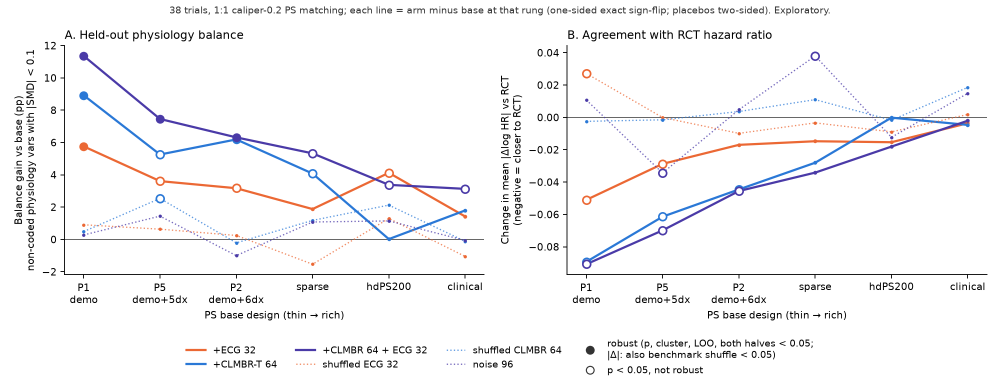

# ECG vs CLMBR-T vs both, across the full PS ladder, in 38 trials (v1.8; exploratory)

**Code.** `scripts/v18/v18_embed_compare.py` (`run`, `verify`, `summarize`, `tables`, `figure`).
**Outputs.** Aggregates only, in `audits/claude-v18-embed-compare/` (umask 077, files 600):
- `results.csv`, `common_support.csv`;
- `summary.csv` (8,640 cells), `common_summary.csv`, `retention.csv`;
- `verify.csv`, `tables.md`.

**Complete cell tables** (every set × rung × contrast × endpoint): `EMBEDDING_COMPARISON_TABLES.md`. **Figure:** `EMBEDDING_COMPARISON.png`.

**Status.** Everything here is **exploratory** (post hoc, PI request 2026-09-28), with one exception: the v1.8 Plan B contrasts on P1/P5/P2 in the 33 trials (set `all33`, column `status` in `summary.csv`). Those were prespecified in an exploratory plan, and they reproduce `CLMBR_RESULTS.md`.

## Verdict in plain language

1. **Largest robust balance gain at each rung.** The primary endpoint is the share of non-coded physiology variables (vitals, labs, echo) with |SMD| < 0.1. "Robust" means p, comparator-cluster p, LOO max p and both split halves are all < 0.05.

   | rung | largest gain | robust? | notes |
   |---|---|---|---|
   | P1 (demographics) | **CLMBR+ECG, +11.4 pp** | yes | CLMBR alone +8.9, ECG alone +5.8; all three robust |
   | P5 | **CLMBR+ECG, +7.5 pp** | yes (the only robust arm) | CLMBR +5.3 and ECG +3.6 are nominal only |
   | P2 | CLMBR (+6.2) ≈ CLMBR+ECG (+6.3) | both robust | ECG +3.2, nominal |
   | sparse | CLMBR+ECG +5.3, CLMBR +4.1 | no (halves fail) | ECG +1.9, p = 0.052 |
   | hdPS200 | **ECG, +4.1 pp** (p = 0.002, q = 0.03) | no (half A p = 0.80) | CLMBR adds exactly nothing (+0.0, p = 0.50) |
   | clinical | none | — | best is CLMBR+ECG +3.1 (p = 0.023, q = 0.15) |

2. **Does ECG add to CLMBR?**
   - **Only with thin PSs, modestly.** At P1, CLMBR+ECG vs CLMBR is +2.4 pp (24/38, p = 0.004, q = 0.049, robust). At P5 it is +2.2 (p = 0.047, not robust). At P2 and sparse there is nothing (+0.1 and +1.3).
   - **Where ECG does add is at hdPS200** (+3.4 over CLMBR, p = 0.016, not robust), because CLMBR's gain disappears there.
   - **Emulation: never.** |Δ| changes by −0.015 to +0.003 at every rung, all p ≥ 0.12.
   - Caveat: this grid has no CLMBR+shufECG arm. In Plan B, the P1 increment against that placebo was p = 0.056.
3. **Does CLMBR add to ECG?**
   - **Yes, from P1 through sparse.** CLMBR+ECG vs ECG is P1 +5.6 pp (p < 0.001), P5 +3.8, P2 +3.1 and sparse +3.4 (p = 0.004–0.025). Only half A, or neither half, passes, so none of these is robust.
   - **No at hdPS200** (−0.7).
   - **Head to head (two-sided), CLMBR ≥ ECG from P1 to sparse:** −3.2 / −1.6 / −3.0 / −2.2 pp, p = 0.06 / 0.31 / 0.03 / 0.06. None is robust.
   - **ECG > CLMBR at hdPS200:** +4.1, p = 0.009, not robust. They are equal at clinical.
   - On the covars2b lab/vital panel, CLMBR dominates at every rung except hdPS200. Examples: P1 +22.5 pp vs ECG +4.2; clinical +5.9 vs +1.5. Part of this is "which labs were ordered", which CLMBR sees as codes.
4. **Trial-specific emulation gain: none.**
   - Every embedding narrows |Δlog HR| with thin PSs:
     - P1: ECG 0.258 → 0.207, CLMBR → 0.168, both → 0.167; p = 0.002–0.006.
     - z² falls with q = 0.036.
   - **No |Δ| or z² cell for an embedding vs base, in any set or at any rung, beats the benchmark shuffle after FDR.** The minimum q is 0.23. At P1 in all 38 trials the shuffle p is 0.22 (ECG), 0.70 (CLMBR) and 0.81 (both). This is generic shrinkage, as in v1.7 and Plan B.
   - A few nominal shuffle passes appear in subsets, all non-robust with q ≥ 0.23:
     - v1.6-18 P2 ECG: shuffle p 0.001 / 0.004, but half B p = 0.39;
     - AF-5 hdPS200 ECG;
     - HF P2 ECG.
   - **The placebo |Δ| nulls are not centred.** They move by −0.034 to +0.038 (shufECG P1 +0.027, p = 0.039; noise96 sparse +0.038, p = 0.001; noise96 P5 −0.034, p = 0.016). |Δ| changes of this size therefore occur with pure noise columns.
5. **Where do the gains vanish along the ladder?**
   - **Balance:**
     - CLMBR's gain shrinks steadily (+8.9 → +5.3 → +6.2 → +4.1) and **vanishes at hdPS200** (+0.0). hdPS already harvests the coded record that CLMBR encodes.
     - The ECG's gain shrinks from +5.8 (P1) to ~+2–4 and **vanishes at clinical** (+1.4, p = 0.18).
     - The combination keeps a nominal +3 pp through clinical, but nothing is robust beyond P2.
   - **Emulation:** the |Δ| reduction decays monotonically, from −0.09 at P1 to ≈ 0 at hdPS200/clinical, for every embedding.
6. **Confirmation 20 (v1.7 15 + v1.8 AF 5; out-of-sample for the v1.6 discovery).**
   - Directions agree, but only CLMBR+ECG at P1 is robust: +8.4 pp, p = 0.004, cluster p = 0.045.
   - The other nominal cells are not robust: CLMBR P1 +6.5 (p = 0.007); ECG P1 +5.1 (p = 0.036, cluster p = 0.19); CLMBR at P5 / P2 / sparse (p ≤ 0.006).
   - The v1.6 18 carry most of the effect: CLMBR P1 +11.6 pp; ECG +6.5.
   - AF-5 alone: CLMBR P1 +12.6 pp (5/5, p = 0.031, the floor); ECG +3.3 (3/5).

**Bottom line.** For held-out physiology balance with a thin PS, the code-based CLMBR-T embedding is the strongest single strategy, and adding the ECG gives a small further, robust gain at P1 only. The ECG is the only embedding that still adds balance on top of hdPS200, though not robustly. Nothing adds robustly at the clinical rung. No embedding produces trial-specific agreement with RCT hazard ratios at any rung.

## Main table (all 38 trials, full cohort)

- **Balance** = % of non-coded physiology variables with |SMD| < 0.1 (higher is better).
- **|Δ|** = mean |Δlog HR| vs RCT (lower is better).
- **p** = one-sided exact sign-flip vs base. **q** = BH within the endpoint family (all 8,640 cells).
- **bs** = benchmark-shuffle p (38-RCT pool, 20,000 joint draws without replacement).
- **\*** = robust: p, cluster p, LOO max p and both halves < 0.05; for |Δ|, bs < 0.05 as well.

| rung | bal base | bal +ECG | bal +CLMBR | bal +CLMBR+ECG | \|Δ\| base | \|Δ\| +ECG | \|Δ\| +CLMBR | \|Δ\| +CLMBR+ECG |
|---|---|---|---|---|---|---|---|---|
| P1 demo | 51.4 | 57.1 (+5.8; p <0.001, q 0.011)* | 60.3 (+8.9; p <0.001, q <0.001)* | 62.7 (+11.4; p <0.001, q <0.001)* | 0.258 | 0.207 (p 0.002; bs 0.220) | 0.168 (p 0.002; bs 0.700) | 0.167 (p 0.006; bs 0.807) |
| P5 demo+5dx | 55.3 | 58.9 (+3.6; p 0.003, q 0.045) | 60.6 (+5.3; p <0.001, q 0.018) | 62.8 (+7.5; p <0.001, q 0.005)* | 0.224 | 0.195 (p 0.033; bs 0.684) | 0.162 (p 0.011; bs 0.902) | 0.154 (p 0.006; bs 0.912) |
| P2 demo+6dx | 56.8 | 60.0 (+3.2; p 0.003, q 0.045) | 63.0 (+6.2; p <0.001, q <0.001)* | 63.1 (+6.3; p <0.001, q 0.008)* | 0.209 | 0.192 (p 0.080; bs 0.274) | 0.164 (p 0.047; bs 0.853) | 0.163 (p 0.032; bs 0.873) |
| sparse | 58.0 | 59.9 (+1.9; p 0.052, q 0.233) | 62.1 (+4.1; p <0.001, q 0.012) | 63.4 (+5.3; p <0.001, q 0.014) | 0.188 | 0.173 (p 0.121; bs 0.760) | 0.160 (p 0.138; bs 0.934) | 0.154 (p 0.054; bs 0.739) |
| hdPS200 | 59.7 | 63.8 (+4.1; p 0.002, q 0.029) | 59.7 (+0.0; p 0.496, q 0.680) | 63.1 (+3.4; p 0.019, q 0.129) | 0.181 | 0.166 (p 0.149; bs 0.109) | 0.181 (p 0.496; bs 0.639) | 0.163 (p 0.078; bs 0.317) |
| clinical | 63.4 | 64.8 (+1.4; p 0.184, q 0.414) | 65.2 (+1.8; p 0.147, q 0.371) | 66.5 (+3.1; p 0.023, q 0.147) | 0.159 | 0.155 (p 0.400; bs 0.602) | 0.154 (p 0.404; bs 0.643) | 0.157 (p 0.462; bs 0.868) |

At hdPS200, PROTECT AF has no HR in the CLMBR / CLMBR+ECG arms: matching collapsed to < 11 pairs; see Caveats. Those |Δ| cells use 37 trials.

## Design

- **Trials:** the 38 trials in the v18_af_confirm order: the v1.6 18 (i = 0–17), then the v1.7 15 (18–32), then the v1.8 AF 5 (33–37). Halves full/A/B use seed 16060 + i.
- **PS ladder** (base designs):

  | rung | design | source |
  |---|---|---|
  | P1 | `T.demo` | |
  | P5 | P1 + HTN, T2D, CAD, AF, HF | `s11_p5` |
  | P2 | P5 + obesity | |
  | sparse | `T.X_dx` | = S1 r5 |
  | hdPS200 | `T.X_dx` + top-200 hdPS levels ranked on the half's treatment | = S1 r7 |
  | clinical | `T.X_core` | = S1 r8 |

- **Arms per rung:**
  - base, +ECG32, +CLMBR64, +CLMBR64+ECG32;
  - placebos: +shufECG32, +shufCLMBR64 (the same row permutation `T.shuffle_perm`) and +noise96 (N(0,1), seed 960000 + i), the dimension-matched placebo of the combined arm;
  - unmatched once per half.
- **Estimator:** 1:1 greedy caliper-0.2 matching on the L2 logistic PS (`("match", 0.2, 1)`), pair-clustered Cox.
- **Balance endpoints:**
  - non-coded 54-variable subset of the 58-panel (**primary**);
  - full 58-panel;
  - mean |SMD| of both;
  - covars2b non-proximal lab/vital panel (`lv`) and its values-only version (`lvv`).
- **Per-rung exclusions:**
  - At `clinical`, meds, utilisation and the observed vitals/labs of `T.phys` are in the PS and are removed from every 58-panel endpoint (S1/S6 rule).
  - The covars2b panel drops variables in, or proxied by, the rung's PS (S6.excluded_extra + S8.composite_overlap).
  - At hdPS200 it also drops variables whose hdPS keys overlap the half's selected codes (S6 v2b).
- **Emulation endpoints:** |Δlog HR|, z², and consistency (|z| < 1.96).
- **Retention:** pairs / smaller arm.
- **Common support** (full cohort): anchors matched under both base and the arm.
- **Tests:**
  - one-sided exact sign-flip (full enumeration; meet-in-the-middle for k > 20); two-sided for ECG vs CLMBR and for placebo vs base;
  - comparator-cluster sign-flip (`docs/v17/trial_selection.json`);
  - LOO max p;
  - halves A/B;
  - benchmark shuffle for |Δ| and z²: joint (rb, rs) pairs, without replacement, 20,000 draws, `default_rng(0)`. The pool is either within-set or all 38 RCTs (identical for all-38). Trials without an HR in either arm are dropped and the pools redrawn.
- **BH-FDR** is applied within each endpoint family over all 8,640 cells. The families are:
  - balance-primary;
  - balance-secondary;
  - emulation;
  - retention;
  - benchmark shuffle, which gets separate q columns.
- **Sets:**
  - all 38;
  - all 33 (the Plan B set);
  - confirmation 20;
  - v1.6 18;
  - v1.7 15;
  - AF 5;
  - categories: AF 12, HF 5, DM 9, HTN 5, ACS/post-MI 2, Other 5.

## Audit as we went

- **Reuse of existing cells.** Every overlapping cell was recomputed and compared, column by column, with the committed results. Differences are ≤ 1.4e-14 (CSV float round-trip), with 0 NaN mismatches.

  | source | cells compared | max deviation |
  |---|---|---|
  | `claude-v18-clmbr/results_all.csv`: 33 trials × 3 halves × P1/P5/P2 × base/ECG/CLMBR/CLMBR+ECG/shufECG/shufCLMBR/unmatched; HR, SE, counts, C-stat, 58 SMDs, covars2b x/lv/lvv | 155,925 | 1.4e-14 |
  | `claude-v18-af-confirm/results_af5.csv`: AF-5, P1/P5 × base/ECG/shufECG/unmatched | 8,280 | 7e-15 |
  | `claude-v16-s1-ladder/results.csv`: v1.6 18, sparse/hdPS200/clinical × base/ECG/shufECG/unmatched | 42,768 | 2e-16 |

  - New cells: noise96 everywhere, CLMBR arms at sparse/hdPS200/clinical and for AF-5, all arms at sparse/hdPS200/clinical for the 20 non-v1.6 trials, and P2 for AF-5.
  - A second full run was bit-identical (max deviation 0).
  - The panel58 recomputation from the captured matched sets equals `run_cell`'s SMDs (max deviation 0) in every trial/rung.
- **Summary statistics reproduce the prior docs:**
  - Plan B all-33 P1 CLMBR non-coded: 53.3 → 61.6, 26/33, p = 4e-5, cluster p = 0.0005.
  - |Δ| 0.258 → 0.157, p = 0.0019, cluster p = 0.017.
  - ECG vs CLMBR, two-sided: p = 0.216.
  - CLMBR+ECG vs CLMBR: p = 0.0031.
  - ECG P1 |Δ| within-set shuffle p: 0.374 (round 4: 0.366).
  - Common-support P1 non-coded gain in the 33 trials: CLMBR +7.6, ECG +5.1 (round 4: +7.6 / +5.1).
- **Placebo balance nulls are centred.** Balance placebo contrasts range from −1.5 to +2.5 pp; one is nominal (shufCLMBR at P5, +2.5, p = 0.025), and all have q ≥ 0.15. **The |Δ| nulls are not centred** (see verdict 4).

  | rung | endpoint | shufECG − base (p) | shufCLMBR − base (p) | noise96 − base (p) |
  |---|---|---|---|---|
  | P1 | balance pp | +0.9 (0.615) | +0.5 (0.739) | +0.3 (0.839) |
  | P1 | \|Δ\| | +0.027 (0.039) | -0.002 (0.876) | +0.011 (0.335) |
  | P5 | balance pp | +0.6 (0.503) | +2.5 (0.025) | +1.4 (0.286) |
  | P5 | \|Δ\| | -0.000 (0.995) | -0.002 (0.914) | -0.034 (0.016) |
  | P2 | balance pp | +0.2 (0.839) | -0.2 (0.823) | -1.0 (0.349) |
  | P2 | \|Δ\| | -0.010 (0.522) | +0.004 (0.737) | +0.005 (0.718) |
  | sparse | balance pp | -1.5 (0.227) | +1.2 (0.245) | +1.1 (0.394) |
  | sparse | \|Δ\| | -0.003 (0.746) | +0.011 (0.280) | +0.038 (0.001) |
  | hdPS200 | balance pp | +1.3 (0.335) | +2.1 (0.076) | +1.1 (0.419) |
  | hdPS200 | \|Δ\| | -0.009 (0.520) | -0.002 (0.906) | -0.012 (0.445) |
  | clinical | balance pp | -1.1 (0.434) | -0.1 (0.961) | -0.1 (0.959) |
  | clinical | \|Δ\| | +0.002 (0.906) | +0.019 (0.327) | +0.015 (0.355) |

- **Pair counts / retention** (mean pairs / smaller arm, 38 trials, full cohort):

  | rung | base | ECG | CLMBR | CLMBR+ECG | noise96 |
  |---|---|---|---|---|---|
  | P1 | 89.4% | 88.8% | 80.9% | 79.4% | 89.0% |
  | sparse | 88.2% | 87.1% | 79.9% | 78.5% | 87.1% |
  | hdPS200 | 78.4% | 77.0% | 73.0% | 71.7% | 76.7% |
  | clinical | 85.3% | 84.0% | 77.6% | 76.4% | 83.6% |

  - The ECG costs ~1 pp of pairs. CLMBR costs ~8–9 pp: it keeps ~90% of base pairs.
  - Four cells had < 11 matched pairs and are suppressed in the CSVs; all are in PROTECT AF at hdPS200.

## Common support (anchors matched under both base and the arm; all 38, non-coded %)

| rung | arm | common anchors, % of smaller arm (min) | own-matched gain (pp) | common-support gain (pp), k, p, cluster p |
|---|---|---|---|---|
| P1 | ECG | 84 (24) | +5.8 | +4.6, 26/38, 0.002, 0.028 |
| P1 | CLMBR | 76 (24) | +8.9 | +8.1, 31/38, <0.001, <0.001 |
| P1 | CLMBR+ECG | 75 (24) | +11.4 | +10.1, 32/38, <0.001, <0.001 |
| P1 | noise96 | 84 (24) | +0.3 | +0.8, 23/38, 0.284, 0.591 |
| P5 | ECG | 83 (26) | +3.6 | +1.8, 20/38, 0.122, 0.067 |
| P5 | CLMBR | 76 (25) | +5.3 | +4.6, 24/38, 0.006, 0.018 |
| P5 | CLMBR+ECG | 75 (25) | +7.5 | +6.6, 26/38, <0.001, 0.005 |
| P5 | noise96 | 83 (25) | +1.4 | +0.5, 17/38, 0.362, 0.181 |
| P2 | ECG | 83 (25) | +3.2 | +2.4, 21/38, 0.017, 0.041 |
| P2 | CLMBR | 76 (25) | +6.2 | +5.2, 27/38, <0.001, 0.005 |
| P2 | CLMBR+ECG | 75 (25) | +6.3 | +6.1, 28/38, <0.001, <0.001 |
| P2 | noise96 | 83 (25) | -1.0 | -0.4, 14/38, 0.661, 0.402 |
| sparse | ECG | 82 (26) | +1.9 | +2.7, 22/38, 0.015, 0.009 |
| sparse | CLMBR | 75 (25) | +4.1 | +5.0, 27/38, <0.001, <0.001 |
| sparse | CLMBR+ECG | 74 (26) | +5.3 | +4.6, 28/38, 0.002, <0.001 |
| sparse | noise96 | 82 (26) | +1.1 | +0.2, 23/38, 0.422, 0.281 |
| hdPS200 | ECG | 71 (24) | +4.1 | +2.9, 22/38, 0.004, 0.006 |
| hdPS200 | CLMBR | 68 (3) | +0.0 | +0.1, 18/38, 0.470, 0.546 |
| hdPS200 | CLMBR+ECG | 66 (2) | +3.4 | +3.2, 20/38, 0.011, 0.008 |
| hdPS200 | noise96 | 71 (19) | +1.1 | +2.8, 20/38, 0.013, 0.030 |
| clinical | ECG | 79 (27) | +1.4 | +3.8, 21/38, 0.007, 0.033 |
| clinical | CLMBR | 73 (27) | +1.8 | +1.9, 20/38, 0.129, 0.281 |
| clinical | CLMBR+ECG | 71 (27) | +3.1 | +3.1, 26/38, 0.015, 0.006 |
| clinical | noise96 | 78 (28) | -0.1 | -1.1, 18/38, 0.832, 0.797 |

- **P1 to sparse:** the combined arm keeps ~90% of its gain on the common population (+10.1 of +11.4 at P1). Trimming explains little. The noise96 placebo stays null.
- **hdPS200:** the noise96 placebo *gains* +2.8 pp on common support (p = 0.013). Restricting to jointly matched anchors itself improves balance there, so common-support gains at hdPS200 are not interpretable.

## Categories (non-coded balance, pp vs base; one-sided sign-flip; no cluster/halves at this size)

| category (n) | rung | ECG | CLMBR | CLMBR+ECG |
|---|---|---|---|---|
| AF (12) | P1 | +7.4 (9/12, p 0.022) | **+17.8 (12/12, p < 0.001, q 0.008)** | +18.8 (12/12, p < 0.001) |
| AF (12) | sparse | +2.3 (p 0.18) | +6.5 (p 0.016) | +5.0 (p 0.074) |
| AF (12) | hdPS200 | +6.5 (10/12, p 0.010) | −0.2 | +2.8 |
| HF (5) | P1 / sparse / hdPS200 | +3.3 / +2.2 / +8.5 (p 0.06) | +4.8 / +4.1 / +2.6 | +7.4 / +5.2 / +10.0 (p 0.06) |
| DM (9) | P1 / sparse / hdPS200 | +3.5 / +4.1 / +4.1 | +2.4 / +2.1 / −1.3 | +4.1 / +5.8 (p 0.051) / +4.9 |
| HTN (5) | P1 / sparse / hdPS200 | +3.0 / −0.7 / −1.1 | +5.6 / 0.0 / +2.2 | +8.9 / +3.7 / +3.7 |
| Other (5) | P1 / sparse / hdPS200 | +10.7 (5/5, p 0.031) / +1.0 / +1.9 | +10.4 (5/5, p 0.031) / +5.8 (p 0.031) / −0.5 | +15.2 (p 0.031) / +6.3 / +0.8 |
| ACS/post-MI (2) | — | uninformative (p floor 0.25) | | |

- **AF |Δ|, P1:** ECG 10/12, p = 0.004, shuffle p 0.19 within-set / 0.14 with 38. CLMBR p = 0.034, shuffle 0.70 / 0.94. **Neither is trial-specific.**
- The complete category cells (all rungs, all contrasts, all endpoints) are in `EMBEDDING_COMPARISON_TABLES.md`.

## Prespecified cells (v1.8 Plan B, all 33, P1/P5/P2)

These reproduce `CLMBR_RESULTS.md`. The shuffle now uses 20,000 draws with both pools.

| rung | contrast | non-coded | \|Δ\| |
|---|---|---|---|
| P1 | CLMBR vs base | +8.4 pp, p 4e-5, q 0.002 | 0.258 → 0.157, p 0.002, q 0.12; shuffle 0.60 (within) / 0.42 (38) |
| P1 | ECG vs base | +6.1 pp, p 2e-4 | p 0.004; shuffle 0.37 / 0.30 |
| P1 | ECG vs CLMBR (two-sided) | p 0.22 | p 0.077 |
| P1 | CLMBR+ECG vs CLMBR | +2.6, p 0.003, q 0.044 | p 0.41 |
| P1 | CLMBR+ECG vs ECG | +4.8, p 0.002, q 0.034 | — |
| P5 | CLMBR vs base | +4.8, p 0.003 | — |
| P5 | CLMBR+ECG vs CLMBR | p 0.024 | — |
| P2 | CLMBR vs base | +6.2, p < 0.001 | — |
| P2 | ECG vs CLMBR | −3.4, p 0.011 | — |
| P2 | CLMBR+ECG vs CLMBR | p 0.52 | — |

- At P5 and P2, no |Δ| contrast passes the shuffle; the minimum shuffle p is 0.074.
- No prespecified |Δ| cell survives BH (min q 0.07). The prespecified z² shrinkage cells do (q 0.036–0.045), but none of them is shuffle-significant.

## Multiplicity

Cells with q < 0.05, by family:

| family | cells with q < 0.05 | which |
|---|---|---|
| balance-primary | 71 / 864 | mostly P1–P2, CLMBR or combined arm |
| balance-secondary | 853 / 4,320 | dominated by the lab/vital panel for CLMBR |
| emulation | 26 / 2,592 | all z² or \|Δ\| shrinkage cells at P1/P5/sparse; none shuffle-significant |
| benchmark shuffle | 7 / 1,728 | all are *placebo worse than base* cells in AF-5 or the AF category |

The 7 benchmark-shuffle cells show that the 38-RCT pool is not exchangeable with the atypical AF-5 benchmarks. For small, special sets, read the within-set p.

## Caveats

- **PROTECT AF at hdPS200.** With CLMBR (and CLMBR+ECG, and in halves some placebos), the PS nearly separates the arms: < 11 pairs, no HR. The cells are kept for balance (noisy) and dropped for HR (37 trials).
- **What CLMBR sees.** CLMBR sees measurement codes (which labs were ordered), not values. Its lab/vital-panel advantage partly reflects test-ordering patterns. Leakage was checked in `CLMBR_LEAKAGE.md`, and sensitivity sets were run in `CLMBR_RESULTS.md`.
- **Robustness requirements.** "Robust" requires both halves. With k = 38 the halves have about half the power, so non-robust ≠ null. Cluster floors apply in small categories.
- **Surrogate endpoint.** Held-out balance is a surrogate. The only direct check of confounding control, trial-specific RCT agreement, is null for every strategy.
